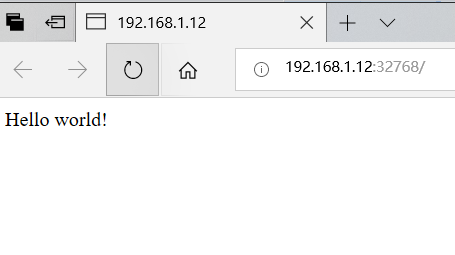
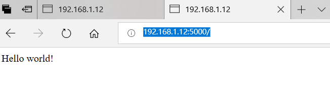

[TOC]

# 菜鸟教程_Docker教程学习2

**document support**

ysys

**date**

2018-12-11

**label**

菜鸟教程,Docker


## Docker Hello World

​	docker运行在容器内运行应用程序，使用docker run 命令来在容器内运行一个应用程序。

​	输出Hello World

```
# docker run ubuntu:15.10 /bin/echo "Hello world"
...
Hello world
```

​	各个参数解析：

​	`docker`:Docker二进制执行文件

​	`run`:与前面的docker组合来运行一个容器

​	`ubuntu:15.10`制定要运行的镜像，Docker首先从本地主机上查找镜像是否存在，如果不存在，Docker就会从镜像仓库Docker Hub下载公共镜像

​	`/bin/echo "Hello world"`:在启动的容器里执行的命令

​	以上命令的完整意思可以解释为`Docker以ubuntu 15.10镜像创建一个新容器，然后再容器里执行/bin/echo "Hello world",然后输出结果`

### 运行交互式的容器

​	通过docker的两个参数`-i`,`-t`,让docker运行的容器实现对话的能力

```
# docker run -i -t ubuntu:15.10 /bin/bash
root@9325d0db9445:/# 
```

​	各个参数解析：

​	`-t`:在新的容器内执行一个伪终端或终端

​	`-i`:允许你对容器内的标准输入（STDIN)进行交互

​	此时进入到一个ubuntu15.10系统的容器，可以执行许多命令

```
[root@gh12 docker]# docker run -i -t ubuntu:15.10 /bin/bash
root@8685b882bfb3:/# cat /proc/version
Linux version 3.10.5-3.el6.x86_64 (rpmbuild@node1) (gcc version 4.6.3 20120306 (Red Hat 4.6.3-2) (GCC) ) #1 SMP Tue Aug 20 14:10:49 UTC 2013
root@8685b882bfb3:/# ls -ls
total 64
4 drwxr-xr-x   2 root root 4096 Jul  6  2016 bin
4 drwxr-xr-x   2 root root 4096 Oct 19  2015 boot
0 drwxr-xr-x   5 root root  380 Dec 11 16:08 dev
4 drwxr-xr-x  45 root root 4096 Dec 11 16:08 etc
4 drwxr-xr-x   2 root root 4096 Oct 19  2015 home
4 drwxr-xr-x   8 root root 4096 Sep 13  2015 lib
4 drwxr-xr-x   2 root root 4096 Jul  6  2016 lib64
4 drwxr-xr-x   2 root root 4096 Jul  6  2016 media
4 drwxr-xr-x   2 root root 4096 Oct 19  2015 mnt
4 drwxr-xr-x   2 root root 4096 Jul  6  2016 opt
0 dr-xr-xr-x 123 root root    0 Dec 11 16:08 proc
4 drwx------   2 root root 4096 Jul  6  2016 root
4 drwxr-xr-x   5 root root 4096 Jul  6  2016 run
4 drwxr-xr-x   2 root root 4096 Jul 22  2016 sbin
4 drwxr-xr-x   2 root root 4096 Jul  6  2016 srv
0 dr-xr-xr-x  13 root root    0 Dec 11 16:08 sys
4 drwxrwxrwt   2 root root 4096 Jul  6  2016 tmp
4 drwxr-xr-x  11 root root 4096 Jul 22  2016 usr
4 drwxr-xr-x  13 root root 4096 Jul 22  2016 var
root@8685b882bfb3:/# 
```

### 启动容器(后台模式)

​	使用以下命令创建一个以进程方式运行的容器

```
# docker run -d ubuntu:15.10 /bin/sh -c "while true;do echo hello world;sleep 1;done"
9992e8f38cac5a8d6084381a268da8c4dd0f87df3cbddc8f3f77b4d412485e41
```

​	在输出中，没有看到“hello world"，而是一串长字符

`9992e8f38cac5a8d6084381a268da8c4dd0f87df3cbddc8f3f77b4d412485e41`

​	这个长字符串叫做容器ID,对每个容器来说都是唯一的，可以通过容器ID来查看对应的容器发生了什么。

​	首先确认容器是否在运行，可以通过命令`docker ps`来查看

```
# docker ps
CONTAINER ID        IMAGE               COMMAND                CREATED             STATUS              PORTS               NAMES
9992e8f38cac        ubuntu:15.10        "/bin/sh -c 'while t   5 minutes ago       Up 5 minutes                            naughty_torvalds    
```

​	`CONTAINER ID`:容器ID

​	`NAMES`:自动分配的容器名称

​	在容器内使用docker logs 命令，查看容器的标准输出

```
# docker logs 9992e8f38cac
hello world
...
hello world
```

```
# docker logs  naughty_torvalds 
hello world
...
hello world
```

### 停止容器

​	使用docker stop 命令停止容器

```
# docker stop naughty_torvalds 
naughty_torvalds
```

​	通过docker ps 命令查看，容器已经停止工作

```
# docker ps
CONTAINER ID        IMAGE               COMMAND             CREATED             STATUS              PORTS               NAMES
```

​	也可以使用下面的命令来停止

```
# docker stop 9992e8f38cac
9992e8f38cac
```

​	

## Docker 容器使用

​	docker客户端非常简单，可以直接输入docker命令来查看到Docker客户端的所有命令

```
# docker
Usage: docker [OPTIONS] COMMAND [arg...]

A self-sufficient runtime for linux containers.

Options:

  --api-cors-header=                   Set CORS headers in the remote API
  -b, --bridge=                        Attach containers to a network bridge
  --bip=                               Specify network bridge IP
  -D, --debug=false                    Enable debug mode
  -d, --daemon=false                   Enable daemon mode
  --default-gateway=                   Container default gateway IPv4 address
  --default-gateway-v6=                Container default gateway IPv6 address
  --default-ulimit=[]                  Set default ulimits for containers
  --dns=[]                             DNS server to use
  --dns-search=[]                      DNS search domains to use
  -e, --exec-driver=native             Exec driver to use
  --exec-opt=[]                        Set exec driver options
  --exec-root=/var/run/docker          Root of the Docker execdriver
  --fixed-cidr=                        IPv4 subnet for fixed IPs
  --fixed-cidr-v6=                     IPv6 subnet for fixed IPs
  -G, --group=docker                   Group for the unix socket
  -g, --graph=/var/lib/docker          Root of the Docker runtime
  -H, --host=[]                        Daemon socket(s) to connect to
  -h, --help=false                     Print usage
  --icc=true                           Enable inter-container communication
  --insecure-registry=[]               Enable insecure registry communication
  --ip=0.0.0.0                         Default IP when binding container ports
  --ip-forward=true                    Enable net.ipv4.ip_forward
  --ip-masq=true                       Enable IP masquerading
  --iptables=true                      Enable addition of iptables rules
  --ipv6=false                         Enable IPv6 networking
  -l, --log-level=info                 Set the logging level
  --label=[]                           Set key=value labels to the daemon
  --log-driver=json-file               Default driver for container logs
  --log-opt=map[]                      Set log driver options
  --mtu=0                              Set the containers network MTU
  -p, --pidfile=/var/run/docker.pid    Path to use for daemon PID file
  --registry-mirror=[]                 Preferred Docker registry mirror
  -s, --storage-driver=                Storage driver to use
  --selinux-enabled=false              Enable selinux support
  --storage-opt=[]                     Set storage driver options
  --tls=false                          Use TLS; implied by --tlsverify
  --tlscacert=~/.docker/ca.pem         Trust certs signed only by this CA
  --tlscert=~/.docker/cert.pem         Path to TLS certificate file
  --tlskey=~/.docker/key.pem           Path to TLS key file
  --tlsverify=false                    Use TLS and verify the remote
  --userland-proxy=true                Use userland proxy for loopback traffic
  -v, --version=false                  Print version information and quit

Commands:
    attach    Attach to a running container
    build     Build an image from a Dockerfile
    commit    Create a new image from a container's changes
    cp        Copy files/folders from a container's filesystem to the host path
    create    Create a new container
    diff      Inspect changes on a container's filesystem
    events    Get real time events from the server
    exec      Run a command in a running container
    export    Stream the contents of a container as a tar archive
    history   Show the history of an image
    images    List images
    import    Create a new filesystem image from the contents of a tarball
    info      Display system-wide information
    inspect   Return low-level information on a container or image
    kill      Kill a running container
    load      Load an image from a tar archive
    login     Register or log in to a Docker registry server
    logout    Log out from a Docker registry server
    logs      Fetch the logs of a container
    pause     Pause all processes within a container
    port      Lookup the public-facing port that is NAT-ed to PRIVATE_PORT
    ps        List containers
    pull      Pull an image or a repository from a Docker registry server
    push      Push an image or a repository to a Docker registry server
    rename    Rename an existing container
    restart   Restart a running container
    rm        Remove one or more containers
    rmi       Remove one or more images
    run       Run a command in a new container
    save      Save an image to a tar archive
    search    Search for an image on the Docker Hub
    start     Start a stopped container
    stats     Display a stream of a containers' resource usage statistics
    stop      Stop a running container
    tag       Tag an image into a repository
    top       Lookup the running processes of a container
    unpause   Unpause a paused container
    version   Show the Docker version information
    wait      Block until a container stops, then print its exit code

Run 'docker COMMAND --help' for more information on a command.
```

​	`Run 'docker COMMAND --help' for more information on a command`:可以通过命令`docker command --help`得到更多该参数信息

​	例如查看`docker stats`指令的具体使用

```
# docker stats --help

Usage: docker stats [OPTIONS] CONTAINER [CONTAINER...]

Display a live stream of one or more containers' resource usage statistics

  --help=false         Print usage
  --no-stream=false    Disable streaming stats and only pull the first result
```

### 运行一个web应用

​	前面运行的容器没有一些特别的用处

​	接下来让我们尝试使用docker构建一个web应用程序

​	我们将在docker容器中运行一个python flask应用来运行一个web应用

```
# docker pull training/webapp
latest: Pulling from training/webapp
e9e06b06e14c: Pull complete 
a82efea989f9: Pull complete 
37bea4ee0c81: Pull complete 
07f8e8c5e660: Pull complete 
23f0158a1fbe: Pull complete 
0a4852b23749: Pull complete 
7d0ff9745632: Pull complete 
99b0d955e85d: Pull complete 
33e109f2ff13: Pull complete 
cc06fd877d54: Pull complete 
b1ae241d644a: Pull complete 
b37deb56df95: Pull complete 
02a8815912ca: Already exists 
Digest: sha256:06e9c1983bd6d5db5fba376ccd63bfa529e8d02f23d5079b8f74a616308fb11d
Status: Downloaded newer image for training/webapp:latest
```

```
# docker run -d -P training/webapp python app.py
3bb6ece90f4897d1d1639e5991c94db42c0098e9d829d9d816aef50e334b3b54
```

​	参数说明

​	-d:让容器在后台运行

​	-P:将容器内部使用的网络端口映射到我们使用的主机上

### 查看WEB应用容器

​	使用docker ps来查看正在运行的容器

```
# docker ps
CONTAINER ID        IMAGE               COMMAND             CREATED             STATUS              PORTS                     NAMES
3bb6ece90f48        training/webapp     "python app.py"     2 minutes ago       Up 2 minutes        0.0.0.0:32768->5000/tcp   tender_hawking     
```

​	这里多了端口信息

`ports 0.0.0.0:32768->5000/tcp  `

​	docker开放了5000端口（默认python flask端口）映射到主机端口32768上。这是我们可以通过浏览器访问WEB应用

```
192.168.1.12:32768
```



​	因为环境是虚拟机，设置两个ip网卡，其中一个是host-only,另外一个是网络地址转换net,出现上图的信息，等了足足三分钟

​	同时可以通过`-p`参数设置端口信息

```
#  docker run -d -p 5000:5000 training/webapp python app.py
85cb389a0152d147fcd01bd2c2bb8bb6e5583effeba19e861938fd44471a0487
```

```
# docker ps
CONTAINER ID        IMAGE               COMMAND             CREATED             STATUS              PORTS                     NAMES
85cb389a0152        training/webapp     "python app.py"     22 seconds ago      Up 22 seconds       0.0.0.0:5000->5000/tcp    mad_albattani       
b0f0f8817cb2        training/webapp     "python app.py"     8 minutes ago       Up 8 minutes        0.0.0.0:32768->5000/tcp   elated_pike         
```

​	容器内部的5000端口映射到本地主机上的5000端口

```
192.168.1.12:5000
```



### 网络端口的快捷方式

​	通过docker ps命令可以看到容器的端口映射，docker还提供了另外一个快捷方式docker port,使用docker port可以查看指定容器的某个端口映射到宿主机的端口号

​	分别可以使用CONTAINER ID或者name就可以查询到端口信息

```
# docker port 85cb389a0152
5000/tcp -> 0.0.0.0:5000
# docker port elated_pike
5000/tcp -> 0.0.0.0:32768
```


### 查看WEB应用程序日志

​	docker logs[ID或者名字]可以查看容器内部的标准输出

```
# docker logs -f 85cb389a0152
 * Running on http://0.0.0.0:5000/ (Press CTRL+C to quit)
192.168.1.1 - - [12/Dec/2018 01:16:17] "GET / HTTP/1.1" 200 -
```

​	参数

​	-f:让docker logs 像使用tail -f 一样输出容器内部的标准输出

### 查看WEB应用程序容器的进程

​	使用docker top [id|name]查看容器内部运行的进程

```
# docker top 85cb389a0152
UID                 PID                 PPID                C                   STIME               TTY                 TIME                CMD
root                2255                1759                0                   09:15               ?                   00:00:00            python app.py
```

### 检查WEB应用程序

​	使用docker inspect来查看Docker的底层信息。它会返回一个JSON文件记录着Docker容器的配置和状态信息。

```
# docker inspect 85cb389a0152
[
{
    "Id": "85cb389a0152d147fcd01bd2c2bb8bb6e5583effeba19e861938fd44471a0487",
    "Created": "2018-12-12T01:15:38.333464372Z",
    "Path": "python",
    "Args": [
        "app.py"
    ],
    "State": {
        "Running": true,
        "Paused": false,
        "Restarting": false,
        "OOMKilled": false,
        "Dead": false,
        "Pid": 2255,
        "ExitCode": 0,
        "Error": "",
        "StartedAt": "2018-12-12T01:15:38.440879068Z",
        "FinishedAt": "0001-01-01T00:00:00Z"
    },
    "Image": "02a8815912ca800f99b7d912485e8c618260e27c6de8d7a161b356b322d5c121",
    "NetworkSettings": {
        "Bridge": "",
        "EndpointID": "95ed8edc1bb74c9ce5f3625b8d3f73962d2ff4b2f8dc62eeb8688c819184ec91",
        "Gateway": "172.17.42.1",
        "GlobalIPv6Address": "",
        "GlobalIPv6PrefixLen": 0,
        "HairpinMode": false,
        "IPAddress": "172.17.0.2",
        "IPPrefixLen": 16,
        "IPv6Gateway": "",
        "LinkLocalIPv6Address": "",
        "LinkLocalIPv6PrefixLen": 0,
        "MacAddress": "02:42:ac:11:00:02",
        "NetworkID": "594f5d59a2a180598b1ae9a38a6a0eb81489ee44099e40bb650cb468e9987fd0",
        "PortMapping": null,
        "Ports": {
            "5000/tcp": [
                {
                    "HostIp": "0.0.0.0",
                    "HostPort": "5000"
                }
            ]
        },
        "SandboxKey": "/var/run/docker/netns/85cb389a0152",
        "SecondaryIPAddresses": null,
        "SecondaryIPv6Addresses": null
    },
    "ResolvConfPath": "/var/lib/docker/containers/85cb389a0152d147fcd01bd2c2bb8bb6e5583effeba19e861938fd44471a0487/resolv.conf",
    "HostnamePath": "/var/lib/docker/containers/85cb389a0152d147fcd01bd2c2bb8bb6e5583effeba19e861938fd44471a0487/hostname",
    "HostsPath": "/var/lib/docker/containers/85cb389a0152d147fcd01bd2c2bb8bb6e5583effeba19e861938fd44471a0487/hosts",
    "LogPath": "/var/lib/docker/containers/85cb389a0152d147fcd01bd2c2bb8bb6e5583effeba19e861938fd44471a0487/85cb389a0152d147fcd01bd2c2bb8bb6e5583effeba19e861938fd44471a0487-json.log",
    "Name": "/mad_albattani",
    "RestartCount": 0,
    "Driver": "aufs",
    "ExecDriver": "native-0.2",
    "MountLabel": "",
    "ProcessLabel": "",
    "Volumes": {},
    "VolumesRW": {},
    "AppArmorProfile": "",
    "ExecIDs": null,
    "HostConfig": {
        "Binds": null,
        "ContainerIDFile": "",
        "LxcConf": [],
        "Memory": 0,
        "MemorySwap": 0,
        "CpuShares": 0,
        "CpuPeriod": 0,
        "CpusetCpus": "",
        "CpusetMems": "",
        "CpuQuota": 0,
        "BlkioWeight": 0,
        "OomKillDisable": false,
        "Privileged": false,
        "PortBindings": {
            "5000/tcp": [
                {
                    "HostIp": "",
                    "HostPort": "5000"
                }
            ]
        },
        "Links": null,
        "PublishAllPorts": false,
        "Dns": null,
        "DnsSearch": null,
        "ExtraHosts": null,
        "VolumesFrom": null,
        "Devices": [],
        "NetworkMode": "bridge",
        "IpcMode": "",
        "PidMode": "",
        "UTSMode": "",
        "CapAdd": null,
        "CapDrop": null,
        "RestartPolicy": {
            "Name": "no",
            "MaximumRetryCount": 0
        },
        "SecurityOpt": null,
        "ReadonlyRootfs": false,
        "Ulimits": null,
        "LogConfig": {
            "Type": "json-file",
            "Config": {}
        },
        "CgroupParent": ""
    },
    "Config": {
        "Hostname": "85cb389a0152",
        "Domainname": "",
        "User": "",
        "AttachStdin": false,
        "AttachStdout": false,
        "AttachStderr": false,
        "PortSpecs": null,
        "ExposedPorts": {
            "5000/tcp": {}
        },
        "Tty": false,
        "OpenStdin": false,
        "StdinOnce": false,
        "Env": [
            "PATH=/usr/local/sbin:/usr/local/bin:/usr/sbin:/usr/bin:/sbin:/bin"
        ],
        "Cmd": [
            "python",
            "app.py"
        ],
        "Image": "training/webapp",
        "Volumes": null,
        "VolumeDriver": "",
        "WorkingDir": "/opt/webapp",
        "Entrypoint": null,
        "NetworkDisabled": false,
        "MacAddress": "",
        "OnBuild": null,
        "Labels": {}
    }
}
]
```


### 停止WEB应用容器

```
# docker ps
CONTAINER ID        IMAGE               COMMAND             CREATED             STATUS              PORTS                     NAMES
85cb389a0152        training/webapp     "python app.py"     27 minutes ago      Up 27 minutes       0.0.0.0:5000->5000/tcp    mad_albattani       
b0f0f8817cb2        training/webapp     "python app.py"     36 minutes ago      Up 36 minutes       0.0.0.0:32768->5000/tcp   elated_pike         
# docker stop 85cb389a0152 
85cb389a0152
# docker ps
CONTAINER ID        IMAGE               COMMAND             CREATED             STATUS              PORTS                     NAMES
b0f0f8817cb2        training/webapp     "python app.py"     36 minutes ago      Up 36 minutes       0.0.0.0:32768->5000/tcp   elated_pike         
# docker stop elated_pike
elated_pike
# docker ps
CONTAINER ID        IMAGE               COMMAND             CREATED             STATUS              PORTS               NAMES
```


### 重启WEB应用容器

​	已经停止的容器，可以通过docker start来启动

```
# docker start elated_pike
elated_pike
# docker ps
CONTAINER ID        IMAGE               COMMAND             CREATED             STATUS              PORTS                     NAMES
b0f0f8817cb2        training/webapp     "python app.py"     38 minutes ago      Up 3 seconds        0.0.0.0:32769->5000/tcp   elated_pike         
# docker start 85cb389a0152
85cb389a0152
# docker ps
CONTAINER ID        IMAGE               COMMAND             CREATED             STATUS              PORTS                     NAMES
85cb389a0152        training/webapp     "python app.py"     31 minutes ago      Up 4 seconds        0.0.0.0:5000->5000/tcp    mad_albattani       
b0f0f8817cb2        training/webapp     "python app.py"     40 minutes ago      Up About a minute   0.0.0.0:32769->5000/tcp   elated_pike         
```

​	docker ps -l 查询最后一次创建的容器

```
# docker ps -l
CONTAINER ID        IMAGE               COMMAND             CREATED             STATUS                       PORTS               NAMES
85cb389a0152        training/webapp     "python app.py"     30 minutes ago      Exited (137) 2 minutes ago                       mad_albattani       

```

​	正在运行的容器，可以使用docker restart 命令来重启

​	

### 移除WEB应用容器

​	可以使用docker rm命令来删除不需要的容器

```
# docker rm mad_albattani
mad_albattani
```

​	错误情况:删除容器时，容器必须时停止的状态，否则会报错

```
# docker rm  mad_albattani
Error response from daemon: Cannot destroy container mad_albattani: Conflict, You cannot remove a running container. Stop the container before attempting removal or use -f
Error: failed to remove containers: [mad_albattani]
```


## Docker 镜像使用

​	当运行容器时，使用的镜像如果不在本地中，docker就会自动从docker镜像仓库中下载，默认是从Docker Hub公共镜像源下载。

​	1、管理和使用本地Docker主机镜像

​	2、创建镜像

### 列出镜像列表

​	docker images来列出本地主机上的镜像

```
# docker images
REPOSITORY          TAG                 IMAGE ID            CREATED             VIRTUAL SIZE
hello-world         latest              19b3f968b60c        3 months ago        1.84 kB
ubuntu              15.10               bfaaabeea063        2 years ago         137.2 MB
training/webapp     latest              02a8815912ca        3 years ago         348.8 MB
```

​	各个选项说明

​	1、repository:镜像的仓库源

​	2、镜像的标签

​	3、IMAGE ID：镜像ID

​	4、CREATED:镜像创建时间

​	5、SIZE:镜像大小

​	同一个仓库源可以有多个TAG，代表这个仓库源的不同个版本，如ubuntu仓库源，有15.10，14.04等多个不同的版本，使用REPOSITORY:TAG来定义不同的镜像

​	所以，如果使用版本15.10的ubuntu系统镜像来运行容器时，命令如下：

```
# docker run -t -i ubuntu:15.10 /bin/bash
```

​	如果使用版本为14.04的ubuntu系统镜像来运行容器时，命令如下

```
# docker run -t -i ubuntu:14.04 /bin/bash
```

​	如果不指定一个镜像的版本标签，如果只是用ubuntu,docker将默认使用ubuntu:latest镜像


### 获取一个新的镜像

​	当本地主机使用一个不存在的镜像时Docker就会自动下载这个镜像，如果想预先下载这个镜像，可以使用docker pull 命令来下载

```
# docker pull ubuntu:13.10
13.10: Pulling from ubuntu
511136ea3c5a: Pull complete 
f127542f0b61: Pull complete 
fae16849ebe2: Pull complete 
0f4aac48388f: Pull complete 
209ea56fda6d: Pull complete 
195eb90b5349: Already exists 
Digest: sha256:403105e61e2d540187da20d837b6a6e92efc3eb4337da9c04c191fb5e28c44dc
Status: Downloaded newer image for ubuntu:13.10
```

​	下载完成后，可以直接使用这个镜像来运行容器


### 查找镜像

​	可以从Docker Hub网站来搜索镜像，Docker Hub网址为：` https://hub.docker.com/`

​	可以通过命令docker search 命令来搜索镜像。如需要一个httpd的镜像来作为web服务.

```
# docker search httpd
NAME                                    DESCRIPTION                                     STARS     OFFICIAL   AUTOMATED
httpd                                   The Apache HTTP Server Project                  2224      [OK]       
hypriot/rpi-busybox-httpd               Raspberry Pi compatible Docker Image with ...   45                   
centos/httpd                                                                            21                   [OK]
centos/httpd-24-centos7                 Platform for running Apache httpd 2.4 or b...   20                   
armhf/httpd                             The Apache HTTP Server Project                  8                    
tplatform/aws-linux-httpd24-php70       aws-linux-httpd24-php70                         3                    [OK]
salim1983hoop/httpd24                   Dockerfile running apache config                2                    [OK]
tplatform/aws-linux-httpd24-php71       aws-linux-httpd24-php71                         1                    [OK]
epflidevelop/os-wp-httpd                WP httpd                                        1                    [OK]
lead4good/httpd-fpm                     httpd server which connects via fcgi proxy...   1                    [OK]
ssarioglu/sample-httpd                  sample-httpd                                    1                    [OK]
tplatform/aws-linux-2-httpd24-php72     aws-linux-2-httpd24-php72                       1                    [OK]
tplatform/aws-linux-httpd24-php71-fpm   aws-linux-httpd24-php71-fpm                     1                    [OK]
izdock/httpd                            Production ready Apache HTTPD Web Server +...   0                    
solsson/httpd-openidc                   mod_auth_openidc on official httpd image, ...   0                    [OK]
amd64/httpd                             The Apache HTTP Server Project                  0                    
itsziget/httpd24                        Extended HTTPD Docker image based on the o...   0                    [OK]
mprahl/s2i-angular-httpd24              An S2I image for building and running Angu...   0                    [OK]
publici/httpd                           httpd:latest                                    0                    [OK]
manageiq/httpd_configmap_generator      Httpd Configmap Generator                       0                    [OK]
manageiq/httpd                          Container with httpd, built on CentOS for ...   0                    [OK]
manasip/httpd                                                                           0                    
trollin/httpd                                                                           0                    
dockerpinata/httpd                                                                      0                    
interlutions/httpd                      httpd docker image with debian-based confi...   0                    [OK]
```

*NAME*:表示镜像仓库源的名称

*DESCRIPTION*:表示镜像的描述

*OFFICIAL*:是否为docker官方发布

### 拖取镜像

​	决定使用上图中的httpd官方版本的镜像，使用docker pull来下载镜像

```
# docker pull httpd
latest: Pulling from httpd
0454203f6769: Pull complete 
97569d305060: Pull complete 
28a935a87300: Pull complete 
22883c0483ff: Pull complete 
5d7bfa79e59c: Pull complete 
4d8983b8d1db: Pull complete 
37e6becbe752: Pull complete 
0ae6d7b0b7e0: Pull complete 
6ca9d9cf3c14: Pull complete 
e2e41699dedd: Pull complete 
8b3302fcabd5: Pull complete 
2a86649a2932: Pull complete 
3cdcc299a714: Pull complete 
2681c6e0d961: Pull complete 
50045c5579eb: Pull complete 
Digest: sha256:29c08c75fcc3bdc8210d6fdabf9ad63f485071ca4519ad5a1a656cf9bc4b4c7b
Status: Downloaded newer image for httpd:latest
```

​	下载完成后，使用这个镜像

```
# docker run httpd
AH00558: httpd: Could not reliably determine the server's fully qualified domain name, using 172.17.0.5. Set the 'ServerName' directive globally to suppress this message
AH00558: httpd: Could not reliably determine the server's fully qualified domain name, using 172.17.0.5. Set the 'ServerName' directive globally to suppress this message
[Wed Dec 12 02:55:08.229577 2018] [mpm_event:notice] [pid 1:tid 139980547331264] AH00489: Apache/2.4.37 (Unix) configured -- resuming normal operations
[Wed Dec 12 02:55:08.229933 2018] [core:notice] [pid 1:tid 139980547331264] AH00094: Command line: 'httpd -D FOREGROUND'
```


### 创建镜像

​	从docker镜像仓库中下载的镜像不能满足我们的需求时，可以通过以下两种方式对镜像进行修改

​	1.从已经创建的容器中更新镜像，并且提交这个镜像

​	2.使用Dockerfile指令来创建一个新的镜像

### 更新镜像

​	更新镜像前，使用镜像来创建一个容器

​	在运行的容器内使用apt-get update命令进行更新

​	此时ID为 b0f0f8817cb2的容器，是按照要求修改的容器，可以通过命令`docker commit`来提交容器副本

```
# docker run -t -i ubuntu:15.10 /bin/bash
root@7d9eac524f06:/# apt-get update
...
root@7d9eac524f06:/# exit
exit
# docker commit -m="has update" -a="runoob" b0f0f8817cb2 runoob/ubuntu:v2
9d4710dd2178a2667702b4d04417e464293049b7338b341e77e6cc00e4614102
```

​	各个参数说明

​	-m:提交的描述信息

​	-a:制定镜像作者

​	b0f0f8817cb2：容器ID

​	runoob/ubuntu:v2：指定要创建的目标镜像名

​	可以使用docker images命令来查看新镜像runoob/ubuntu:v2

```
# docker images
REPOSITORY          TAG                 IMAGE ID            CREATED             VIRTUAL SIZE
runoob/ubuntu       v2                  9d4710dd2178        37 minutes ago      348.8 MB
httpd               latest              50045c5579eb        3 weeks ago         131.7 MB
hello-world         latest              19b3f968b60c        3 months ago        1.84 kB
ubuntu              15.10               bfaaabeea063        2 years ago         137.2 MB
training/webapp     latest              02a8815912ca        3 years ago         348.8 MB
ubuntu              13.10               195eb90b5349        4 years ago         184.6 MB

```

​	使用新的镜像来启动一个容器

```
# docker run -t -i runoob/ubuntu:v2 /bin/bash
```

### 构建镜像


## 链接地址

http://www.runoob.com/docker/docker-hello-world.html

http://www.runoob.com/docker/docker-image-usage.html