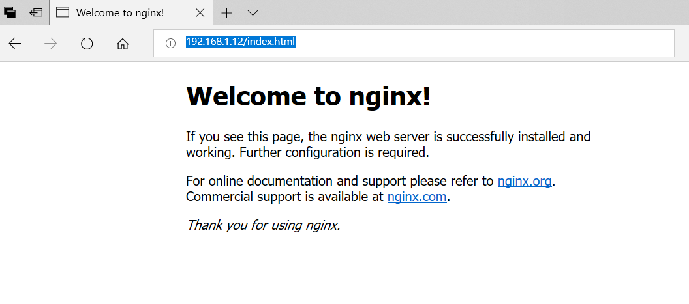

[TOC]

# 菜鸟教程_Docker教程学习4

**document support**

ysys

**date**

2018-12-12

**label**

菜鸟教程,Docker,Nginx


## Docker 安装 Nginx

 ### 方法一、docker pull nginx(推荐)

在[Docker Hub](https://hub.docker.com/r/library/nginx/)上的nginx镜像

```
# docker search nginx
NAME                                                   DESCRIPTION                                     STARS     OFFICIAL   AUTOMATED
nginx                                                  Official build of Nginx.                        10536     [OK]       
jwilder/nginx-proxy                                    Automated Nginx reverse proxy for docker c...   1486                 [OK]
richarvey/nginx-php-fpm                                Container running Nginx + PHP-FPM capable ...   663                  [OK]
jrcs/letsencrypt-nginx-proxy-companion                 LetsEncrypt container to use with nginx as...   452                  [OK]
kong                                                   Open-source Microservice & API Management ...   257       [OK]       
webdevops/php-nginx                                    Nginx with PHP-FPM                              119                  [OK]
kitematic/hello-world-nginx                            A light-weight nginx container that demons...   113                  
zabbix/zabbix-web-nginx-mysql                          Zabbix frontend based on Nginx web-server ...   81                   [OK]
bitnami/nginx                                          Bitnami nginx Docker Image                      58                   [OK]
1and1internet/ubuntu-16-nginx-php-phpmyadmin-mysql-5   ubuntu-16-nginx-php-phpmyadmin-mysql-5          48                   [OK]
linuxserver/nginx                                      An Nginx container, brought to you by Linu...   44                   
tobi312/rpi-nginx                                      NGINX on Raspberry Pi / armhf                   23                   [OK]
nginx/nginx-ingress                                    NGINX Ingress Controller for Kubernetes         13                   
blacklabelops/nginx                                    Dockerized Nginx Reverse Proxy Server.          12                   [OK]
wodby/drupal-nginx                                     Nginx for Drupal container image                11                   [OK]
centos/nginx-18-centos7                                Platform for running nginx 1.8 or building...   9                    
nginxdemos/hello                                       NGINX webserver that serves a simple page ...   8                    [OK]
centos/nginx-112-centos7                               Platform for running nginx 1.12 or buildin...   5                    
1science/nginx                                         Nginx Docker images that include Consul Te...   4                    [OK]
mailu/nginx                                            Mailu nginx frontend                            2                    [OK]
pebbletech/nginx-proxy                                 nginx-proxy sets up a container running ng...   2                    [OK]
travix/nginx                                           NGinx reverse proxy                             2                    [OK]
toccoag/openshift-nginx                                Nginx reverse proxy for Nice running on sa...   1                    [OK]
ansibleplaybookbundle/nginx-apb                        An APB to deploy NGINX                          0                    [OK]
wodby/nginx                                            Generic nginx                                   0                    [OK]

```

​	拉取官方的镜像

```
# docker pull nginx
```

​	方法二略

### 使用 nginx 镜像

#### 运行容器

```
# docker run -p 80:80 --name mynginx -v $PWD/www:/www -v $PWD/conf/nginx.conf:/etc/nginx.conf -v $PWD/logs:/wwwlogs -d nginx
b64f1066e1371ffecb2acb900f27eef5189935f43b21d89794057dc1388ba1b1
```

​	-p 80:80 将容器的80端口映射到主机的80端口

​	--name mynginx:将容器命名为mynginx

​	-v $PWD/www:/www: 将主机中当前目录下的www挂在到容器的/www

​	-v $PWD/conf/nginx.conf:/etc/nginx.conf:将主机中当前目录下的nginx.conf挂载到容器的`/etc/nginx/nginx.conf`

​	-v $PWD/logs:/wwwlogs:将主机中当前目录下的logs挂载到容器的/wwwlogs

​	

#### 查看容器启动情况

```
# docker ps
CONTAINER ID        IMAGE               COMMAND                CREATED             STATUS              PORTS                                NAMES
b64f1066e137        nginx               "nginx -g 'daemon of   16 seconds ago      Up 16 seconds       0.0.0.0:80->80/tcp                   mynginx             
9992af291f4e        training/webapp     "python app.py"        28 minutes ago      Up 28 minutes       0.0.0.0:32771->5000/tcp              runoob              
be0d1cb72411        training/webapp     "python app.py"        48 minutes ago      Up 48 minutes       5000/tcp, 127.0.0.1:5000->5000/udp   suspicious_cray     
136d0cc54913        training/webapp     "python app.py"        49 minutes ago      Up 49 minutes       127.0.0.1:5001->5000/tcp             high_cray           
e02a88d5a171        training/webapp     "python app.py"        50 minutes ago      Up 50 minutes       0.0.0.0:5000->5000/tcp               mad_hypatia         
a2c952f18384        training/webapp     "python app.py"        51 minutes ago      Up 51 minutes       0.0.0.0:32770->5000/tcp              thirsty_banach      
b0f0f8817cb2        training/webapp     "python app.py"        6 hours ago         Up 5 hours          0.0.0.0:32769->5000/tcp              elated_pike    
```


​	通过浏览器访问



## 链接地址

http://www.runoob.com/docker/docker-install-nginx.html