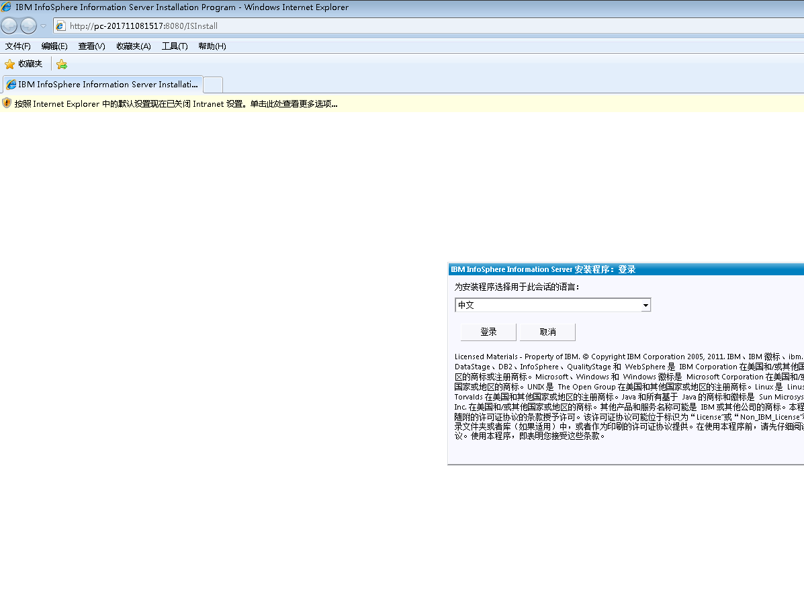
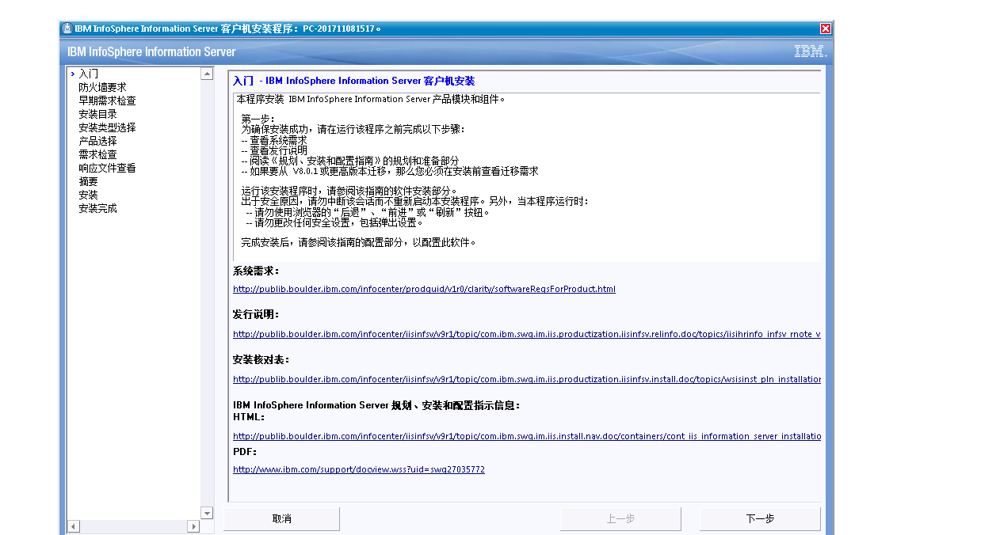
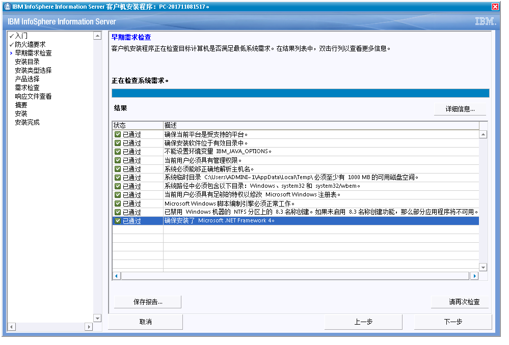
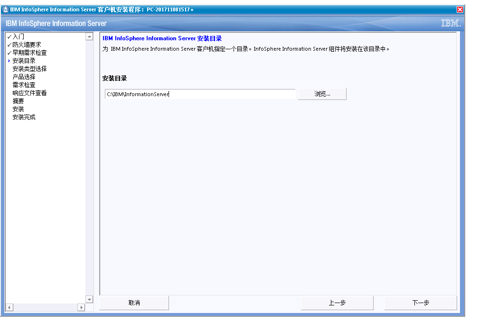
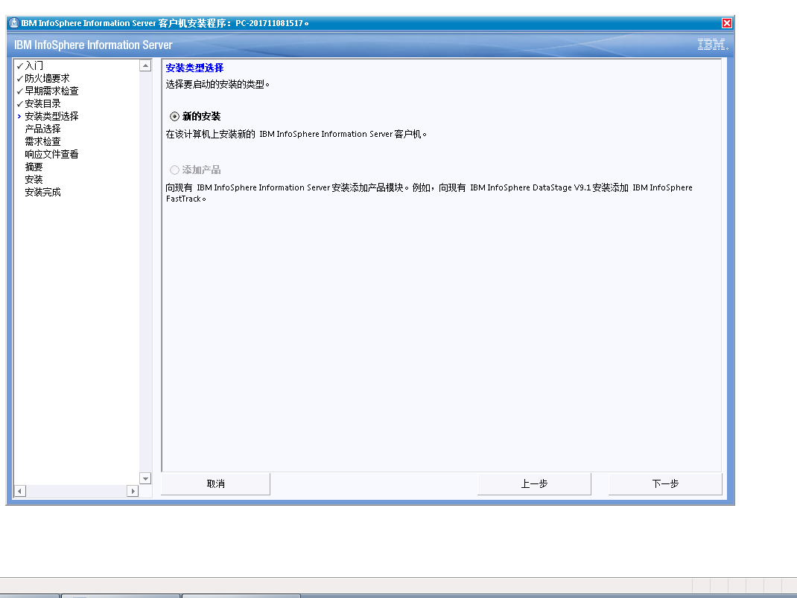
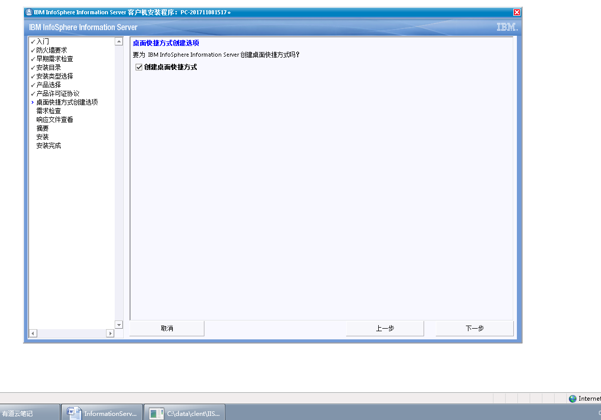
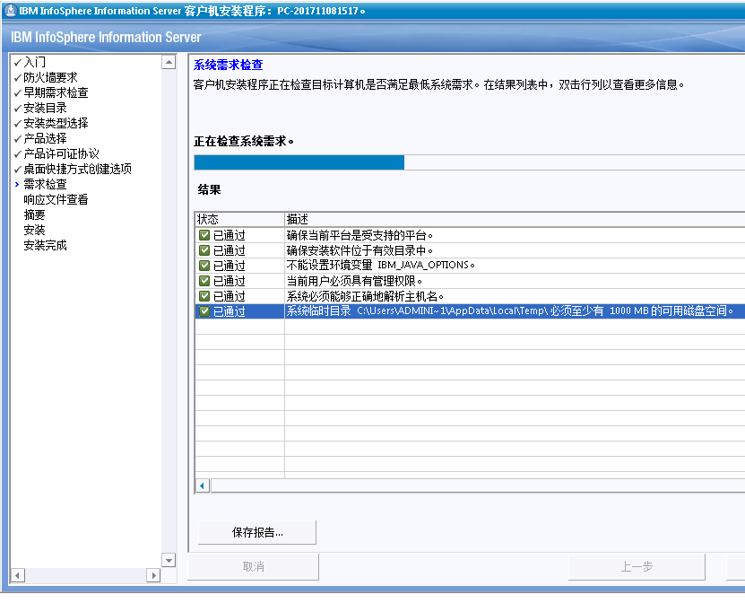
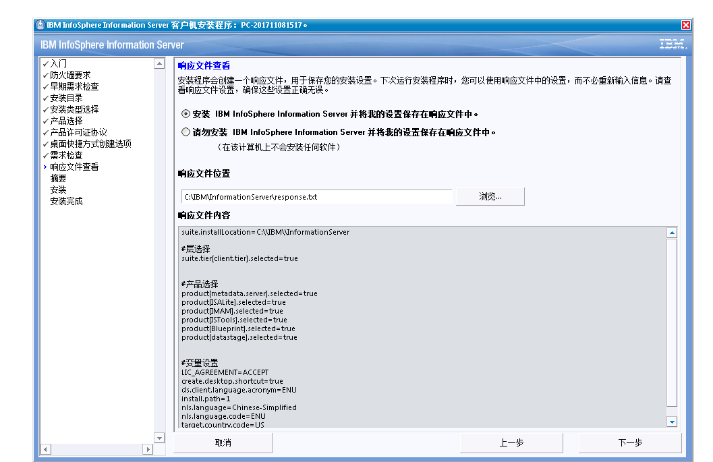

[TOC]

# windows 安装 datastage 客户端

## 环境介绍

操作系统：win7_64

软件：ds_client9.1

安装客户端软件前需要安装Net FrameWork 4，否则会报错

## 操作步骤

解压Client安装包，并将Bundle spec file复制到安装程序所在目录，执行setup.exe

下一步：

下一步

下一步

下一步

下一步：

下一步：选择产品，如只用DataStage，则只选择DataStage即可

下一步接受

下一步

下一步检查如果没有问题就执行下一步

下一步：

下一步：

下一步：安装等待时间可能久一点

下一步完成

完成后就可以进行相关客户端操作