[TOC]

# datastage install in linux

环境准备

linux版本：centos6.5X64

oracle版本：oracle11gr2

datastage版本：datagstage9.1

操作系统安装

操作系统安装参考文档：centos linux 6.5 install.note

操作系统虚拟机复制参考文档：linux  virtualbox copy.note

oracle安装

oracle单机安装： install oracle 11g single in linux.note

oracle复制：oracle amend hostname ip.note

操作步骤

1、切换到oracle环境并在oracle数据库上创建dswas

sqlplus / as sysdba

create user dswas identified by 123456;

grant dba to dswas;

2、切换到root用户并且上传安装包 

cd /opt/tool

tar -xzvf IIS_V9.1_LINUX_X86_64_ML.tar.gz 

chmod 777 /opt/tool/is-suite/DatabaseSupport/UNIX_Linux/MetadataRepository/Oracle11g

cd /opt/tool/is-suite/DatabaseSupport/UNIX_Linux/MetadataRepository/Oracle11g

chmod 775 create_xmeta_db.sh

3、切换到oracle用户并执行脚本

su - oracle

cd /opt/tool/is-suite/DatabaseSupport/UNIX_Linux/MetadataRepository/Oracle11g

./create_xmeta_db.sh system dragon orcl ds91meta 123456 xmetats /u01/app/oracle/product/11.2.0/db_1

4、登录到sys用户并给ds91meta授权

grant dba to ds91meta

5、解压zip文件并将授权文件并在指定路径

unzip Bundle.suite.workgroup.zip 

mv license/ is-suite/

mv image.properties is-suite/

6、使用root用户并且开始安装图形化界面

cd /opt/tool/is-suite/

./setup

7、在firefox上输入http://ds91:8084/ISInstall，可能会报错，将ds91直接换成ip地址，输入后，选择语言是中文

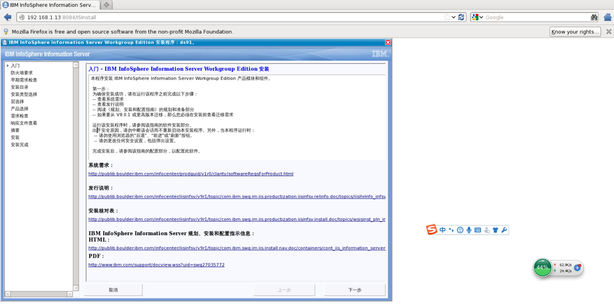

1-1

下一步》下一步

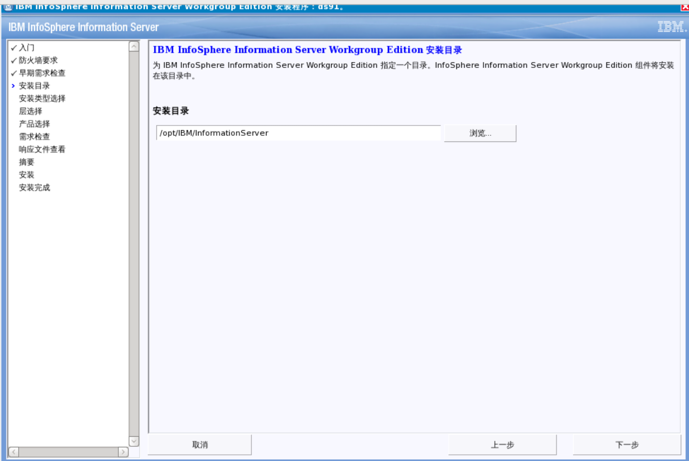

下一步

下一步选择服务引擎

下一步选择english+ibm infosphere datastage

下一步选择接受协议

下一步选择DataStage版本，勾选第一项（parallel job及server job）：

下一步Information Server自带的主/备模式HA配置，本例中不选用，直接点击下一步

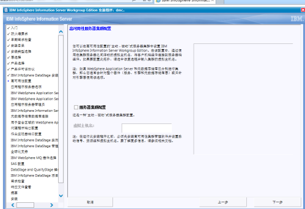

下一步选择安装

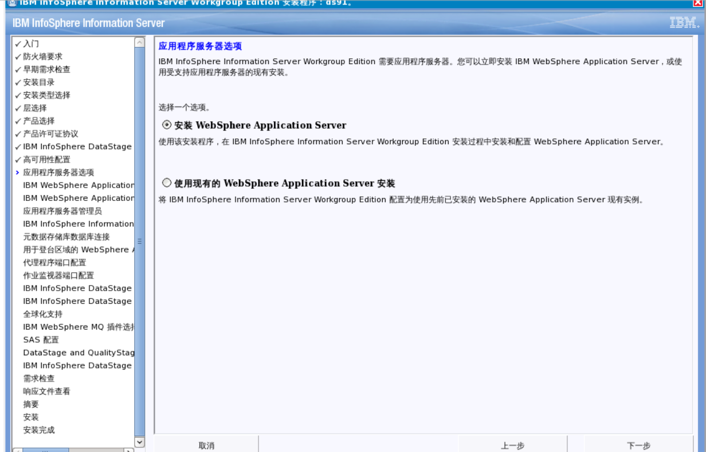

下一步设置WAS安装路径，默认安装在/opt/IBM目录下，默认勾选端口列表

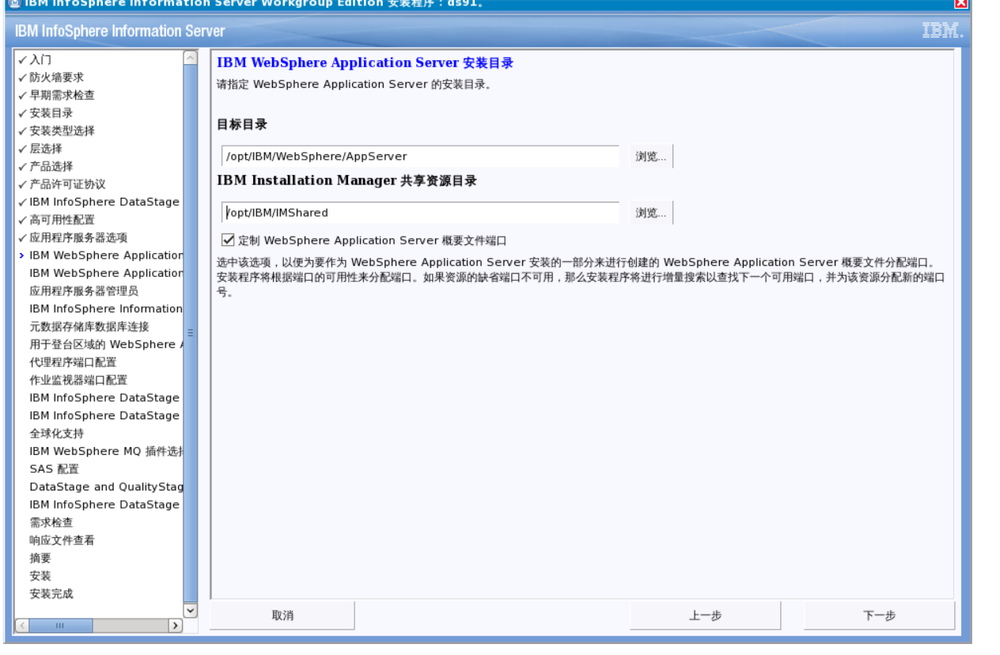

下一步端口列表中，是当前WAS使用的端口号，左侧是描述及默认端口，右侧是实际值，如发现实际端口与默认不符，则可能是/etc/services文件中被其它条目占用，安装程序自动选择了相邻的端口，可根据需要对/etc/services文件进行修改，或沿用安装程序自动适配的端口号，确认后

下一步设置WAS账号及密码 wasadmin/123456

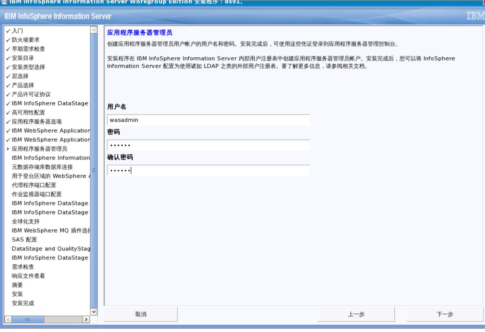

下一步设置IS管理用户及密码 isadmin/123456

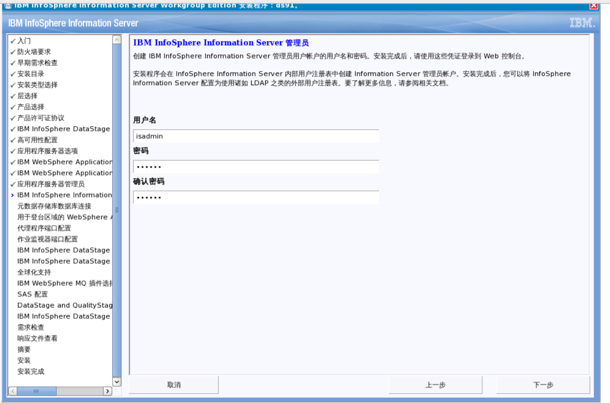

下一步修改数据库相关信息

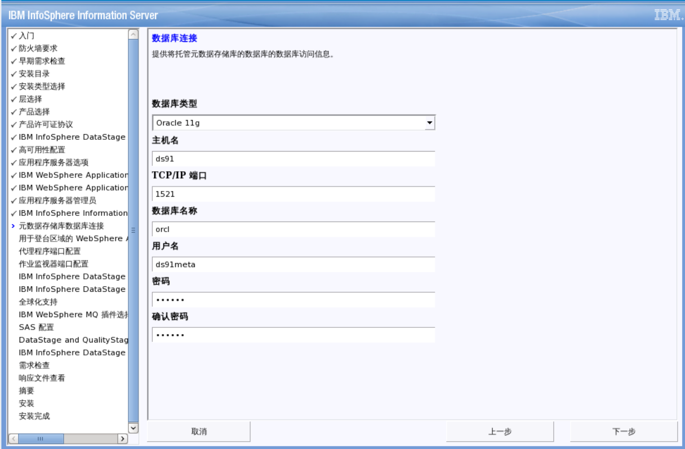

下一步修改数据库相关信息

下一步：IS ASB登录代理及日志端口设置，默认是31533和31538

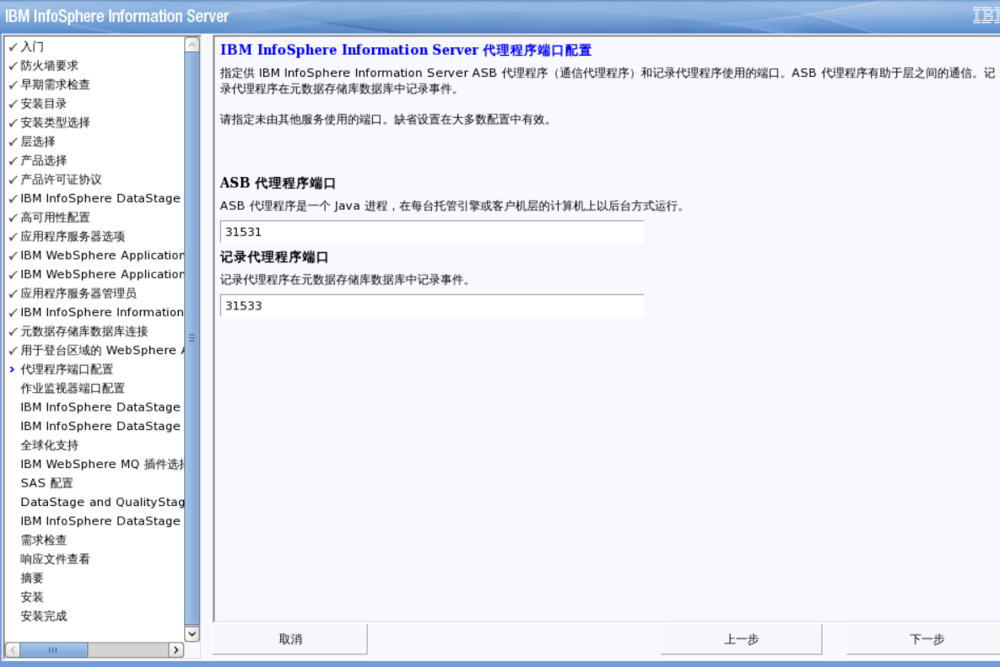

下一步：作业监视器端口配置：DataStage job monitor端口，默认是13400和13401

下一步：用于一台服务器上安装多个DataStage引擎的情况，本例不涉及此场景，留空，继续下一步

下一步：建立DataStage管理员账号dsadm及密码

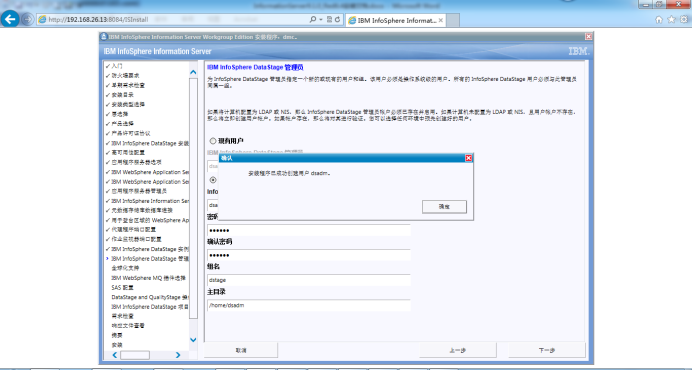

下一步：安装NLS支持，用于支持处理中文

下一步：MQ插件，本例不涉及，留空，不安装，继续下一步

下一步：SAS配置，本例不涉及，留空不安装，继续下一步

下一步：1. 创建操作数据库，仍然使用oracle，设置相应用户名及密码，数据库位置留空，继续下一步：dsodb/123456

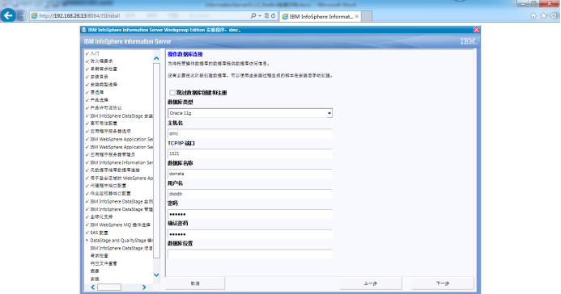

下一步默认的DataStage project，暂保留，不做更改，继续下一步：

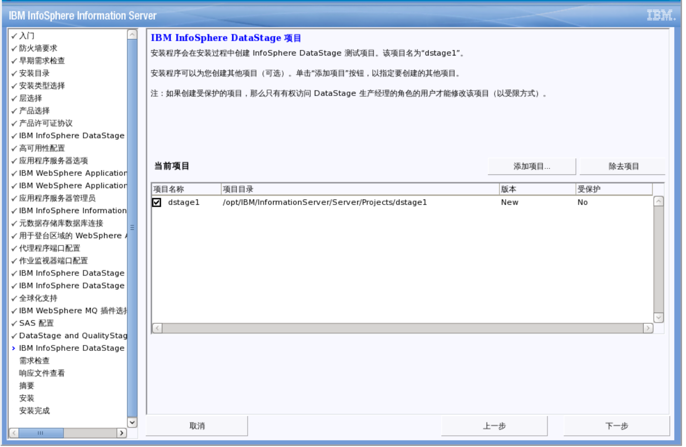

下一步检查根据相关警告修改

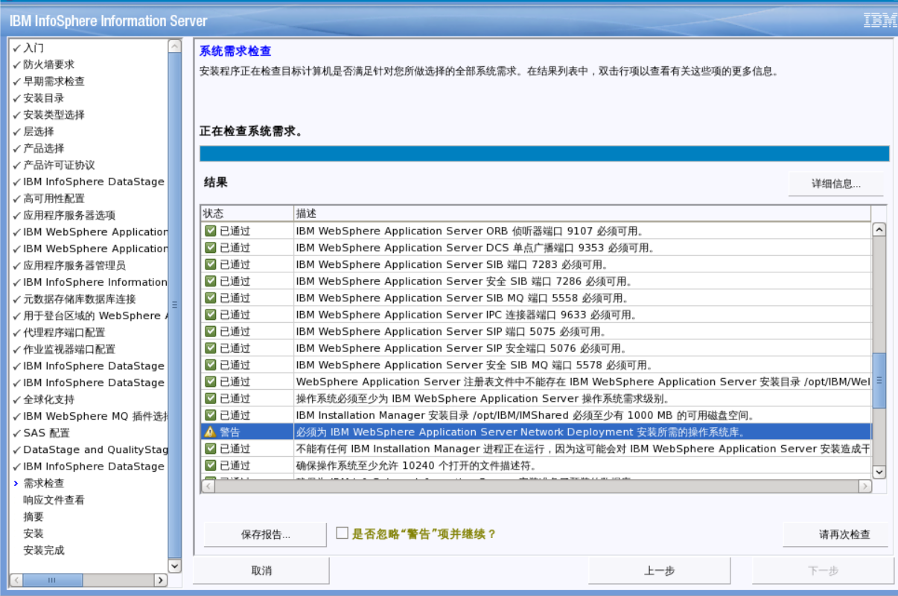

yum -y install libXp*;yum -y install compat-libstdc*;yum -y install libXmu*;

修改配置参数

vim /etc/sysctl.conf 

kernel.sem = 250 128000 32 1024

sysctl -p

重新检查除了内存外

下一步：安装程序将前面所有配置好的内容放入一个响应文件，作为模板供下次安装时使用

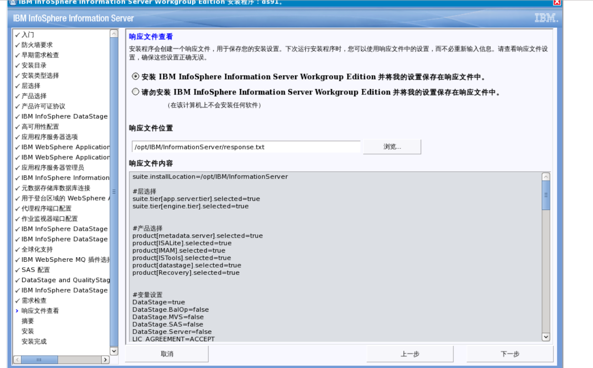

下一步

下一步：安装进程开始

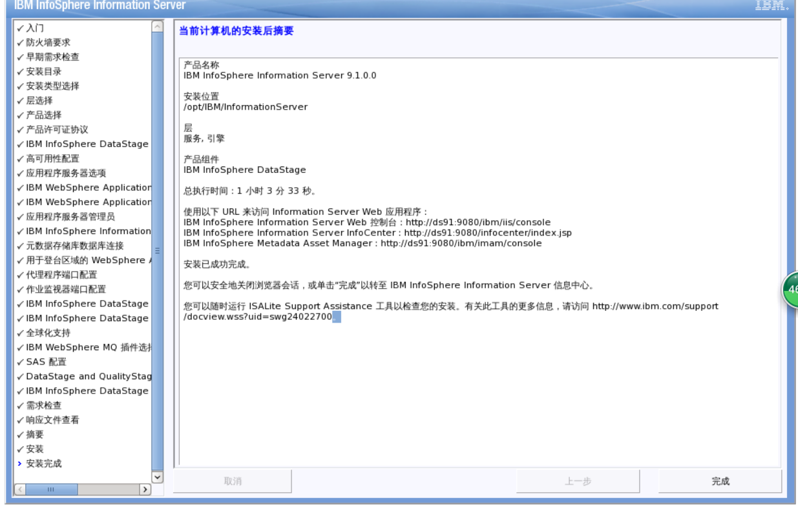

<http://ds91:9080/ibm/iis/console>

<http://ds91:9080/infocenter/index.jsp>

<http://ds91:9080/ibm/imam/console>

[下一步输入：](http://ds91:9080/ibm/imam/console)<http://ds91:9080/ibm/iis/console>，在浏览器打开Information server管理页面，使用wasadmin用户登录

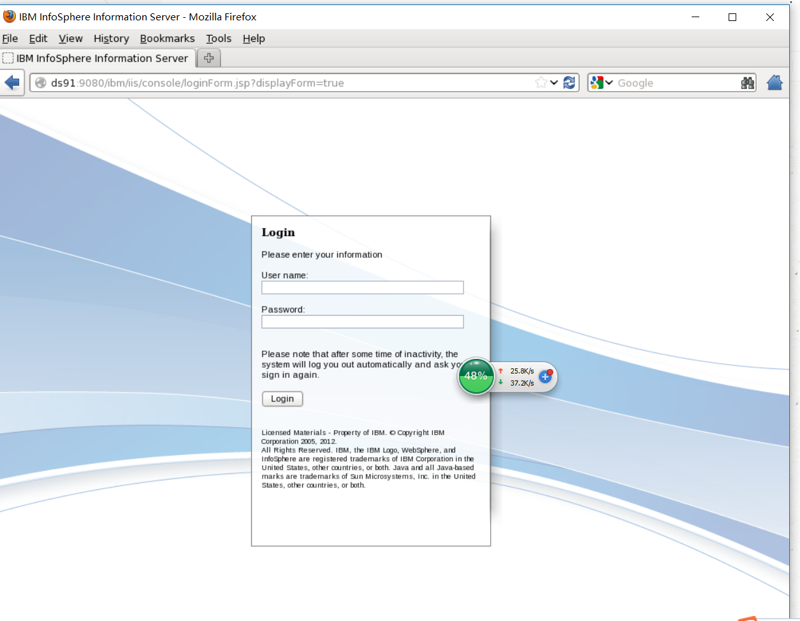

下一步：欢迎界面

下一步：1. 找到Administration界面，选择Users and Groups，点击Users可看见当前服务器上的用户列表，这时我们需要新建一个用户用于DataStage client的登录，点击右侧New User：

下一步：1. 在新用户创建界面，输入用户名密码等信息，红色星号为必填，在中间的Roles窗口，为此用户指定权限，Suite是指此用户在当前web界面中的权限，下方Suite Component是指此用户对于Information Server所有产品的使用权限，可根据实际需要进行设定：

下一步设置完成后，点击右下方的Save and close：

下一步此时可见用户列表中，多出了新建的test用户

下一步：1. 在Domain Management菜单里，我们需要对此新建的用户进行后台引擎的授权，让此用户拥有启动DataStage引擎，执行ETL job的权力；

选择Engine Credential，在中间选择提供ETL服务的主机名（列表内容根据登录的ETL服务器而不同），点击右侧的Open User Credential

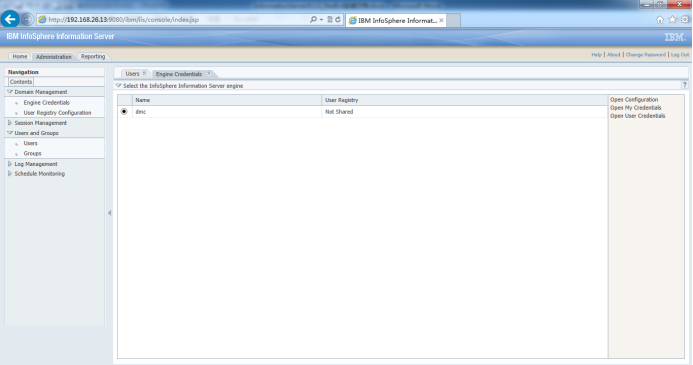

下一步：这里的列表是空的，点击中下部的Browse按钮

下一步：选择之前建立的新用户test，并点击ok

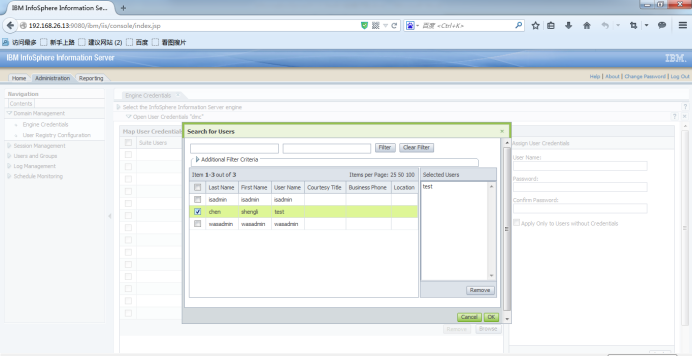

下一步在右侧输入ETL服务器dsadm的用户名和密码，并点击Apply

下一步：用户名密码验证正确后，可以看到中部的test用户已经与服务器操作系统的dsadm账号建立了映射关系：

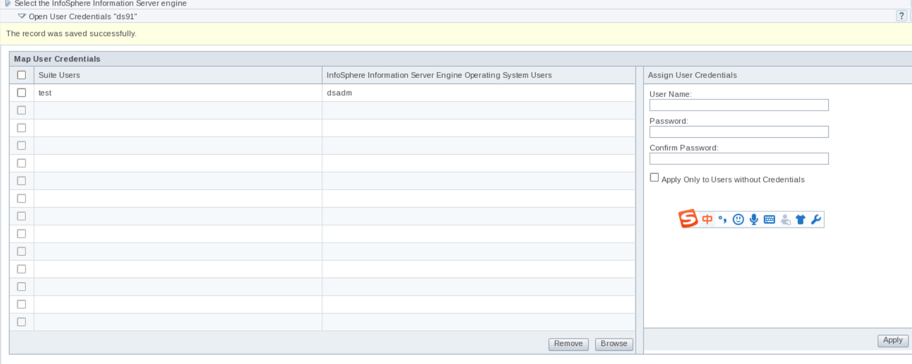

至此，Information Server的client用户创建结束，可以关闭web窗口

关闭流程

[root@ds91 share]# cd /opt/IBM/InformationServer/Server/DSEngine/bin

[root@ds91 bin]# ./uv -admin -stop

Stopping JobMonApp

JobMonApp has been shut down.

resource_tracker has been shutdown.

DataStage Engine 9.1.0.0 instance "ade" has been brought down.

[root@ds91 bin]# cd /opt/IBM/InformationServer/ASBNode/bin

[root@ds91 bin]# ./NodeAgents.sh stop

Agent stopped.

AgentService stopped.

LoggingAgent stopped.

[root@ds91 bin]# su - oracle

[oracle@ds91 ~]$ sqlplus / as sysdba

SQL*Plus: Release 11.2.0.1.0 Production on Tue Nov 7 06:54:10 2017

Copyright (c) 1982, 2009, Oracle.  All rights reserved.

Connected to:

Oracle Database 11g Enterprise Edition Release 11.2.0.1.0 - 64bit Production

With the Partitioning, OLAP, Data Mining and Real Application Testing options

SQL> shutdown immediate;

Database closed.

Database dismounted.

ORACLE instance shut down.

SQL> exit

Disconnected from Oracle Database 11g Enterprise Edition Release 11.2.0.1.0 - 64bit Production

With the Partitioning, OLAP, Data Mining and Real Application Testing options

[oracle@ds91 ~]$ lsnrctl stop

LSNRCTL for Linux: Version 11.2.0.1.0 - Production on 07-NOV-2017 06:54:42

Copyright (c) 1991, 2009, Oracle.  All rights reserved.

Connecting to (DESCRIPTION=(ADDRESS=(PROTOCOL=IPC)(KEY=EXTPROC1521)))

The command completed successfully

[oracle@ds91 ~]$ 