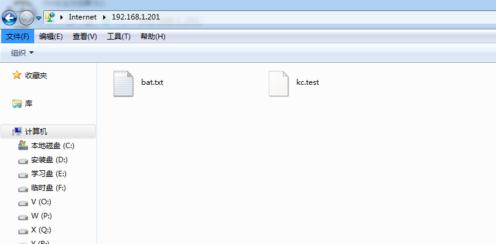
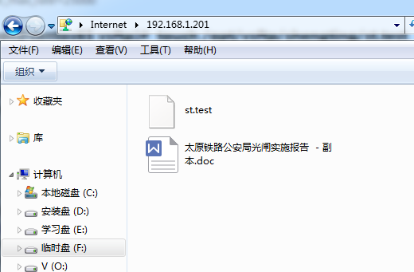
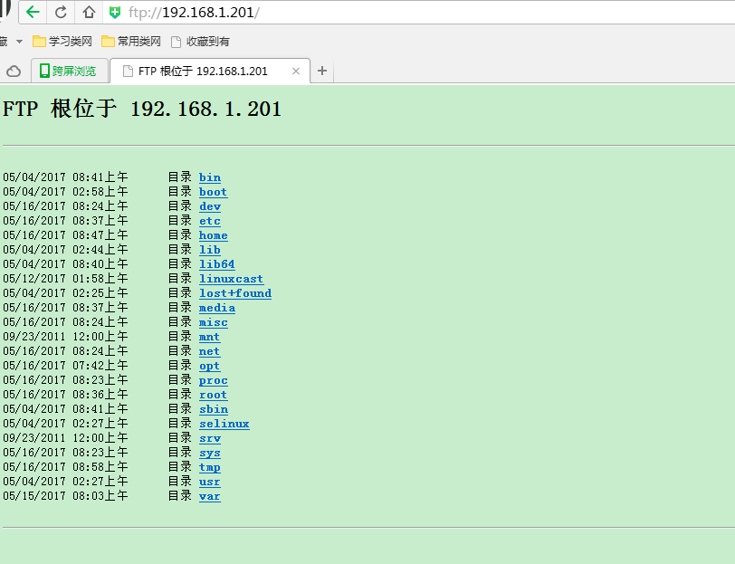

[TOC]

# linux ftp create


## 前提


​	最近“想哭”病毒导致window2008 server的文件感染，ftp文件数据无法使用，所以想在linux上建立ftp服务器。


## 要求


​	多个用户访问不同的文件，用户无法访问其他用户的文件

​	经过在虚拟机的实践，初步达成预期效果


## 部署

​	本次安装部署是通过yum来部署rpm，所以首先要配置yum

### 清空yum缓存

​	

```
[root@centos65 home]# yum clean all

Loaded plugins: fastestmirror, refresh-packagekit, security

Cleaning repos: newdvd

Cleaning up Everything

```


### 安装vsftp软件

```
[root@centos65 home]# yum install vsftpd*

Loaded plugins: fastestmirror, refresh-packagekit, security

Determining fastest mirrors

newdvd                                         | 4.0 kB     00:00 ... 

newdvd/primary_db                              | 4.4 MB     00:00 ... 

Setting up Install Process

Resolving Dependencies

--> Running transaction check

---> Package vsftpd.x86_64 0:2.2.2-11.el6_4.1 will be installed

--> Finished Dependency Resolution

Dependencies Resolved

======================================================================

 Package      Arch         Version                 Repository    Size

======================================================================

Installing:

 vsftpd       x86_64       2.2.2-11.el6_4.1        newdvd       151 k

Transaction Summary

======================================================================

Install       1 Package(s)

Total download size: 151 k

Installed size: 331 k

Is this ok [y/N]: y

Downloading Packages:

Running rpm_check_debug

Running Transaction Test

Transaction Test Succeeded

Running Transaction

  Installing : vsftpd-2.2.2-11.el6_4.1.x86_64                     1/1 

  Verifying  : vsftpd-2.2.2-11.el6_4.1.x86_64                     1/1 

Installed:

  vsftpd.x86_64 0:2.2.2-11.el6_4.1                                    

Complete!

安装pam软件（开发包）

[root@centos65 home]# yum  install pam*

Loaded plugins: fastestmirror, refresh-packagekit, security

Loading mirror speeds from cached hostfile

Setting up Install Process

Package pam_krb5-2.3.11-9.el6.x86_64 already installed and latest version

Package pam-1.1.1-17.el6.x86_64 already installed and latest version

Package pam_passwdqc-1.0.5-6.el6.x86_64 already installed and latest version

Resolving Dependencies

--> Running transaction check

---> Package pam-devel.x86_64 0:1.1.1-17.el6 will be installed

---> Package pam_ldap.x86_64 0:185-11.el6 will be installed

---> Package pam_pkcs11.x86_64 0:0.6.2-12.1.el6 will be installed

--> Processing Dependency: libpcsclite.so.1()(64bit) for package: pam_pkcs11-0.6.2-12.1.el6.x86_64

---> Package pam_ssh_agent_auth.x86_64 0:0.9.3-94.el6 will be installed

--> Running transaction check

---> Package pcsc-lite-libs.x86_64 0:1.5.2-13.el6_4 will be installed

--> Finished Dependency Resolution

Dependencies Resolved

======================================================================

 Package               Arch      Version              Repository

                                                                 Size

======================================================================

Installing:

 pam-devel             x86_64    1.1.1-17.el6         newdvd    204 k

 pam_ldap              x86_64    185-11.el6           newdvd     88 k

 pam_pkcs11            x86_64    0.6.2-12.1.el6       newdvd    192 k

 pam_ssh_agent_auth    x86_64    0.9.3-94.el6         newdvd     98 k

Installing for dependencies:

 pcsc-lite-libs        x86_64    1.5.2-13.el6_4       newdvd     28 k

Transaction Summary

======================================================================

Install       5 Package(s)

Total download size: 610 k

Installed size: 2.0 M

Is this ok [y/N]: y

Downloading Packages:

Error Downloading Packages:

  pam_ssh_agent_auth-0.9.3-94.el6.x86_64: failure: Packages/pam_ssh_agent_auth-0.9.3-94.el6.x86_64.rpm from newdvd: [Errno 256] No more mirrors to try.

安装db4软件（支持文件数据库）

[root@centos65 home]# yum install db4*

Loaded plugins: fastestmirror, refresh-packagekit, security

Loading mirror speeds from cached hostfile

Setting up Install Process

Package db4-cxx-4.7.25-18.el6_4.x86_64 already installed and latest version

Package db4-utils-4.7.25-18.el6_4.x86_64 already installed and latest version

Package db4-4.7.25-18.el6_4.x86_64 already installed and latest version

Package db4-devel-4.7.25-18.el6_4.x86_64 already installed and latest version

Resolving Dependencies

--> Running transaction check

---> Package db4-devel-static.x86_64 0:4.7.25-18.el6_4 will be installed

---> Package db4-java.x86_64 0:4.7.25-18.el6_4 will be installed

---> Package db4-tcl.x86_64 0:4.7.25-18.el6_4 will be installed

--> Finished Dependency Resolution

Dependencies Resolved

======================================================================

 Package              Arch       Version             Repository  Size

======================================================================

Installing:

 db4-devel-static     x86_64     4.7.25-18.el6_4     newdvd     2.5 M

 db4-java             x86_64     4.7.25-18.el6_4     newdvd     1.7 M

 db4-tcl              x86_64     4.7.25-18.el6_4     newdvd     620 k

Transaction Summary

======================================================================

Install       3 Package(s)

Total download size: 4.8 M

Installed size: 23 M

Is this ok [y/N]: y

Downloading Packages:

Error Downloading Packages:

  db4-tcl-4.7.25-18.el6_4.x86_64: failure: Packages/db4-tcl-4.7.25-18.el6_4.x86_64.rpm from newdvd: [Errno 256] No more mirrors to try.

  db4-java-4.7.25-18.el6_4.x86_64: failure: Packages/db4-java-4.7.25-18.el6_4.x86_64.rpm from newdvd: [Errno 256] No more mirrors to try.

  db4-devel-static-4.7.25-18.el6_4.x86_64: failure: Packages/db4-devel-static-4.7.25-18.el6_4.x86_64.rpm from newdvd: [Errno 256] No more mirrors to try.

```

​	部分报错信息不会影响本次的安装部署


### 建立Vsftpd服务的宿主用户

```
[root@centos65 home]# useradd vsftpd -s /sbin/nologin
```


### 建立Vsftpd虚拟宿主用户

```
[root@centos65 home]# useradd overlord -s /sbin/nolog
```


​	Vsftp的虚拟用户，虚拟用户并不是系统用户，也就是说这些FTP的用户在系统中是不存在的。他们的总体权限其实是集中寄托在一个在系统中的某一个用户身上的，所谓Vsftpd的虚拟宿主用户，就是这样一个支持着所有虚拟用户的宿主用户。由于他支撑了FTP的所有虚拟的用户，那么他本身的权限将会影响着这些虚拟的用户，因此，处于安全性的考虑，也要非分注意对该用户的权限的控制，该用户也绝对没有登陆系统的必要，这里也设定他为不能登陆系统的用户

### 编辑配置文件前先备份

```
[root@centos65 home]# cp /etc/vsftpd/vsftpd.conf /etc/vsftpd/vsftpd.conf.backup

[root@centos65 home]# vi /etc/vsftpd/vsftpd.conf

```


具体内容如下：

[[root@centos65](mailto:root@centos65) home]# cat /etc/vsftpd/vsftpd.conf

\# Example config file /etc/vsftpd/vsftpd.conf

\#

\# The default compiled in settings are fairly paranoid. This sample file

\# loosens things up a bit, to make the ftp daemon more usable.

\# Please see vsftpd.conf.5 for all compiled in defaults.

\#

\# READ THIS: This example file is NOT an exhaustive list of vsftpd options.

\# Please read the vsftpd.conf.5 manual page to get a full idea of vsftpd's

\# capabilities.

\#

\# Allow anonymous FTP? (Beware - allowed by default if you comment this out).

anonymous_enable=NO

\#

\# Uncomment this to allow local users to log in.

local_enable=YES

\#

\# Uncomment this to enable any form of FTP write command.

write_enable=YES

\#

\# Default umask for local users is 077. You may wish to change this to 022,

\# if your users expect that (022 is used by most other ftpd's)

local_umask=022

\#

\# Uncomment this to allow the anonymous FTP user to upload files. This only

\# has an effect if the above global write enable is activated. Also, you will

\# obviously need to create a directory writable by the FTP user.

anon_upload_enable=NO

\#

\# Uncomment this if you want the anonymous FTP user to be able to create

\# new directories.

anon_mkdir_write_enable=NO

\#

\# Activate directory messages - messages given to remote users when they

\# go into a certain directory.

dirmessage_enable=YES

\#

\# The target log file can be vsftpd_log_file or xferlog_file.

\# This depends on setting xferlog_std_format parameter

xferlog_enable=YES

\#

\# Make sure PORT transfer connections originate from port 20 (ftp-data).

connect_from_port_20=YES

\#

\# If you want, you can arrange for uploaded anonymous files to be owned by

\# a different user. Note! Using "root" for uploaded files is not

\# recommended!

chown_uploads=NO

\#chown_username=whoever

\#

\# The name of log file when xferlog_enable=YES and xferlog_std_format=YES

\# WARNING - changing this filename affects /etc/logrotate.d/vsftpd.log

xferlog_file=/var/log/xsftpd.log

\#

\# Switches between logging into vsftpd_log_file and xferlog_file files.

\# NO writes to vsftpd_log_file, YES to xferlog_file

xferlog_std_format=YES

\#

\# You may change the default value for timing out an idle session.

\#idle_session_timeout=600

\#

\# You may change the default value for timing out a data connection.

\#data_connection_timeout=120

\#

\# It is recommended that you define on your system a unique user which the

\# ftp server can use as a totally isolated and unprivileged user.

\#nopriv_user=ftpsecure

nopriv_user=vsftpd

\#

\# Enable this and the server will recognise asynchronous ABOR requests. Not

\# recommended for security (the code is non-trivial). Not enabling it,

\# however, may confuse older FTP clients.

async_abor_enable=YES

\#

\# By default the server will pretend to allow ASCII mode but in fact ignore

\# the request. Turn on the below options to have the server actually do ASCII

\# mangling on files when in ASCII mode.

\# Beware that on some FTP servers, ASCII support allows a denial of service

\# attack (DoS) via the command "SIZE /big/file" in ASCII mode. vsftpd

\# predicted this attack and has always been safe, reporting the size of the

\# raw file.

\# ASCII mangling is a horrible feature of the protocol.

ascii_upload_enable=YES

ascii_download_enable=YES

\#

\# You may fully customise the login banner string:

ftpd_banner=Welcome to blah FTP service.

\#

\# You may specify a file of disallowed anonymous e-mail addresses. Apparently

\# useful for combatting certain DoS attacks.

\#deny_email_enable=YES

\# (default follows)

\#banned_email_file=/etc/vsftpd/banned_emails

\#

\# You may specify an explicit list of local users to chroot() to their home

\# directory. If chroot_local_user is YES, then this list becomes a list of

\# users to NOT chroot().

\#chroot_local_user=YES

chroot_list_enable=NO

\# (default follows)

\#chroot_list_file=/etc/vsftpd/chroot_list

\#

\# You may activate the "-R" option to the builtin ls. This is disabled by

\# default to avoid remote users being able to cause excessive I/O on large

\# sites. However, some broken FTP clients such as "ncftp" and "mirror" assume

\# the presence of the "-R" option, so there is a strong case for enabling it.

ls_recurse_enable=NO

\#

\# When "listen" directive is enabled, vsftpd runs in standalone mode and

\# listens on IPv4 sockets. This directive cannot be used in conjunction

\# with the listen_ipv6 directive.

listen=YES

\#

\# This directive enables listening on IPv6 sockets. To listen on IPv4 and IPv6

\# sockets, you must run two copies of vsftpd with two configuration files.

\# Make sure, that one of the listen options is commented !!

\#listen_ipv6=YES

\#pam_service_name=vsftpd

pam_service_name=vsftpd

userlist_enable=YES

tcp_wrappers=YES

guest_enable=YES

guest_username=overlord

virtual_use_local_privs=YES

user_config_dir=/etc/vsftpd/vconf


### 建立Vsftpd的日志文件，并更该属主为Vsftpd的服务宿主用户

```
[root@centos65 home]# touch /var/log/vsftpd.log

[root@centos65 home]# chown vsftpd.vsftpd /var/log/vsftpd.log

[root@centos65 home]# mkdir /etc/vsftpd/vconf/

```


### 建立虚拟用户名单文件

```
[root@centos65 home]# touch /etc/vsftpd/virtusers

[root@centos65 home]# vi /etc/vsftpd/virtusers

```


具体内容如下：

[[root@centos65](mailto:root@centos65) home]# cat /etc/vsftpd/virtusers

knecruise

123456

near

123456near

mello

123456mello

注：由于参考文档的用户创建出现了名字不对称，后面使用了最后一个用户mello来完成实验；

一行用户名，一行口令

### 生成虚拟用户数据文件

```
[root@centos65 home]# db_load -T -t hash -f /etc/vsftpd/virtusers /etc/vsftpd/virtusers.db
```


### 查看生成的虚拟用户数据文件

```
[root@centos65 vsftpd]# ll /etc/vsftpd/virtusers.db 

-rw-r--r-- 1 root root 12288 May 16 03:40 /etc/vsftpd/virtusers.db

```


注：文件权限要一致


### 设定PAM验证文件，并指定虚拟用户数据库文件进行读取


```
[root@centos65 vsftpd]# cp /etc/pam.d/vsftpd /etc/pam.d/vsftpd.backup

[root@centos65 vsftpd]# vi /etc/pam.d/vsftpd

```


具体内容如下：

[[root@centos65](mailto:root@centos65) home]# cat /etc/pam.d/vsftpd

\#%PAM-1.0

\#session    optional     pam_keyinit.so    force revoke

\#auth       required    pam_listfile.so item=user sense=deny file=/etc/vsftpd/ftpusers onerr=succeed

\#auth       required    pam_shells.so

\#auth       include    password-auth

\#account    include    password-auth

\#session    required     pam_loginuid.so

\#session    include    password-auth

\#%PAM-1.0

auth    sufficient      /lib64/security/pam_userdb.so    db=/etc/vsftpd/virtusers

account sufficient      /lib64/security/pam_userdb.so    db=/etc/vsftpd/virtusers

注：如果是64位，那么选择/lib64/,如果使32位选择/lib/

​       前面的信息最好都注释掉，不然可能输入密码无效

### 规划好虚拟用户的主路径

```
[root@centos65 vsftpd]# mkdir /opt/vsftp/
```


### 建立测试用户的FTP用户目录

```
[root@centos65 vsftpd]#  mkdir /opt/vsftp/kanecruise/ /opt/vsftp/mello/ /opt/vsftp/near/
```


### 建立虚拟用户配置文件模版

```
[root@centos65 vsftpd]# cp /etc/vsftpd/vsftpd.conf.backup /etc/vsftpd/vconf/vconf.tmp

[root@centos65 vsftpd]# vi /etc/vsftpd/vconf/vconf.tmp 

```


具体内容如下：

[[root@centos65](mailto:root@centos65) home]# cat /etc/vsftpd/vconf/vconf.tmp 

\# Example config file /etc/vsftpd/vsftpd.conf

\#

\# The default compiled in settings are fairly paranoid. This sample file

\# loosens things up a bit, to make the ftp daemon more usable.

\# Please see vsftpd.conf.5 for all compiled in defaults.

\#

\# READ THIS: This example file is NOT an exhaustive list of vsftpd options.

\# Please read the vsftpd.conf.5 manual page to get a full idea of vsftpd's

\# capabilities.

\#

\# Allow anonymous FTP? (Beware - allowed by default if you comment this out).

anonymous_enable=YES

\#

\# Uncomment this to allow local users to log in.

local_enable=YES

\#

\# Uncomment this to enable any form of FTP write command.

write_enable=YES

\#

\# Default umask for local users is 077. You may wish to change this to 022,

\# if your users expect that (022 is used by most other ftpd's)

local_umask=022

\#

\# Uncomment this to allow the anonymous FTP user to upload files. This only

\# has an effect if the above global write enable is activated. Also, you will

\# obviously need to create a directory writable by the FTP user.

\#anon_upload_enable=YES

\#

\# Uncomment this if you want the anonymous FTP user to be able to create

\# new directories.

\#anon_mkdir_write_enable=YES

\#

\# Activate directory messages - messages given to remote users when they

\# go into a certain directory.

dirmessage_enable=YES

\#

\# The target log file can be vsftpd_log_file or xferlog_file.

\# This depends on setting xferlog_std_format parameter

xferlog_enable=YES

\#

\# Make sure PORT transfer connections originate from port 20 (ftp-data).

connect_from_port_20=YES

\#

\# If you want, you can arrange for uploaded anonymous files to be owned by

\# a different user. Note! Using "root" for uploaded files is not

\# recommended!

\#chown_uploads=YES

\#chown_username=whoever

\#

\# The name of log file when xferlog_enable=YES and xferlog_std_format=YES

\# WARNING - changing this filename affects /etc/logrotate.d/vsftpd.log

\#xferlog_file=/var/log/xferlog

\#

\# Switches between logging into vsftpd_log_file and xferlog_file files.

\# NO writes to vsftpd_log_file, YES to xferlog_file

xferlog_std_format=YES

\#

\# You may change the default value for timing out an idle session.

\#idle_session_timeout=600

\#

\# You may change the default value for timing out a data connection.

\#data_connection_timeout=120

\#

\# It is recommended that you define on your system a unique user which the

\# ftp server can use as a totally isolated and unprivileged user.

\#nopriv_user=ftpsecure

\#

\# Enable this and the server will recognise asynchronous ABOR requests. Not

\# recommended for security (the code is non-trivial). Not enabling it,

\# however, may confuse older FTP clients.

\#async_abor_enable=YES

\#

\# By default the server will pretend to allow ASCII mode but in fact ignore

\# the request. Turn on the below options to have the server actually do ASCII

\# mangling on files when in ASCII mode.

\# Beware that on some FTP servers, ASCII support allows a denial of service

\# attack (DoS) via the command "SIZE /big/file" in ASCII mode. vsftpd

\# predicted this attack and has always been safe, reporting the size of the

\# raw file.

\# ASCII mangling is a horrible feature of the protocol.

\#ascii_upload_enable=YES

\#ascii_download_enable=YES

\#

\# You may fully customise the login banner string:

\#ftpd_banner=Welcome to blah FTP service.

\#

\# You may specify a file of disallowed anonymous e-mail addresses. Apparently

\# useful for combatting certain DoS attacks.

\#deny_email_enable=YES

\# (default follows)

\#banned_email_file=/etc/vsftpd/banned_emails

\#

\# You may specify an explicit list of local users to chroot() to their home

\# directory. If chroot_local_user is YES, then this list becomes a list of

\# users to NOT chroot().

\#chroot_local_user=YES

\#chroot_list_enable=YES

\# (default follows)

\#chroot_list_file=/etc/vsftpd/chroot_list

\#

\# You may activate the "-R" option to the builtin ls. This is disabled by

\# default to avoid remote users being able to cause excessive I/O on large

\# sites. However, some broken FTP clients such as "ncftp" and "mirror" assume

\# the presence of the "-R" option, so there is a strong case for enabling it.

\#ls_recurse_enable=YES

\#

\# When "listen" directive is enabled, vsftpd runs in standalone mode and

\# listens on IPv4 sockets. This directive cannot be used in conjunction

\# with the listen_ipv6 directive.

listen=YES

\#

\# This directive enables listening on IPv6 sockets. To listen on IPv4 and IPv6

\# sockets, you must run two copies of vsftpd with two configuration files.

\# Make sure, that one of the listen options is commented !!

\#listen_ipv6=YES

pam_service_name=vsftpd

userlist_enable=YES

tcp_wrappers=YES

local_root=/opt/vsftp/virtuser

注：其实可以参考下面的各个用户的脚本就可以，这步可以忽略

### 更改虚拟用户的主目录的属主为虚拟宿主用户

```
[root@centos65 vsftpd]# chown -R overlord.overlord /opt/vsftp/
```

[[root@centos65](mailto:root@centos65) vsftpd]# ll /opt/vsftp/

total 12

drwxr-xr-x 2 overlord overlord 4096 May 16 03:42 kanecruise

drwxr-xr-x 2 overlord overlord 4096 May 16 03:42 mello

drwxr-xr-x 2 overlord overlord 4096 May 16 03:42 near

### 针对具体用户进行定制

```
[root@KcentOS5 ~]# cp /etc/vsftpd/vconf/vconf.tmp /etc/vsftpd/vconf/mello
```


具体内容如下：

[[root@centos65](mailto:root@centos65) home]# cat /etc/vsftpd/vconf/mello 

local_root=/opt/vsftp/mello

anonymous_enable=NO

write_enable=YES

local_umask=022

anon_upload_enable=NO

anon_mkdir_write_enable=NO

idle_session_timeout=300

data_connection_timeout=90

max_clients=1

max_per_ip=1

local_max_rate=25000

注：这个内容需要修改local_root可以直接复制上面使用

### 启动vsftpd应用

```
[root@centos65 log]# service vsftpd restart

Shutting down vsftpd:                                      [  OK  ]

Starting vsftpd for vsftpd:                                [  OK  ]

```


### 在虚拟用户目录中预先放入文件

```
[root@KcentOS5 ~]# touch /opt/vsftp/mello/kc.test
```


### 通过ie登陆查看信息并上传文件



### 添加新的用户

[root@centos65 home]# vi /etc/vsftpd/virtusers

具体内容如下：

[[root@centos65](mailto:root@centos65) ~]# cat /etc/vsftpd/virtusers

knecruise

123456

near

123456near

mello

123456mello

shengting

1234567812

[root@centos65 vsftpd]# db_load -T -t hash -f /etc/vsftpd/virtusers /etc/vsftpd/virtusers.db

[[root@centos65](mailto:root@centos65) vsftpd]# ll /etc/vsftpd/virtusers.db 

-rw-r--r-- 1 root root 12288 May 16 06:01 /etc/vsftpd/virtusers.db

[root@centos65 vsftp]# mkdir /opt/vsftp/shengting

[[root@centos65](mailto:root@centos65) vsftp]# ls -ls

total 16

4 drwxr-xr-x 2 overlord overlord 4096 May 16 03:51 kanecruise

4 drwxr-xr-x 2 overlord overlord 4096 May 16 04:42 mello

4 drwxr-xr-x 2 overlord overlord 4096 May 16 03:42 near

4 drwxr-xr-x 2 root     root     4096 May 16 06:03 shengting

[root@centos65 vsftp]# chown -R overlord.overlord /opt/vsftp/shengting/

[[root@centos65](mailto:root@centos65) vsftp]# ls -ls

total 16

4 drwxr-xr-x 2 overlord overlord 4096 May 16 03:51 kanecruise

4 drwxr-xr-x 2 overlord overlord 4096 May 16 04:42 mello

4 drwxr-xr-x 2 overlord overlord 4096 May 16 03:42 near

4 drwxr-xr-x 2 overlord overlord 4096 May 16 06:03 shengting

[root@centos65 vsftp]# cp /etc/vsftpd/vconf/mello  /etc/vsftpd/vconf/shengting

[root@centos65 vsftp]# vi /etc/vsftpd/vconf/shengting 

[[root@centos65](mailto:root@centos65) ~]# cat /etc/vsftpd/vconf/shengting

local_root=/opt/vsftp/shengting

anonymous_enable=NO

write_enable=YES

local_umask=022

anon_upload_enable=NO

anon_mkdir_write_enable=NO

idle_session_timeout=300

data_connection_timeout=90

max_clients=1

max_per_ip=1

local_max_rate=25000

[root@centos65 vsftp]#  touch /opt/vsftp/shengting/st.test

[root@centos65 vsftp]# service vsftpd restart

Shutting down vsftpd:                                      [FAILED]

Starting vsftpd for vsftpd:                                [  OK  ]



================================================================

## 问题记录

1-1.大意写错关键字

[[root@centos65](mailto:root@centos65) vsftpd]# service vsftpd start

Starting vsftpd for vsftpd: 500 OOPS: unrecognised variable in config file: guset_username

在/etc/vsftpd/vsftpd.conf下"guest"写成了"guset"

2-1.530无法登录

远程ftp登陆 报：530 login incrrect 

1>检查/etc/pam.d/vsftpd 是否配置准确

2>检查/etc/vsftpd/vsftpd.conf的pam_service_name=vsftpd

报错信息日志：/var/log/secure    /var/log/vsftpd.log

2-2.本地连接ftp服务器报错：需要ftp客户端

[[root@centos65](mailto:root@centos65) opt]# ftp 192.168.1.201

-bash: ftp: command not found

[[root@centos65](mailto:root@centos65) opt]# yum list ftp*

Loaded plugins: fastestmirror, refresh-packagekit, security

Loading mirror speeds from cached hostfile

newdvd                                         | 4.0 kB     00:00 ... 

Available Packages

ftp.x86_64                     0.17-54.el6                      newdvd

[[root@centos65](mailto:root@centos65) opt]# yum -y install ftp*

Loaded plugins: fastestmirror, refresh-packagekit, security

Loading mirror speeds from cached hostfile

Setting up Install Process

Resolving Dependencies

--> Running transaction check

---> Package ftp.x86_64 0:0.17-54.el6 will be installed

--> Finished Dependency Resolution

Dependencies Resolved

======================================================================

 Package                                   Arch                       

======================================================================

Installing:

 ftp                                       x86_64                     

Transaction Summary

======================================================================

Install       1 Package(s)

Total download size: 58 k

Installed size: 95 k

Downloading Packages:

Running rpm_check_debug

Running Transaction Test

Transaction Test Succeeded

Running Transaction

  Installing : ftp-0.17-54.el6.x86_64                                 

  Verifying  : ftp-0.17-54.el6.x86_64                                 

Installed:

  ftp.x86_64 0:0.17-54.el6                                            

Complete!

[[root@centos65](mailto:root@centos65) opt]# ls

3-1.报密码错误 [2017-05-17 18:39  补充]

May 17 10:21:38 qbname vsftpd[3058]: pam_userdb(vsftpd:auth): user 'dragon_gasj' granted access

May 17 10:21:43 qbname vsftpd[3061]: pam_userdb(vsftpd:auth): user 'dragon_gasj' granted access

May 17 10:21:49 qbname vsftpd[3064]: pam_userdb(vsftpd:auth): user 'dragon_gasj' granted access

May 17 10:21:50 qbname vsftpd[3067]: pam_userdb(vsftpd:auth): user `dragon_gasj' denied access (incorrect password)

May 17 10:23:48 qbname vsftpd[3090]: pam_userdb(vsftpd:auth): user 'dragon_gasj' granted access

关闭防火墙和selinux,重启后可以远程登陆和访问

[[root@qbname](mailto:root@qbname) vconf]# chkconfig iptables off

[[root@qbname](mailto:root@qbname) vconf]# /usr/sbin/sestatus -v

SELinux status:                 enabled

SELinuxfs mount:                /selinux

Current mode:                   enforcing

Mode from config file:          enforcing

Policy version:                 24

Policy from config file:        targeted

Process contexts:

Current context:                unconfined_u:unconfined_r:unconfined_t:s0-s0:c0.c1023

Init context:                   system_u:system_r:init_t:s0

/usr/sbin/sshd                  system_u:system_r:sshd_t:s0-s0:c0.c1023

File contexts:

Controlling term:               unconfined_u:object_r:user_devpts_t:s0

/etc/passwd                     system_u:object_r:etc_t:s0

/etc/shadow                     system_u:object_r:shadow_t:s0

/bin/bash                       system_u:object_r:shell_exec_t:s0

/bin/login                      system_u:object_r:login_exec_t:s0

/bin/sh                         system_u:object_r:bin_t:s0 -> system_u:object_r:shell_exec_t:s0

/sbin/agetty                    system_u:object_r:getty_exec_t:s0

/sbin/init                      system_u:object_r:init_exec_t:s0

/sbin/mingetty                  system_u:object_r:getty_exec_t:s0

/usr/sbin/sshd                  system_u:object_r:sshd_exec_t:s0

[[root@qbname](mailto:root@qbname) vconf]# vim /etc/selinux/config 

4-1.网络速度较慢，3.1M的文件传输了2分钟

[[root@qbname](mailto:root@qbname) yum.repos.d]# yum update

Loaded plugins: product-id, refresh-packagekit, security, subscription-manager

This system is not registered to Red Hat Subscription Management. You can use subscription-manager to register.

dvd                                                                                                            | 3.9 kB     00:00     

dvd/primary_db                                                                                                 | 3.1 MB     02:09     

Setting up Update Process

No Packages marked for Update

网上资料修改dns,但是目前工作性质接触的都非互联网

[[root@qbname](mailto:root@qbname) yum.repos.d]# cat /etc/resolv.conf 

\# Generated by NetworkManager

\# No nameservers found; try putting DNS servers into your

\# ifcfg files in /etc/sysconfig/network-scripts like so:

\#

\# DNS1=xxx.xxx.xxx.xxx

\# DNS2=xxx.xxx.xxx.xxx

\# DOMAIN=lab.foo.com bar.foo.com

<https://yq.aliyun.com/ziliao/79556>

修改该用户的配置参数local_max_rate=250000(250kb),问题得到解决

[[root@qbname](mailto:root@qbname) vconf]# vi dragon_jfyq 

[[root@qbname](mailto:root@qbname) vconf]# yum update

Loaded plugins: product-id, refresh-packagekit, security, subscription-manager

This system is not registered to Red Hat Subscription Management. You can use subscription-manager to register.

Setting up Update Process

No Packages marked for Update

[[root@qbname](mailto:root@qbname) vconf]# yum clean all

Loaded plugins: product-id, refresh-packagekit, security, subscription-manager

This system is not registered to Red Hat Subscription Management. You can use subscription-manager to register.

Cleaning repos: dvd

Cleaning up Everything

[[root@qbname](mailto:root@qbname) vconf]# yum update

Loaded plugins: product-id, refresh-packagekit, security, subscription-manager

This system is not registered to Red Hat Subscription Management. You can use subscription-manager to register.

dvd                                                                                                            | 3.9 kB     00:00     

dvd/primary_db                                                                                                 | 3.1 MB     00:12     

Setting up Update Process

No Packages marked for Update

5.1、在360浏览器中登陆，界面是这样的,或者在其他浏览器中，路径地址暴漏



网上一种解决方案，请查看

<https://zhidao.baidu.com/question/436817030166104004.html>，对于解决该问题没有起到作用

网上第二种解决方案如下：参考文档：<https://zhidao.baidu.com/question/2205911713706365028.html>，这个文档解决该问题，信息如下：

修改/etc/vsftpd/vsftpd.conf 

将以下三行 

\#chroot_list_enable=YES 

\# (default follows) 

\#chroot_list_file=/etc/vsftpd.chroot_list 

改为 

chroot_list_enable=YES 

\# (default follows) 

chroot_list_file=/etc/vsftpd/chroot_list 

二、 新增一个档案: /etc/vsftpd/chroot_list 

内容增加两行： 

user1

user2

注：chroot_list文件需要创建，新增的两行为ftp用户

6.1某些ftp客户端服务器访问vsftp中文文件乱码，具体参考《flashfxp*》相关文档

6.2直接使用window的资源管理器登陆ftp地址，乱码问题正在解决中

## 链接地址

<http://www.linuxidc.com/Linux/2013-09/90562.htm>

<http://www.361way.com/ftp-error/1832.html>                                      

http://www.07net01.com/linux/vsftpd_530_login_incrrect_xuniyonghupeizhiwufadengluwentichuli_20980_1350959472.html

<http://www.jb51.net/LINUXjishu/138726.html>

<http://blog.csdn.net/shachejiayou/article/details/47805463>

<https://yq.aliyun.com/ziliao/79556>

<http://securityer.lofter.com/post/1d0f3ee7_71d87d9>

<https://zhidao.baidu.com/question/436817030166104004.html>

<https://zhidao.baidu.com/question/2205911713706365028.html>