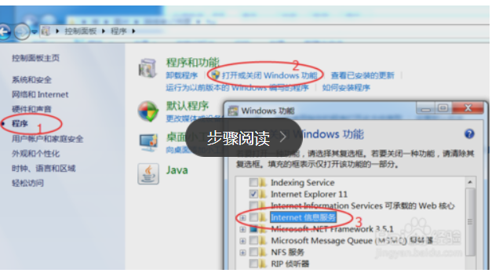
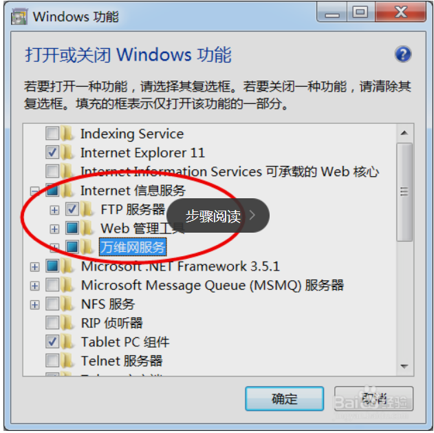
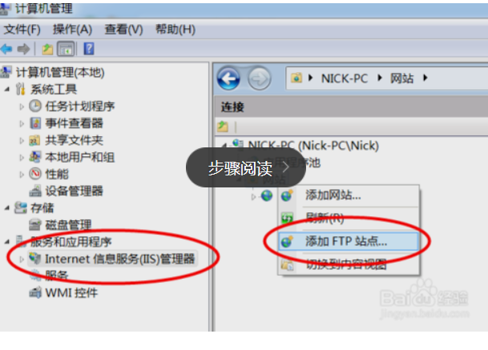
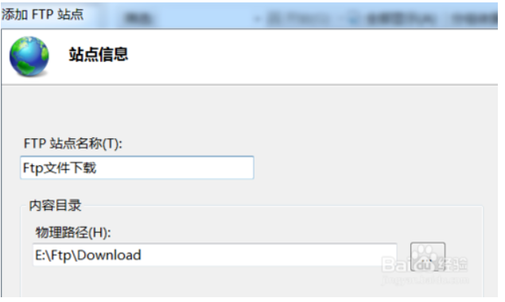
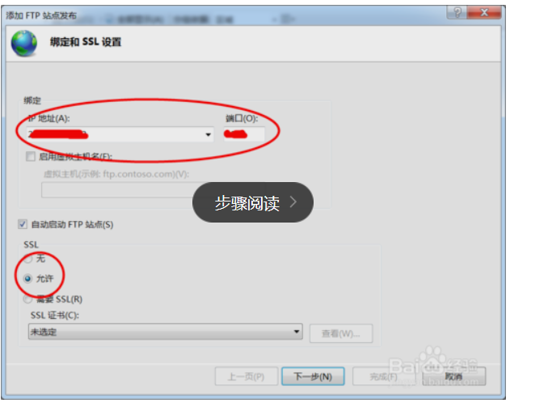
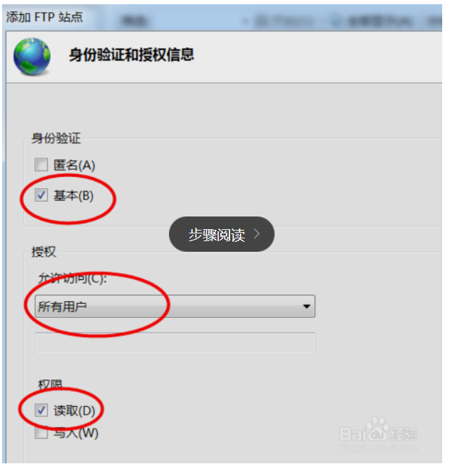

[TOC]

# window 开启自带ftp

window ftp 匿名服务

ftp 匿名服务 创建非常简便

首先在控制面板》程序》打开或者关闭window功能》

选择Internet信息服务中ftp服务器，web管理工具，万维网服务，点击确定，等待几分钟

右击我的电脑选择管理进入到计算机管理界面

在服务和应用程序下选择Ineternet信息服务管理器

在右侧选择添加ftp站点

填写ftp站点名称和路径

按照下图配置

下图中本次选择匿名，所有用户，读取，写入；

不选择基本的原因还需要配置用户，匿名就不要用户

匿名配置完成，可能需要重启才能生效。部分图片来自于百度