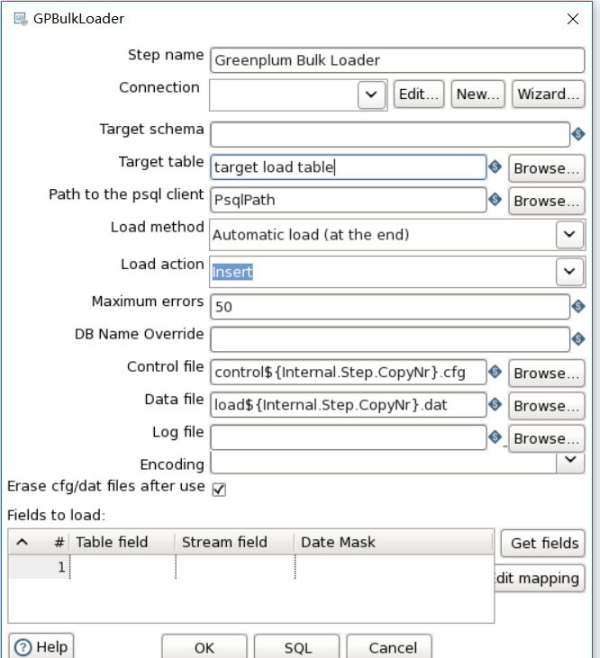

[TOC]

# kettle greenplum bulk loader 

kettle greenplum bulk loader

之前一个章节中讲到greenplum bulk loader与greenplum load区别联系；当时自己不是很懂（其实现在也不懂），但是现将此测试成功

界面与greenplum load有所区别

=============================================================================错误：

1.1、gpbulkloader报错

主要报错信息：Passwords are not supported directly, try configuring your connection for trusted access using pg_hba.conf

修改配置参数改为trust,重启后，依然没有效果，暂时先放弃