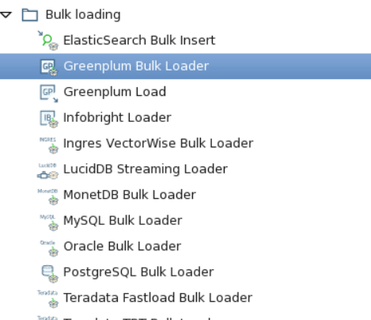
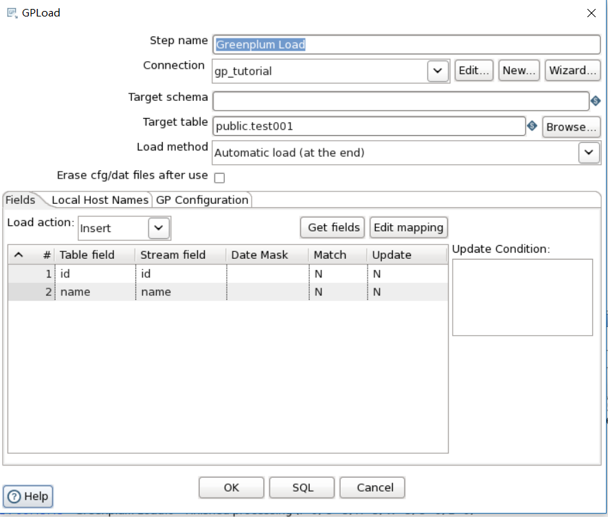
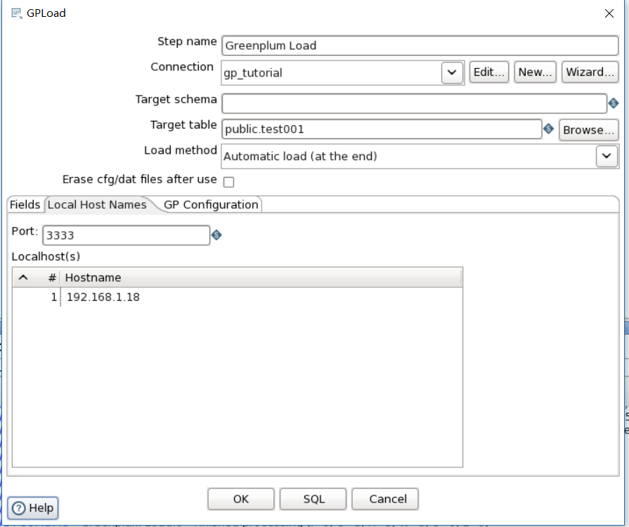
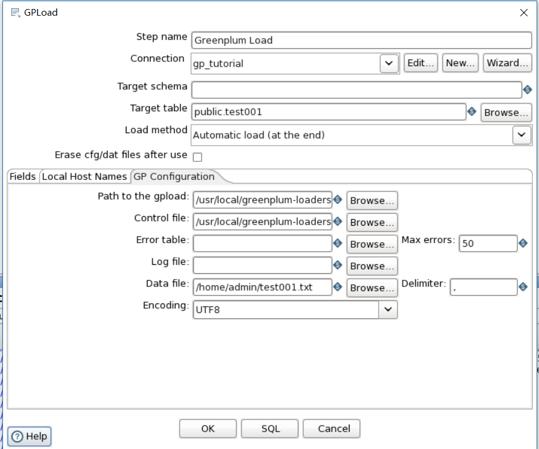
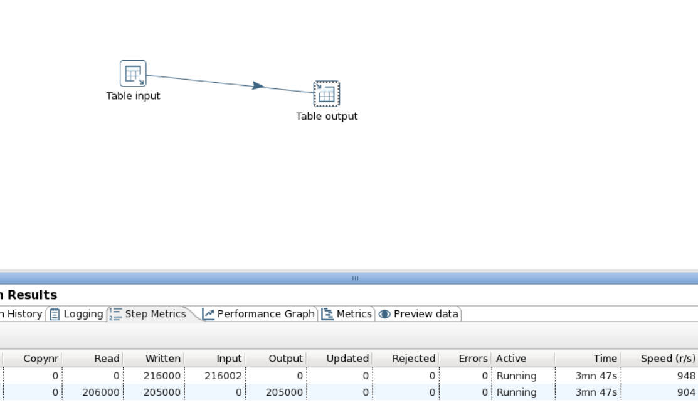
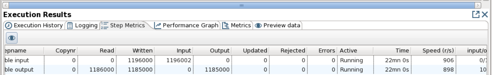
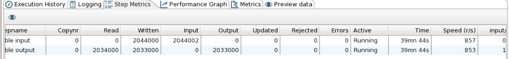
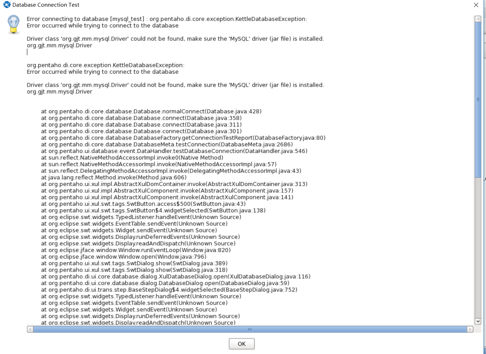

[TOC]

# kettle  支持 greenplum gpload

kettle greenplum loader

测试用例：kettle的表输出，插入或者更新控件对于gp数据库来说，如果数据量都在万以下，不考虑时间，还可以接受，如果万级以上，时间要求比较及时，那么只能使用greenplum loader控件来完成

操作环境：centos6.5

软件：greenplum-loader（installed）;kettle(5.4)

【步骤】

打开kettle界面

新建一个转换

查找到BULK LOADING下的GREENPLUM LOADER控件

如下图

greenplum bulk loader 与 greenplum loader 区别还有联系，暂时还是不懂，所以现在使用greenplum load

介绍：本次转换将从mysql数据库中获取数据并传入到greenplumdatabase

大致图形如下

查看greenplum load配置

分为

字段；本地主机名；gp的配置参数

字段不需要过多解释

本地主机名

端口号最好填写3333不是关键端口

主机名：有的时候无法解析，建议直接使用ip地址

gp参数配置

path to the gpload:本地部署gpload的路径

/usr/local/greenplum-loaders-4.3.8.1-build-1/bin/gpload

control file：此文件可以只创建文件名

data file:此文件可以只创建文件名

Encoding：选择UTF8

现在开始比较表插入，更新或者插入以及使用greenplum loader的效率

查询mysql下的test001数据量为5242880；

执行mysql到gp通过greenplum loader方式，总共用时2分钟；

使用mysql到gp直接使用表输出模式

时间比较长，3min跑完20万，其实在生产库中，由于字段较多，每秒钟的速度只是到100条左右；

20min后截图

40min后截图

放弃了最终时间，不过时间确实是超长的

比较插入更新；

这次选择1000条数据左右

greenplum loader用时1min

kettle自带的插入更新

好像5.4没有插入更新这个控件，其实在生产库中，使用kettle插入更新gp数据库超级慢，后来由负责gp的人使用gpload写入加载数据，考虑到脚本不可确定性；使用kettle通过greenplum load控件更加易于管理

方案附件

[MYSQL_TRAN_GREENPLUM](../img_src/133FE193D8F14553B39F809896F2ED33/MYSQL_TRAN_GREENPLUM.ktr)

====================================================================

错误

1.1、Driver class 'org.gjt.mm.mysql.Driver' could not be found, make sure the 'MySQL' driver (jar file) is installed.

org.gjt.mm.mysql.Driver

kettle没有自带mysql驱动，需要下载后安装就可以了

​       2.1、启动greenplum loader报错

主要问题是找不到gpload.py，查看环境配置

添加

source /usr/local/greenplum-loaders-4.3.8.1-build-1/greenplum_loaders_path.sh

export PYTHONPATH=/usr/local/lib