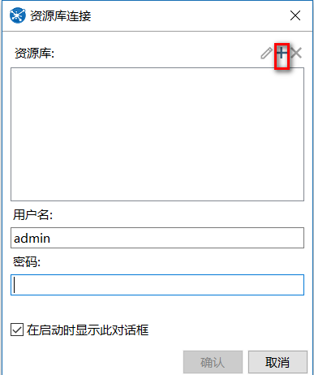
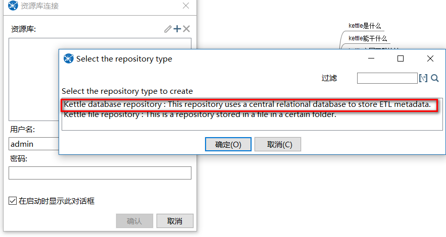
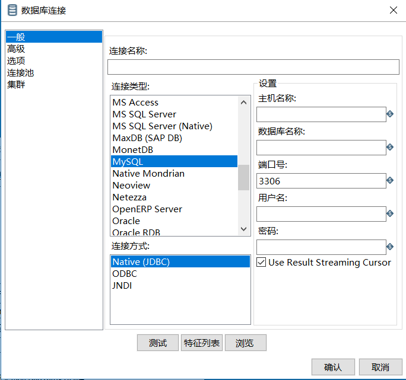

[TOC]

# kettle_mysql_配置数据库资源库

主要点：

学习配置资源库

说明：kettle 第一语言设置的是中文，因此后面部分菜单栏名称都是中文

kettle 资源库 配置成oracle的比较常见而且在生产环境中大多是这样的，但是在学习的案例中使用的是mysql作为kettle的数据库资源库，因此，自己按照案例重新配置一下资源库

1、工具》选项》启动时显示资源库对话框》打钩

将此信息保存并重新打开kettle

2、参考图片步骤操作

2.1、选择下图中红色按钮，点击"+"按钮

图片2.1

2.2 点击“+”后，出现下图，并选择 kettle database repository(数据库资源库)

图片2.2

2,3选择完“kettle database repository”后，出现下图，并选择新建

图片2.3

2.4选择完新建后，出现下图，请按照实情来配置数据库链接

图片2.4

后面的名称和描述与选择的数据库链接一致即可，防止后面调用时不知道该使用什么名字

注意如下问题：

1、不建议使用mysql作为kettle的资源库数据库，kettle 5.0 系列的boolean 类型在 mysql数据库中可能变成tinyint类型

2、使用oracle暂时没有发现该问题