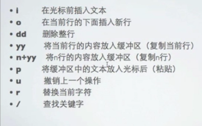
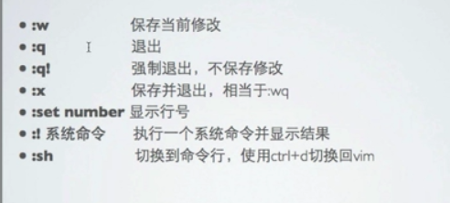

[TOC]

# linux vi文本编辑器

​	vi是一个命令界面下的文本编辑工具，早期名字叫做ex,vi支持绝大多数操作系统，并且功能十分强大

​	1991基于vi进行了改进，发布了vim，加入了对GUI的支持

​	vim已经不仅仅最为普通意义的文本编辑器，而且被广泛的作为在文本编辑，文本处理，代码开发等等用途

​	

	## VIM

​	绝大多数都装有vim，vim比vi功能更为强大

​	命令vim可以启动vim编辑器

​	vim + 目标文件路径 使用vim

​	

vim 拥有三种模式

 - 命令模式

   vim启动后，默认进入到命令模式，任何模式都可以通过esc键回到命令模式

- 插入模式

  在命令模式"i"

  

- ex模式

  在命令模式":" 退出保存，不保存

  

  