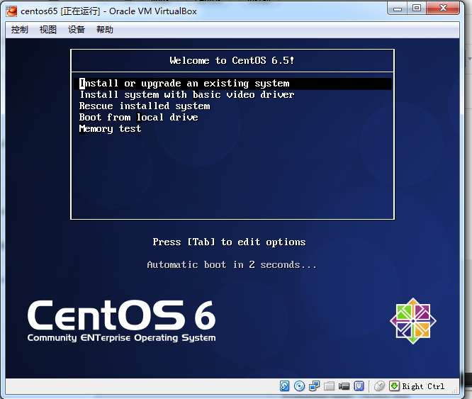
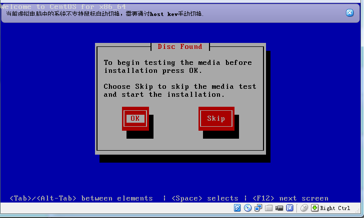
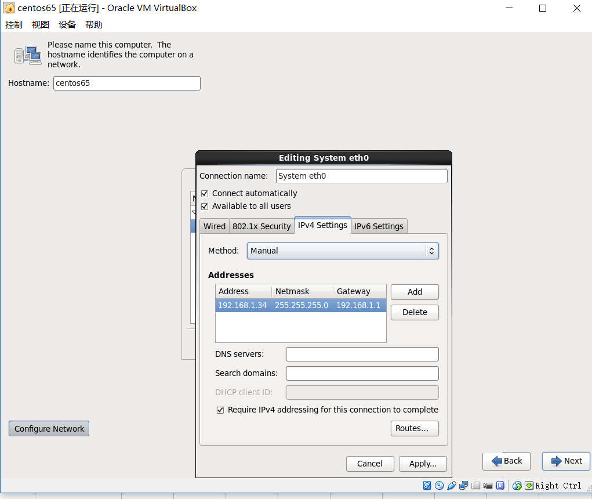
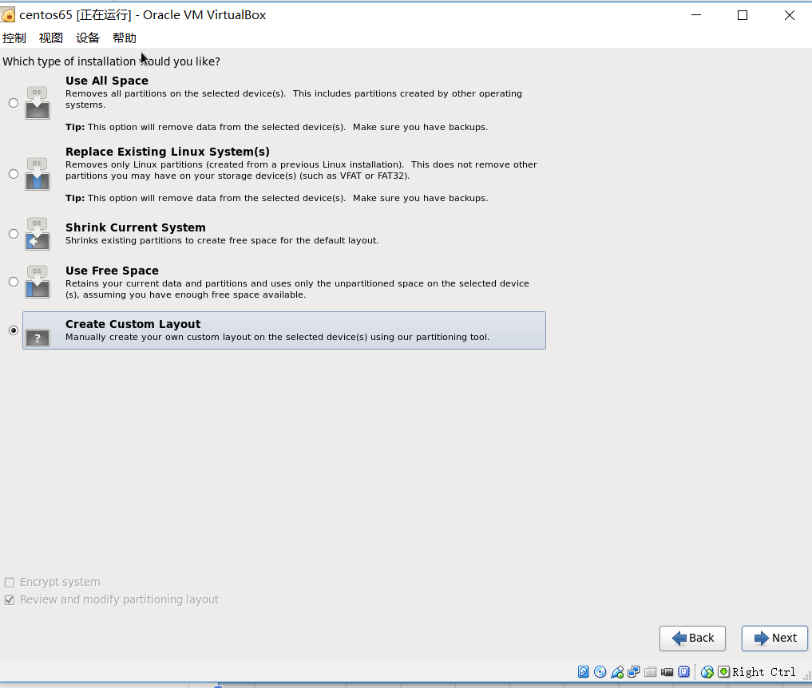
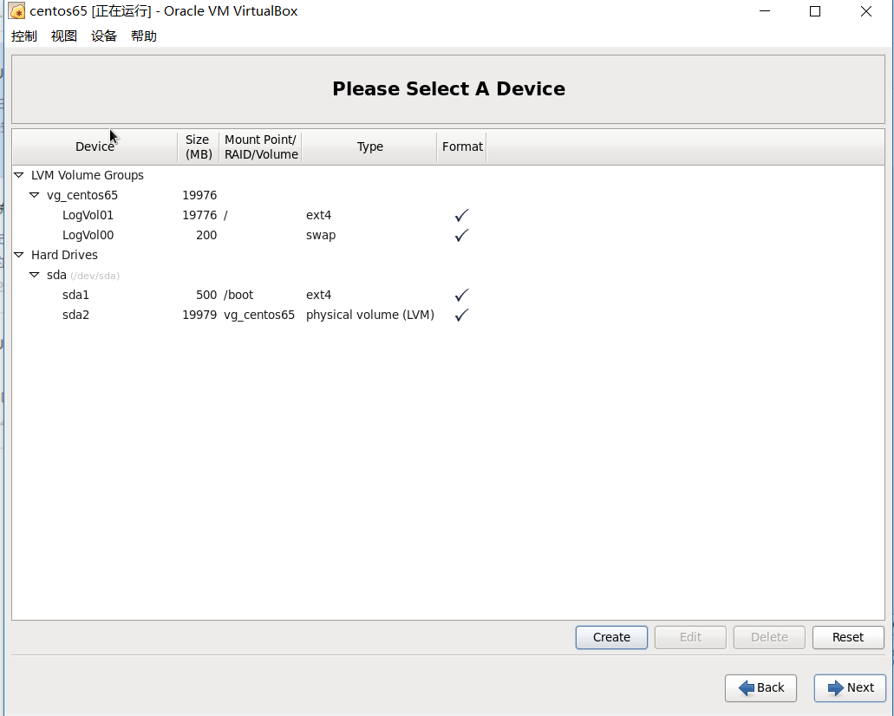
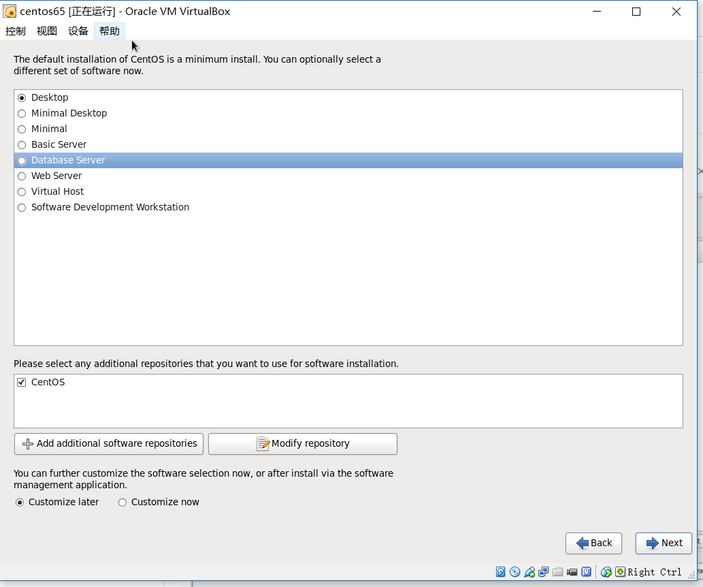

[TOC]

# centos 6.5 install

​	

​	今天将有道云笔记的文档迁移到githup中，这篇《centos 6.5 install》让我影响深刻，并非是这篇文档写的有多好，而是自己觉得这一段时间进步比较大(当然是自己认为了)，依稀记得当时安装操作系统时，每一个步骤与文档记录不符合，就会心里很慌，这是不自信的表现(不熟悉的事情自己做总是会紧张)，现在操作系统拿来，该搞搞就搞搞(当然深的也不懂)。

​	操作系统的安装主要是磁盘的划分，其他的默认一般就可以了

​	

## centos虚拟机安装 

安装界面一

选择SKIP选项

主机名和网络配置

硬盘分区

不论是安装虚拟机还是安装生产环境都要学会使用逻辑分区

在使用逻辑分区前，首先划分一个磁盘作为/boot区,boot区为引导区，不能使用逻辑分区

需要选择desktop可视化界面模式，与redhat还有不同就是选择项较少，更容易查看

