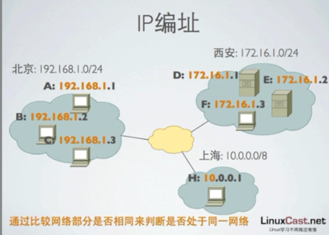
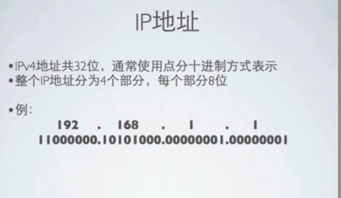
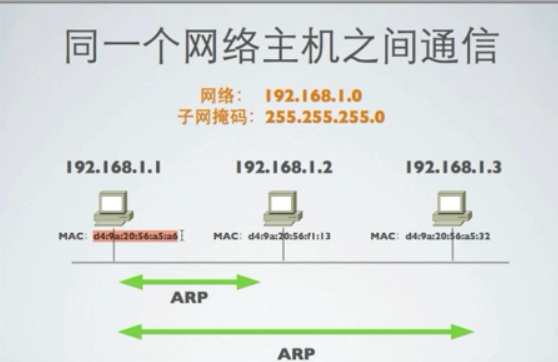
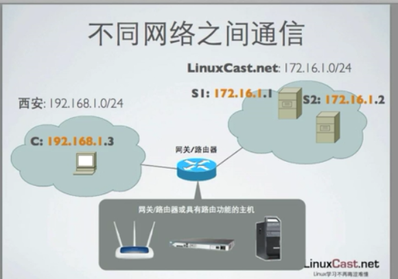
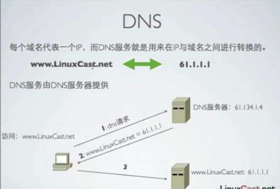
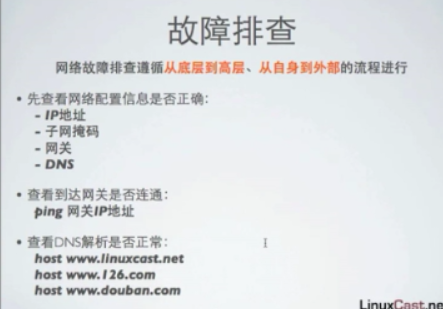

[TOC]

# LINUX NETWORK

## ip遍址

linux 网络编址 使用最广泛的是 ip编址，一个ip地址标识一个主机

现在使用最广泛的ipv4编址，已经开始逐渐向ipv6地址切换

ipv4地址为32位长，ipv6地址为128位长

一个ipv4地址分为两个部分：网络部分和主机部分

网络部分用来标识所属区域，主机部分用来表示该区域终的那个主机

192.168.0.0/24~192.168.0.1->192.168.0.255

10.0.0.0/8~ 10.x.x.x

## IP 地址

ipv4共分为32位，通常使用点分十进制式表示

192.168.1.1

## 子网掩码

## 同一个网络主机之前的通信

网络：192.168.1.0 子网掩码：255.255.255.0

mac地址

通常一个网段是通过交换机或者直接直连

## 不同网络之间通信

## 路由

路由相当于网关，用来跨区域交换数据

## 域名管理

[www.baidu.com](http://www.baidu.com)

主机名.域名.类型

每个域名代表一个ip，而dns服务就是用来在ip与域名直接进行切换的

## 基本网络参数

### 局域网通信

ip地址

子网掩码

### 跨网段通信

ip地址

子网掩码

网关

### 域名访问

ip地址

子网掩码

网关

DNS配置

## 以太网连接

在linux中，以太网接口被命名为:eth0,eth1,0,1代表网卡变号

### 通过lspci命令查看硬件信息

[root@centos65 ~]# lspci

00:00.0 Host bridge: Intel Corporation 440FX - 82441FX PMC [Natoma] (rev 02)

00:01.0 ISA bridge: Intel Corporation 82371SB PIIX3 ISA [Natoma/Triton II]

00:01.1 IDE interface: Intel Corporation 82371AB/EB/MB PIIX4 IDE (rev 01)

00:02.0 VGA compatible controller: InnoTek Systemberatung GmbH VirtualBox Graphics Adapter

00:03.0 Ethernet controller: Intel Corporation 82540EM Gigabit Ethernet Controller (rev 02)

00:04.0 System peripheral: InnoTek Systemberatung GmbH VirtualBox Guest Service

00:07.0 Bridge: Intel Corporation 82371AB/EB/MB PIIX4 ACPI (rev 08)

00:0d.0 SATA controller: Intel Corporation 82801HM/HEM (ICH8M/ICH8M-E) SATA Controller [AHCI mode] (rev 02)

[[root@centos65](mailto:root@centos65) ~]# lsusb

### 命令ifconfig查看网络设备结构

[root@centos65 ~]# ifconfig -a

eth0      Link encap:Ethernet  HWaddr 08:00:27:EA:B9:C1  

​          inet addr:192.168.1.201  Bcast:192.168.1.255  Mask:255.255.255.0

​          inet6 addr: fe80::a00:27ff:feea:b9c1/64 Scope:Link

​          UP BROADCAST RUNNING MULTICAST  MTU:1500  Metric:1

​          RX packets:7602 errors:0 dropped:0 overruns:0 frame:0

​          TX packets:2528 errors:0 dropped:0 overruns:0 carrier:0

​          collisions:0 txqueuelen:1000 

​          RX bytes:693032 (676.7 KiB)  TX bytes:256171 (250.1 KiB)

lo        Link encap:Local Loopback  

​          inet addr:127.0.0.1  Mask:255.0.0.0

​          inet6 addr: ::1/128 Scope:Host

​          UP LOOPBACK RUNNING  MTU:16436  Metric:1

​          RX packets:56 errors:0 dropped:0 overruns:0 frame:0

​          TX packets:56 errors:0 dropped:0 overruns:0 carrier:0

​          collisions:0 txqueuelen:0 

​          RX bytes:4544 (4.4 KiB)  TX bytes:4544 (4.4 KiB)

[[root@centos65](mailto:root@centos65) ~]# ifconfig eth0

eth0      Link encap:Ethernet  HWaddr 08:00:27:EA:B9:C1  

​          inet addr:192.168.1.201  Bcast:192.168.1.255  Mask:255.255.255.0

​          inet6 addr: fe80::a00:27ff:feea:b9c1/64 Scope:Link

​          UP BROADCAST RUNNING MULTICAST  MTU:1500  Metric:1

​          RX packets:7628 errors:0 dropped:0 overruns:0 frame:0

​          TX packets:2550 errors:0 dropped:0 overruns:0 carrier:0

​          collisions:0 txqueuelen:1000 

​          RX bytes:695266 (678.9 KiB)  TX bytes:259199 (253.1 KiB)

### 命令ifup,ifdown用来启用，关闭网络接口设备

[root@centos65 ~]# ifdown eth0

[root@centos65 ~]# ifup eth0

### 命令setup配置网络

[root@centos65 ~]# setup

### 网卡相关配置文件

网卡配置文件

/etc/sysconfig/network-scripts/ifcfg-ethx

dns配置文件

/etc/resolv.conf

主机名配置文件

/etc/sysconfig/network

[[root@centos65](mailto:root@centos65) etc]# cat /etc/sysconfig/network

NETWORKING=yes

HOSTNAME=centos65

GATEWAY=192.168.1.1

静态地址

/etc/hosts

### 网络测试命令

测试网络联通地址

ping ip

ping www.baidu.com

测试DNS解析

host www.baidu.com

dig www.baidu.com

显示路由表

ip route

追踪到达目标地址的网络路径

traceroute  域名或者ip地址:经过多少台机器来转接

traceroute 192.168.1.1

使用mtr进行网络质量测试

mtr 域名或者ip地址

## 故障排查

从底层到高层，从自身到外部

先查看网络配置信息是否正确

查看到达网关是否链接

查看DNS解析是否正常