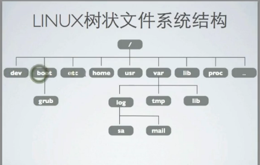

[TOC]

# linux文件系统结构

linux 文件系统为一个倒转的单根树状结构

文件系统的根"/"

文件系统严格区分大小写

路径使用"/"分割,(windows中使用”\“)

linux 树状文件系统结构

bin:可执行二进制文件

sbin:可执行的二进制文件，只有超级用户root才能执行

boot:引导目录（包含内核文件）

dev:device的缩写，每个设备都被抽象成一个文件，含硬盘声卡网卡镜像

etc:配置文件(很多文件以conf结尾)

home:家目录，每个用户都会在home下都有一个文件夹

root:root用户的家目录

lib:库文件都保存在lib下

lost_found:每一个硬盘格式化都会有一个lost_found

media:

mnt:正常的挂载目录

proc:不存在硬盘上，存储系统实时的信息

selinux:

sys: 系统底层信息

tmp:临时目录，所有放在临时目录的文件都会删除

usr:小型应用软件保存usr

opt:大型应用软件保存在opt

var:经常变换的内容

## 当前工作目录

​	每一个shell或者系统进程都有一个当前工作目录

​	使用pwd命令可以显示当前工作目录

## 文件名称

​	文件的名称大小写敏感

​	名称最多可以为255个字符

​	除了正斜线外，都是有效字符

​	通过touch命令可以创建一个空白文件或者更新已有文件的时间

​	以"."开头的文件为隐藏文件

## 列出目录内容

​	ls 命令用来列出目录内容

​	ls -a：显示所有文件包括隐藏文件

​	ls -l:显示详细信息

​	ls -R:递归显示子目录结构

​	ls -ld 显示目录和链接信息

## 查看文件类型

​	file 文件

## 绝对路径与相对路径

​	绝对路径

​	相对路径

​	

​	".":当前目录

​	"..":上一级目录

​	"~":当前用户的家目录

​	"-":上一个工作目录

