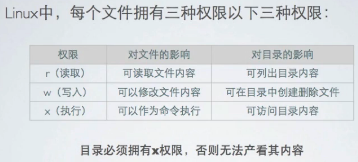
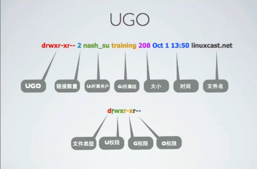

[TOC]

# linux authorization

​	linux authorization

权限：操作系统用来限制对资源的访问机制

文件权限：

linux权限给予UGO模式进行控制

U代表User,G代表Group，O代表Other

权限三个为一组(rwx),对应UGO分别设置

修改文件所属用户，组

命令chown用以改变文件的所属用户

chown username filename

-R 参数递归的修改目录下的所有文件的所属用户

命令chgrp用以改变文件的所属组

chgrp username filename

-R  参数递归的修改目录下的所有文件的所属组

修改文件的权限

chmod 修改文件的权限

r - 4

w - 2

x  -1

chmod ugo-+rwx filename

linux  默认权限

每个终端都拥有umask,来确定新建文件，文件夹的默认权限

umask使用数字权限方式表示，如：022

目录的默认权限是：777-umask

文件的默认权限是：666-umask

普通用户的默认权限为002，root用户的默认权限为022

[[linuxlearn@centos65](mailto:linuxlearn@centos65) ~]$ umask

0002

修改默认权限

[[linuxlearn@centos65](mailto:linuxlearn@centos65) ~]$ umask 022

系统显示为4位，使用ugo占用了其中的9位，换算为3，前面第一个为特殊权限

特殊权限（了解一下就可以了）

chmod u+s 文件

chmod g+s 文件

chmod o+t 文件

SUID=4

SGID=2

SOID =1

suid 以文件的所属用户身份执行，而非执行文件的用户

[[root@centos65](mailto:root@centos65) opt]# ls -ld /usr/bin/passwd

-rwsr-xr-x. 1 root root 30768 Feb 22  2012 /usr/bin/passwd

[[root@centos65](mailto:root@centos65) opt]# ls -ld /etc/shadow

---------- 1 root root 1026 May 16 03:27 /etc/shadow

sgid 以文件所属组身份运行，最主要的功能是对于文件夹，在该目录创建的任意文件的所属组

[[root@centos65](mailto:root@centos65) opt]# mkdir  /opt/linuxcast.net

[[root@centos65](mailto:root@centos65) opt]# ls -ld /opt/linuxcast.net/

drwxr-xr-x 2 root root 4096 May 16 22:11 /opt/linuxcast.net/

[[root@centos65](mailto:root@centos65) opt]# chgrp linuxlearn linuxcast.net/

[[root@centos65](mailto:root@centos65) linuxcast.net]# ls -ld 

drwxr-sr-x 4 root linuxlearn 4096 May 16 22:59 .

[[root@centos65](mailto:root@centos65) linuxcast.net]# mkdir linuxl

[[root@centos65](mailto:root@centos65) linuxcast.net]# ls -ld linuxl

drwxr-xr-x 2 root root 4096 May 16 22:12 linuxl

\#权限并没有修改

[[root@centos65](mailto:root@centos65) opt]# chmod g+s linuxcast.net/

[[root@centos65](mailto:root@centos65) linuxcast.net]# mkdir linux2

\#用户组权限修改

[[root@centos65](mailto:root@centos65) linuxcast.net]# ls -ls

total 8

4 drwxr-sr-x 2 root linuxlearn 4096 May 16 22:59 linux2

4 drwxr-xr-x 2 root root       4096 May 16 22:12 linuxl

sticky：对目录拥有读写权限的用户可以删除各自拥有的文件