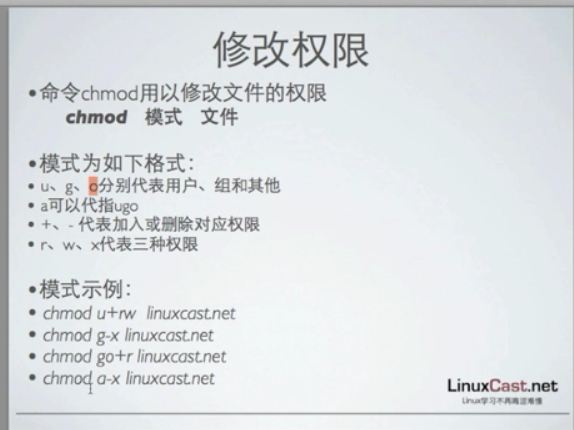
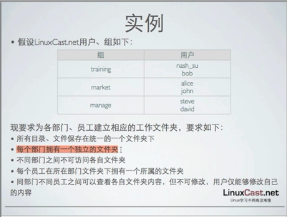
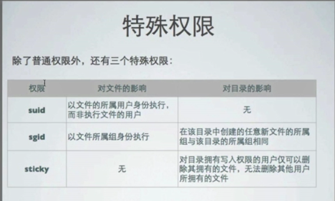

[TOC]

# linux authorization


## 权限

​	权限是操作系统用来限制对资源访问的机制，权限一般分为读，写，执行权限，系统中每个文件都拥有特定的权限，所属用户及其所属组，通过这样的机制限制那些用户，那些组可以对特定的文件进行怎样的操作

​	每个进程都以某个用户的身份运行，所以进程的权限与该用户的权限一样，用户的权限大，该进程拥有的权限就大。


文件权限：


## UGO


linux权限给予UGO模式进行控制


- U代表User,G代表Group，O代表Other


- 每一个文件的权限基于UGO进行设置


- 权限三个一组(rwx),对应UGO分别设置


- 每一个文件拥有一个所属用户和所属组，对应UG,不属于该文件所属用户及所属组使用O权限


ls -l 查看当前文件(目录)的详细信息

权限三个为一组(rwx),对应UGO分别设置


## 修改文件所属用户，组

命令chown用以改变文件的所属用户

chown username filename

-R 参数递归的修改目录下的所有文件的所属用户

命令chgrp用以改变文件的所属组

chgrp username filename

-R  参数递归的修改目录下的所有文件的所属组

## 修改权限

chmod 修改文件的权限



r - 4

w - 2

x  -1

chmod ugo-+rwx filename





## linux  默认权限

```
[ysys@gh9 ~]$ touch gh.txt
[ysys@gh9 ~]$ ls -ld gh.txt 
-rw-rw-r-- 1 ysys ysys 0 Aug 21 08:32 gh.txt
[ysys@gh9 ~]$ mkdir gh
[ysys@gh9 ~]$ ls -lsd gh
4 drwxrwxr-x 2 ysys ysys 4096 Aug 21 08:32 gh
```


每个终端都拥有umask,来确定新建文件，文件夹的默认权限

umask使用数字权限方式表示，如：022

目录的默认权限是：777-umask

文件的默认权限是：666-umask

普通用户的默认权限为002，root用户的默认权限为022

```
$ umask
0002
```

修改默认权限

```
$ umask 022
$ umask
0022
```


在普通用户修改umask并且创建文件夹和文件

```
[ysys@gh9 ~]$ umask
0002
[ysys@gh9 ~]$ touch gh.txt
[ysys@gh9 ~]$ mkdir gh

[ysys@gh9 ~]$ ls -ls
total 8
4 drwxrwxr-x 2 ysys ysys 4096 Aug 21 08:32 gh
0 -rw-rw-r-- 1 ysys ysys    0 Aug 21 08:32 gh.txt
4 -rw-rw-r-- 1 ysys ysys   63 Aug 21 07:41 test.sql


[ysys@gh9 ~]$ umask 022
[ysys@gh9 ~]$ umask
0022

[ysys@gh9 ~]$ rm -rf gh
[ysys@gh9 ~]$ rm -rf gh.txt
[ysys@gh9 ~]$ touch gh.txt
[ysys@gh9 ~]$ mkdir gh
[ysys@gh9 ~]$ ls -ls
total 8
4 drwxr-xr-x 2 ysys ysys 4096 Aug 21 08:37 gh
0 -rw-r--r-- 1 ysys ysys    0 Aug 21 08:37 gh.txt
4 -rw-rw-r-- 1 ysys ysys   63 Aug 21 07:41 test.sql
```




系统显示为4位，使用ugo占用了其中的9位，换算为3，前面第一个为特殊权限

特殊权限（了解一下就可以了）

chmod u+s 文件

chmod g+s 文件

chmod o+t 文件

SUID=4

SGID=2

SOID =1

suid 以文件的所属用户身份执行，而非执行文件的用户

[[root@centos65](mailto:root@centos65) opt]# ls -ld /usr/bin/passwd

-rwsr-xr-x. 1 root root 30768 Feb 22  2012 /usr/bin/passwd

[[root@centos65](mailto:root@centos65) opt]# ls -ld /etc/shadow

---------- 1 root root 1026 May 16 03:27 /etc/shadow

sgid 以文件所属组身份运行，最主要的功能是对于文件夹，在该目录创建的任意文件的所属组

[[root@centos65](mailto:root@centos65) opt]# mkdir  /opt/linuxcast.net

[[root@centos65](mailto:root@centos65) opt]# ls -ld /opt/linuxcast.net/

drwxr-xr-x 2 root root 4096 May 16 22:11 /opt/linuxcast.net/

[[root@centos65](mailto:root@centos65) opt]# chgrp linuxlearn linuxcast.net/

[[root@centos65](mailto:root@centos65) linuxcast.net]# ls -ld 

drwxr-sr-x 4 root linuxlearn 4096 May 16 22:59 .

[[root@centos65](mailto:root@centos65) linuxcast.net]# mkdir linuxl

[[root@centos65](mailto:root@centos65) linuxcast.net]# ls -ld linuxl

drwxr-xr-x 2 root root 4096 May 16 22:12 linuxl

\#权限并没有修改

[[root@centos65](mailto:root@centos65) opt]# chmod g+s linuxcast.net/

[[root@centos65](mailto:root@centos65) linuxcast.net]# mkdir linux2

\#用户组权限修改

[[root@centos65](mailto:root@centos65) linuxcast.net]# ls -ls

total 8

4 drwxr-sr-x 2 root linuxlearn 4096 May 16 22:59 linux2

4 drwxr-xr-x 2 root root       4096 May 16 22:12 linuxl

sticky：对目录拥有读写权限的用户可以删除各自拥有的文件


