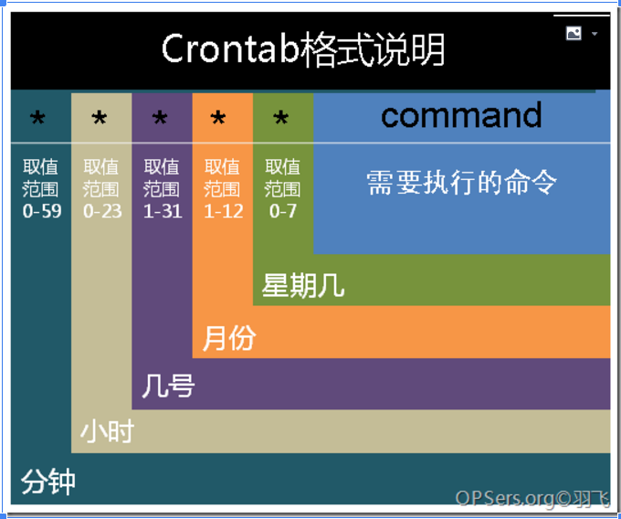

[TOC]

# linux  crontab

​	最近一段时间要将window上的kettle迁移到linux服务器上，遇到如何定时处理数据的问题，记录linux crontab的用法，以备后面使用（其实本次闹了一个小笑话，就是crontab的命令不懂，自己希望每隔五分钟执行一次，最后自己写的命令每天凌晨5分执行一次任务，也没有成功） 


## 了解CRONTAB命令 

​	crontab --h

```
[root@centos65 home]# crontab --h

crontab: invalid option -- '-'

crontab: usage error: unrecognized option

usage:	crontab [-u user] file

	crontab -u user

		(default operation is replace, per 1003.2)

	-e	(edit user's crontab)：编辑命令

	-l	(list user's crontab)：展示命令

	-r	(delete user's crontab)：删除命令

	-i	(prompt before deleting user's crontab)：删除之前需要确认

	-s	(selinux context)

```


## 编辑crontab文件

vim /etc/crontab 

```
[root@centos65 home]# vim /etc/crontab

# For details see man 4 crontabs

# Example of job definition:
# .---------------- minute (0 - 59)
# |  .------------- hour (0 - 23)
# |  |  .---------- day of month (1 - 31)
# |  |  |  .------- month (1 - 12) OR jan,feb,mar,apr ...
# |  |  |  |  .---- day of week (0 - 6) (Sunday=0 or 7) OR sun,mon,tue,wed,thu,fri,sat
# |  |  |  |  |
# *  *  *  *  * user-name command to be executed
  */1 * *  *  * root      pwd  > /home/good.txt
```

介绍一下两个符号

"*":代表所有可以取值的范围

"/"：每隔多少

上面的命令是：每隔1分钟，root用户执行一边pwd命令



注：编辑/etc/crontab后，可能需要重启crond服务，不过可以查看/var/log/cron:

查看是否出现：(*system*) RELOAD (/etc/crontab)


## crontab -e

crontab -e 也是可以修改执行计划的，而且crontab -l只能看到crontab -e修改的数据

```
[root@centos65 home]# crontab -e
  */1 * *  *  *     pwd  > /home/good.txt
```

注：使用crontab -e的方式不论是添加或者修改都会重新加载((root) RELOAD /var/sppl/cron/root),不需要重启crond服务
    使用crontab -e那个用户创建的就是在/var/spool/cron/*
    只有使用crontab -e创建的命令，才能使用crontab -l命令显示，如果直接
在/etc/crontab编辑的命令，无法显示


## 错误

1.1在/etc/crontab下配置定时调度没有执行

05 * * * * root /xx.sh

希望配置为每隔五分钟执行一次，后来发现这个配置第一不起作用，第二时间上也不对，就采用了

crontab -e的方案执行

*/5 * * * * /xx.sh

1.2命令执行却没有结果错误信息查看

```
[root@centos65 home]# cat /var/log/cron

Jun  1 04:59:01 centos65 CROND[2694]: (root) CMD (     ls -ls  > /home/good.txt)

[root@centos65 home]# cat /var/spool/mail/root 

From root@centos65.localdomain  Thu Jun  1 04:57:01 2017

Return-Path: root@centos65.localdomain

X-Original-To: root

Delivered-To: root@centos65.localdomain

Received: by centos65.localdomain (Postfix, from userid 0)

	id 3BDC5200EC; Thu,  1 Jun 2017 04:57:01 -0400 (EDT)

From: root@centos65.localdomain (Cron Daemon)

To: root@centos65.localdomain

Subject: Cron root@centos65      ls - ls  > /home/good.txt

Content-Type: text/plain; charset=UTF-8

Auto-Submitted: auto-generated

X-Cron-Env: <LANG=en_US.UTF-8>

X-Cron-Env: <SHELL=/bin/bash>

X-Cron-Env: PATH=/sbin:/bin:/usr/sbin:/usr/bin

X-Cron-Env: <MAILTO=root>

X-Cron-Env: <HOME=/>

X-Cron-Env: <LOGNAME=root>

X-Cron-Env: <USER=root>

Message-Id: 20170601085701.3BDC5200EC@centos65.localdomain

Date: Thu,  1 Jun 2017 04:57:01 -0400 (EDT)

ls: cannot access -: No such file or directory

ls: cannot access ls: No such file or directory

```

后面手动执行确实报错，修改为 ls -ls > /home/good.txt 就可以执行了，不过有个命令history 就是不行


1.3/etc/crontab命令无法执行

查看/var/log/cron是否出现命令，如果出现命令，那么需要查看/var/spool/mail/root下是否报错，如果有报错，处理报错信息，如果没有报错，可能需要执行命令

service crond reload

service crond restart

当然如果/var/log/cron没有出现该命令，那么需要和上面执行步骤一样

service crond reload

service crond restart

## 链接地址：

<http://blog.csdn.net/zlzlei/article/details/7767599>

http://bencane.com/2011/11/02/did-my-cronjob-run/