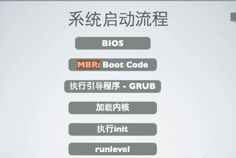
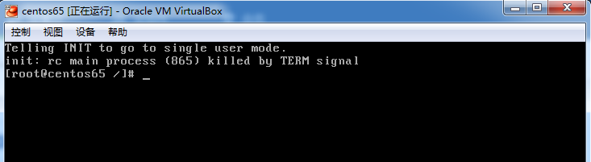

[TOC]

# LILNUX_STARTUP

linux startup

BIOS

保存在主板的BIOS芯片

查看硬件并且查找可启动设备

在BIOS设置进行定义可启动设备：如USB,CDROM,HD

MBR

BIOS找到可启动设备后执行其引导代码

引导代码为MBR的前446字节

GRUB

Grub是现在LINUX使用的主流引导程序

可以引导现在几乎所有的操作系统

Grub的文件路径/boot/grub

[[root@centos65](mailto:root@centos65) grub]# cd /boot/grub

[[root@centos65](mailto:root@centos65) grub]# ll -ls

total 274

  2 -rw-r--r--. 1 root root     63 May  3 23:00 device.map

 15 -rw-r--r--. 1 root root  13380 May  3 23:00 e2fs_stage1_5

 14 -rw-r--r--. 1 root root  12620 May  3 23:00 fat_stage1_5

 13 -rw-r--r--. 1 root root  11748 May  3 23:00 ffs_stage1_5

  2 -rw-------. 1 root root    835 May  3 23:00 grub.conf

 13 -rw-r--r--. 1 root root  11756 May  3 23:00 iso9660_stage1_5

 14 -rw-r--r--. 1 root root  13268 May  3 23:00 jfs_stage1_5

  1 lrwxrwxrwx. 1 root root     11 May  3 23:00 menu.lst -> ./grub.conf

 13 -rw-r--r--. 1 root root  11956 May  3 23:00 minix_stage1_5

 16 -rw-r--r--. 1 root root  14412 May  3 23:00 reiserfs_stage1_5

  3 -rw-r--r--. 1 root root   1341 Nov 14  2010 splash.xpm.gz

  2 -rw-r--r--. 1 root root    512 May  3 23:00 stage1

125 -rw-r--r--. 1 root root 126100 May  3 23:00 stage2

 13 -rw-r--r--. 1 root root  12024 May  3 23:00 ufs2_stage1_5

 13 -rw-r--r--. 1 root root  11364 May  3 23:00 vstafs_stage1_5

 15 -rw-r--r--. 1 root root  13964 May  3 23:00 xfs_stage1_5

在/boot/grub文件下

标绿是mbr引导文件的备份

标红可以发现都是文件系统

[root@centos65 grub]# cat grub.conf

\# grub.conf generated by anaconda

\#

\# Note that you do not have to rerun grub after making changes to this file

\# NOTICE:  You have a /boot partition.  This means that

\#          all kernel and initrd paths are relative to /boot/, eg.

\#          root (hd0,0)

\#          kernel /vmlinuz-version ro root=/dev/mapper/vg_centos65-LogVol01

\#          initrd /initrd-[generic-]version.img

\#boot=/dev/sda

default=0 #title<默认从0开始>

timeout=5#开机等待时间（s）

splashimage=(hd0,0)/grub/splash.xpm.gz#开机画面

hiddenmenu#隐藏菜单

title CentOS (2.6.32-431.el6.x86_64) #标题

​    root (hd0,0) #root路径（第一块盘的第一个分区）

​    kernel /vmlinuz-2.6.32-431.el6.x86_64 ro root=/dev/mapper/vg_centos65-LogVol01 rd_NO_LUKS LANG=en_US.UTF-8 rd_NO_MD SYSFONT=latarcyrheb-sun16 crashkernel=auto rd_NO_DM  KEYBOARDTYPE=pc KEYTABLE=us rd_LVM_LV=vg_centos65/LogVol01 rd_LVM_LV=vg_centos65/LogVol00 rhgb quiet #内核相关信息 在启动编辑改参数 后面如果添加1或者single 进入单用户模式 修改密码

​    initrd /initramfs-2.6.32-431.el6.x86_64.img #加载驱动

在启动系统时，选择 上下键进入到Grub的配置界面再次选择上下键后进入到配置界面在第二个参数最后 添加空格  1 或者 single，就可以无密码登录root用户，修改密码

之后entry后执行b

加载内核

使用dmesg查看内核启动信息

执行init

init常用的参数为3,5:（5就是比3多了图像化界面）

[root@centos65 etc]# cd /etc/

[root@centos65 etc]# cat inittab

\# inittab is only used by upstart for the default runlevel.

\#

\# ADDING OTHER CONFIGURATION HERE WILL HAVE NO EFFECT ON YOUR SYSTEM.

\#

\# System initialization is started by /etc/init/rcS.conf

\#

\# Individual runlevels are started by /etc/init/rc.conf

\#

\# Ctrl-Alt-Delete is handled by /etc/init/control-alt-delete.conf

\#

\# Terminal gettys are handled by /etc/init/tty.conf and /etc/init/serial.conf,

\# with configuration in /etc/sysconfig/init.

\#

\# For information on how to write upstart event handlers, or how

\# upstart works, see init(5), init(8), and initctl(8).

\#

\# Default runlevel. The runlevels used are:

\#   0 - halt (Do NOT set initdefault to this)

\#   1 - Single user mode

\#   2 - Multiuser, without NFS (The same as 3, if you do not have networking)

\#   3 - Full multiuser mode

\#   4 - unused

\#   5 - X11

\#   6 - reboot (Do NOT set initdefault to this)

\# 

id:5:initdefault:

3多用户

5多用户图形化

[root@centos65 etc]# cd /etc/init

[root@centos65 init]# ls -ls

total 68

4 -rw-r--r--. 1 root root  412 Oct 10  2013 control-alt-delete.conf

4 -rw-r--r--. 1 root root  130 Jun 25  2013 init-system-dbus.conf

4 -rw-r--r--. 1 root root  463 Oct 10  2013 kexec-disable.conf

4 -rw-r--r--. 1 root root  560 Oct 10  2013 plymouth-shutdown.conf

4 -rw-r--r--. 1 root root  357 Oct 10  2013 prefdm.conf

4 -rw-r--r--. 1 root root  505 Oct 10  2013 quit-plymouth.conf

4 -rw-r--r--. 1 root root  417 Oct 10  2013 rc.conf

4 -rw-r--r--. 1 root root 1046 Oct 10  2013 rcS.conf

4 -rw-r--r--. 1 root root  430 Oct 10  2013 rcS-emergency.conf

4 -rw-r--r--. 1 root root  725 Oct 10  2013 rcS-sulogin.conf

4 -rw-r--r--. 1 root root 2915 Nov 23  2013 readahead-collector.conf

4 -rw-r--r--. 1 root root 1559 Nov 23  2013 readahead.conf

4 -rw-r--r--. 1 root root  726 Nov 23  2013 readahead-disable-services.conf

4 -rw-r--r--. 1 root root 1302 Oct 10  2013 serial.conf

4 -rw-r--r--. 1 root root  791 Oct 10  2013 splash-manager.conf

4 -rw-r--r--. 1 root root  473 Oct 10  2013 start-ttys.conf

4 -rw-r--r--. 1 root root  335 Oct 10  2013 tty.conf

经常默认会使用ctrl+alt+delete快捷键查看windows的资源服务器，但是在linux下是重启服务器

runlevel

runlevel:查看当前执行的运行级别

[root@centos65 init]# runlevel

N 5