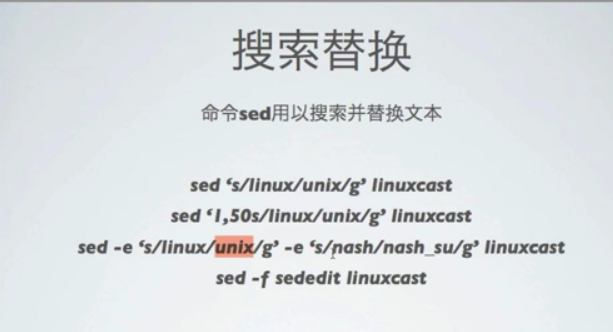

[TOC]

# linux 命令行文本处理工具


## 文件浏览

- cat
- more
- less
- head
- tail

## 基于关键字搜索

### 命令 grep 用以基于关键字搜索文本

利用正则表达式


```
# cat /etc/passwd | grep mysql
# find / -user osdba  2>/dev/null | grep postgresql.conf
```

```
[root@mysql45 etc]# find / -user osdba > /dev/null| grep postgresql.conf
find: `/proc/2723/task/2723/fd/5': No such file or directory
find: `/proc/2723/task/2723/fdinfo/5': No such file or directory
find: `/proc/2723/fd/5': No such file or directory
find: `/proc/2723/fdinfo/5': No such file or directory
[root@mysql45 etc]# find / -user osdba  2>/dev/null | grep postgresql.conf
/usr/local/pgsql/share/postgresql.conf.sample
/usr/local/pgsql/data/postgresql.conf
/software/pgsql/share/postgresql/postgresql.conf.sample

```

- -i 在搜索的时候忽略大小写

- -n 显示结果所在行数

  ```
  [root@mysql45 etc]# cat /etc/passwd | grep -n osdba
  35:osdba:x:500:501::/home/osdba:/bin/bash
  [root@mysql45 etc]# cat /etc/passwd | grep  osdba
  osdba:x:500:501::/home/osdba:/bin/bash
  ```

- -v 输出不带关键字的行

  ```
  [root@mysql45 etc]# cat /etc/passwd | grep  -v osdba
  root:x:0:0:root:/root:/bin/bash
  bin:x:1:1:bin:/bin:/sbin/nologin
  daemon:x:2:2:daemon:/sbin:/sbin/nologin
  adm:x:3:4:adm:/var/adm:/sbin/nologin
  lp:x:4:7:lp:/var/spool/lpd:/sbin/nologin
  sync:x:5:0:sync:/sbin:/bin/sync
  shutdown:x:6:0:shutdown:/sbin:/sbin/shutdown
  halt:x:7:0:halt:/sbin:/sbin/halt
  mail:x:8:12:mail:/var/spool/mail:/sbin/nologin
  uucp:x:10:14:uucp:/var/spool/uucp:/sbin/nologin
  operator:x:11:0:operator:/root:/sbin/nologin
  games:x:12:100:games:/usr/games:/sbin/nologin
  gopher:x:13:30:gopher:/var/gopher:/sbin/nologin
  ftp:x:14:50:FTP User:/var/ftp:/sbin/nologin
  nobody:x:99:99:Nobody:/:/sbin/nologin
  dbus:x:81:81:System message bus:/:/sbin/nologin
  usbmuxd:x:113:113:usbmuxd user:/:/sbin/nologin
  vcsa:x:69:69:virtual console memory owner:/dev:/sbin/nologin
  rpc:x:32:32:Rpcbind Daemon:/var/cache/rpcbind:/sbin/nologin
  rtkit:x:499:497:RealtimeKit:/proc:/sbin/nologin
  avahi-autoipd:x:170:170:Avahi IPv4LL Stack:/var/lib/avahi-autoipd:/sbin/nologin
  abrt:x:173:173::/etc/abrt:/sbin/nologin
  rpcuser:x:29:29:RPC Service User:/var/lib/nfs:/sbin/nologin
  nfsnobody:x:65534:65534:Anonymous NFS User:/var/lib/nfs:/sbin/nologin
  haldaemon:x:68:68:HAL daemon:/:/sbin/nologin
  gdm:x:42:42::/var/lib/gdm:/sbin/nologin
  ntp:x:38:38::/etc/ntp:/sbin/nologin
  apache:x:48:48:Apache:/var/www:/sbin/nologin
  saslauth:x:498:76:"Saslauthd user":/var/empty/saslauth:/sbin/nologin
  postfix:x:89:89::/var/spool/postfix:/sbin/nologin
  pulse:x:497:496:PulseAudio System Daemon:/var/run/pulse:/sbin/nologin
  sshd:x:74:74:Privilege-separated SSH:/var/empty/sshd:/sbin/nologin
  tcpdump:x:72:72::/:/sbin/nologin
  mysql:x:496:500::/usr/local/mysql:/sbin/nologin
  [root@mysql45 etc]# 
  
  ```

- -Ax 在输出的时候包含结果所在行的之后几行

- -Bx 在输出的时候包含结果所在行的之后几行

  ```
  [root@mysql45 etc]# cat /etc/passwd | grep  ntp
  ntp:x:38:38::/etc/ntp:/sbin/nologin
  [root@mysql45 etc]# cat /etc/passwd | grep -A 3 ntp
  ntp:x:38:38::/etc/ntp:/sbin/nologin
  apache:x:48:48:Apache:/var/www:/sbin/nologin
  saslauth:x:498:76:"Saslauthd user":/var/empty/saslauth:/sbin/nologin
  postfix:x:89:89::/var/spool/postfix:/sbin/nologin
  [root@mysql45 etc]# cat /etc/passwd | grep -B 3 ntp
  nfsnobody:x:65534:65534:Anonymous NFS User:/var/lib/nfs:/sbin/nologin
  haldaemon:x:68:68:HAL daemon:/:/sbin/nologin
  gdm:x:42:42::/var/lib/gdm:/sbin/nologin
  ntp:x:38:38::/etc/ntp:/sbin/nologin
  [root@mysql45 etc]# 
  
  ```

  

## 基于列处理文本

### 命令cut用以基于列处理文本内容

**cut命令要慎用**

```
# cut -d: -f1 passwd
# grep osdba /test/passwd | cut -d: -f3
```

- -d指定分割字符，默认是TAB
- -f 指定输出的列号
- -c 基于字符进行切割

```
# cut -c2-6 passwd
```


## 文本统计

### 命令wc用以统计文本信息

wc 文件名

-l 只统计行数

-w 只统计单词

-c 只统计字节数

-m 只统计字符数

```
[root@mysql45 test]# wc passwd
  38   54 1668 passwd
[root@mysql45 test]# wc -m passwd
1668 passwd
[root@mysql45 test]# wc -w passwd
54 passwd
[root@mysql45 test]# wc -l passwd
38 passwd
[root@mysql45 test]# wc -c passwd
1668 passwd
```


## 文本排序

### 命令sort用以对文本内容进行排序

sort 文件名，不基于中文排序

```
[root@mysql45 test]# sort passwd
abrt:x:173:173::/etc/abrt:/sbin/nologin
adm:x:3:4:adm:/var/adm:/sbin/nologin
apache:x:48:48:Apache:/var/www:/sbin/nologin
avahi-autoipd:x:170:170:Avahi IPv4LL Stack:/var/lib/avahi-autoipd:/sbin/nologin
bin:x:1:1:bin:/bin:/sbin/nologin
daemon:x:2:2:daemon:/sbin:/sbin/nologin
dbus:x:81:81:System message bus:/:/sbin/nologin
ftp:x:14:50:FTP User:/var/ftp:/sbin/nologin
games:x:12:100:games:/usr/games:/sbin/nologin
gdm:x:42:42::/var/lib/gdm:/sbin/nologin
gopher:x:13:30:gopher:/var/gopher:/sbin/nologin
haldaemon:x:68:68:HAL daemon:/:/sbin/nologin
halt:x:7:0:halt:/sbin:/sbin/halt
lp:x:4:7:lp:/var/spool/lpd:/sbin/nologin
mail:x:8:12:mail:/var/spool/mail:/sbin/nologin
mysql:x:496:500::/usr/local/mysql:/sbin/nologin
nfsnobody:x:65534:65534:Anonymous NFS User:/var/lib/nfs:/sbin/nologin
nobody:x:99:99:Nobody:/:/sbin/nologin
ntp:x:38:38::/etc/ntp:/sbin/nologin
operator:x:11:0:operator:/root:/sbin/nologin
osdba:x:500:501::/home/osdba:/bin/bash
postfix:x:89:89::/var/spool/postfix:/sbin/nologin
pulse:x:497:496:PulseAudio System Daemon:/var/run/pulse:/sbin/nologin
root:x:0:0:root:/root:/bin/bash
rpcuser:x:29:29:RPC Service User:/var/lib/nfs:/sbin/nologin
rpc:x:32:32:Rpcbind Daemon:/var/cache/rpcbind:/sbin/nologin
rtkit:x:499:497:RealtimeKit:/proc:/sbin/nologin
saslauth:x:498:76:"Saslauthd user":/var/empty/saslauth:/sbin/nologin
shutdown:x:6:0:shutdown:/sbin:/sbin/shutdown
sshd:x:74:74:Privilege-separated SSH:/var/empty/sshd:/sbin/nologin
sync:x:5:0:sync:/sbin:/bin/sync
tcpdump:x:72:72::/:/sbin/nologin
usbmuxd:x:113:113:usbmuxd user:/:/sbin/nologin
uucp:x:10:14:uucp:/var/spool/uucp:/sbin/nologin
vcsa:x:69:69:virtual console memory owner:/dev:/sbin/nologin
[root@mysql45 test]# 

```


- -r 倒序排序
- -n 基于数字进行排序
- -f 忽略大小写
- -u 删除重复行
- -t c 使用c作为分割符分割为列进行排序
- -k x 当进行基于指定字符分割为列的排序时，指定基于那个列排序


**sort -u 删除重复行**

**uniq可以删除重复的相邻行 **


## 文本比较

### 命令diff用以比较两个文件的区别

diff f_1 f_2


## 检查拼写

### 命令aspell用以显示检查英文拼写

```
aspell check  dirctory
aspell list < direcotry
```


## 处理文本内容

### 命令tr用以处理文本内容

- 删除关键字

  tr -d 'TMD'  < file

- 转换大小写

  tr 'a-z' 'A-Z' < file


## 搜索替换

### 命令sed用以搜索并替换文本

正则表达式




