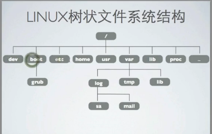

[TOC]

# linux system diectory structure 

bin:可执行二进制文件

sbin:可执行的二进制文件，只有超级用户root才能执行

boot:引导目录（包含内核文件）

dev:device的缩写，每个设备都被抽象成一个文件，含硬盘声卡网卡镜像

etc:配置文件(很多文件以conf结尾)

home:家目录，每个用户都会在home下都有一个文件夹

root:root用户的家目录

lib:库文件都保存在lib下

lost_found:每一个硬盘格式化都会有一个lost_found

media:

mnt:正常的挂载目录

proc:不存在硬盘上，存储系统实时的信息

selinux:

sys: 系统底层信息

tmp:临时目录，所有放在临时目录的文件都会删除

usr:小型应用软件保存usr

opt:大型应用软件保存在opt

var:经常变换的内容