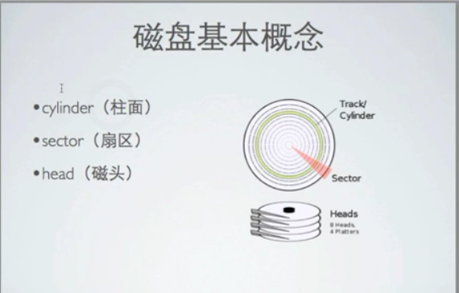
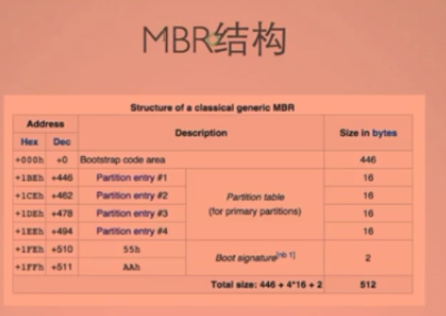

[TOC]

# linux 磁盘基本概念

## 机械硬盘

磁盘物理图

磁盘基本概念

柱面:

扇区:

磁头：

## 磁盘在LINUX中的表示

​	linux所有设备都被抽象为一个文件，保存在/dev目录下

​	设备名称hd,sd,

​	IDE设备的名称为hd,SATA,SCSI,SAS，USB等设备的名称为sd

​	

## 分区

​	将一个磁盘逻辑的分为几个区，每个区当作独立磁盘，以方便使用管理

​	分区是一个软件概念，并非是磁盘带有的物理功能

​	主流的分区机制分为MBR和GPT两种

​	不同分区用：设备名称+分区号 方式表示如:sda1,sda2

​	

### MBR

​	MBR(master boot record)是传统的分区机制，应用与绝大多数使用BIOS的PC设备

​	EFI引导方式比较新，BIOS引导方式比较老

​	

​	MBR支持32bit和64bit系统

​	MBR支持分区数量有限

​	MBR只支持不超过2T的硬盘，超过2T的硬盘将只能使用2T空间(有第三方解决方法)

​	MBR结构

​	MBR分区

​	主分区

​	主分区只能创建四个主分区

​	扩展分区

​	一个扩展分区就占用一个主分区位置

​	逻辑分区

​	LINUX最多支持63个IDE分区,15个SCSI分区

​	

​	4 主分区

​	3 主分区 +  1个扩展分区(n个逻辑分区)

## GPT

​	gpt(guid partition table)是一个较新的分区机制，解决了MBR的很多缺点

​	

​	1>支持超过2T的磁盘

​	2>向后兼容MBR

​	3>必须在UEFI的硬件上才能使用

​	4>必须使用64bit系统

​	5>mac,linux系统都能支持GPT系统

