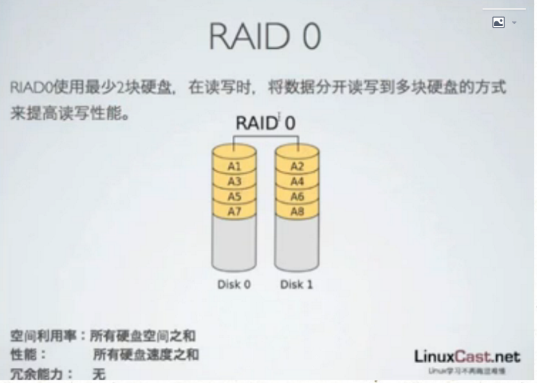
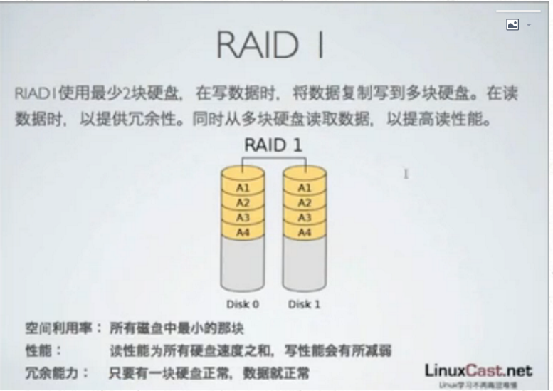
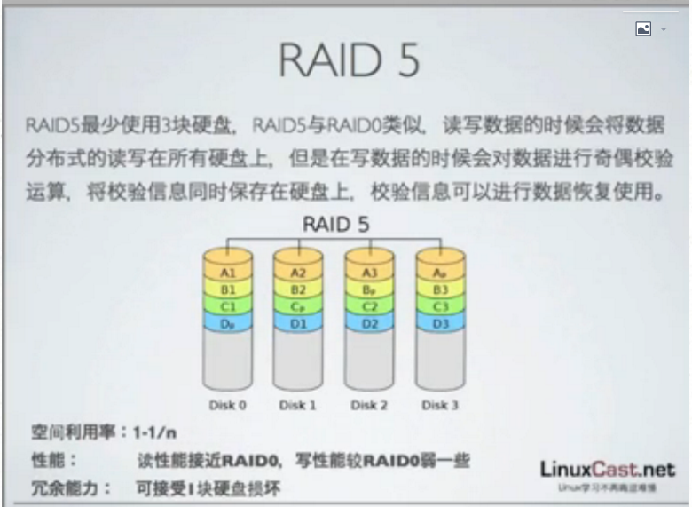
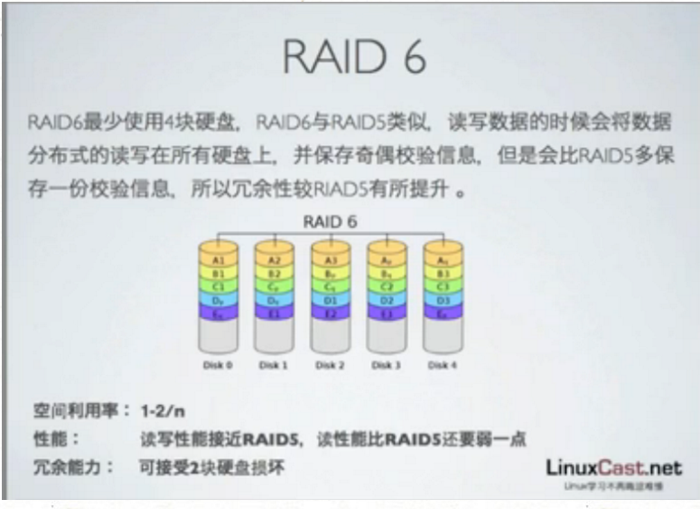

[TOC]


# linux  raid


​	影响计算机性能的组件：CPU,主板IO，内存IO，硬盘IO，网卡IO

​	硬盘是绝大多数计算机的性能瓶颈


## raid 原理

现代硬盘的缺陷：IO性能极弱，稳定性极差

RAID（Redundant Array of Independent Disks)廉价磁盘冗余阵列

通过多磁盘并行运行来提高计算机的存储IO性能

RAID是一种把多块独立的硬盘（物理硬盘）按不同的方式组合起来形成一个硬盘组（逻辑硬盘），从而提供比单个硬盘更高的存储性能和提供数据备份技术。 

Raid分为很多种类，成为Raid级别，现在Raid共有7类，常用的有以下四类


-RAID 0   



​	

-RAID 1 




-RAID 5 




-RAID 6



软件RAID：推荐个人使用RAID，了解这些信息

硬件RAID：生产环境下推荐使用硬件RAID


## 软件RAID

linux系统通过mdadm这个程序实现

mdadm支持RAID级别是：0,1,4,5,6,

mdadm可以基于多块硬盘，分区或者逻辑卷创建软件RAID

创建好的软件RAID对应/dev/mdn，n为第几个RAID

raid信息保存在/proc/mdstat文件中，或者通过mdadm命令查看


### 脚本创建


创建RAID 0

mdadm -C /dev/md0 -a yes -l 0 -n 2 /dev/sdb /dev/sdc

-C :创建磁盘路径

-a:自动创建对应设备

-l:raid级别

-n:硬盘数

```
# mdadm -C /dev/md0 -a yes -l 0 -n 2 /dev/sdb /dev/sdc

mdadm: Defaulting to version 1.2 metadata

mdadm: array /dev/md0 started.
```

创建RAID 1

mdadm -C /dev/md0 -a yes -l 1 -n 2 /dev/sdb /dev/sdc

创建RAID 5

mdadm -C /dev/md0 -a yes -l 5 -n 3 /dev/sdb /dev/sdc /dev/sdd

创建RAID 6

mdadm -C /dev/md0 -a yes -l 6 -n 4 /dev/sdb /dev/sdc /dev/sdd /dev/sde

重建RAID 5 多添加一块硬盘:如果有一块坏了，自动替补

mdadm -C /dev/md0 -a yes -l 5 -n 3 -x 1  /dev/sdb /dev/sdc /dev/sdd /dev/sde


### 创建配置文件 

mdadm -D --scan > /etc/mdadm.conf 

```
[root@datastage ~]# mdadm -D --scan > /etc/mdadm.conf
```

### 格式化文件系统

mkfs.ext4 /dev/md0

```
[root@datastage ~]# mkfs.ext4 /dev/md0
mke2fs 1.41.12 (17-May-2010)
Filesystem label=
OS type: Linux
Block size=4096 (log=2)
Fragment size=4096 (log=2)
Stride=128 blocks, Stripe width=256 blocks
131072 inodes, 524032 blocks
26201 blocks (5.00%) reserved for the super user
First data block=0
Maximum filesystem blocks=536870912
16 block groups
32768 blocks per group, 32768 fragments per group
8192 inodes per group
Superblock backups stored on blocks: 
 32768, 98304, 163840, 229376, 294912

Writing inode tables: done 
Creating journal (8192 blocks): done
Writing superblocks and filesystem accounting information: done

This filesystem will be automatically checked every 32 mounts or
180 days, whichever comes first. Use tune2fs -c or -i to override.
```

### 挂载

mount /dev/md0 /mnt

```
[root@datastage ~]# mount /dev/md0 /mnt

[root@datastage ~]# df -h

Filesystem Size Used Avail Use% Mounted on

/dev/mapper/vg_centos65-LogVol01 27G 22G 3.7G 86% /

tmpfs 1.9G 72K 1.9G 1% /dev/shm

/dev/sda1 194M 30M 155M 16% /boot

/dev/md0 2.0G 35M 1.9G 2% /mnt
```


### 查看md0 信息

cat /proc/mdstat

mdadm -D /dev/md0

```
[root@datastage ~]# mdadm -D /dev/md0

/dev/md0:

        Version : 1.2

  Creation Time : Tue Jun 27 03:54:37 2017

     Raid Level : raid0

     Array Size : 2096128 (2047.34 MiB 2146.44 MB)

   Raid Devices : 2

  Total Devices : 2

    Persistence : Superblock is persistent


    Update Time : Tue Jun 27 03:54:37 2017

          State : clean 

 Active Devices : 2

Working Devices : 2

 Failed Devices : 0

  Spare Devices : 0


     Chunk Size : 512K


           Name : datastage:0 (local to host datastage)

           UUID : 7f78e088:b8faca93:77f9dfb2:07927202

         Events : 0


    Number Major Minor RaidDevice State

       0 8 16 0 active sync /dev/sdb

       1 8 32 1 active sync /dev/sdc

[root@datastage ~]# cat /proc/mdstat

Personalities : [raid0] 

md0 : active raid0 sdc[1] sdb[0]

      2096128 blocks super 1.2 512k chunks
```

### 系统开机自启动配置fstab


vim /etc/fatab 


### 关闭md0

umount /mnt #当前挂载到/mnt，就卸载/mnt，如果挂载到其他地方就需要卸载其他

mdadm -S /dev/md0 

```
[root@datastage ~]# umount /mnt

[root@datastage ~]# df -h

Filesystem                        Size  Used Avail Use% Mounted on

/dev/mapper/vg_centos65-LogVol01   27G   22G  3.7G  86% /

tmpfs                             1.9G   72K  1.9G   1% /dev/shm

/dev/sda1                         194M   30M  155M  16% /boot

[root@datastage ~]# clear

[root@datastage ~]# mdadm -S /dev/md0

mdadm: stopped /dev/md0
```

### 启动md0

mdadm -R /dev/md0

```
[root@datastage ~]# mdadm -R /dev/md0 mdadm: error opening /dev/md0: No such file or directory 
```

如果报错，请重新启动 


### 将硬盘重新变为新的raid组 

mdadm -S /dev/md0

mdadm --zero-superblock /dev/sdb

mdadm --zero-superblock /dev/sdc

mdadm -C /dev/md0 -a yes -l 5 -n 3 /dev/sdb /dev/sdc /dev/sdd

```
[root@datastage ~]# mdadm -S /dev/md0
mdadm: stopped /dev/md0
[root@datastage ~]# ls /dev/sdb
/dev/sdb
[root@datastage ~]# ls /dev/sdc
/dev/sdc
[root@datastage ~]# mdadm --zero-superblock /dev/sdb
[root@datastage ~]# mdadm --zero-superblock /dev/sdc
[root@datastage ~]# mdadm -C /dev/md0 -a yes -l 5 -n 3 /dev/sdb /dev/sdc /dev/sdd

mdadm: Defaulting to version 1.2 metadata

mdadm: array /dev/md0 started.

[root@datastage ~]# mdadm -D /dev/md0

/dev/md0:

        Version : 1.2

  Creation Time : Tue Jun 27 04:20:02 2017

     Raid Level : raid5

     Array Size : 2095104 (2046.34 MiB 2145.39 MB)

  Used Dev Size : 1047552 (1023.17 MiB 1072.69 MB)

   Raid Devices : 3

  Total Devices : 3

    Persistence : Superblock is persistent


    Update Time : Tue Jun 27 04:20:11 2017

          State : clean 

 Active Devices : 3

Working Devices : 3

 Failed Devices : 0

  Spare Devices : 0


         Layout : left-symmetric

     Chunk Size : 512K


           Name : datastage:0 (local to host datastage)

           UUID : a8d24c96:f1b54516:1f082fc6:b832bc92

         Events : 18


    Number Major Minor RaidDevice State

       0 8 16 0 active sync /dev/sdb

       1 8 32 1 active sync /dev/sdc

       3 8 48 2 active sync /dev/sdd
```


## 模拟换盘


### 将某盘置为坏盘

mdadm /dev/md0 -f /dev/sdd 

```
[root@datastage ~]# mdadm /dev/md0 -f /dev/sdd

mdadm: set /dev/sdd faulty in /dev/md0

[root@datastage ~]# mdadm -D /dev/md0

/dev/md0:

        Version : 1.2

  Creation Time : Tue Jun 27 04:20:02 2017

     Raid Level : raid5

     Array Size : 2095104 (2046.34 MiB 2145.39 MB)

  Used Dev Size : 1047552 (1023.17 MiB 1072.69 MB)

   Raid Devices : 3

  Total Devices : 3

    Persistence : Superblock is persistent


    Update Time : Tue Jun 27 04:22:27 2017

          State : clean, degraded 

 Active Devices : 2

Working Devices : 2

 Failed Devices : 1

  Spare Devices : 0


         Layout : left-symmetric

     Chunk Size : 512K


           Name : datastage:0 (local to host datastage)

           UUID : a8d24c96:f1b54516:1f082fc6:b832bc92

         Events : 20


    Number Major Minor RaidDevice State

       0 8 16 0 active sync /dev/sdb

       1 8 32 1 active sync /dev/sdc

       2 0 0 2 removed


       3 8 48 - faulty /dev/sdd
```

### 将坏盘移除 

mdadm /dev/md0 -r /dev/sdd 

```
[root@datastage ~]# mdadm /dev/md0 -r /dev/sdd

mdadm: hot removed /dev/sdd from /dev/md0
```

### 添加新的硬盘 

mdadm /dev/md0 -a /dev/sde 

```
[root@datastage ~]# mdadm /dev/md0 -a /dev/sde

mdadm: added /dev/sde

[root@datastage ~]# mdadm -D /dev/md0

/dev/md0:

        Version : 1.2

  Creation Time : Tue Jun 27 04:20:02 2017

     Raid Level : raid5

     Array Size : 2095104 (2046.34 MiB 2145.39 MB)

  Used Dev Size : 1047552 (1023.17 MiB 1072.69 MB)

   Raid Devices : 3

  Total Devices : 3

    Persistence : Superblock is persistent


    Update Time : Tue Jun 27 04:25:01 2017

          State : clean 

 Active Devices : 3

Working Devices : 3

 Failed Devices : 0

  Spare Devices : 0


         Layout : left-symmetric

     Chunk Size : 512K


           Name : datastage:0  (local to host datastage)

           UUID : a8d24c96:f1b54516:1f082fc6:b832bc92

         Events : 42


    Number   Major   Minor   RaidDevice State

       0       8       16        0      active sync   /dev/sdb

       1       8       32        1      active sync   /dev/sdc

       3       8       64        2      active sync   /dev/sde

[root@datastage ~]# cat /etc/mdstat

cat: /etc/mdstat: No such file or directory

[root@datastage ~]# cat /proc/mdstat

Personalities : [raid0] [raid6] [raid5] [raid4] 

md0 : active raid5 sde[3] sdc[1] sdb[0]

      2095104 blocks super 1.2 level 5, 512k chunk, algorithm 2 [3/3] [UUU]

      

unused devices: <none>
```

