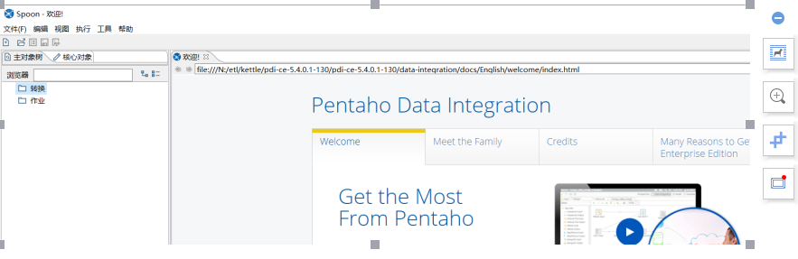
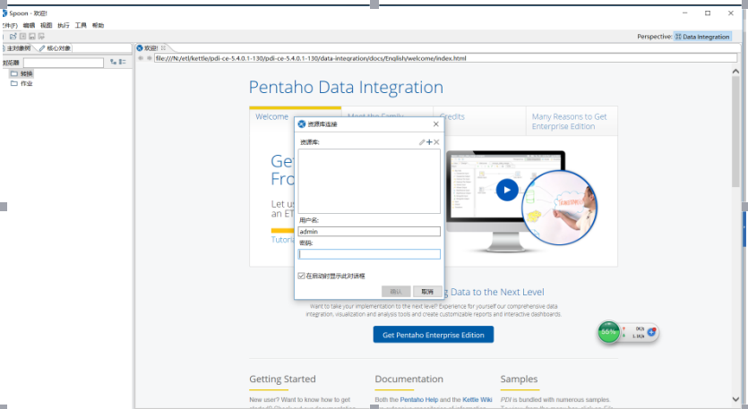
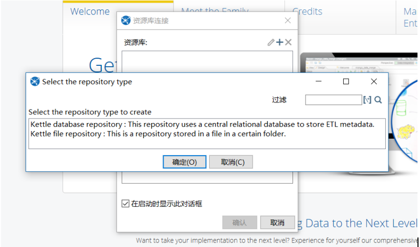
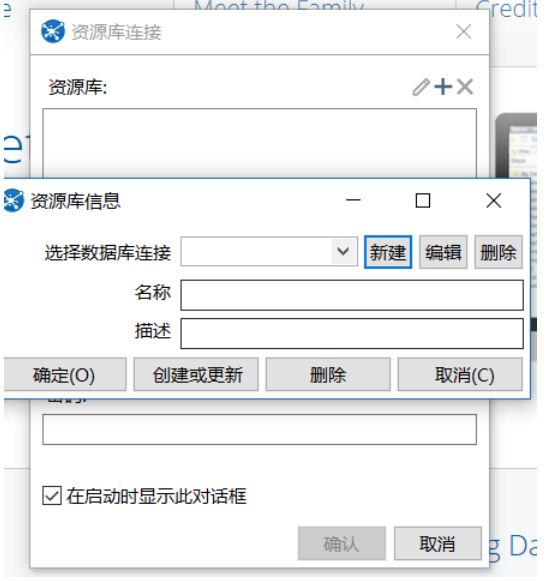
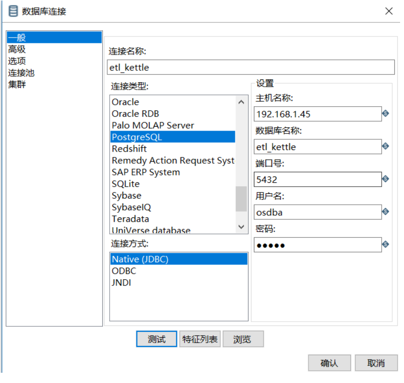
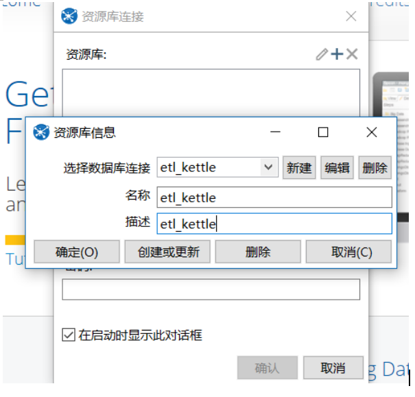
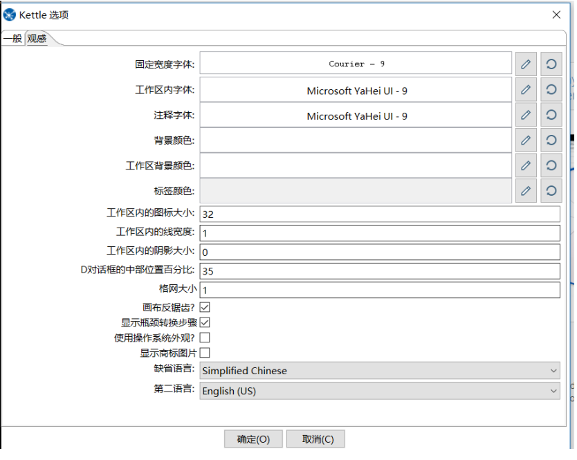

[TOC]

# KETTLE 配置数据库资源库

## 概念

   资源库：kettle使用的资源库是用来存储转换,调度的；普通使用两种形式作为资源库，一种是文件资源库，一种是数据库资源库，在生产环境普遍使用数据库资源库，本次就是配置数据库资源库。

## 环境介绍

  当前以windows为例，使用的kettle版本是5.4，生产环境大多是linux服务器，该文档只是作为数据库资源库配置文档。

## 配置流程

- 点击spoon.bat出现图像化界面

  

linux 需要点击spoon.sh出现界面

- 在界面的菜单栏选择 工具》资源库》连接资源库

会出现一个新的页面叫“资源库连接”

 

- 出现界面“资源库连接”并选择“+”按钮，出现“Kettle database repository”，并点击它

 

- 初次设置数据库资源库，选择”新建”配置数据源

选择”新建”,建议连接名称和名称，描述一致，方便后期调用

 

 

 

初始化是选择创建或更新

备注：如果是之前已经设置过数据库资源库，只需要配置好上图，选择“确定”按钮就可以了

备注：因为kettle有时菜单栏都是英文，可能不太好理解，建议设置语言类型，将“缺省语言”改为中文即可

 

