## kettle配置一次性抽取n张表(二)

- 适用场景

适合目标数据库和源头数据库都是不变的，并且数据为轨迹类可变类的(如LG数据，存在更新TFSJ字段),这种方式就需要考虑到目标表的更新插入，建议利用临时表(物理表)，通过过程来为其更新插入。

- 遗留问题

1、暂时不支持postgresql数据库抽取

2、浪费1/2时间，浪费1倍空间(虽然后面可以删除)

- 方案描述

上一个方案和本方案不同主要实在更新这个问题上，这次以oracle为基础来设计此方案(postgresql9.5后才有了upsert语句)

第一步配置一张记录来源表，目标表字段名，以及来源表的时间戳字段，以及时间戳值，以及临时表名称

第二步使用kettle类似for循环将其一一取出并且变为变量传递。

第三步如果临时表存在则将临时表将其数据进行truncate，如果没有临时表就要重建。

第四步就是将数据抽取到临时表，通过存储过程(merge into)动态表的方式来更新数据。

第五步记录当前最大时间戳


- kettle版本

本次测试版本是kettle5.4,建议后期都尽量使用kettle5.4及其以上，本次测试都是使用oracle数据库。

### 方案配置


- 时间戳记录脚本

oracle

```
CREATE TABLE t_etl_time_stamp (id int primary key, source_obj varchar2(100),dest_obj varchar2(100),sjc_column varchar2(100),sjc_time varchar2(14),status varchar2(1),lsb_obj varchar2(100),zj_column varchar2(100),rksj date default sysdate,gxsj date);
```

#### 配置流程

- 设计存储过程来动态创建临时表

```
create or replace procedure sp_pd_bsfcz(dest_obj varchar2,dest_tmp varchar2)
is

v_count number:=0;
v_dest_obj varchar2(100);--目标表
v_dest_tmp varchar2(100);--临时表
v_sql varchar2(1000);
begin

v_dest_obj :=dest_obj;
v_dest_tmp :=dest_tmp;

select count(1) into v_count from user_tables  t where   t.table_name =upper(v_dest_tmp);

DBMS_OUTPUT.PUT_LINE('GOOD');

if v_count =1 then

v_sql :='truncate table '||v_dest_tmp;

execute immediate v_sql;

else

v_sql :='create table '||v_dest_tmp||' as select * from '||v_dest_obj||' WHERE 1=2';

execute immediate v_sql;


end  if;


end;


```

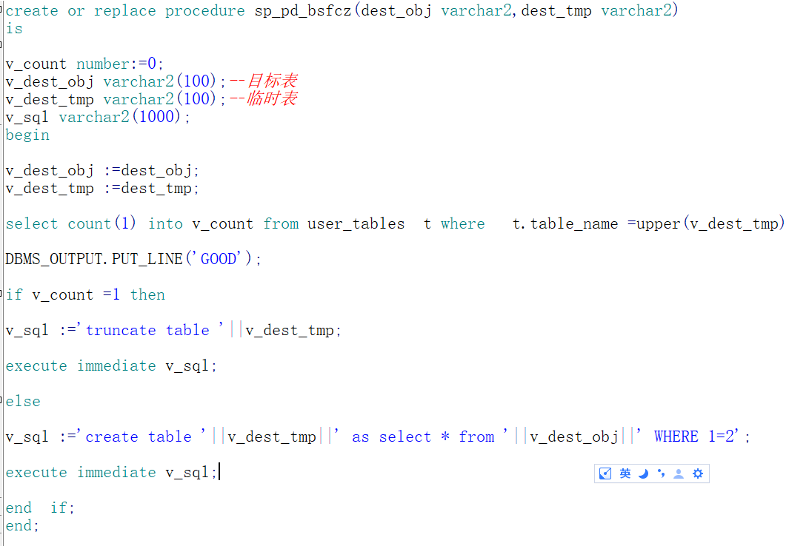  

后期将其修改为使用id作为参数传入，减少配置


```
create or replace procedure sp_pd_bsfcz(id number)
is
V_ID NUMBER;
v_count number:=0;
v_dest_obj varchar2(100);--目标表
v_dest_tmp varchar2(100);--临时表
v_sql varchar2(1000);
begin
  

v_id :=id;

select t.dest_obj ,t.lsb_obj into v_dest_obj,v_dest_tmp from t_etl_time_stamp t where t.id = v_id;

select count(1) into v_count from user_tables  t where   t.table_name =upper(v_dest_tmp);


if v_count =1 then

v_sql :='truncate table '||v_dest_tmp;

execute immediate v_sql;

else

v_sql :='create table '||v_dest_tmp||' as select * from '||v_dest_obj||' WHERE 1=2';

execute immediate v_sql;

end  if;
end;

```
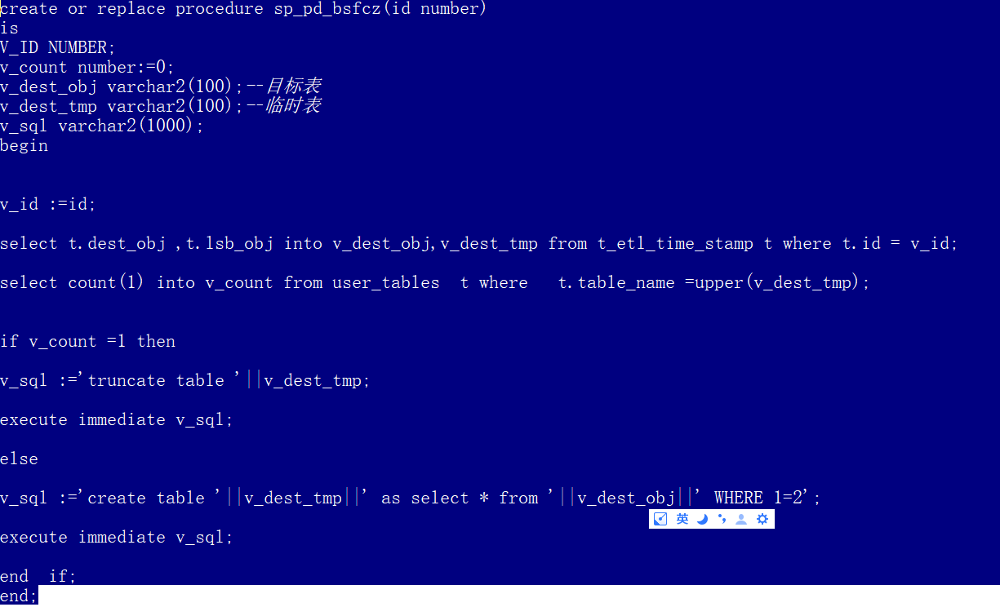  


- 设计存储过程来动态更新数据


```
create or replace procedure sp_gx_sj(id number) as

  /*1、本次方案设计默认主键是唯一字段，不是联合主键
  2、更新完成后将临时表干掉，防止浪费空间
  3、本次暂时不记录报错信息
  4、不建议在本次方案记录入库时间，最好带默认default sysdate*/

  V_ID number;

  v_dest_tmp  varchar2(100);
  v_dest_obj  varchar2(100);
  v_zj_column varchar2(100);

  --sql
  V_UPDATE   VARCHAR2(4000);
  V_INSERT_1 VARCHAR2(4000);
  V_INSERT_2 VARCHAR2(4000);

  V_MERGE VARCHAR2(4000);
  V_DROP  VARCHAR2(4000);

begin

  v_id := id;

  select t.dest_obj, t.lsb_obj, t.zj_column
    into v_dest_obj, v_dest_tmp, v_zj_column
    from t_etl_time_stamp t
   where t.id = v_id;

  --从字段表中取出更新数据字段

  select wm_concat('t.' || t.column_name || '=f.' || t.column_name)
    INTO V_UPDATE
    from user_tab_cols t
   where t.table_name = UPPER(v_dest_obj)
     and t.column_name <> UPPER(V_ZJ_COLUMN);

  dbms_output.put_line(V_UPDATE);

  --从表中取出插入数据字段

  select wm_concat('t.' || t.column_name)
    into v_insert_1
    from user_tab_cols t
   where t.table_name = UPPER(v_dest_obj);
  dbms_output.put_line(v_insert_1);
  select wm_concat('f.' || t.column_name)
    into v_insert_2
    from user_tab_cols t
   where t.table_name = UPPER(v_dest_obj);
  dbms_output.put_line(v_insert_2);
  --组合成merge

  V_MERGE := 'MERGE INTO ' || V_DEST_OBJ || '  t using(select * from ' ||
             V_DEST_TMP || ')f on (t.' || V_ZJ_COLUMN || '=f.' ||
             V_ZJ_COLUMN || ')
   WHEN MATCHED THEN UPDATE SET ' || V_UPDATE ||
             ' WHEN NOT MATCHED THEN INSERT (' || V_INSERT_1 ||
             ') VALUES(' || V_INSERT_2 || ')';

  DBMS_OUTPUT.PUT_LINE(V_MERGE);

  EXECUTE IMMEDIATE V_MERGE;

  V_DROP := 'DROP TABLE ' || v_dest_tmp;

  EXECUTE IMMEDIATE V_DROP;

end;


```
  


- 配置获取时间戳，时间戳字段，来源表，目标表(TABLE_INPUT_COPY_RESULT)


```
select id,source_obj,dest_obj,sjc_column,sjc_time，lsb_obj as dest_tmp,zj_column from t_etl_time_stamp where status ='1'

```
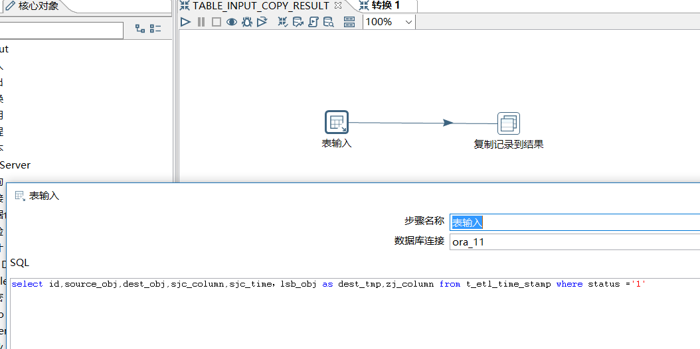  

- 配置变量(FROM_RESULT_SET_VARIABLE)


  

- 配置临时表创建


```
DECLARE

BEGIN

sp_pd_bsfcz(${ID})

END;

```
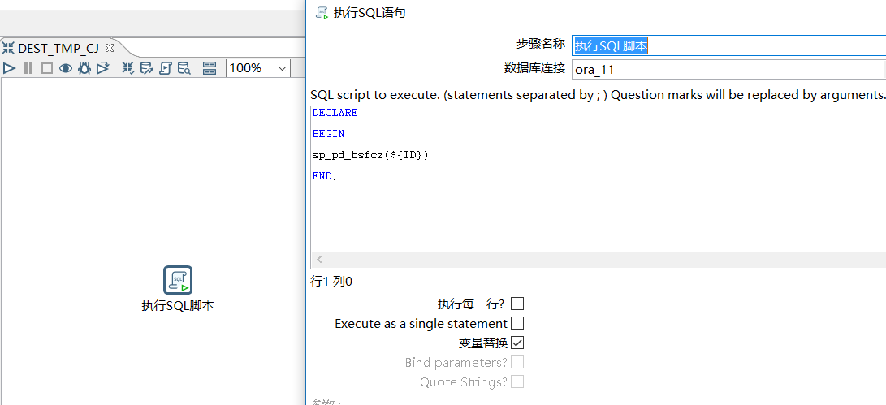  


- 配置表输入临时表输出

```

SELECT * FROM ${SOURCE_OBJ} WHERE ${SJC_COLUMN} > '${SJC_TIME}'

```
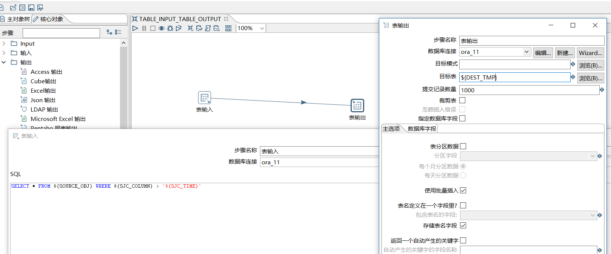  


- 配置增量更新插入


```
declare
begin
sp_gx_sj(${ID});
end;

```
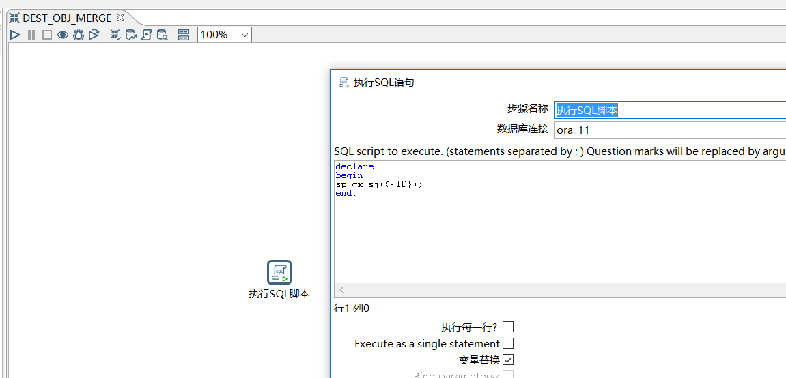  


- 配置更新时间戳(UPDATE_SJC)

```
update T_ETL_TIME_STAMP t set t.gxsj=sysdate,t.sjc_time =(select max(${SJC_COLUMN}) from ${DEST_OBJ}) where id =  ${ID}

```
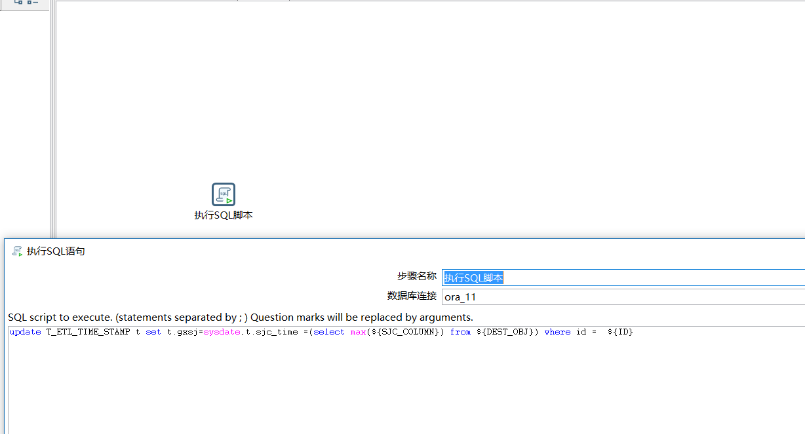  


演示数据

```
CREATE TABLE t_etl_time_stamp (id int primary key, source_obj varchar2(100),dest_obj varchar2(100),sjc_column varchar2(100),sjc_time varchar2(14),status varchar2(1),lsb_obj varchar2(100),zj_column varchar2(100),rksj date default sysdate,gxsj date);

insert into t_etl_time_stamp values(1,'t_gh_cs1','t_gh_cs2','sjc','20180501000000','1','T_GH_CS2_TMP','ID',SYSDATE,SYSDATE);


insert into t_etl_time_stamp values(1,'t_gh_cs3','t_gh_cs4','sjc','20180501000000','1','T_GH_CS4_TMP','ID',SYSDATE,SYSDATE);


create table t_gh_cs1(id int primary key,info varchar2(100),sjc varchar2(14));

create table t_gh_cs2(id int primary key,info varchar2(100),sjc varchar2(14));

create table t_gh_cs3(id int primary key,info varchar2(100),sjc varchar2(14));

create table t_gh_cs4(id int primary key,info varchar2(100),sjc varchar2(14));

insert into t_gh_cs1 values(1,'guohui','20180601000000');

insert into t_gh_cs3 values(1,'guohui','20180601120000');

insert into t_gh_cs1 values(2,'guose','20180601000000');

insert into t_gh_cs1 values(3,'guoqy','20180601120000');


```


## 配置流程图

- 配置最里面一层调度(JOB_1_3)

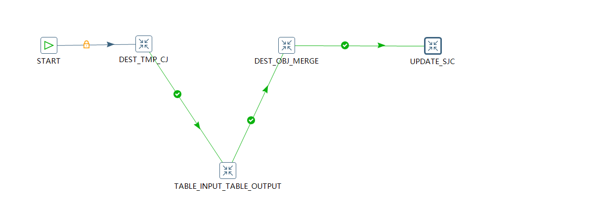  

- 第二个调度主要是连接SET_VARIABLE和job为JOB_1_3，并为其起名为JOB_1_2

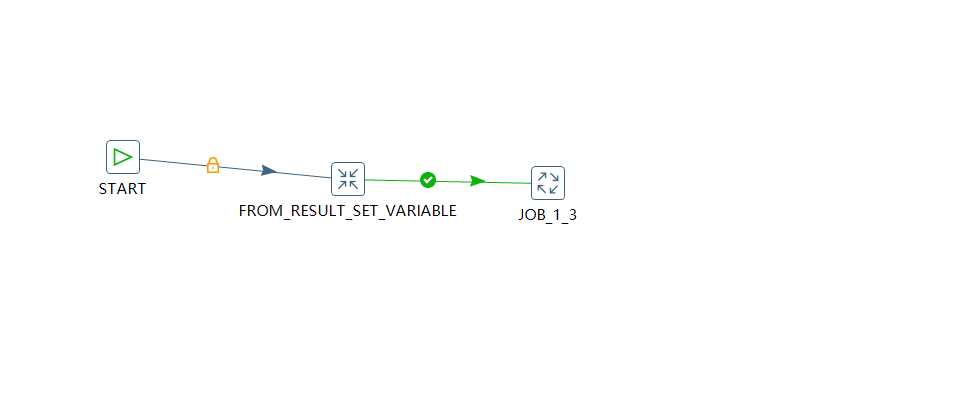  

- 第三个调度主要是将参数赋值给变量是连接TABLE_INPUT_COPY_RESULT和job为JOB_1_2，并起名为JOB_1_1

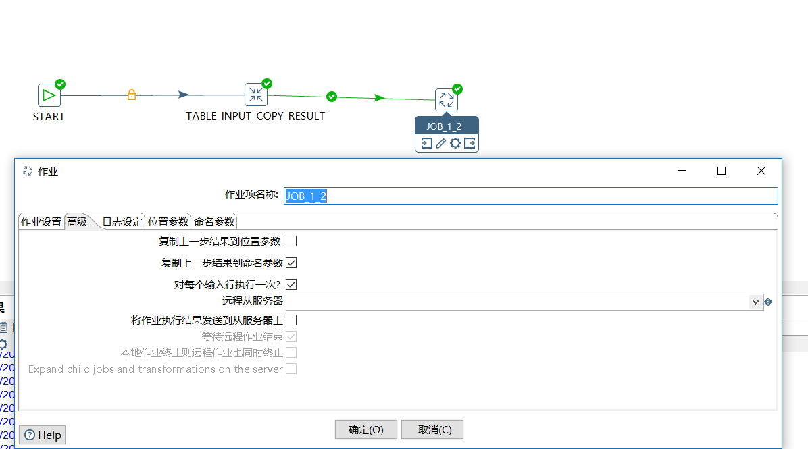  


如果只是这样配置完成，如果时间戳记录表有多条数据的话，就会报错：只有一个输入记录期待设置变量并且至少已经收到2个变量(这是本次方案的报错内容)其实就是告诉我们，后面其实期待是一行，但是我们给了不止一行数据，这样就会报错，如何解决这个问题，只要在JOB_1_1的JOB_1_2的“编辑作业入口”中的“高级”，将“复制上一步参数到命名参数”和“对每个输入行执行一次”打上“√”就可以了。

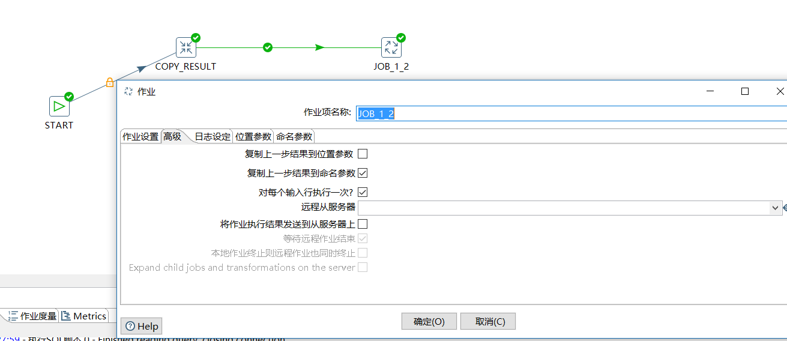  

- 文件下载

[kettle方案镜像文件](../mirror/mirror_kettle_n_2_180619.zip)

[kettle oracle资源库dmp文件](../mirror/etl_kettle_n_2_180619.dmp)

- 链接

[kettle 配置一次性抽取n张表](../20180616/kettle配置一次性抽取n张表.md)


### 问题

- 调度存储过程无法创建表


```
SQL> exec sp_pd_bsfcz('t_gh_cs1','t_gh_cs1_tmp');
begin sp_pd_bsfcz('t_gh_cs1','t_gh_cs1_tmp'); end;
ORA-01031: 权限不足
ORA-06512: 在 "ETL.SP_PD_BSFCZ", line 29
ORA-06512: 在 line 1


grant create any table to etl;


SQL> exec sp_pd_bsfcz('t_gh_cs1','t_gh_cs1_tmp');
PL/SQL procedure successfully completed
```


