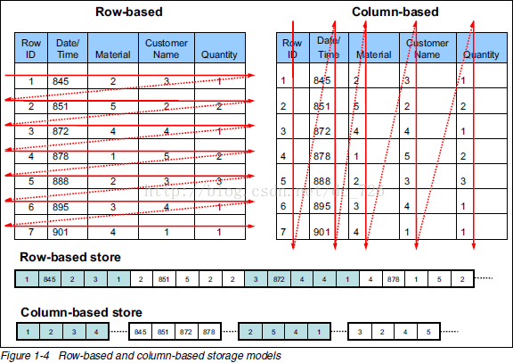
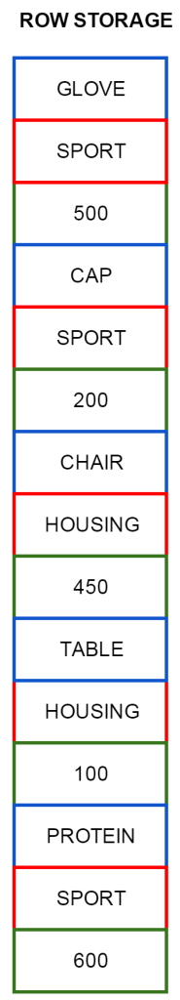

[TOC]

# 列式存储行式存储

​	其实就是存储的选型，普通的关系型数据库主要是通过行式存储，就是将一行数据作为一个整体存储在数据页中，而新型的nosql或者其他数据库选用的列式存储，就是将一列作为一个整体存储到数据页中(自己理解)。

​	网上截图：

​	 

以下全是自己译文(http://teachmehana.com/row-store-vs-column-store/)

## 列式存储

​	一些数据库支持另外一种额外的存储形式叫做列式存储，在表中的每一列看起来就像一个独立的表一样，可以得到分别存储。

​         当每一个字段看起来想一个独立表时，每个独立的迷你型表可以被索引以及压缩的

​         这可以确信这些表只会保存唯一的值，下面的例子说明了它是如何工作但是并没有描绘出真正的优势，为了实现这个，假设一张表拥有 100万数据，多达数字段将只会拥有几百或者几千个唯一的值，压缩可以使其减少磁盘空间和索引，可以让你查询更快。

​	 

备注：支持列存储的数据库一般也会支持行存储模式。

## 行式存储

​	行式存储是绝大多数数据库使用的存储方式。

​	让我们通过图形来理解这些，你可以看到表时如何存储在数据库中。

​	 

​	从上图可以看到，它的存储是顺序的存储按照行1，行2，行3等

​	每一行数据存储都是以完美的方式存储的。通过这个照片，你可以通过查看数据看到明显的问题， 

即使我想都读取数据集的一行，你的读取通过整个数据集才行。

## 各自优缺点

| 性质     | 行存储                   | 列存储 | 原因                           |
| -------- | ------------------------ | ------ | ------------------------------ |
| 内存使用 | 高                       | 低     | 压缩                           |
| 事务     | 快                       | 慢     | 列存储修改会对多个列表进行更新 |
| 分析     | 即便是有内存，有时也会慢 | 快     | 较小的内部集需要扫描，内部索引 |

以上为译文结束。

译文来自于

http://teachmehana.com/row-store-vs-column-store/

## 链接地址

https://en.wikipedia.org/wiki/Column-oriented_DBMS

http://blog.51cto.com/3776960/1911866

http://teachmehana.com/row-store-vs-column-store/

