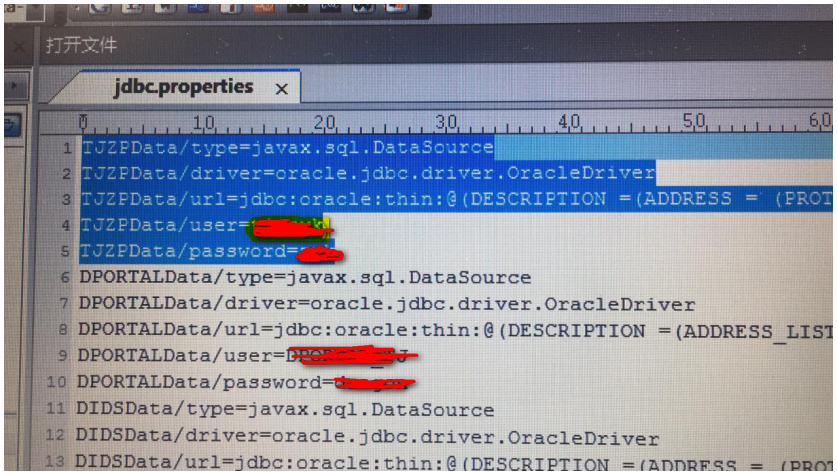

## kettle配置oracle集群

- 文件配置

文件路径{path}/simple-jndi/jdbc.properities

参考前五行数据

TJZPData/type=javax.sql.DataSource
TJZPData/driver=oracle.jdbc.driver.OracleDriver
TJZPData/url=jdbc:oracle:thin:@(tnsname)
TJZPData/user=xxx
TJZPData/password=xxx

在jdbc.properities编辑好后，需要在注册数据库链接时选择连接方式为JNDI，将JNDI名称填到上面

- 数据库链接配置

选择数据库名称并将(tnsname)填写上去，端口号变为-1即刻，需要填写用户名和密码，主机名称不需要填写。