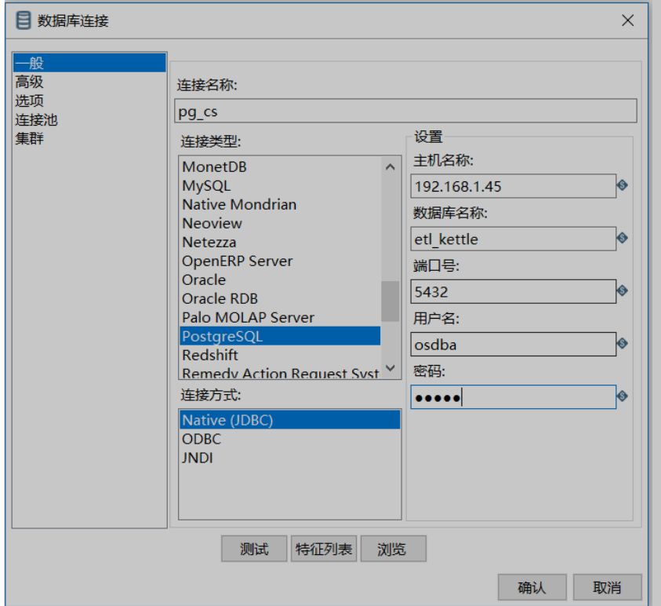

## kettle 配置数据库链接两种方式

#### 数据库链接

- 文件配置

在安装kettle相对路径{path}\data-integration\simple-jndi\jdbc.properties
```
SampleData/type=javax.sql.DataSource
SampleData/driver=org.h2.Driver
SampleData/url=jdbc:h2:file:samples/db/sampledb;IFEXISTS=TRUE
SampleData/user=PENTAHO_USER
SampleData/password=PASSWORD
```
- 数据库配置


在主对象数这个菜单栏下选择DB链接，选择新建，就可以创建了，以postgresql为例


  

首先选择链接类型，找到postgresql类型，之后按照要求填写相关信息

  

之后点击测试，查看是否配置成功，成功后，选择确认。


建议使用第二种方式，第二种方式比较好迁移，如果只是迁移数据库，第二种方式不需要修改，而第一种方式就要迁移整个环境


在本次方案中，经常会切换来源库或者目标库的数据库链接，只需要在链接中将其配置改掉，重新启动kettle,就可以重新执行。

