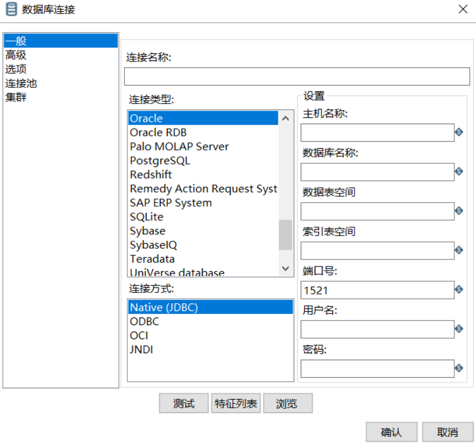

## kettle配置一次性抽取n张表

- 适用场景

适合目标数据库和源头数据库都是不变的，并且数据为轨迹类不可变的(如卡口进站数据，不会有变动字段)


- 方案描述

第一步配置一张记录来源表，目标表字段名，以及来源表的时间戳字段，以及时间戳值

第二步使用kettle类似for循环将其一一取出并且变为变量传递，并且保证数据在入数据报错时，可以删除时间戳值以后的数据，保证数据准确性。

第三步将新的数据入库并且记录当前最大时间戳


- kettle版本

本次测试版本是kettle5.4,建议后期都尽量使用kettle5.4及其以上，本次测试都是使用postgresql数据库。

### 方案配置


- 时间戳记录脚本

oracle

```
CREATE TABLE t_etl_time_stamp (id int primary key, source_obj varchar2(100),dest_obj varchar2(100),sjc_column varchar2(100),sjc_time varchar2(14),status varchar2(1),rksj date default sysdate,gxsj date);
```
postgresql

```
CREATE TABLE t_etl_time_stamp (id int primary key, source_obj varchar(100),dest_obj varchar(100),sjc_column varchar(100),sjc_time varchar(14),status varchar(1),rksj timestamp(0) default now(),gxsj timestamp(0));
;
```

给出两个建表语句是考虑到后期oracle数据库会尽可能多的迁移到postgresql数据库中，给出两个脚本以备后患。

#### 配置流程

- 配置删除语句

```
delete from ${dest_obj} where ${sjc_column} > to_date('${sjc_time}','yyymmddhh24miss')
```

  

