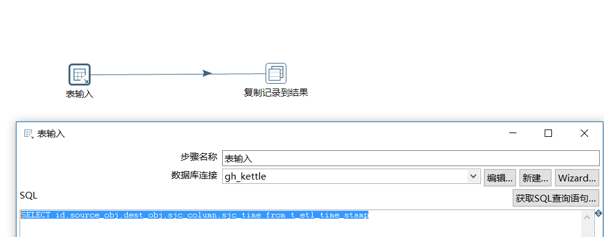
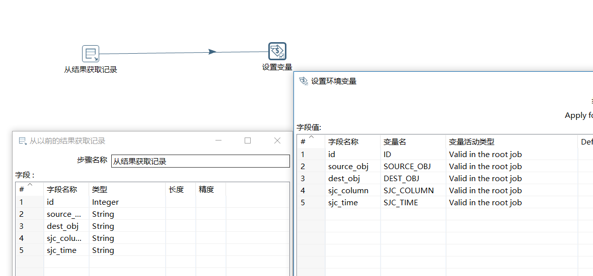
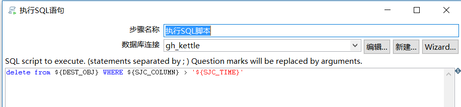
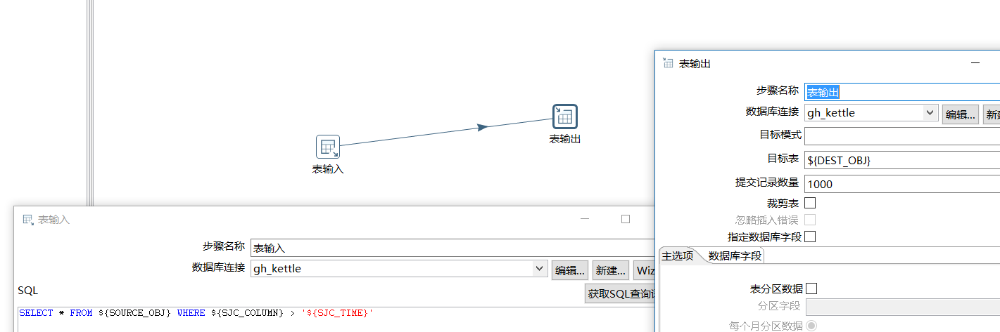
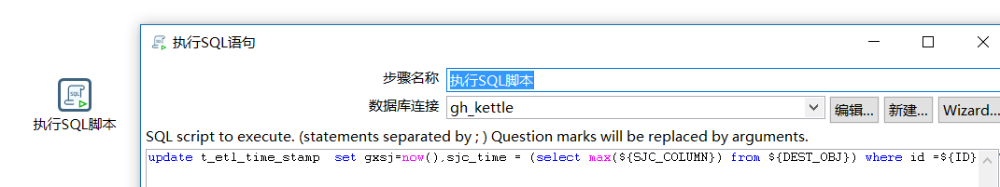
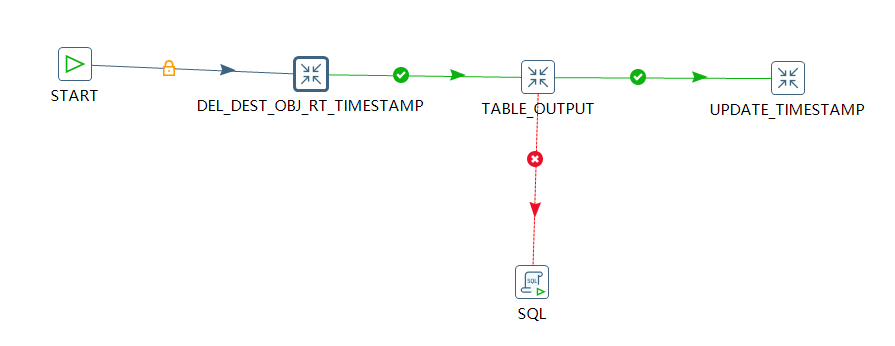
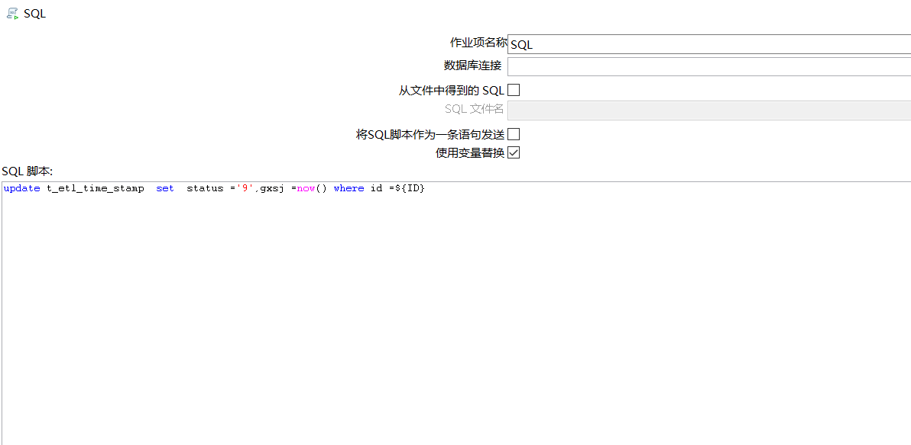
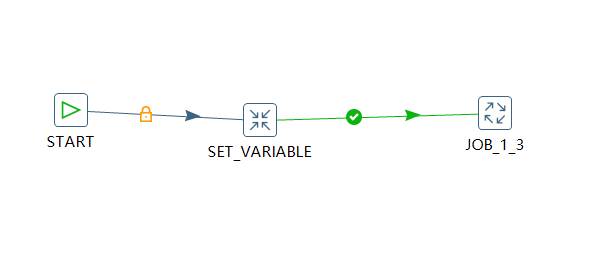
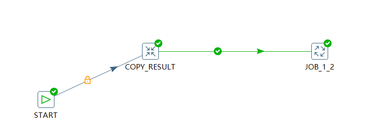

## kettle配置一次性抽取n张表

- 适用场景

适合目标数据库和源头数据库都是不变的，并且数据为轨迹类不可变的(如卡口进站数据，不会有变动字段)


- 方案描述

第一步配置一张记录来源表，目标表字段名，以及来源表的时间戳字段，以及时间戳值

第二步使用kettle类似for循环将其一一取出并且变为变量传递，并且保证数据在入数据报错时，可以删除时间戳值以后的数据，保证数据准确性。

第三步将新的数据入库并且记录当前最大时间戳


- kettle版本

本次测试版本是kettle5.4,建议后期都尽量使用kettle5.4及其以上，本次测试都是使用postgresql数据库。

### 方案配置


- 初始化时间戳记录脚本

oracle

```
CREATE TABLE t_etl_time_stamp (id int primary key, source_obj varchar2(100),dest_obj varchar2(100),sjc_column varchar2(100),sjc_time varchar2(14),status varchar2(1),rksj date default sysdate,gxsj date);
```
postgresql

```
CREATE TABLE t_etl_time_stamp (id int primary key, source_obj varchar(100),dest_obj varchar(100),sjc_column varchar(100),sjc_time varchar(14),status varchar(1),rksj timestamp(0) default now(),gxsj timestamp(0));

```

给出两个建表语句是考虑到后期oracle数据库会尽可能多的迁移到postgresql数据库中，给出两个脚本以备后患。


#### 配置关键点

- 抽取关键字段(copy_result)


```
SELECT id,source_obj,dest_obj,sjc_column,sjc_time from t_etl_time_stamp

```

  


- 配置生成变量(SET_VARIABLE)


  

- 配置删除语句(DEL_DEST_OBJ_RT_TIMESTAMP)

```

delete from ${DEST_OBJ} WHERE ${SJC_COLUMN} > '${SJC_TIME}'


```

  


- 配置插入新数据(TABLE_OUTPUT)


```
SELECT * FROM ${SOURCE_OBJ} WHERE ${SJC_COLUMN} > '${SJC_TIME}'

```
  


- 配置更新时间戳字段，状态(UPDATE_TIMESTAMP)


```
update t_etl_time_stamp  set gxsj=now(),sjc_time = (select max(${SJC_COLUMN}) from ${DEST_OBJ}) where id =${ID}

```
  


演示数据

```
gh_etl=# CREATE TABLE t_etl_time_stamp (id int primary key, source_obj varchar(100),dest_obj varchar(100),sjc_column varchar(100),sjc_time varchar(14),status varchar(1),rksj timestamp(0) default now(),gxsj timestamp(0));
CREATE TABLE

gh_etl=# insert into t_etl_time_stamp values(1,'t_gh_cs1','t_gh_cs2','sjc','20160101000000','1',now(),now());
INSERT 0 1

gh_etl=# insert into t_etl_time_stamp values(2,'t_gh_cs3','t_gh_cs4','sjc','20160101000000','1',now(),now());
INSERT 0 1

gh_etl=# create table t_gh_cs1(id int primary key,info text,sjc varchar(14));
CREATE TABLE
gh_etl=# create table t_gh_cs2(id int primary key,info text,sjc varchar(14));
CREATE TABLE
gh_etl=# create table t_gh_cs3(id int primary key,info text,sjc varchar(14));
CREATE TABLE
gh_etl=# create table t_gh_cs4(id int primary key,info text,sjc varchar(14));
CREATE TABLE


gh_etl=# insert into t_gh_cs1 values(1,'guohui','20180601000000');
INSERT 0 1
gh_etl=# insert into t_gh_cs3 values(1,'guohui','20180601120000');
INSERT 0 1
gh_etl=# insert into t_gh_cs1 values(2,'guose','20180602000000');
INSERT 0 1
gh_etl=# insert into t_gh_cs1 values(3,'guoqi','20180603000000');
INSERT 0 1


```
目标：将表t_gh_cs1的数据按照时间戳字段抽取到t_gh_cs2中，将表t_gh_cs3的数据传入到t_gh_cs4中。


## 配置流程图


配置最里面一层调度(JOB_1_3)


  

其中关于用红色连线标注的sql

```
update t_etl_time_stamp  set  status ='9',gxsj =now() where id =${ID}

```

  


第二个调度主要是连接SET_VARIABLE和job为JOB_1_3，并为其起名为JOB_1_2

  

第三个调度主要是将参数赋值给变量是连接copy_result和job为JOB_1_2，并起名为JOB_1_1

  

如果只是这样配置完成，如果时间戳记录表有多条数据的话，就会报错：只有一个输入记录期待设置变量并且至少已经收到2个变量(这是本次方案的报错内容)其实就是告诉我们，后面其实期待是一行，但是我们给了不止一行数据，这样就会报错，如何解决这个问题，只要在JOB_1_1的JOB_1_2的“编辑作业入口”中的“高级”，将“复制上一步参数到命名参数”和“对每个输入行执行一次”打上“√”就可以了。

  

- 文件下载
[kettle方案镜像文件](../mirror/mirror_kettle_n_180619.zip)
