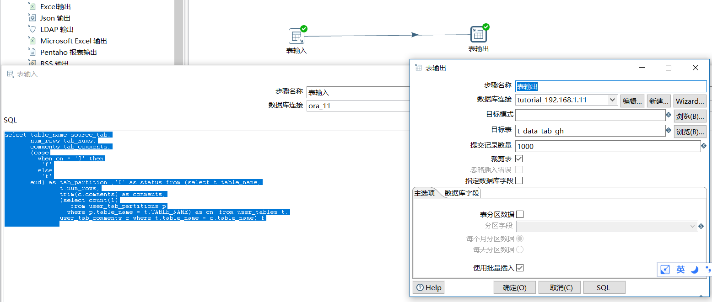
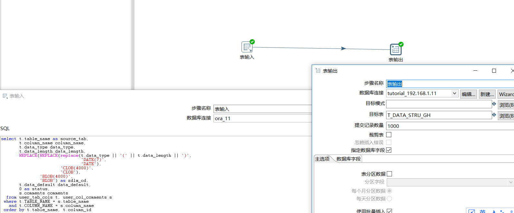
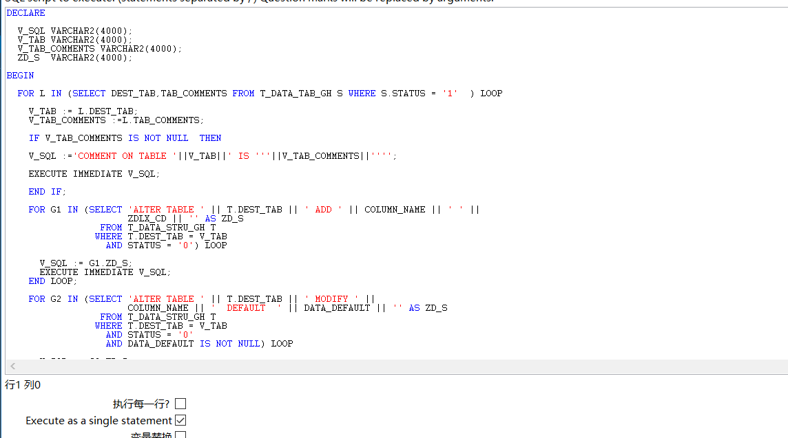
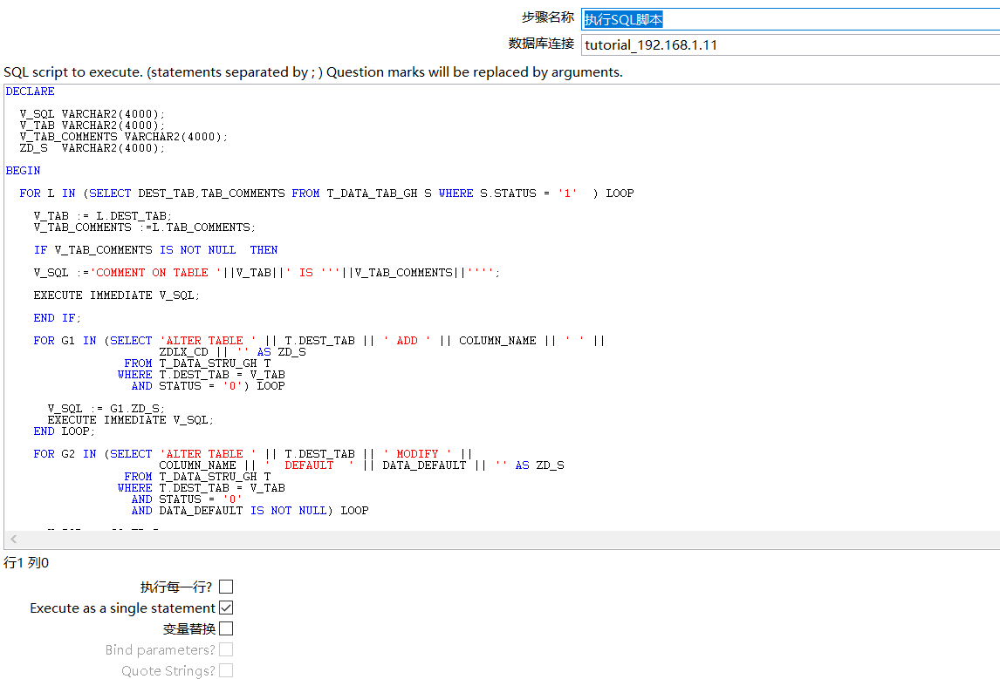


## 关于kettle将oracle数据库整体迁移到另外oracle数据库方案


### 背景

由于目标库为汇集库，需要将各个业务单位的数据库都要事先汇总过来，现在就各个业务单位的数据库大都是oracle，
而目标库也是oracle数据库，任务比较繁重，如果每张表都要事先调研，分析表的主键，时间戳，是否分区。
对于现场人手不够的情况下，用户有要求数据灌入，建议使用其他方式创建表和首批全量数据灌入。

### 要求

- 原始数据库表名，目标数据库表名，表的大概数据量，表中文注释，表是否分区

- 字段名，字段类型，字段长度，字段默认初始值，字段注释，是否非空约束

- 索引，唯一索引，主键信息

这些信息是设计要求，后期要尽量满足。


### 待实现


- 表是否分区

- 字段是否非空约束

- 索引，唯一索引，外键索引


### 系统表

- user_tables
- user_tab_columns
- user_constraints
- user_cons_columns
- others


### sql语句了解

- 原始表名，数据量，中文注释，是否分区

```

select table_name,
       num_rows,
       comments,
       (case
         when cn = '0' then
          'f'
         else
          't'
       end) as sffq
  from (select t.table_name,
               t.num_rows,
               trim(c.comments) as comments,
               (select count(1)
                  from user_tab_partitions p
                 where p.table_name = t.TABLE_NAME) as cn　from user_tables t,
               user_tab_comments c where t.table_name = c.table_name) f
               
```

- 字段名，字段类型，字段长度，字段默认初始值，字段注释

```
select t.table_name,
               t.column_name,
               t.data_type,
               t.data_length,
               REPLACE(replace(t.data_type || '(' || t.data_length || ')',
                               'DATE(7)',
                               'DATE'),
                       'CLOB(4000)',
                       'CLOB') as zdlx,
                       t.data_default,
               s.comments
          from user_tab_cols t, user_col_comments s
         where t.TABLE_NAME = s.table_name
           and t.COLUMN_NAME = s.column_name
         order by t.table_name, t.column_id


```
 
注：字段data_default中的字段类型是long类型，在oracle中很难直接转换为varchar类型，需要后期与kettle控件组合使用。
创建语句如果报错，可能与字符类型有关，可以自行修改脚本方案


- 主键索引
```


```

暂时不考虑索引和唯一索引，只是考虑主键索引

### 初始化前需要在目标库执行的步骤

- 首先在目标库创建两张临时表，并且需要source_tab和dest_tab关联数据，
考虑到目标表可能与原始表不一致，可能是手动配置，故没有将dest_obj写死，而是需要评估填写。

```
create table t_data_tab_gh(source_tab varchar2(1000),dest_tab varchar2(1000),
tab_comments varchar2(4000),tab_nums number,tab_partition varchar2(1),status varchar2(1));


create table t_data_stru_gh(source_tab varchar2(1000),dest_tab varchar2(1000),
column_name varchar2(1000),data_type varchar2(100),data_length varchar2(100),
data_default varchar2(1000),comments varchar2(4000),status varchar2(1));


alter table T_DATA_STRU_GH add zdlx_cd varchar2(4000);


update t_data_str_gh f set f.dest_tab = (select t.dest_tab from t_gh_tab_gh t where t.source_tab=f.source_tab);

```

- 其次参考平时新添加一个字段的方法来处理这些数据，不过首先要创建一张目标表(带有后期删除字段比如gh_rksj)

```
create table t_gh_fz(gh_rksj date);

comment on table t_gh_fz is  '';

alter table t_gh_fz add column id varchar2(100);

alter table t_gh_fz modify column column_value;

comment on column t_gh_fz.id is '';

```


### KETTLE 配置流程

- 原表名，注释传入到目标库指定表中，并对应到将要抽取的目标表中(MBB_T_DATA_TAB_GH)

```

select table_name source_tab,
       num_rows tab_nums,
       comments tab_comments,
       (case
         when cn = '0' then
          'f'
         else
          't'
       end) as tab_partition ,'0' as status from (select t.table_name,
               t.num_rows,
               trim(c.comments) as comments,
               (select count(1)
                  from user_tab_partitions p
                 where p.table_name = t.TABLE_NAME) as cn　from user_tables t,
               user_tab_comments c where t.table_name = c.table_name) f
               

```
  

- 批量添加目标表名

```
select * from T_DATA_TAB_GH t where rownum < 10

update t_data_tab_gh set dest_tab='GH_'||SOURCE_TAB

select * from T_DATA_TAB_GH t where rownum < 10

```

- 源字段，字段注释，字段类型，默认值(MBB_T_DATA_STRU_GH)

```

select t.table_name as source_tab,
       t.column_name column_name,
       t.data_type data_type,
       t.data_length data_length,
       REPLACE(REPLACE(replace(t.data_type || '(' || t.data_length || ')',
                               'DATE(7)',
                               'DATE'),
                       'CLOB(4000)',
                       'CLOB'),
               'BLOB(4000)',
               'BLOB') as zdlx_cd,
       t.data_default data_default,
       0 as status,
       s.comments comments
  from user_tab_cols t, user_col_comments s
 where t.TABLE_NAME = s.table_name
   and t.COLUMN_NAME = s.column_name
 order by t.table_name, t.column_id

```
  

- 创建表(DEST_OBJ_CREATE)
```
declare
 v_count  number := 0;
  v_sql    varchar2(4000);
  v_create varchar2(4000);
  v_tab    varchar2(1000);
begin
  for l in (select s.dest_tab
              from t_data_tab_gh s
             where s.status = '0'
               ) loop
    v_tab := l.dest_tab;
    v_sql := 'select count(1) from  user_tables  t where t.table_name=upper(''' ||
             v_tab || ''')';
    execute immediate v_sql
      into v_count;
    if v_count = 1 then
      null;
    else
      v_create := 'create table ' || v_tab || ' (gh_x1_rksj date)';
      execute immediate v_create;
      update t_data_tab_gh t
         set t.status = '1'
       where t.dest_tab = v_tab
         and t.status = '0';
      commit;
    end if;
  end loop;
end;
```
  

- 添加字段，字段类型，注释，删除最初时字段gh_xl_rksj(DEST_COLUMN_CREATE)

```

DECLARE
  V_SQL VARCHAR2(4000);
  V_TAB VARCHAR2(4000);
  V_TAB_COMMENTS VARCHAR2(4000);
  ZD_S  VARCHAR2(4000);
BEGIN
  FOR L IN (SELECT DEST_TAB,TAB_COMMENTS FROM T_DATA_TAB_GH S WHERE S.STATUS = '1'  ) LOOP
    V_TAB := L.DEST_TAB;
    V_TAB_COMMENTS :=L.TAB_COMMENTS;
    IF V_TAB_COMMENTS IS NOT NULL  THEN
    V_SQL :='COMMENT ON TABLE '||V_TAB||' IS '''||V_TAB_COMMENTS||'''';
    EXECUTE IMMEDIATE V_SQL;
    END IF;
    FOR G1 IN (SELECT 'ALTER TABLE ' || T.DEST_TAB || ' ADD ' || COLUMN_NAME || ' ' ||
                      ZDLX_CD || '' AS ZD_S
                 FROM T_DATA_STRU_GH T
                WHERE T.DEST_TAB = V_TAB
                  AND STATUS = '0') LOOP
      V_SQL := G1.ZD_S;
      EXECUTE IMMEDIATE V_SQL;
    END LOOP;
    FOR G2 IN (SELECT 'ALTER TABLE ' || T.DEST_TAB || ' MODIFY ' ||
                      COLUMN_NAME || '  DEFAULT  ' || DATA_DEFAULT || '' AS ZD_S
                 FROM T_DATA_STRU_GH T
                WHERE T.DEST_TAB = V_TAB
                  AND STATUS = '0'
                  AND DATA_DEFAULT IS NOT NULL) LOOP
      V_SQL := G2.ZD_S;
      EXECUTE IMMEDIATE V_SQL;
    END LOOP;
    FOR G3 IN (SELECT 'COMMENT ON COLUMN ' || T.DEST_TAB || '.' ||
                      T.COLUMN_NAME || ' IS  ''' || COMMENTS || '''' AS ZD_S
                 FROM T_DATA_STRU_GH T
                WHERE T.DEST_TAB = V_TAB
                  AND STATUS = '0'
                  AND COMMENTS IS NOT NULL) LOOP
      V_SQL := G3.ZD_S;
      EXECUTE IMMEDIATE V_SQL;
    END LOOP;
    V_SQL :=' ALTER TABLE '||V_TAB||' DROP COLUMN GH_X1_RKSJ';
    EXECUTE IMMEDIATE V_SQL;
    UPDATE T_DATA_TAB_GH T
       SET T.STATUS = '2'
     WHERE T.STATUS = '1'
       AND T.DEST_TAB = V_TAB;
    UPDATE T_DATA_STRU_GH S
       SET S.STATUS = '1'
     WHERE S.STATUS = '0'
       AND S.DEST_TAB = V_TAB;
    COMMIT;
  END LOOP;
END;
```

  


执行顺序是

MBB_T_DATA_TAB_GH>MBB_T_DATA_STRU_GH>DEST_OBJ_CREATE>DEST_COLUMN_CREATE

这样就完成了数据库的大致迁移，后期还可以做如下方案，表创建好后，可以将数据一次性抽取出来，[全量抽取](../20180616/kettle配置一次性抽取n张表.md)后，
就可以在后期配置增量抽取，那个时候就要对表进行一些分析，如主键，时间戳类型还是全量插入类型，还是其他类型。

- 文件下载

[kettle方案镜像文件](../mirror/mirror_kettle_n_180625.zip)

链接：

[全量抽取](../20180616/kettle配置一次性抽取n张表.md)


