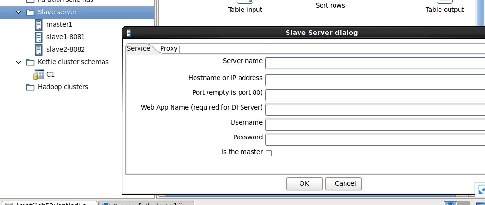
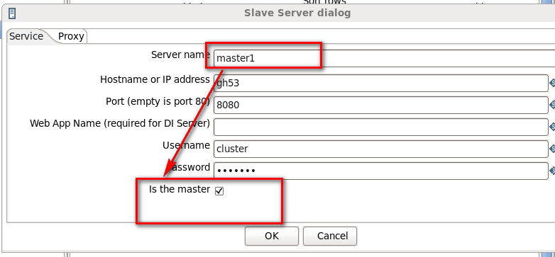
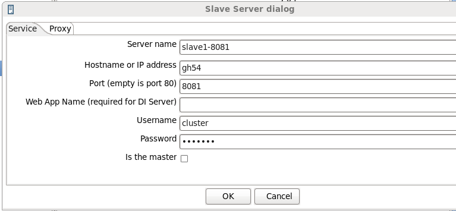
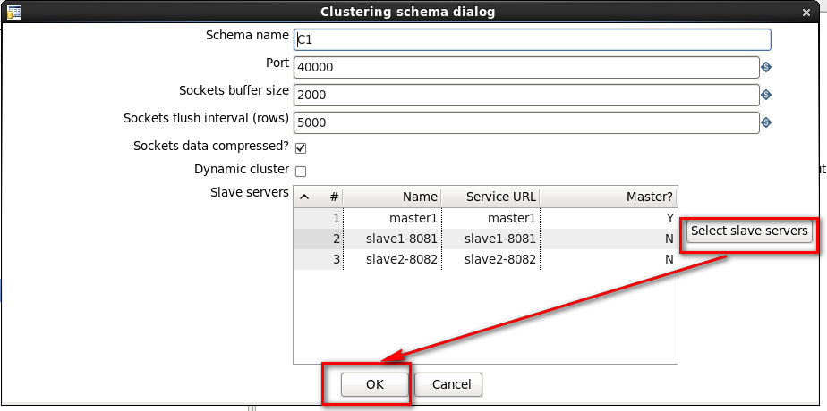
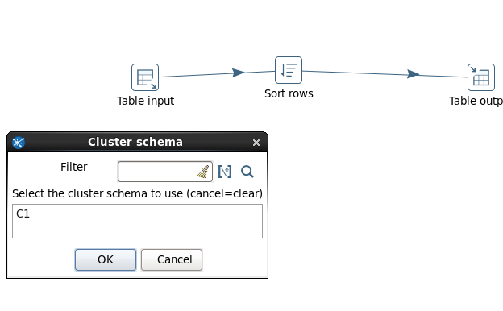
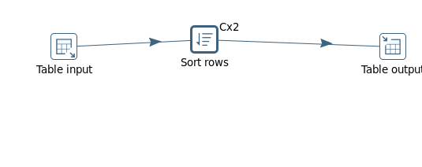


## kettle_集群


### 背景

	现在这个时代都要对软件进行分布式操作，如此研究一下kettle_集群的搭建。

### 要求

- 文档整理清楚，便于后期查阅

### 环境

- operation version

centos6.5_x64

- kettle version

kettle 5.4

- java version

jdk1.8

- 说明

本次安装部署采用的是一主两从的方式，ip地址为192.168.1.53为主，192.168.1.54、192.168.1.55为从。

### 部署

- 检查各个机器java版本

建议是jdk1.8以上,不要是openjdk这种jar包

[linux 安装jdk]()

```

# java version
java version "1.8.0_131"
Java(TM) SE Runtime Environment (build 1.8.0_131-b11)
Java HotSpot(TM) 64-Bit Server VM (build 25.131-b11, mixed mode)

```

- 修改各个机器的/etc/hosts

初始化的主机名默认都是localhost，需要自己去修改，其次建议主机名起名时尽量切合业务。

```

# vim /etc/hosts

192.168.1.53 gh53
192.168.1.54 gh54
192.168.1.55 gh55

```

- 在主机服务器上传安装包

```
# cd /opt/

# ls -ls
total 8
4 drwxr-xr-x  3 root root 4096 Sep  8  2016 pdi-ce-5.4.0.1-130
4 drwxr-xr-x. 2 root root 4096 Nov 22  2013 rh

```
- 修改参数文件

本次方案设计是一主两从，所以需要修改参数文件(care-config-master-8080.xml,carte-config-8081.xml,carte-config-8082.xml)

为大家解释一下参数具体信息:

name:代表服务器名称，这个是可以随便起的，不过建议不修改原始名称(修改意味着后面好多个文件都要修改)

hostname:默认配置是localhost，不过在linux服务器中建议在/etc/hosts文件下将其ip和主机名配置完成后，修改成为主机名

port:默认不修改

master:是否是主机，除了主机外其他都是N

username:用户名，默认是cluster

password:密码,默认是cluster

```

# cd pdi-ce-5.4.0.1-130/data-integration/pwd

# ls -ls
total 24
4 -rw-r--r-- 1 root root 1094 Jun 26 05:20 carte-config-8081.xml
4 -rw-r--r-- 1 root root 1094 Jun 26 05:20 carte-config-8082.xml
4 -rw-r--r-- 1 root root 1104 Jun 14  2015 carte-config-8083.xml
4 -rw-r--r-- 1 root root 1104 Jun 14  2015 carte-config-8084.xml
4 -rw-r--r-- 1 root root  803 Jun 26 05:18 carte-config-master-8080.xml
4 -rw-r--r-- 1 root root  213 Jun 14  2015 kettle.pwd

#  vim carte-config-master-8080.xml 
<slave_config>
 

  <slaveserver>
    <name>master1</name>
    <hostname>gh53</hostname>
    <port>8080</port>
    <master>Y</master>
    <username>cluster</username>
    <password>cluster</password>
  </slaveserver>


</slave_config>


# vim carte-config-8081.xml 
<slave_config>
 

  <masters>

    <slaveserver>
      <name>master1</name>
      <hostname>gh53</hostname>
      <port>8080</port>
      <username>cluster</username>
      <password>cluster</password>
      <master>Y</master>
    </slaveserver>

  </masters>

  <report_to_masters>Y</report_to_masters>

  <slaveserver>
    <name>slave1-8081</name>
    <hostname>gh54</hostname>
    <port>8081</port>
    <username>cluster</username>
    <password>cluster</password>
    <master>N</master>
  </slaveserver>


</slave_config>

# vim  carte-config-8082.xml 

  <masters>

    <slaveserver>
      <name>master1</name>
      <hostname>gh53</hostname>
      <port>8080</port>
      <username>cluster</username>
      <password>cluster</password>
      <master>Y</master>
    </slaveserver>

  </masters>

  <report_to_masters>Y</report_to_masters>

  <slaveserver>
    <name>slave2-8082</name>
    <hostname>gh55</hostname>
    <port>8082</port>
    <username>cluster</username>
    <password>cluster</password>
    <master>N</master>
  </slaveserver>


</slave_config>


```

将其拷贝后，传送到子服务器

- 在主机和子节点上授权 .sh 可执行权限

```

# cd pdi-ce-5.4.0.1-130/data-integration/

# chmod 777 *.sh

```

- 分别启动主节点和从节点的carte服务

carte默认路径在/data-integration/下

```

[gh53]

# ./carte.sh gh53 8080

[gh54]

# ./carte.sh gh54 8081


[gh55]

# ./carte.sh  gh55 8082


```

- 在主机点启动spoon.sh并且选择数据库作为自己的数据库资源库存储方案调度信息

[kettle配置数据库资源库](../201806215/kettle配置数据库资源库.md)

```

# ./spoon.sh

```

- 新建转换并在slave下新建NEW,参考carte-config-master-8080.xml配置master1，参考carte-config-xxx.xml配置相对应的节点







- 在 kettle cluster schemas 中选择新建NEW,并在出现的界面选择右下方的“SELECT slave servers”,选择保存




- 正式新建方案，选择SORT column控件，并在右击找到"clustering"下的选择集群组名，当前是C1





- 保存方案并开启运行后，查看子节点的日志

```
[gh54]

2018/06/26 05:49:35 - Sort rows.0 - Server socket accepted for port [40000], reading from server master1
2018/06/26 05:49:41 - Sort rows.0 - Finished processing (I=50000, O=40444, R=0, W=9555, U=0, E=0)
2018/06/26 05:49:47 - General - I couldn't find the repository with name 'etl_cluster'
2018/06/26 05:49:47 - jiqun_cs_180626_1 (C1:slave1-8081) - Dispatching started for transformation [jiqun_

[gh55]

2018/06/26 05:49:34 - Sort rows.0 - Server socket accepted for port [40000], reading from server master1
2018/06/26 05:49:40 - Sort rows.0 - Finished processing (I=50000, O=40300, R=0, W=9700, U=0, E=0)
2018/06/26 05:49:46 - General - I couldn't find the repository with name 'etl_cluster'
2018/06/26 05:49:46 - jiqun_cs_180626_1 (C1:slave2-8082) - Dispatching started for transformation [jiqun_cs_180626_1 (C1:slave2-8082)]


```


参考链接：

https://www.cnblogs.com/skyrim/p/5104557.html