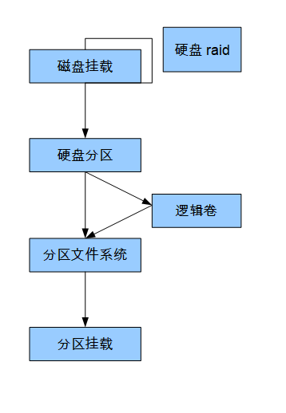

[TOC]


# linux 分区 文件系统 挂载 逻辑卷

​	近一段时间发现，虚拟机经常被使用，而且是别的公司人做的系统，可能他们给的磁盘空间够用了，就是没有给分配出来，或者根路径有的还是使用传统分区，当文件占用的空间变大，很难对根路径进行扩展，现在总结一些经验供后面使用。


​	通过df -Th命令可以看到当前的所有分配的空间以及使用当前设备的几个主分区，或者使用的是逻辑卷的方式

```
# df -Th
```

​	通过fdisk -l命令的可以查看当前硬盘设备的所有信息，是否分区

```
# fdisk -l
```

​	

## 分区

​	如果空间超过2T的磁盘，需要使用gpt分区方式

[gpt分区](../20180717/linux_磁盘分区_parted.md)

​	如果空间在2T以内的磁盘，需要使用mbr分区方式

[mbr分区](../20180717/linux_磁盘分区_fdisk.md)

​	

## 文件系统创建

​	分区完成后，如果是需要对齐进行直接挂载在某个路径下的话，首先要进行文件系统创建,现在linux常用的文件系统是ext3,ext4,xfs系统

[文件系统创建](../20180718/linux_创建文件系统.md)


## 挂载

​	文件系统创建完成后，需要将文件系统挂载到某个路径下，挂载后，我们就可以使用文件系统

[挂载](../20180718/LINUX_挂载_卸载.md)


## 逻辑卷

​	传统分区很难解决当挂载的路径文件已经要满时，除了删除文件，或者迁移文件外，没有对其更好的办法，但是现实又是要求我们确保在不停机的情况将路径磁盘空间变大，这里就要为大家介绍一种非常好用的技术：逻辑卷。

​	逻辑卷本身需要分区，磁盘分区后需要对其进行pv,vg,lv,之后分配使用。


[逻辑卷](../20180718/LINUX_逻辑卷_CREATE_EXTEND.md)


## 总结


​	先看一下草图



​	首先硬盘挂载，可能在安装操作系统之前，硬盘就做了raid，这个后面我们会讲到，当硬盘挂载到系统时，硬盘需要分区采用使用；硬盘分区普通采用两种方式，其中一种较为常见是mbr方式，采用的fdisk分区，而第二种方式则是通过gpt方式，使用的是parted分区，两种主要的区别在fdisk没有办法分配超过2T空间以上的硬盘，而parted没有这个限制；分区完成后如果没有文件系统就叫做裸设备，裸设备有些应用支持，但是大多数据应用还是需要文件系统；分区完成后，直接为其创建文件系统操作，是较为常见的操作，不过在这里建议为其创建逻辑卷；逻辑卷后为其创建文件系统，之后挂载是推荐的做法，能够很好的避免当空间不够使用时，只能对文件想办法，不能对磁盘想办法的尴尬局面。


