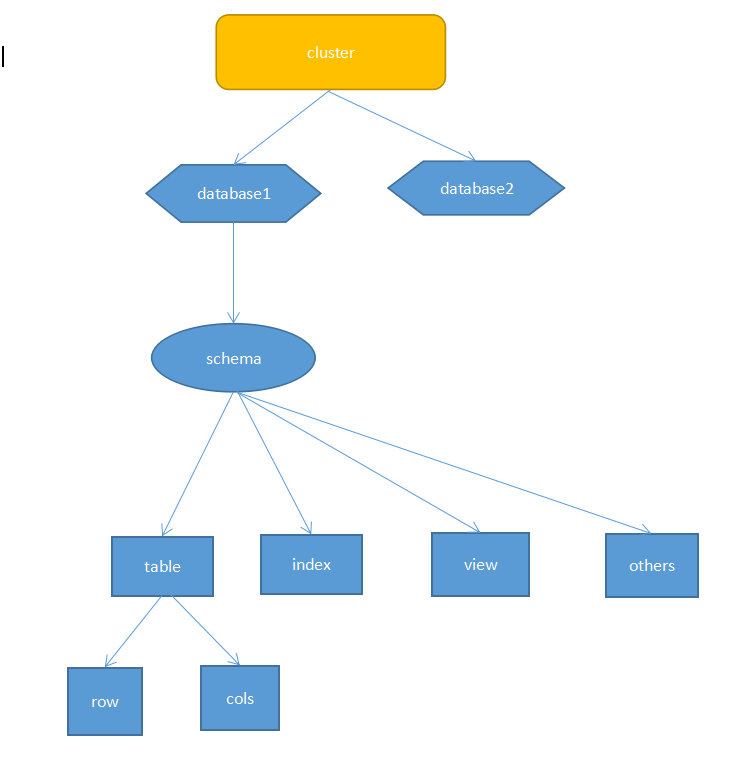
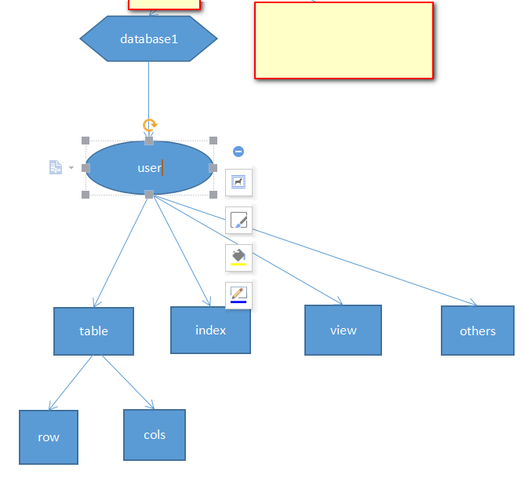
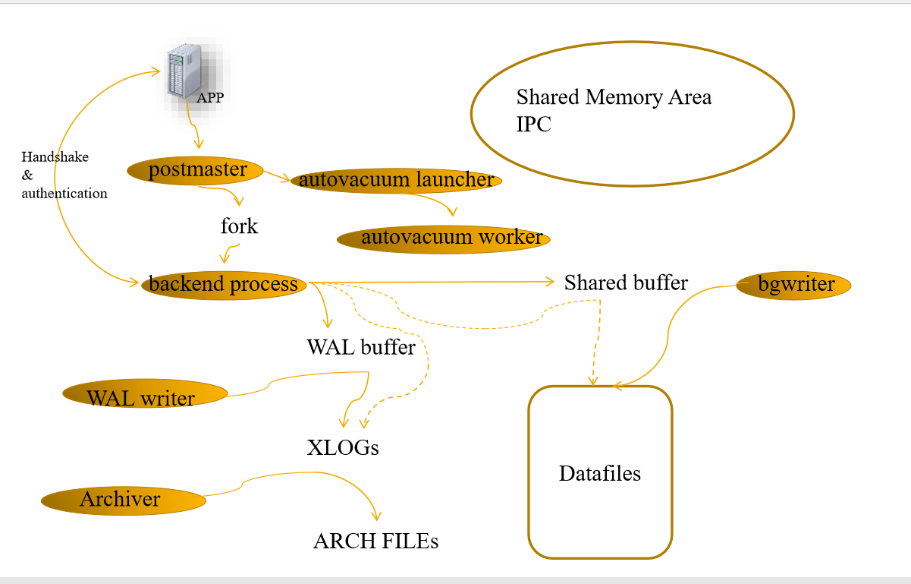
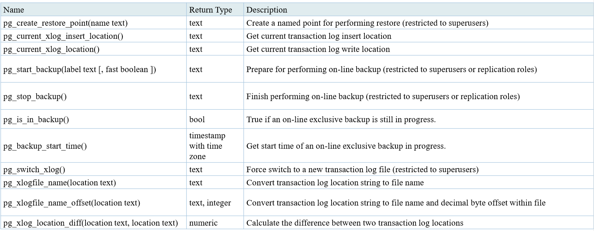
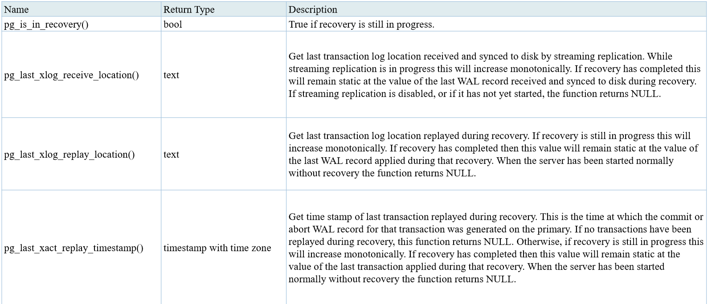
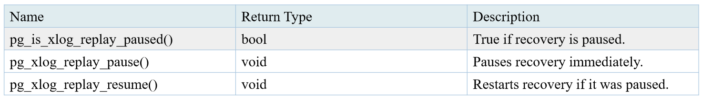

[TOC]

# PG 培训 DBA 2


​	第二小节主要讲述的是体系结构，主要需要了解PG的逻辑结构，进程结构，物理结构，以及系统表

之间的关系，系统视图，管理函数等。


## 问题

1. 检查点是否是事务提交点

   


## 逻辑结构

​	pg的逻辑结构



​	oracled的逻辑结构



​	其实两者的区别首先oracle的实例上并没有一层cluster管理，对于postgres而言，cluster就是当前环境$PGDATA，可以通过查询pg_database,或者在命令行上执行\l，就可以查看当前环境下有多少个数据库，除了部分表或者视图是全局共有的，其他的表对于postgres的另外实例必须通过数据库连接或者其他方式才能访问。

​	第二个不同点：在postgresql中用户独立在逻辑体系之外，而oracle数据将user等同于schema来处理。


## 物理结构


​	在postgres数据库中，表的存储是以文件方式存在的，表空间就是一层目录，表就是一个文件，而在oracle当中就不是这个样子，表空间是有n个物理文件组成，而表存储在表空间，具体表到底在那个文件下，一般而言是无法知道

​	postgresql 表文件默认大小是在创建$PGDATA时决定的，而且当表的大小超过时，会生成同名的文件后添加后缀名。

​	查看编译过程

```
#./configure --help

with-segsize=SEGSIZE  set table segment size in GB [1]
```

​	除了数据文件外，还有参数文件，wal日志，归档文件，系统日志

​	查看表的路径

```
osdba=# select * from pg_relation_filepath('t_etl_task');
 pg_relation_filepath 
----------------------
 base/16384/24886
(1 row)


tutorial=# select * from pg_relation_filepath('t_3');
             pg_relation_filepath             
----------------------------------------------
 pg_tblspc/16511/PG_9.3_201306121/16490/16512
```

​	默认的数据存放在pg_global,或者pg_default下，如果创建了表空间，不在当前目录下，一般会在pg_tablspc下生成一个软链接，指向这个文件

```
下面来解释一下这个链接地址信息：
pg_tblspc/16511/PG_9.3_201306121/16490/16512
pt_tblspc:软连接
16511：表空间oid
PG_9.3_201306121:postgres版本号
16490:数据库oid
16512:表node
```


## 进程结构


​	在进程机构中最需要了解三点，第一点是启动时的postmaster进程，第二点是wal_write,第三点是bgwrite




​	当有应用连接postgres数据库时，postmaster会folk出一个子进程backend process来负责和它进行交互，(想没想过，为什么可以通过杀掉进程就可以结束会话，释放锁或者资源呢，而不会影响整个数据库，就是杀掉了子进程不是吗？)

​	bgwriter:将数据刷新到文件中

​	wal writer:将wal buffer中的日志刷新到xlogs中

​	archiver:将xlogs归档到arch files中

​	pgstat -- 收集统计信息

​	pgarch -- 如果开启了归档, 那么postmaster会fork一个归档进程.

​	checkpointer -- 负责检查点的进程

​	autovacuum lanucher -- 负责回收垃圾数据的进程, 如果开启了autovacuum的话,那么postmaster会fork这个进程.

​	autovacuum worker -- 负责回收垃圾数据的worker进程, 是lanucher进程fork出来的.

 

## 系统表


```
osdba=# select relkind,relname from pg_class where relkind = 'r' and relnamespace=(select oid from pg_namespace where nspname ='pg_catalog') order by 1,2;
 relkind |         relname         
---------+-------------------------
 r       | pg_aggregate
 r       | pg_am
 r       | pg_amop
 r       | pg_amproc
 r       | pg_attrdef
 r       | pg_attribute
 r       | pg_auth_members
 r       | pg_authid
 r       | pg_cast
 r       | pg_class
 r       | pg_collation
 r       | pg_constraint
 r       | pg_conversion
 r       | pg_database
 r       | pg_db_role_setting
 r       | pg_default_acl
 r       | pg_depend
 r       | pg_description
 r       | pg_enum
 r       | pg_event_trigger
 r       | pg_extension
 r       | pg_foreign_data_wrapper
 r       | pg_foreign_server
 r       | pg_foreign_table
 r       | pg_index
 r       | pg_inherits
 r       | pg_language
 r       | pg_largeobject
 r       | pg_largeobject_metadata
 r       | pg_namespace
 r       | pg_opclass
 r       | pg_operator
 r       | pg_opfamily
 r       | pg_pltemplate
 r       | pg_proc
 r       | pg_range
 r       | pg_rewrite
 r       | pg_seclabel
 r       | pg_shdepend
 r       | pg_shdescription
 r       | pg_shseclabel
 r       | pg_statistic
 r       | pg_tablespace
 r       | pg_trigger
 r       | pg_ts_config
 r       | pg_ts_config_map
 r       | pg_ts_dict
 r       | pg_ts_parser
 r       | pg_ts_template
 r       | pg_type
 r       | pg_user_mapping
(51 rows)


```


1. pg_class

   

   

   ```
   select relname,(select nspname from pg_namespace s where s.oid = t.relnamespace) as relnamespace,reltype::regtype ,reloftype::regtype,(select rolname from pg_authid where oid
    = t.relowner) as relowner, (select amname from pg_am where oid = relam) as relam,relfilenode,(select spcname from pg_tablespace  where oid =t.reltablespace) as reltablespace ,relpages,reltuples,relallvisible ,reltoastrelid::regclass,relhasindex,relisshared,relpersistence,relkind,relnatts,relchecks ,relhasoids,relhaspkey,relhasrules,relhastriggers,relhassubclass,relispopulated,relreplident,relfrozenxid,relminmxid,relacl,reloptions  from pg_class t ;
   
   
   
   ```

   | Name             | Type        | References          | Description                                                  |
   | ---------------- | ----------- | ------------------- | ------------------------------------------------------------ |
   | `oid`            | `oid`       |                     | Row identifier (hidden attribute; must be explicitly selected) |
   | `relname`        | `name`      |                     | Name of the table, index, view, etc.                         |
   | `relnamespace`   | `oid`       | `pg_namespace.oid`  | The OID of the namespace that contains this relation         |
   | `reltype`        | `oid`       | `pg_type.oid`       | The OID of the data type that corresponds to this table's row type, if any (zero for indexes, which have no `pg_type` entry) |
   | `reloftype`      | `oid`       | `pg_type.oid`       | For typed tables, the OID of the underlying composite type, zero for all other relations |
   | `relowner`       | `oid`       | `pg_authid.oid`     | Owner of the relation                                        |
   | `relam`          | `oid`       | `pg_am.oid`         | If this is an index, the access method used (B-tree, hash, etc.) |
   | `relfilenode`    | `oid`       |                     | Name of the on-disk file of this relation; zero means this is a "mapped" relation whose disk file name is determined by low-level state |
   | `reltablespace`  | `oid`       | `pg_tablespace.oid` | The tablespace in which this relation is stored. If zero, the database's default tablespace is implied. (Not meaningful if the relation has no on-disk file.) |
   | `relpages`       | `int4`      |                     | Size of the on-disk representation of this table in pages (of size `BLCKSZ`). This is only an estimate used by the planner. It is updated by `VACUUM`, `ANALYZE`, and a few DDL commands such as `CREATE INDEX`. |
   | `reltuples`      | `float4`    |                     | Number of rows in the table. This is only an estimate used by the planner. It is updated by `VACUUM`, `ANALYZE`, and a few DDL commands such as `CREATE INDEX`. |
   | `relallvisible`  | `int4`      |                     | Number of pages that are marked all-visible in the table's visibility map. This is only an estimate used by the planner. It is updated by `VACUUM`, `ANALYZE`, and a few DDL commands such as `CREATE INDEX`. |
   | `reltoastrelid`  | `oid`       | `pg_class.oid`      | OID of the TOAST table associated with this table, 0 if none. The TOAST table stores large attributes "out of line" in a secondary table. |
   | `reltoastidxid`  | `oid`       | `pg_class.oid`      | For a TOAST table, the OID of its index. 0 if not a TOAST table. |
   | `relhasindex`    | `bool`      |                     | True if this is a table and it has (or recently had) any indexes |
   | `relisshared`    | `bool`      |                     | True if this table is shared across all databases in the cluster. Only certain system catalogs (such as `pg_database`) are shared. |
   | `relpersistence` | `char`      |                     | `p` = permanent table, `u` = unlogged table, `t` = temporary table |
   | `relkind`        | `char`      |                     | `r` = ordinary table, `i` = index, `S` = sequence, `v` = view, `m` = materialized view, `c` = composite type, `t` = TOAST table, `f` = foreign table |
   | `relnatts`       | `int2`      |                     | Number of user columns in the relation (system columns not counted). There must be this many corresponding entries in `pg_attribute`. See also `pg_attribute.attnum`. |
   | `relchecks`      | `int2`      |                     | Number of `CHECK` constraints on the table; see [`pg_constraint`](https://www.postgresql.org/docs/9.3/static/catalog-pg-constraint.html) catalog |
   | `relhasoids`     | `bool`      |                     | True if we generate an OID for each row of the relation      |
   | `relhaspkey`     | `bool`      |                     | True if the table has (or once had) a primary key            |
   | `relhasrules`    | `bool`      |                     | True if table has (or once had) rules; see [`pg_rewrite`](https://www.postgresql.org/docs/9.3/static/catalog-pg-rewrite.html) catalog |
   | `relhastriggers` | `bool`      |                     | True if table has (or once had) triggers; see [`pg_trigger`](https://www.postgresql.org/docs/9.3/static/catalog-pg-trigger.html) catalog |
   | `relhassubclass` | `bool`      |                     | True if table has (or once had) any inheritance children     |
   | `relispopulated` | `bool`      |                     | True if relation is populated (this is true for all relations other than some materialized views) |
   | `relfrozenxid`   | `xid`       |                     | All transaction IDs before this one have been replaced with a permanent ("frozen") transaction ID in this table. This is used to track whether the table needs to be vacuumed in order to prevent transaction ID wraparound or to allow `pg_clog` to be shrunk. Zero (`InvalidTransactionId`) if the relation is not a table. |
   | `relminmxid`     | `xid`       |                     | All multixact IDs before this one have been replaced by a transaction ID in this table. This is used to track whether the table needs to be vacuumed in order to prevent multixact ID wraparound or to allow `pg_multixact` to be shrunk. Zero (`InvalidMultiXactId`) if the relation is not a table. |
   | `relacl`         | `aclitem[]` |                     | Access privileges; see [GRANT](https://www.postgresql.org/docs/9.3/static/sql-grant.html) and [REVOKE](https://www.postgresql.org/docs/9.3/static/sql-revoke.html) for details |
   | `reloptions`     | `text[]`    |                     | Access-method-specific options, as "keyword=value" strings   |

   

   pg_class的字段信息很多不是很清楚，后面学习时需要注意

   

2. pg_aggregate:聚合函数

3. pg_am：索引

   ```
   osdba=# select amname from pg_am;
    amname 
   --------
    btree
    hash
    gist
    gin
    spgist
   (5 rows)
   
   ```

4. pg_amop:存储每个索引访问方法操作符家族(pg_opfamily)中的详细操作符信息 

5. pg_amproc:存储每个索引访问方法操作符家族(pg_opfamily)支持的函数信息

6. pg_attrdef:存储数据表列的默认值(例如创建表时指定了列的default值). 

   ```
   osdba=# create table t_180721_1(id int4,note text default 'guohui');
   CREATE TABLE
   osdba=# select adrelid::regclass,adnum,adsrc from pg_attrdef where adrelid = 't_180721_1'::regclass and adnum = 2;
     adrelid   | adnum |     adsrc      
   ------------+-------+----------------
    t_180721_1 |     2 | 'guohui'::text
   
   ```

7. pg_attribute:存储数据表列的详细信息. 包括隐含的列(ctid, cmin, cmax, xmin, xmax) 

   ```
   osdba=# create table t_180721_1(id int4,note text default 'guohui');
   CREATE TABLE
   osdba=# select * from pg_attribute  where attrelid ='t_180721_1'::regclass ;
    attrelid | attname  | atttypid | attstattarget | attlen | attnum | attndims | attcacheoff | atttypmod | attbyval | attstorage | attalign | attnotnull | atthasdef | attisdropped | attislocal | attinhcount | at
   tcollation | attacl | attoptions | attfdwoptions 
   ----------+----------+----------+---------------+--------+--------+----------+-------------+-----------+----------+------------+----------+------------+-----------+--------------+------------+-------------+---
   -----------+--------+------------+---------------
       73313 | tableoid |       26 |             0 |      4 |     -7 |        0 |          -1 |        -1 | t        | p          | i        | t          | f         | f            | t          |           0 |   
            0 |        |            | 
       73313 | cmax     |       29 |             0 |      4 |     -6 |        0 |          -1 |        -1 | t        | p          | i        | t          | f         | f            | t          |           0 |   
            0 |        |            | 
       73313 | xmax     |       28 |             0 |      4 |     -5 |        0 |          -1 |        -1 | t        | p          | i        | t          | f         | f            | t          |           0 |   
            0 |        |            | 
       73313 | cmin     |       29 |             0 |      4 |     -4 |        0 |          -1 |        -1 | t        | p          | i        | t          | f         | f            | t          |           0 |   
            0 |        |            | 
       73313 | xmin     |       28 |             0 |      4 |     -3 |        0 |          -1 |        -1 | t        | p          | i        | t          | f         | f            | t          |           0 |   
            0 |        |            | 
       73313 | ctid     |       27 |             0 |      6 |     -1 |        0 |          -1 |        -1 | f        | p          | s        | t          | f         | f            | t          |           0 |   
            0 |        |            | 
       73313 | id       |       23 |            -1 |      4 |      1 |        0 |          -1 |        -1 | t        | p          | i        | f          | f         | f            | t          |           0 |   
            0 |        |            | 
       73313 | note     |       25 |            -1 |     -1 |      2 |        0 |          -1 |        -1 | f        | x          | i        | f          | t         | f            | t          |           0 |   
          100 |        |            | 
   (8 rows)
   
   ```

   发现没有attnum = -2的列名，如果创建表时添加with oids就会出现

   ```
   osdba=# drop table t_180721_1 ;
   DROP TABLE
   osdba=# create table t_180721_1(id int4,note text default 'guohui') with oids;
   CREATE TABLE
   osdba=# select * from pg_attribute  where attrelid ='t_180721_1'::regclass ;
    attrelid | attname  | atttypid | attstattarget | attlen | attnum | attndims | attcacheoff | atttypmod | attbyval | attstorage | attalign | attnotnull | atthasdef | attisdropped | attislocal | attinhcount | at
   tcollation | attacl | attoptions | attfdwoptions 
   ----------+----------+----------+---------------+--------+--------+----------+-------------+-----------+----------+------------+----------+------------+-----------+--------------+------------+-------------+---
   -----------+--------+------------+---------------
       73320 | tableoid |       26 |             0 |      4 |     -7 |        0 |          -1 |        -1 | t        | p          | i        | t          | f         | f            | t          |           0 |   
            0 |        |            | 
       73320 | cmax     |       29 |             0 |      4 |     -6 |        0 |          -1 |        -1 | t        | p          | i        | t          | f         | f            | t          |           0 |   
            0 |        |            | 
       73320 | xmax     |       28 |             0 |      4 |     -5 |        0 |          -1 |        -1 | t        | p          | i        | t          | f         | f            | t          |           0 |   
            0 |        |            | 
       73320 | cmin     |       29 |             0 |      4 |     -4 |        0 |          -1 |        -1 | t        | p          | i        | t          | f         | f            | t          |           0 |   
            0 |        |            | 
       73320 | xmin     |       28 |             0 |      4 |     -3 |        0 |          -1 |        -1 | t        | p          | i        | t          | f         | f            | t          |           0 |   
            0 |        |            | 
       73320 | oid      |       26 |             0 |      4 |     -2 |        0 |          -1 |        -1 | t        | p          | i        | t          | f         | f            | t          |           0 |   
            0 |        |            | 
       73320 | ctid     |       27 |             0 |      6 |     -1 |        0 |          -1 |        -1 | f        | p          | s        | t          | f         | f            | t          |           0 |   
            0 |        |            | 
       73320 | id       |       23 |            -1 |      4 |      1 |        0 |          -1 |        -1 | t        | p          | i        | f          | f         | f            | t          |           0 |   
            0 |        |            | 
       73320 | note     |       25 |            -1 |     -1 |      2 |        0 |          -1 |        -1 | f        | x          | i        | f          | t         | f            | t          |           0 |   
          100 |        |            | 
   (9 rows)
   
   ```

8. pg_auth_members: 数据库用户的成员关系信息,不太清楚到底是什么意思

   ```
   osdba=# \du
                                List of roles
    Role name |                   Attributes                   | Member of 
   -----------+------------------------------------------------+-----------
    learn1    |                                                | {}
    learn2    |                                                | {}
    osdba     | Superuser, Create role, Create DB, Replication | {}
   osdba=# grant learn1 to osdba;
   GRANT ROLE
   osdba=# select * from pg_auth_members ;
    roleid | member | grantor | admin_option 
   --------+--------+---------+--------------
     73210 |     10 |      10 | f
   (1 row)
   
   osdba=# \du
                                List of roles
    Role name |                   Attributes                   | Member of 
   -----------+------------------------------------------------+-----------
    learn1    |                                                | {}
    learn2    |                                                | {}
    osdba     | Superuser, Create role, Create DB, Replication | {learn1}
   
   osdba=# 
   
   ```

9. pg_authid:存储数据库用户的详细信息(包括是否超级用户, 是否允许登陆, 密码(加密与否和创建用户时是否指定 encrypted有关), 密码失效时间等) 

   ```
   osdba=# select * from pg_authid;
    rolname | rolsuper | rolinherit | rolcreaterole | rolcreatedb | rolcatupdate | rolcanlogin | rolreplication | rolconnlimit |             rolpassword             | rolvaliduntil 
   ---------+----------+------------+---------------+-------------+--------------+-------------+----------------+--------------+-------------------------------------+---------------
    osdba   | t        | t          | t             | t           | t            | t           | t              |           -1 | md53b95a76d6aa5d605770a53120673337b | 
    learn1  | f        | t          | f             | f           | f            | t           | f              |           -1 | md500cbcccb14805c88c81c8eab3ac09663 | 
    learn2  | f        | t          | f             | f           | f            | t           | f              |           -1 | md5ff65316c35b635d4aeeabcff8cac62dc | 
   (3 rows)
   
   osdba=# 
   
   ```

10.  pg_cast  -- 数据库的显性类型转换路径信息, 包括内建的和自定义的. (不支持具体意思)

11.  pg_class  -- 几乎包括了数据库的所有对象信息(r = ordinary table, i = index, S = sequence, v = view, m = materialized view, c = composite type, t = TOAST table, f = foreign table) 

12. pg_collation  -- 集信息, 包括encoding, collate, ctype等（不太清楚具体意思)

13. pg_constraint  -- 存储列上定义的约束信息(例如PK, FK, UK, 排他约束, check约束, 但是不包括非空约束) 

14. pg_conversion  -- 字符集之间的转换的相关信息 (不太清楚具体意思)

15. pg_database:集群中数据库信息

16. pg_db_role_setting:基于角色和数据库组合的定制参数。alter role set

```
osdba=# select * from pg_db_role_setting ;
 setdatabase | setrole | setconfig 
-------------+---------+-----------
(0 rows)
osdba=# alter role learn1 set enable_seqscan = off;
ALTER ROLE
osdba=# select * from pg_db_role_setting ;
 setdatabase | setrole |      setconfig       
-------------+---------+----------------------
           0 |   73210 | {enable_seqscan=off}
(1 row)

osdba=# 
```

17. pg_default_acl:存储新建对象的初始权限信息 （不太清楚具体意思）

```
tutorial=# \dp+ sa.gh_1;
                            Access privileges
 Schema | Name | Type  |   Access privileges   | Column access privileges 
--------+------+-------+-----------------------+--------------------------
 sa     | gh_1 | table | learn1=arwdDxt/learn1+| 
        |      |       | learn2=r/learn1       | 
(1 row)

tutorial=# select * from pg_default_acl ;
 defaclrole | defaclnamespace | defaclobjtype |     defaclacl     
------------+-----------------+---------------+-------------------
      73210 |           73212 | r             | {learn2=r/learn1}
(1 row)


```

[链接资料](../20180118/pg_一次性授权.md)


18.pg_depend : 数据库对象之间的依赖信息. 

19.pg_description  -- 数据库对象的描述信息 

20. pg_enum  -- 枚举类型信息 
21. pg_event_trigger  -- 事件触发器信息 
22. pg_extension  -- 扩展插件信息 
23. pg_foreign_data_wrapper  -- FDW信息 
24.  pg_foreign_server  -- 外部服务器信息 
25. pg_foreign_table  -- 外部表信息. 
26. pg_index  -- 索引信息
27. pg_inherits  -- 继承表的继承关系信息 
28. pg_language  -- 过程语言信息 

```
tutorial=# select * from pg_language;
 lanname  | lanowner | lanispl | lanpltrusted | lanplcallfoid | laninline | lanvalidator | lanacl 
----------+----------+---------+--------------+---------------+-----------+--------------+--------
 internal |       10 | f       | f            |             0 |         0 |         2246 | 
 c        |       10 | f       | f            |             0 |         0 |         2247 | 
 sql      |       10 | f       | t            |             0 |         0 |         2248 | 
 plpgsql  |       10 | t       | t            |         12724 |     12725 |        12726 | 
(4 rows)

```

29. pg_largeobject  -- 大对象的切片后的真实数据存储在这个表里 

30. pg_largeobject_metadata  -- 大对象的元信息, 包括大对象的owner, 访问权限. 

31. pg_namespace  -- 数据库中的schema信息(pg中称为namespace) 

32. pg_opclass -- 索引访问方法的操作符分类信息. 

33.  pg_operator  -- 操作符信息 

34. pg_opfamily  -- 操作符家族信息 

35. pg_pltemplate  -- 过程语言的模板信息 

36.  pg_proc  -- 数据库服务端函数信息 

    ```
    tutorial=# create function f_get_int(id int4) returns int4 as $$
    declare
    begin
    return id+1;
    end;
    $$ language plpgsql;
    CREATE FUNCTION
    tutorial=# create function f_get_int(id int4,id2 int4) returns int4 as $$
    declare
    begin
    return id+1;
    end;
    $$ language plpgsql;
    CREATE FUNCTION
    tutorial=# select * from pg_proc where proname ='f_get_int';
    -[ RECORD 1 ]---+-------------
    proname         | f_get_int
    pronamespace    | 2200
    proowner        | 10
    prolang         | 12727
    procost         | 100
    prorows         | 0
    provariadic     | 0
    protransform    | -
    proisagg        | f
    proiswindow     | f
    prosecdef       | f
    proleakproof    | f
    proisstrict     | f
    proretset       | f
    provolatile     | v
    pronargs        | 1
    pronargdefaults | 0
    prorettype      | 23
    proargtypes     | 23
    proallargtypes  | 
    proargmodes     | 
    proargnames     | {id}
    proargdefaults  | 
    prosrc          | 
                    | declare
                    | begin
                    | return id+1;
                    | end;
                    | 
    probin          | 
    proconfig       | 
    proacl          | 
    -[ RECORD 2 ]---+-------------
    proname         | f_get_int
    pronamespace    | 2200
    proowner        | 10
    prolang         | 12727
    procost         | 100
    prorows         | 0
    provariadic     | 0
    protransform    | -
    proisagg        | f
    proiswindow     | f
    prosecdef       | f
    proleakproof    | f
    proisstrict     | f
    proretset       | f
    provolatile     | v
    pronargs        | 2
    pronargdefaults | 0
    prorettype      | 23
    proargtypes     | 23 23
    proallargtypes  | 
    proargmodes     | 
    proargnames     | {id,id2}
    proargdefaults  | 
    prosrc          | 
                    | declare
                    | begin
                    | return id+1;
                    | end;
                    | 
    probin          | 
    proconfig       | 
    proacl          | 
    
    
    ```

    

37. pg_range  -- 范围类型信息 

38.  pg_rewrite  -- 表和视图的重写规则信息

39. pg_seclabel  -- 安全标签信息(SELinux)

40. pg_shdepend  -- 数据库中的对象之间或者集群中的共享对象之间的依赖关系 

41. pg_shdescription  -- 共享对象的描述信息 

42. pg_shseclabel  -- 共享对象的安全标签信息(SELinux) 

43. pg_statistic -- analyze生成的统计信息, 用于查询计划器计算成本.

44. pg_tablespace  -- 表空间相关的信息. 

45. pg_trigger  -- 表上的触发器信息 

46. pg_ts_config  -- 全文检索的配置信息 

47. pg_ts_config_map  -- 全文检索配置映射信息 

48. pg_ts_dict  -- 全文检索字典信息

49. pg_ts_parser  -- 全文检索解析器信息 

50. pg_ts_template  -- 全文检索模板信息 

51. pg_type  -- 数据库中的类型信息 

52. pg_user_mapping  -- foreign server的用户配置信息.


## 系统视图

```
tutorial=# select relkind,relname from pg_class where relkind = 'v' and relnamespace=(select oid from pg_ relkind |             relname             r by 1,2;
---------+---------------------------------
 v       | pg_available_extension_versions
 v       | pg_available_extensions
 v       | pg_cursors
 v       | pg_group
 v       | pg_indexes
 v       | pg_locks
 v       | pg_matviews
 v       | pg_prepared_statements
 v       | pg_prepared_xacts
 v       | pg_replication_slots
 v       | pg_roles
 v       | pg_rules
 v       | pg_seclabels
 v       | pg_settings
 v       | pg_shadow
 v       | pg_stat_activity
 v       | pg_stat_all_indexes
 v       | pg_stat_all_tables
 v       | pg_stat_archiver
 v       | pg_stat_bgwriter
 v       | pg_stat_database
 v       | pg_stat_database_conflicts
 v       | pg_stat_replication
 v       | pg_stat_sys_indexes
 v       | pg_stat_sys_tables
 v       | pg_stat_user_functions
 v       | pg_stat_user_indexes
 v       | pg_stat_user_tables
 v       | pg_stat_xact_all_tables
 v       | pg_stat_xact_sys_tables
 v       | pg_stat_xact_user_functions
 v       | pg_stat_xact_user_tables
 v       | pg_statio_all_indexes
 v       | pg_statio_all_sequences
 v       | pg_statio_all_tables
 v       | pg_statio_sys_indexes
 v       | pg_statio_sys_sequences
 v       | pg_statio_sys_tables
 v       | pg_statio_user_indexes
 v       | pg_statio_user_sequences
 v       | pg_statio_user_tables
 v       | pg_stats
 v       | pg_tables
 v       | pg_timezone_abbrevs
 v       | pg_timezone_names
 v       | pg_user
 v       | pg_user_mappings
 v       | pg_views
(48 rows)


```


## 管理函数

### 配置函数

1. current_settings(setting_name)

   ```
   tutorial=# show enable_seqscan;
    enable_seqscan 
   ----------------
    on
   (1 row)
   
   tutorial=# select * from current_setting('enable_seqscan');
    current_setting 
   -----------------
    on
   (1 row)
   
   ```

   show和函数current_setting一样。

2. set_config(setting_name,new_value,is_local):设置变量，is_local，true指的是当前事务内，false指的是当前会话内。

   ```
   tutorial=# show enable_seqscan;
    enable_seqscan 
   ----------------
    on
   (1 row)
   
   tutorial=# begin;
   BEGIN
   tutorial=# select set_config('enable_seqscan','off',true);
    set_config 
   ------------
    off
   (1 row)
   
   tutorial=# show enable_seqscan;
    enable_seqscan 
   ----------------
    off
   (1 row)
   
   tutorial=# end;
   COMMIT
   tutorial=# show enable_seqscan;
    enable_seqscan 
   ----------------
    on
   
   ```

   当事务结束时，在会话中的参数依然保持不变，如果改为false呢？

   ```
   tutorial=# show enable_seqscan;
    enable_seqscan 
   ----------------
    on
   (1 row)
   
   tutorial=# begin;
   BEGIN
   tutorial=# select set_config('enable_seqscan','off',false);
    set_config 
   ------------
    off
   (1 row)
   
   tutorial=# show enable_seqscan;
    enable_seqscan 
   ----------------
    off
   (1 row)
   
   tutorial=# end;
   COMMIT
   tutorial=# show enable_seqscan;
    enable_seqscan 
   ----------------
    off
   (1 row)
   
   
   ```

   参数改为false后，会话内的变量被修改,打开其他会话，会话的具体参数保持不变

   

   

   

   


### 服务端信号发送函数


1. pg_cancel_backend(pid)
2. pg_terminate_backend(pid)
3. pg_reload_conf():重读配置参数
4. pg_rotate_logfile():重新生成一个文件


### 备份控制函数





后续在流复制环节会重点讲述


### 恢复控制函数





后续在流复制环节会重点讲述


### 事务镜像导出函数


pg_export_snapshot() :Save the current snapshot and return its identifier


### 数据库对象管理函数 


