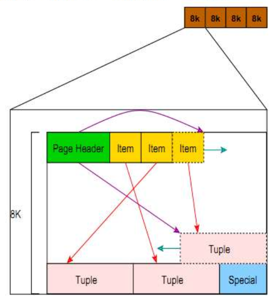

[TOC]

# PG PAGEINSPECT 探索数据页信息


​	上一章节中主要讲述了pageinspect的主要函数，现在就学以致用，看看postgres数据页到底是怎样一个分部


​	先来贴一张图片



​	


	## page header

​	

​	从上图中可以看出page header在数据页的头部，那么它的结构又是什么？

​	测试往新表插入一条数据

```
tutorial=# create table test1(id int);
CREATE TABLE
tutorial=# insert into test1 values(1);
INSERT 0 1
```

​	查看pageheader信息

```
tutorial=# select * from page_header(get_raw_page('test1',0));
    lsn     | checksum | flags | lower | upper | special | pagesize | version | prune_xid 
------------+----------+-------+-------+-------+---------+----------+---------+-----------
 0/416997B8 |        0 |     0 |    28 |  8160 |    8192 |     8192 |       4 |         0
(1 row)
```

​	那么列lsn,checksum,flags,lower,upper,special,pagesize,version,prune_xid字段的含义是什么意思

​	将参考信息贴出来


```
/*
 * disk page organization
 *
 * space management information generic to any page
 *
 *		pd_lsn		- identifies xlog record for last change to this page.
 *		pd_checksum - page checksum, if set.
 *		pd_flags	- flag bits.
 *		pd_lower	- offset to start of free space.
 *		pd_upper	- offset to end of free space.
 *		pd_special	- offset to start of special space.
 *		pd_pagesize_version - size in bytes and page layout version number.
 *		pd_prune_xid - oldest XID among potentially prunable tuples on page.
 *
 * The LSN is used by the buffer manager to enforce the basic rule of WAL:
 * "thou shalt write xlog before data".  A dirty buffer cannot be dumped
 * to disk until xlog has been flushed at least as far as the page's LSN.
 *
 * pd_checksum stores the page checksum, if it has been set for this page;
 * zero is a valid value for a checksum. If a checksum is not in use then
 * we leave the field unset. This will typically mean the field is zero
 * though non-zero values may also be present if databases have been
 * pg_upgraded from releases prior to 9.3, when the same byte offset was
 * used to store the current timelineid when the page was last updated.
 * Note that there is no indication on a page as to whether the checksum
 * is valid or not, a deliberate design choice which avoids the problem
 * of relying on the page contents to decide whether to verify it. Hence
 * there are no flag bits relating to checksums.
 *
 * pd_prune_xid is a hint field that helps determine whether pruning will be
 * useful.  It is currently unused in index pages.
 *
 * The page version number and page size are packed together into a single
 * uint16 field.  This is for historical reasons: before PostgreSQL 7.3,
 * there was no concept of a page version number, and doing it this way
 * lets us pretend that pre-7.3 databases have page version number zero.
 * We constrain page sizes to be multiples of 256, leaving the low eight
 * bits available for a version number.
 *
 * Minimum possible page size is perhaps 64B to fit page header, opaque space
 * and a minimal tuple; of course, in reality you want it much bigger, so
 * the constraint on pagesize mod 256 is not an important restriction.
 * On the high end, we can only support pages up to 32KB because lp_off/lp_len
 * are 15 bits.
 */


typedef struct PageHeaderData
{
	/* XXX LSN is member of *any* block, not only page-organized ones */
	PageXLogRecPtr pd_lsn;		/* LSN: next byte after last byte of xlog
								 * record for last change to this page */
	uint16		pd_checksum;	/* checksum */
	uint16		pd_flags;		/* flag bits, see below */
	LocationIndex pd_lower;		/* offset to start of free space */
	LocationIndex pd_upper;		/* offset to end of free space */
	LocationIndex pd_special;	/* offset to start of special space */
	uint16		pd_pagesize_version;
	TransactionId pd_prune_xid; /* oldest prunable XID, or zero if none */
	ItemIdData	pd_linp[1];		/* beginning of line pointer array */
} PageHeaderData;

```


| 字段                | 类型          | 长度  | 描述                                                    |
| ------------------- | ------------- | ----- | ------------------------------------------------------- |
| pd_lsn              | XLogRecPtr    | 8字节 | LSN: 该页上最后的变化对应的xlog记录的最后字节的下一字节 |
| pd_checksum         | uint16        | 2字节 | 页面校验和                                              |
| pd_flags            | uint16        | 2字节 | 标志位                                                  |
| pd_lower            | LocationIndex | 2字节 | 到空闲空间开始处的偏移量                                |
| pd_upper            | LocationIndex | 2字节 | 到空闲空间结尾处的偏移量                                |
| pd_special          | LocationIndex | 2字节 | 到专用空间开始处的偏移量                                |
| pd_pagesize_version | uint16        | 2字节 | 页大小和布局版本号信息                                  |
| pd_prune_xid        | TransactionId | 4字节 | 页上最旧的未修整的XMAX，如果没有则为零。                |


### pg_lsn

​	The LSN is used by the buffer manager to enforce the basic rule of WAL:"thou shalt write xlog before data".  A dirty buffer cannot be dumped to disk until xlog has been flushed at least as far as the page's LSN.

```
缓存管理器通过lsn来wal基础规则生效：在写入数据之前需要写入到xlog文件中。脏数据不能被转储到磁盘中除非xlog已经将页面的lsn刷新进去
```

函数:pg_xlogfile_name定位lsn所在的xlog日志

```
tutorial=#  select pg_xlogfile_name('0/416997B8');
     pg_xlogfile_name     
--------------------------
 000000010000000000000041
(1 row)
```

检查当前的xlog日志

```
[osdba@mysql45 pg_xlog]$ ls -lt
total 131076
-rw------- 1 osdba osdba 16777216 Aug  8 11:41 000000010000000000000041
-rw------- 1 osdba osdba 16777216 Aug  8 04:50 000000010000000000000048
-rw------- 1 osdba osdba 16777216 Aug  8 04:50 000000010000000000000046
-rw------- 1 osdba osdba 16777216 Aug  8 04:50 000000010000000000000047
-rw------- 1 osdba osdba 16777216 Aug  8 04:50 000000010000000000000043
-rw------- 1 osdba osdba 16777216 Aug  8 04:50 000000010000000000000045
-rw------- 1 osdba osdba 16777216 Aug  8 04:50 000000010000000000000044
-rw------- 1 osdba osdba 16777216 Aug  8 04:50 000000010000000000000042
drwx------ 2 osdba osdba     4096 Jul 30 02:22 archive_status
```


### pd_checksum


pd_checksum stores the page checksum, if it has been set for this page; zero is a valid value for a checksum. If a checksum is not in use then we leave the field unset. This will typically mean the field is zero though non-zero values may also be present if databases have been pg_upgraded from releases prior to 9.3, when the same byte offset was used to store the current timelineid when the page was last updated. Note that there is no indication on a page as to whether the checksum is valid or not, a deliberate design choice which avoids the problem of relying on the page contents to decide whether to verify it. Hence there are no flag bits relating to checksums.

```
pd_checksum存储页面校验和，如果已经为该页设置了校验和;0是校验和的有效值。如果校验和没有被使用，那么我们就不设置字段。这通常意味着字段为0，但如果数据库在9.3之前的版本中升级了pg_upgrade(当页面上一次更新时使用相同的字节偏移量来存储当前的timelineid)，则可能会出现非零值。注意，在页面上没有显示校验和是否有效，这是一个经过深思熟虑的设计选择，它避免了依赖页面内容来决定是否验证校验的问题。因此，没有与校验和相关的标记位。
```


### pd_flags

```
/*
 * pd_flags contains the following flag bits.  Undefined bits are initialized
 * to zero and may be used in the future.
 *
 * PD_HAS_FREE_LINES is set if there are any LP_UNUSED line pointers before
 * pd_lower.  This should be considered a hint rather than the truth, since
 * changes to it are not WAL-logged.
 *
 * PD_PAGE_FULL is set if an UPDATE doesn't find enough free space in the
 * page for its new tuple version; this suggests that a prune is needed.
 * Again, this is just a hint.
 */
#define PD_HAS_FREE_LINES	0x0001		/* are there any unused line pointers? */
#define PD_PAGE_FULL		0x0002		/* not enough free space for new
										 * tuple? */
#define PD_ALL_VISIBLE		0x0004		/* all tuples on page are visible to
										 * everyone */

#define PD_VALID_FLAG_BITS	0x0007		/* OR of all valid pd_flags bits */
```

​	说实话没有看懂到底是什么意思？


### pd_lower pd_upper

​	上面的位移，下面的位移


### pd_special

​	特殊标记，不需要了解


### pd_pagesize_version


## 链接


https://www.postgresql.org/docs/current/static/pageinspect.html?spm=a2c4e.11153940.blogcont2291.5.36292b2bYnZkIy