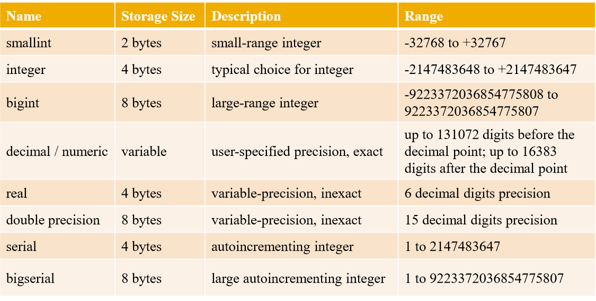
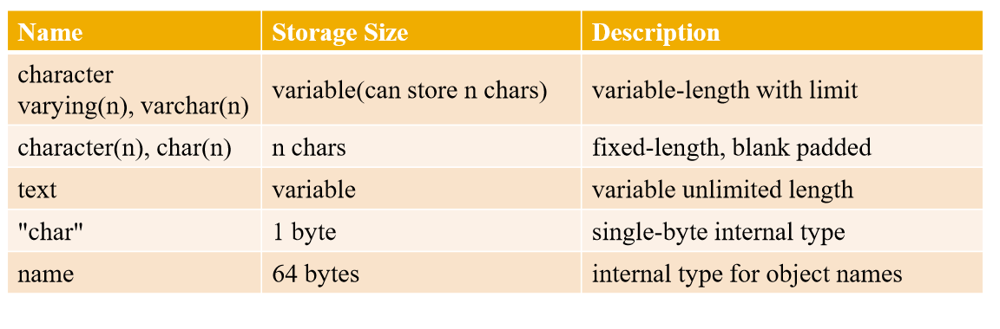
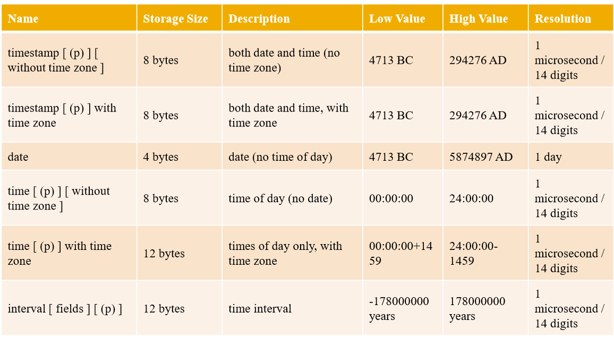
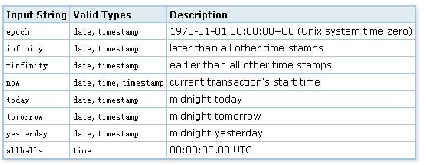
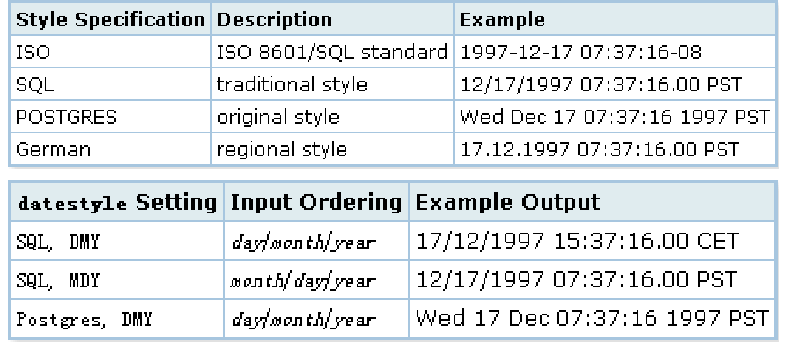
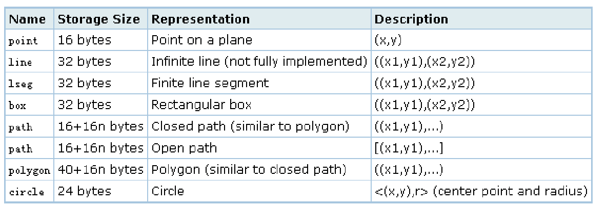
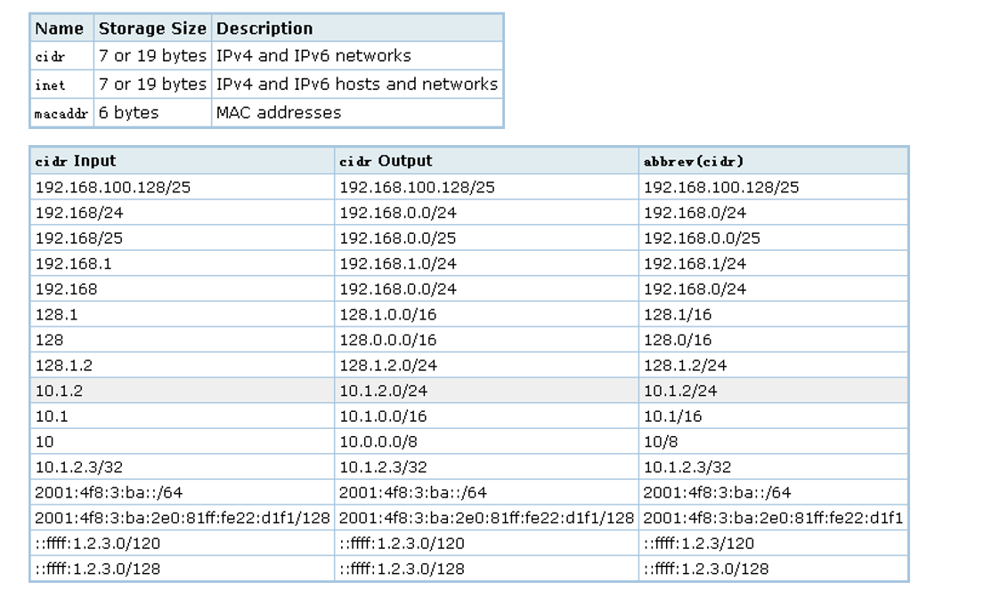

[TOC]

# pg dba 3

​	目标

​	1、熟悉使用psql

​	2、熟悉字段类型

​	3、了解pgadmin


## psql

​	配置好环境变量后，可以执行`psql --help`，查看一些帮助文档，或者执行 `man help`。在测试环境中`man psql`没有显示帮助文档，后续会跟进这个问题


```
[osdba@mysql45 ~]$ psql --help
psql is the PostgreSQL interactive terminal.

Usage:
  psql [OPTION]... [DBNAME [USERNAME]]

General options:
  -c, --command=COMMAND    run only single command (SQL or internal) and exit
  -d, --dbname=DBNAME      database name to connect to (default: "osdba")
  -f, --file=FILENAME      execute commands from file, then exit
  -l, --list               list available databases, then exit
  -v, --set=, --variable=NAME=VALUE
                           set psql variable NAME to VALUE
  -V, --version            output version information, then exit
  -X, --no-psqlrc          do not read startup file (~/.psqlrc)
  -1 ("one"), --single-transaction
                           execute as a single transaction (if non-interactive)
  -?, --help               show this help, then exit

Input and output options:
  -a, --echo-all           echo all input from script
  -e, --echo-queries       echo commands sent to server
  -E, --echo-hidden        display queries that internal commands generate
  -L, --log-file=FILENAME  send session log to file
  -n, --no-readline        disable enhanced command line editing (readline)
  -o, --output=FILENAME    send query results to file (or |pipe)
  -q, --quiet              run quietly (no messages, only query output)
  -s, --single-step        single-step mode (confirm each query)
  -S, --single-line        single-line mode (end of line terminates SQL command)

Output format options:
  -A, --no-align           unaligned table output mode
  -F, --field-separator=STRING
                           field separator for unaligned output (default: "|")
  -H, --html               HTML table output mode
  -P, --pset=VAR[=ARG]     set printing option VAR to ARG (see \pset command)
  -R, --record-separator=STRING
                           record separator for unaligned output (default: newline)
  -t, --tuples-only        print rows only
  -T, --table-attr=TEXT    set HTML table tag attributes (e.g., width, border)
  -x, --expanded           turn on expanded table output
  -z, --field-separator-zero
                           set field separator for unaligned output to zero byte
  -0, --record-separator-zero
                           set record separator for unaligned output to zero byte

Connection options:
  -h, --host=HOSTNAME      database server host or socket directory (default: "local socket")
  -p, --port=PORT          database server port (default: "5432")
  -U, --username=USERNAME  database user name (default: "osdba")
  -w, --no-password        never prompt for password
  -W, --password           force password prompt (should happen automatically)

For more information, type "\?" (for internal commands) or "\help" (for SQL
commands) from within psql, or consult the psql section in the PostgreSQL
documentation.

Report bugs to <pgsql-bugs@postgresql.org>.

```

​		

​	因为man psql没有展现任何信息，无法看到环境变量名称


1. psql -l：列出当前环境下所有数据库

```
[osdba@mysql45 data]$ psql -l
                               List of databases
    Name    | Owner | Encoding |   Collate   |    Ctype    | Access privileges 
------------+-------+----------+-------------+-------------+-------------------
 etl_0511   | osdba | UTF8     | en_US.UTF-8 | en_US.UTF-8 | 
 etl_kettle | osdba | UTF8     | en_US.UTF-8 | en_US.UTF-8 | 
 etl_pg     | osdba | UTF8     | en_US.UTF-8 | en_US.UTF-8 | 
 gh_etl     | osdba | UTF8     | en_US.UTF-8 | en_US.UTF-8 | 
 osdba      | osdba | UTF8     | en_US.UTF-8 | en_US.UTF-8 | 
 postgres   | osdba | UTF8     | en_US.UTF-8 | en_US.UTF-8 | 
 template0  | osdba | UTF8     | en_US.UTF-8 | en_US.UTF-8 | =c/osdba         +
            |       |          |             |             | osdba=CTc/osdba
 template1  | osdba | UTF8     | en_US.UTF-8 | en_US.UTF-8 | =c/osdba         +
            |       |          |             |             | osdba=CTc/osdba
 tutorial   | osdba | UTF8     | en_US.UTF-8 | en_US.UTF-8 | =Tc/osdba        +
            |       |          |             |             | osdba=CTc/osdba  +
            |       |          |             |             | learn1=C/osdba
(9 rows)


```

2、psql -h ip -d database -U username -P port:按照当前参数登陆数据库


## 快捷命令


\?:快捷命令

```
osdba=# \?
General
  \copyright             show PostgreSQL usage and distribution terms
  \g [FILE] or ;         execute query (and send results to file or |pipe)
  \gset [PREFIX]         execute query and store results in psql variables
  \h [NAME]              help on syntax of SQL commands, * for all commands
  \q                     quit psql
  \watch [SEC]           execute query every SEC seconds

Query Buffer
  \e [FILE] [LINE]       edit the query buffer (or file) with external editor
  \ef [FUNCNAME [LINE]]  edit function definition with external editor
  \p                     show the contents of the query buffer
  \r                     reset (clear) the query buffer
  \s [FILE]              display history or save it to file
  \w FILE                write query buffer to file

Input/Output
  \copy ...              perform SQL COPY with data stream to the client host
  \echo [STRING]         write string to standard output
  \i FILE                execute commands from file
  \ir FILE               as \i, but relative to location of current script
  \o [FILE]              send all query results to file or |pipe
  \qecho [STRING]        write string to query output stream (see \o)

Informational
  (options: S = show system objects, + = additional detail)
  \d[S+]                 list tables, views, and sequences
  \d[S+]  NAME           describe table, view, sequence, or index
  \da[S]  [PATTERN]      list aggregates
  \db[+]  [PATTERN]      list tablespaces
  \dc[S+] [PATTERN]      list conversions
  \dC[+]  [PATTERN]      list casts
  \dd[S]  [PATTERN]      show object descriptions not displayed elsewhere
  \ddp    [PATTERN]      list default privileges
  \dD[S+] [PATTERN]      list domains
  \det[+] [PATTERN]      list foreign tables
  \des[+] [PATTERN]      list foreign servers
  \deu[+] [PATTERN]      list user mappings
  \dew[+] [PATTERN]      list foreign-data wrappers
  \df[antw][S+] [PATRN]  list [only agg/normal/trigger/window] functions
  \dF[+]  [PATTERN]      list text search configurations
  \dFd[+] [PATTERN]      list text search dictionaries
  \dFp[+] [PATTERN]      list text search parsers
  \dFt[+] [PATTERN]      list text search templates
  \dg[+]  [PATTERN]      list roles
  \di[S+] [PATTERN]      list indexes
  \dl                    list large objects, same as \lo_list
  \dL[S+] [PATTERN]      list procedural languages
  \dm[S+] [PATTERN]      list materialized views
  \dn[S+] [PATTERN]      list schemas
  \do[S]  [PATTERN]      list operators
  \dO[S+] [PATTERN]      list collations
  \dp     [PATTERN]      list table, view, and sequence access privileges
  \drds [PATRN1 [PATRN2]] list per-database role settings
  \ds[S+] [PATTERN]      list sequences
  \dt[S+] [PATTERN]      list tables
  \dT[S+] [PATTERN]      list data types
  \du[+]  [PATTERN]      list roles
  \dv[S+] [PATTERN]      list views
  \dE[S+] [PATTERN]      list foreign tables
  \dx[+]  [PATTERN]      list extensions
  \dy     [PATTERN]      list event triggers
  \l[+]   [PATTERN]      list databases
  \sf[+] FUNCNAME        show a function's definition
  \z      [PATTERN]      same as \dp

Formatting
  \a                     toggle between unaligned and aligned output mode
  \C [STRING]            set table title, or unset if none
  \f [STRING]            show or set field separator for unaligned query output
  \H                     toggle HTML output mode (currently off)
  \pset [NAME [VALUE]]   set table output option
                         (NAME := {format|border|expanded|fieldsep|fieldsep_zero|footer|null|
                         numericlocale|recordsep|recordsep_zero|tuples_only|title|tableattr|pager})
  \t [on|off]            show only rows (currently off)
  \T [STRING]            set HTML <table> tag attributes, or unset if none
  \x [on|off|auto]       toggle expanded output (currently off)

Connection
  \c[onnect] [DBNAME|- USER|- HOST|- PORT|-]
                         connect to new database (currently "osdba")
  \encoding [ENCODING]   show or set client encoding
  \password [USERNAME]   securely change the password for a user
  \conninfo              display information about current connection

Operating System
  \cd [DIR]              change the current working directory
  \setenv NAME [VALUE]   set or unset environment variable
  \timing [on|off]       toggle timing of commands (currently off)
  \! [COMMAND]           execute command in shell or start interactive shell

Variables
  \prompt [TEXT] NAME    prompt user to set internal variable
  \set [NAME [VALUE]]    set internal variable, or list all if no parameters
  \unset NAME            unset (delete) internal variable

Large Objects
  \lo_export LOBOID FILE
  \lo_import FILE [COMMENT]
  \lo_list
  \lo_unlink LOBOID      large object operations

```


\h command：补提命令或者提醒相关参数

```
osdba=# \h CREATE TABLE
Command:     CREATE TABLE
Description: define a new table
Syntax:
CREATE [ [ GLOBAL | LOCAL ] { TEMPORARY | TEMP } | UNLOGGED ] TABLE [ IF NOT EXISTS ] table_name ( [
  { column_name data_type [ COLLATE collation ] [ column_constraint [ ... ] ]
    | table_constraint
    | LIKE source_table [ like_option ... ] }
    [, ... ]
] )
[ INHERITS ( parent_table [, ... ] ) ]
[ WITH ( storage_parameter [= value] [, ... ] ) | WITH OIDS | WITHOUT OIDS ]
[ ON COMMIT { PRESERVE ROWS | DELETE ROWS | DROP } ]
[ TABLESPACE tablespace_name ]

CREATE [ [ GLOBAL | LOCAL ] { TEMPORARY | TEMP } | UNLOGGED ] TABLE [ IF NOT EXISTS ] table_name
    OF type_name [ (
  { column_name WITH OPTIONS [ column_constraint [ ... ] ]
    | table_constraint }
    [, ... ]
) ]
[ WITH ( storage_parameter [= value] [, ... ] ) | WITH OIDS | WITHOUT OIDS ]
[ ON COMMIT { PRESERVE ROWS | DELETE ROWS | DROP } ]
[ TABLESPACE tablespace_name ]

where column_constraint is:

[ CONSTRAINT constraint_name ]
{ NOT NULL |
  NULL |
  CHECK ( expression ) [ NO INHERIT ] |
  DEFAULT default_expr |
  UNIQUE index_parameters |
  PRIMARY KEY index_parameters |
  REFERENCES reftable [ ( refcolumn ) ] [ MATCH FULL | MATCH PARTIAL | MATCH SIMPLE ]
    [ ON DELETE action ] [ ON UPDATE action ] }
[ DEFERRABLE | NOT DEFERRABLE ] [ INITIALLY DEFERRED | INITIALLY IMMEDIATE ]

and table_constraint is:

[ CONSTRAINT constraint_name ]
{ CHECK ( expression ) [ NO INHERIT ] |
  UNIQUE ( column_name [, ... ] ) index_parameters |
  PRIMARY KEY ( column_name [, ... ] ) index_parameters |
  EXCLUDE [ USING index_method ] ( exclude_element WITH operator [, ... ] ) index_parameters [ WHERE ( pr
edicate ) ] |
  FOREIGN KEY ( column_name [, ... ] ) REFERENCES reftable [ ( refcolumn [, ... ] ) ]
    [ MATCH FULL | MATCH PARTIAL | MATCH SIMPLE ] [ ON DELETE action ] [ ON UPDATE action ] }
[ DEFERRABLE | NOT DEFERRABLE ] [ INITIALLY DEFERRED | INITIALLY IMMEDIATE ]

and like_option is:

{ INCLUDING | EXCLUDING } { DEFAULTS | CONSTRAINTS | INDEXES | STORAGE | COMMENTS | ALL }

index_parameters in UNIQUE, PRIMARY KEY, and EXCLUDE constraints are:

[ WITH ( storage_parameter [= value] [, ... ] ) ]
[ USING INDEX TABLESPACE tablespace_name ]

exclude_element in an EXCLUDE constraint is:

{ column_name | ( expression ) } [ opclass ] [ ASC | DESC ] [ NULLS { FIRST | LAST } ]

```


\dtS+:展示系统表

```
\dtS+
 pg_catalog | pg_seclabels                           | view              | osdba | 0 bytes    | 
 pg_catalog | pg_settings                            | view              | osdba | 0 bytes    | 
 pg_catalog | pg_shadow                              | view              | osdba | 0 bytes    | 
 pg_catalog | pg_shdepend                            | table             | osdba | 40 kB      | 
 pg_catalog | pg_shdescription                       | table             | osdba | 48 kB      | 
 pg_catalog | pg_shseclabel                          | table             | osdba | 0 bytes    | 
 pg_catalog | pg_stat_activity                       | view              | osdba | 0 bytes    | 
 pg_catalog | pg_stat_all_indexes                    | view              | osdba | 0 bytes    | 
 pg_catalog | pg_stat_all_tables                     | view              | osdba | 0 bytes    | 
 pg_catalog | pg_stat_archiver                       | view              | osdba | 0 bytes    | 
 pg_catalog | pg_stat_bgwriter                       | view              | osdba | 0 bytes    | 
 pg_catalog | pg_stat_database                       | view              | osdba | 0 bytes    | 

```


\set VERBOSITY verbose:设置详细的打印输出

```
osdba=# \set VERBOSITY verbose
osdba=# select * from test_1.a;
ERROR:  42P01: relation "test_1.a" does not exist
LINE 1: select * from test_1.a;
                      ^
LOCATION:  parserOpenTable, parse_relation.c:965
osdba=# 

```


## 数据类型

在数据存储时，通过`\d+ tablename`后在字段storage中出现这么几种可能的存储方式：

| exterval | extended |
| -------- | -------- |
| plain    | main     |

plain:表示数据不压缩，不行外存储

main:表示数据压缩，不行外存储

exterval:表示数据不压缩，行外存储

extended:表示数据压缩，行外存储

这些存储方式和pg_toast有关系，后面章节介绍。


### 数值型



一般情况下，创建整数型时，可以直接使用int4,或者int类型，都是integer类型；创建小数型时，建议使用numeric，不要使用numeric(n,m),如果精度超过m，可能无法保证数据的准确值(四舍五入)。

字段类型是serial,bigserial，就是为其创建了一个序列，如果后续需要一个主键，建议使用序列，或者uuid

```
tutorial=# create table test1(id serial,age int4);
CREATE TABLE
tutorial=# \d test1;
                         Table "public.test1"
 Column |  Type   |                     Modifiers                      
--------+---------+----------------------------------------------------
 id     | integer | not null default nextval('test1_id_seq'::regclass)
 age    | integer | 
```


### 字符串



 	在某些数据库中定长的字段查询返回比较快，而在postgresql数据库定长或者变长的字符串并不会有太大却别，建议直接使用变长字符串。

​	character varying(n),character(n),text都是以字符类存储的，而`"char"`和name类型都是以字节存储的。

```
tutorial=# drop table test1;
DROP TABLE
tutorial=# create table test1(info varchar(2));
CREATE TABLE
tutorial=# insert into test1 values('gh'),('国会');
INSERT 0 2
tutorial=# select length(info),info from test1 ;
 length | info 
--------+------
      2 | gh
      2 | 国会
(2 rows)

tutorial=# select length(info),pg_column_size(info),info from test1 ;
 length | pg_column_size | info 
--------+----------------+------
      2 |              3 | gh
      2 |              7 | 国会
(2 rows)

tutorial=# 

```

​	text的空间大小最大是1G


### 时间类型




```
tutorial=# select '20180101 09:34:22'::timestamp,'20180128'::date,'09:02:04'::time ;
      timestamp      |    date    |   time   
---------------------+------------+----------
 2018-01-01 09:34:22 | 2018-01-28 | 09:02:04
tutorial=# select to_char(now(),'yyyymmddhh24:mi:ss');
     to_char      
------------------
 2018072409:35:18
(1 row)

```

#### 特殊时间值



```
select timestamp 'epoch',date 'infinity',time 'now',date 'today',time 'allballs'; 
      timestamp      |   date   |      time       |    date    |   time   
---------------------+----------+-----------------+------------+----------
 1970-01-01 00:00:00 | infinity | 09:28:34.938764 | 2018-07-24 | 00:00:00

```

#### 时间输入输出格式



```
tutorial=# show datestyle;
 DateStyle 
-----------
 ISO, MDY
(1 row)

tutorial=# select now();
              now              
-------------------------------
 2018-07-24 09:38:06.344252+08
(1 row)
tutorial=# set datestyle = 'SQL,DMY';
SET
tutorial=# select now();
              now               
--------------------------------
 24/07/2018 09:38:57.693791 CST
(1 row)
tutorial=# set datestyle = 'ISO,YMD';
SET
tutorial=# select now();
              now              
-------------------------------
 2018-07-24 09:42:58.390804+08
(1 row)

```

建议改成`datestyle='ISO,YMD'时间展现格式`,`vim postgresql.conf中的datestyle = 'iso, ymd'`就可以了

```


tutorial=# show datestyle;
 DateStyle 
-----------
 ISO, YMD
(1 row)

```

#### 间隔表示


year(s):一年为1 year,两年为 2 years

mon(s):一月为1 mon,两个月为 2 mons

week(s):一周为 1 week,两周为 2 weeks

day(s):一天为 1 day,两天为 2 days


```
tutorial=# show intervalStyle;
 IntervalStyle 
---------------
 postgres
(1 row)
tutorial=# select now() + interval '1 year 2 mons';
           ?column?            
-------------------------------
 2019-09-24 09:51:15.499966+08
(1 row)

tutorial=# select now() - interval '1 year 2 mons';
           ?column?            
-------------------------------
 2017-05-24 09:51:23.005948+08
(1 row)

tutorial=# select now() + interval ' 3 days';
           ?column?            
-------------------------------
 2018-07-27 09:51:46.356803+08
(1 row)

tutorial=# select now() + interval ' 2 weeks';
           ?column?            
-------------------------------
 2018-08-07 09:52:03.789803+08
(1 row)

tutorial=# select now() - interval ' 5 weeks';
           ?column?            
-------------------------------
 2018-06-19 09:52:24.086816+08
(1 row)

tutorial=# select now();
             now             
-----------------------------
 2018-07-24 10:11:04.6798+08
(1 row)

tutorial=# select now() + interval '04:05:06';
           ?column?            
-------------------------------
 2018-07-24 14:16:13.345092+08
(1 row)

```


### BOOLEAN

​	true,false

### ENUM

​	create type type_name as ENUM();

```
tutorial=# create type ty_feel_gh as ENUM('sad','ok','happy');
CREATE TYPE
tutorial=# create table person(name text,current_feel ty_feel_gh);
CREATE TABLE
tutorial=# insert into person values('gh','happy');
INSERT 0 1
tutorial=# insert into person values('gh','sad');
INSERT 0 1
tutorial=# select * from person;
 name | current_feel 
------+--------------
 gh   | happy
 gh   | sad
(2 rows)

```

​	如果插入或者查询的字段没有enum中的值就会报错

```
tutorial=# insert into person values('gh','sad1');
ERROR:  invalid input value for enum ty_feel_gh: "sad1"
LINE 1: insert into person values('gh','sad1');

tutorial=# select * from person where current_feel = 'sad1';
ERROR:  invalid input value for enum ty_feel_gh: "sad1"
LINE 1: select * from person where current_feel = 'sad1';

```

​	可以在查询时，将enum值转换为text类型

```
tutorial=# select * from person where current_feel::text = 'sad1';
 name | current_feel 
------+--------------
(0 rows)

```

​	枚举的类型每一行占有4bytes

```
tutorial=# select pg_column_size(current_feel),* from person;
 pg_column_size | name | current_feel 
----------------+------+--------------
              4 | gh   | happy
              4 | gh   | sad
(2 rows)

```

​	查看枚举ty_feel_gh的结构

```
tutorial=# select oid,typname from pg_type where typname = 'ty_feel_gh';
  oid  |  typname   
-------+------------
 81610 | ty_feel_gh
(1 row)

tutorial=# select * from pg_enum where enumtypid = 81610;
 enumtypid | enumsortorder | enumlabel 
-----------+---------------+-----------
     81610 |             1 | sad
     81610 |             2 | ok
     81610 |             3 | happy
(3 rows)

```

​	在枚举ty_feel_gh添加新的参数值

​	 ALTER TYPE name ADD VALUE new_enum_value [ { BEFORE | AFTER } existing_enum_value ] 

​	 This form adds a new value to an enum type. If the new value's place in the enum's ordering is not specified using BEFORE or AFTER, then the new item is placed at the end of the list of values.

```
tutorial=# alter type ty_feel_gh add value 'cool';
ALTER TYPE
tutorial=# select * from pg_enum where enumtypid = 81610;
 enumtypid | enumsortorder | enumlabel 
-----------+---------------+-----------
     81610 |             1 | sad
     81610 |             2 | ok
     81610 |             3 | happy
     81610 |             4 | cool
(4 rows)

```

​	 注意事项, 添加枚举元素时尽量不要改动原来的元素的位置, 即尽量新增值插到最后.

​	否则可能会带来性能问题. 

​	ALTER TYPE ... ADD VALUE (the form that adds a new value to an enum type) cannot be executed inside a transaction block. 

​	 Comparisons involving an added enum value will sometimes be slower than comparisons involving only original members of the enum type. This will usually only occur if BEFORE or AFTER is used to set the new value's sort position somewhere other than at the end of the list. However, sometimes it will happen even though the new value is added at the end (this occurs if the OID counter "wrapped around" since the original creation of the enum type). The slowdown is usually insignificant; but if it matters, optimal performance can be regained by dropping and recreating the enum type, or by dumping and reloading the database.


### money

​	money类型只是为其在数字后添加一个符号

```
tutorial=# show lc_monetary;
 lc_monetary 
-------------
 en_US.UTF-8
(1 row)

tutorial=# select '12.233'::money;
 money  
--------
 $12.23
(1 row)

tutorial=# set lc_monetary='zh_CN';
SET
tutorial=# select '12.233'::money;
  money  
---------
 ￥12.23
(1 row)

```


### bytea


​	oracle blob对应该字段 bytea


### 几何类型




### 网络地址类型



```
tutorial=# create table test_1(id int4,start_ip inet,end_ip inet);
CREATE TABLE
tutorial=# insert into test_1 values(1,'192.168.1.0','192.168.1.255');
INSERT 0 1
tutorial=# insert into test_1 values(2,'192.168.2.0','192.168.3.6');
INSERT 0 1
tutorial=# insert into test_1 values(4,'192.168.3.254','192.168.4.6');
INSERT 0 1
tutorial=# select id,generate_series(0,end_ip-start_ip)+start_ip from test_1 where id = 4;
 id |   ?column?    
----+---------------
  4 | 192.168.3.254
  4 | 192.168.3.255
  4 | 192.168.4.0
  4 | 192.168.4.1
  4 | 192.168.4.2
  4 | 192.168.4.3
  4 | 192.168.4.4
  4 | 192.168.4.5
  4 | 192.168.4.6
(9 rows)
```


### BIT

​	

​	略过


### 全文检索

