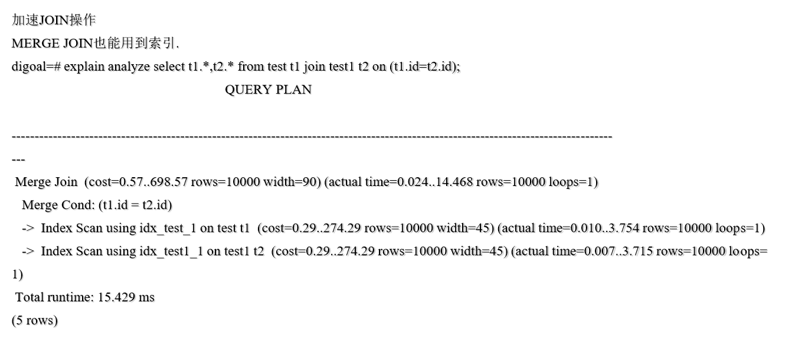
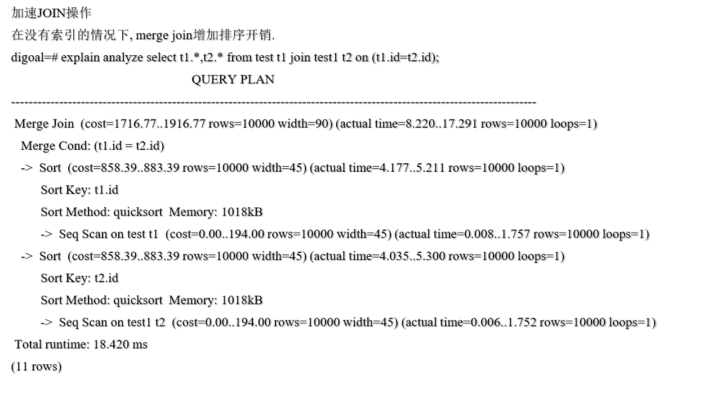
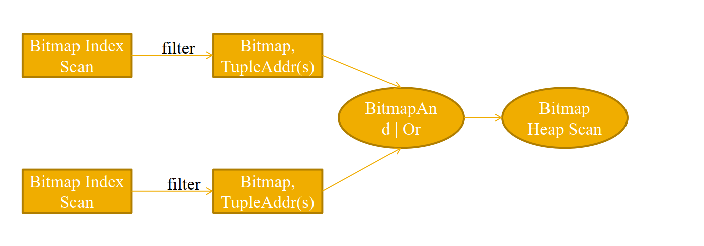
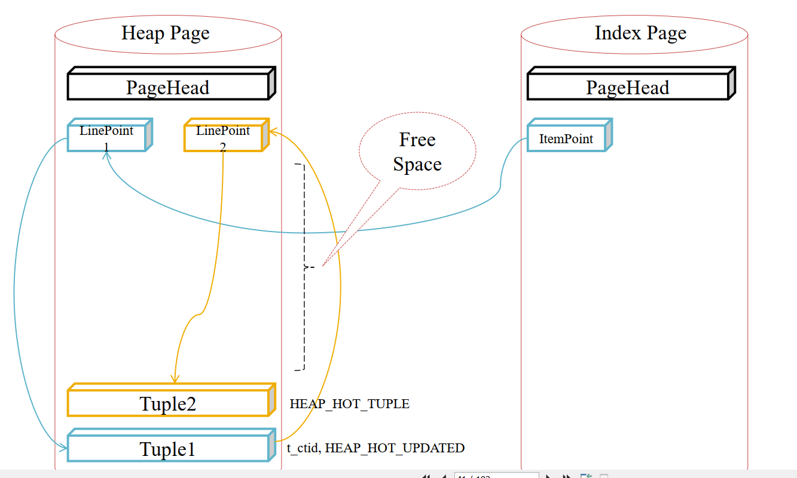
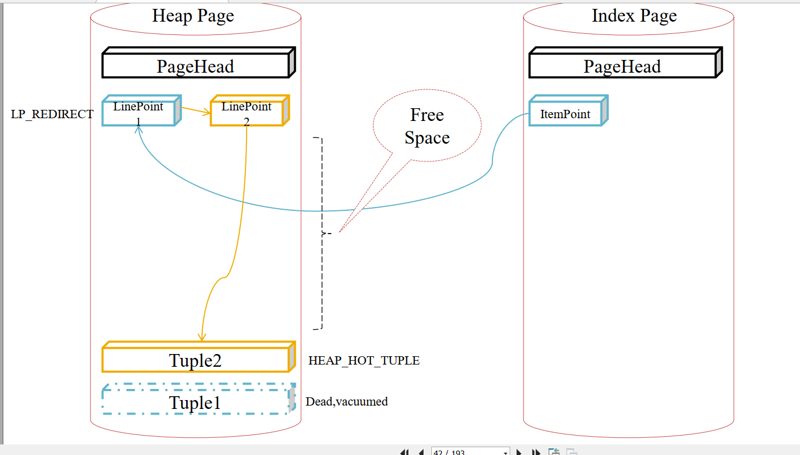
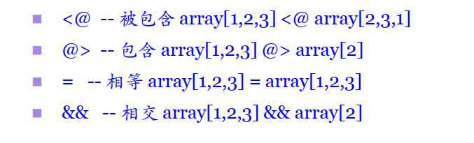
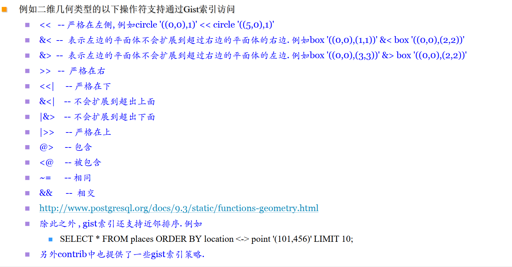
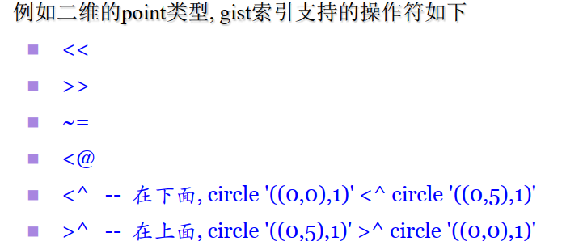

[TOC]

# postgresql dba 4

​	

​	本章节主要讲述的是索引的作用，索引的种类，模糊匹配，近似度匹配


​	

## 索引

### 使用索引的好处


1. 利用索引进行排序减少cpu开销

2. 加速带条件的查询，删除，更新

3. 加速JOIN操作

4. 加速外键约束更新和删除操作

5. 加速唯一值约束，排他约束


####  利用索引进行排序减少cpu开销

```
tutorial=# create table test1(id int,info text,crt_time timestamp(0));
CREATE TABLE
tutorial=# insert into test1 select generate_series(1,10000),md5(random()::text),now();
INSERT 0 10000

```

利用索引进行排序减小cpu开销

1、查询条件是索引列

```
tutorial=# create index idx_test1_id on test1(id);
CREATE INDEX
tutorial=# explain analyze select * from test1 where id < 100 order by id;
                                                       QUERY PLAN             
                                           
------------------------------------------------------------------------------
-------------------------------------------
 Index Scan using idx_test1_id on test1  (cost=0.29..10.04 rows=100 width=45) 
(actual time=0.005..0.018 rows=99 loops=1)
   Index Cond: (id < 100)
 Planning time: 0.315 ms
 Execution time: 0.040 ms
(4 rows)
```

查询条件没有索引列排序

```
tutorial=# drop index idx_test1_id;
DROP INDEX
tutorial=# explain analyze select * from test1 where id < 100 order by id;
                                                QUERY PLAN                                                 
-----------------------------------------------------------------------------------------------------------
 Sort  (cost=222.32..222.57 rows=100 width=45) (actual time=0.717..0.722 rows=99 loops=1)
   Sort Key: id
   Sort Method: quicksort  Memory: 32kB
   ->  Seq Scan on test1  (cost=0.00..219.00 rows=100 width=45) (actual time=0.008..0.704 rows=99 loops=1)
         Filter: (id < 100)
         Rows Removed by Filter: 9901
 Planning time: 0.043 ms
 Execution time: 0.741 ms
(8 rows)
```

2、查询条件不是索引列

​	如果查询条件没有索引，默认会扫描全表

```
tutorial=# explain analyze select * from test1 where info = 'ad18651ba470f129723cdd1260a243ed' order by id;
                                               QUERY PLAN                                               
--------------------------------------------------------------------------------------------------------
 Sort  (cost=219.01..219.01 rows=1 width=45) (actual time=1.601..1.601 rows=1 loops=1)
   Sort Key: id
   Sort Method: quicksort  Memory: 25kB
   ->  Seq Scan on test1  (cost=0.00..219.00 rows=1 width=45) (actual time=0.009..1.594 rows=1 loops=1)
         Filter: (info = 'ad18651ba470f129723cdd1260a243ed'::text)
         Rows Removed by Filter: 9999
 Planning time: 0.062 ms
 Execution time: 1.621 ms
(8 rows)
```

​	将全表扫描关闭,利用索引来查询

```
tutorial=# set enable_seqscan = off;
SET

tutorial=# explain analyze select * from test1 where info = 'ad18651ba470f129723cdd1260a243ed' order by id;
                                                      QUERY PLAN                                                       
-----------------------------------------------------------------------------------------------------------------------
 Index Scan using idx_test1_id on test1  (cost=0.29..392.29 rows=1 width=45) (actual time=0.024..2.068 rows=1 loops=1)
   Filter: (info = 'ad18651ba470f129723cdd1260a243ed'::text)
   Rows Removed by Filter: 9999
 Planning time: 0.091 ms
 Execution time: 2.088 ms
(5 rows)

```

这个只是例子, 不一定适合实际应用场景. 


#### 加速带条件的查询，删除，更新

```
tutorial=# explain analyze select * from test1 where id = 1;
                                                     QUERY PLAN                                                      
---------------------------------------------------------------------------------------------------------------------
 Index Scan using idx_test1_id on test1  (cost=0.29..8.30 rows=1 width=45) (actual time=0.011..0.012 rows=1 loops=1)
   Index Cond: (id = 1)
 Planning time: 0.067 ms
 Execution time: 0.028 ms
(4 rows)

```

将索引扫描关闭

```
tutorial=# set enable_indexscan = off;
SET
tutorial=# set enable_bitmapscan = off;
SET
tutorial=# explain analyze select * from test1 where id = 1;
                                            QUERY PLAN                                            
--------------------------------------------------------------------------------------------------
 Seq Scan on test1  (cost=0.00..219.00 rows=1 width=45) (actual time=0.011..0.799 rows=1 loops=1)
   Filter: (id = 1)
   Rows Removed by Filter: 9999
 Planning time: 0.091 ms
 Execution time: 0.827 ms
(5 rows)

```


#### 加速JOIN操作


```
tutorial=# create table test2(id int,info text,crt_time timestamp(0));
CREATE TABLE
tutorial=# insert into test2 select generate_series(1,10000),md5(random()::text),now();
INSERT 0 10000

```

test2 没有索引

```
tutorial=#  explain analyze select t1.*,t2.* from test1 t1 join test2 t2 on (t1.id=t2.id and t2.id=1); 
                                                          QUERY PLAN                                                          
------------------------------------------------------------------------------------------------------------------------------
 Nested Loop  (cost=0.29..227.31 rows=1 width=90) (actual time=0.019..0.984 rows=1 loops=1)
   ->  Index Scan using idx_test1_id on test1 t1  (cost=0.29..8.30 rows=1 width=45) (actual time=0.007..0.010 rows=1 loops=1)
         Index Cond: (id = 1)
   ->  Seq Scan on test2 t2  (cost=0.00..219.00 rows=1 width=45) (actual time=0.008..0.968 rows=1 loops=1)
         Filter: (id = 1)
         Rows Removed by Filter: 9999
 Planning time: 0.428 ms
 Execution time: 1.042 ms
(8 rows)

```

为test2创建索引

```
tutorial=# create index idx_test2_id on test2(id);
CREATE INDEX
tutorial=#  explain analyze select t1.*,t2.* from test1 t1 join test2 t2 on (t1.id=t2.id and t2.id=1); 
                                                          QUERY PLAN                                                          
------------------------------------------------------------------------------------------------------------------------------
 Nested Loop  (cost=0.57..16.62 rows=1 width=90) (actual time=0.030..0.032 rows=1 loops=1)
   ->  Index Scan using idx_test1_id on test1 t1  (cost=0.29..8.30 rows=1 width=45) (actual time=0.007..0.007 rows=1 loops=1)
         Index Cond: (id = 1)
   ->  Index Scan using idx_test2_id on test2 t2  (cost=0.29..8.30 rows=1 width=45) (actual time=0.021..0.022 rows=1 loops=1)
         Index Cond: (id = 1)
 Planning time: 0.285 ms
 Execution time: 0.058 ms
(7 rows)

```

merge join 也能用到索引

```
tutorial=#  explain analyze select t1.*,t2.* from test1 t1 join test2 t2 on (t1.id=t2.id ); 
                                                               QUERY PLAN                                                               
----------------------------------------------------------------------------------------------------------------------------------------
 Merge Join  (cost=0.57..884.57 rows=10000 width=90) (actual time=0.011..13.670 rows=10000 loops=1)
   Merge Cond: (t1.id = t2.id)
   ->  Index Scan using idx_test1_id on test1 t1  (cost=0.29..367.29 rows=10000 width=45) (actual time=0.004..3.351 rows=10000 loops=1)
   ->  Index Scan using idx_test2_id on test2 t2  (cost=0.29..367.29 rows=10000 width=45) (actual time=0.003..3.804 rows=10000 loops=1)
 Planning time: 0.127 ms
 Execution time: 14.492 ms
(6 rows)


```




没有索引

```
tutorial=#  explain analyze select t1.*,t2.* from test1 t1 join test2 t2 on (t1.id=t2.id ); 
                                                       QUERY PLAN             
                                           
------------------------------------------------------------------------------
-------------------------------------------
 Merge Join  (cost=1716.77..1916.77 rows=10000 width=90) (actual time=7.761..1
3.800 rows=10000 loops=1)
   Merge Cond: (t1.id = t2.id)
   ->  Sort  (cost=858.39..883.39 rows=10000 width=45) (actual time=2.751..3.3
70 rows=10000 loops=1)
         Sort Key: t1.id
         Sort Method: quicksort  Memory: 1166kB
         ->  Seq Scan on test1 t1  (cost=0.00..194.00 rows=10000 width=45) (ac
tual time=0.006..1.382 rows=10000 loops=1)
   ->  Sort  (cost=858.39..883.39 rows=10000 width=45) (actual time=5.000..5.5
78 rows=10000 loops=1)
         Sort Key: t2.id
         Sort Method: quicksort  Memory: 1166kB
         ->  Seq Scan on test2 t2  (cost=0.00..194.00 rows=10000 width=45) (ac
tual time=0.003..1.320 rows=10000 loops=1)
 Planning time: 0.085 ms
 Execution time: 14.439 ms
(12 rows)


```



hash join ,merge join ,Nested Loop三者真正的区别是什么?


#### 加速外键约束更新和删除操作

```
tutorial=#  create table p(id int primary key, info text, crt_time timestamp); 
CREATE TABLE
tutorial=#  create table f(id int primary key, p_id int references p(id) on delete cascade on update cascade, info text, crt_time timestamp); 
CREATE TABLE
tutorial=#  insert into p select generate_series(1,10000), md5(random()::text), clock_timestamp(); 
INSERT 0 10000
tutorial=#  insert into f select generate_series(1,10000), generate_series(1,10000), md5(random()::text), clock_timestamp(); 
INSERT 0 10000

```

```
tutorial=#  explain (analyze,verbose,costs,buffers,timing) update p set id=0 where id=1; 
                                                       QUERY PLAN             
                                          
------------------------------------------------------------------------------
------------------------------------------
 Update on public.p  (cost=0.29..8.30 rows=1 width=46) (actual time=0.035..0.0
35 rows=0 loops=1)
   Buffers: shared hit=8
   ->  Index Scan using p_pkey on public.p  (cost=0.29..8.30 rows=1 width=46) 
(actual time=0.011..0.012 rows=1 loops=1)
         Output: 0, info, crt_time, ctid
         Index Cond: (p.id = 1)
         Buffers: shared hit=3
 Planning time: 0.063 ms
 Trigger RI_ConstraintTrigger_a_24670 for constraint f_p_id_fkey on p: time=1.
715 calls=1
 Trigger RI_ConstraintTrigger_c_24672 for constraint f_p_id_fkey on f: time=0.
052 calls=1
 Execution time: 1.829 ms
(10 rows)

```


```
tutorial=#  create index idx_f_1 on f(p_id); 
CREATE INDEX
tutorial=#  explain (analyze,verbose,costs,buffers,timing) update p set id=1 where id=0;
                                                       QUERY PLAN                                                       
------------------------------------------------------------------------------------------------------------------------
 Update on public.p  (cost=0.29..8.30 rows=1 width=47) (actual time=0.026..0.026 rows=0 loops=1)
   Buffers: shared hit=8
   ->  Index Scan using p_pkey on public.p  (cost=0.29..8.30 rows=1 width=47) (actual time=0.005..0.005 rows=1 loops=1)
         Output: 1, info, crt_time, ctid
         Index Cond: (p.id = 0)
         Buffers: shared hit=3
 Planning time: 0.162 ms
 Trigger RI_ConstraintTrigger_a_24670 for constraint f_p_id_fkey on p: time=0.430 calls=1
 Trigger RI_ConstraintTrigger_c_24672 for constraint f_p_id_fkey on f: time=0.111 calls=1
 Execution time: 0.589 ms
(10 rows)

tutorial=# 

```

#### 索引在排他约束中作用

​	对排他操作符的要求，左右操作数互换对结果没有影响，例如X=Y,Y=X

```
tutorial=#  CREATE TABLE test(id int,geo point,EXCLUDE USING btree (id WITH pg_catalog.=)); 
CREATE TABLE
tutorial=#  insert into test (id) values (1); 
INSERT 0 1
tutorial=#  insert into test (id) values (1);
ERROR:  conflicting key value violates exclusion constraint "test_id_excl"
DETAIL:  Key (id)=(1) conflicts with existing key (id)=(1).
tutorial=# 

```

​	加速唯一值约束

​	primary key

​	unique key

​	

### 是否使用索引和什么有关


​	首先是前面提到的Access Method,然后是使用的operetor class,以及opc中定义的operator或者function

​	这些满足后，还要遵循CBO的选择

```
 #seq_page_cost = 1.0  
 #random_page_cost = 4.0 
 #cpu_tuple_cost = 0.01 
 #cpu_index_tuple_cost = 0.005  
 #cpu_operator_cost = 0.0025             
 #effective_cache_size = 128MB
```

​	遵循完CBO的选择，还需要符合当前配置的Planner配置

```
 #enable_bitmapscan = on 
 #enable_hashagg = on 
 #enable_hashjoin = on 
 #enable_indexscan = on 
 #enable_material = on 
 #enable_mergejoin = on 
 #enable_nestloop = on 
 #enable_seqscan = on 
 #enable_sort = on  
 #enable_tidscan = on
```

### 多列索引使用

​	多列索引，使用任何列作为条件，只要条件中的操作符或者函数满足opclass的匹配都可以使用索引，索引被扫描的部分还是全部基本取决于条件是否有索引的第一列作为条件之一

```
tutorial=# create table test1(c1 int,c2 int);
CREATE TABLE
tutorial=# insert into test1 select 1 ,generate_series(1,100000);
INSERT 0 100000
tutorial=# create index idx_test1_1 on test1(c1,c2);
CREATE INDEX
tutorial=# analyze test1;
ANALYZE

```


```
tutorial=# explain analyze select * from test1 where c2 = 100;
                                            QUERY PLAN                        
                     
------------------------------------------------------------------------------
---------------------
 Seq Scan on test1  (cost=0.00..1693.00 rows=1 width=8) (actual time=0.027..10
.477 rows=1 loops=1)
   Filter: (c2 = 100)
   Rows Removed by Filter: 99999
 Planning time: 0.313 ms
 Execution time: 10.673 ms
(5 rows)

```

将全局扫描置为off

```
tutorial=# set enable_seqscan = off;
SET
tutorial=# explain analyze select * from test1 where c2 = 100;
                                                        QUERY PLAN            
                                             
------------------------------------------------------------------------------
---------------------------------------------
 Index Only Scan using idx_test1_1 on test1  (cost=0.29..1858.30 rows=1 width=
8) (actual time=0.014..1.403 rows=1 loops=1)
   Index Cond: (c2 = 100)
   Heap Fetches: 1
 Planning time: 0.063 ms
 Execution time: 1.422 ms
(5 rows)


```

**创建多列索引时，选择第一个字段尤为重要**

### 索引合并查询

Combining Multiple Indexes

src/backend/executor

例如




```
tutorial=# create table test1(id int primary key,info text unique);
CREATE TABLE
tutorial=# insert into test1 select generate_series(1,100000),'guohui'||generate_series(1,100000);
INSERT 0 100000
tutorial=# explain analyze select * from test1 where id = 1 or id = 100;
                                                       QUERY PLAN             
                                           
------------------------------------------------------------------------------
-------------------------------------------
 Bitmap Heap Scan on test1  (cost=8.52..12.53 rows=1 width=36) (actual time=0.
010..0.010 rows=2 loops=1)
   Recheck Cond: ((id = 1) OR (id = 100))
   Heap Blocks: exact=1
   ->  BitmapOr  (cost=8.52..8.52 rows=1 width=0) (actual time=0.007..0.007 ro
ws=0 loops=1)
         ->  Bitmap Index Scan on test1_pkey  (cost=0.00..4.26 rows=1 width=0)
 (actual time=0.006..0.006 rows=1 loops=1)
               Index Cond: (id = 1)
         ->  Bitmap Index Scan on test1_pkey  (cost=0.00..4.26 rows=1 width=0)
 (actual time=0.001..0.001 rows=1 loops=1)
               Index Cond: (id = 100)
 Planning time: 0.121 ms
 Execution time: 0.029 ms
(10 rows)


```

### 索引和collate的匹配


​	collate是什么？

### 部分值索引

​	

​	例子：

​	--部分约束

​	--去除common的值id=1,这个值有10W条，走索引根本不合适，partical索引很好的避免了此类情况


```
tutorial=# create table test1(id int ,info text);
CREATE TABLE
tutorial=# insert into test1 select 1,'guohui'||generate_series(1,100000);
INSERT 0 100000
tutorial=# insert into test1 select generate_series(1,1000),'guohui'||generate_series(1,1000);
INSERT 0 1000
tutorial=# create index idx_test1_1 on test1(id) where id <> 1;
CREATE INDEX
tutorial=# explain select * from test1 where id  = 1;
                         QUERY PLAN                          
-------------------------------------------------------------
 Seq Scan on test1  (cost=0.00..1808.50 rows=99990 width=15)
   Filter: (id = 1)
(2 rows)

tutorial=# explain analyze select * from test1 where id <> 1;
                                                        QUERY PLAN            
                                            
------------------------------------------------------------------------------
--------------------------------------------
 Index Scan using idx_test1_1 on test1  (cost=0.28..46.90 rows=1010 width=15) 
(actual time=0.026..0.199 rows=999 loops=1)
 Planning time: 0.091 ms
 Execution time: 0.265 ms
(3 rows)

tutorial=# explain select * from test1 where id = 100;
                                QUERY PLAN                                
--------------------------------------------------------------------------
 Index Scan using idx_test1_1 on test1  (cost=0.28..8.33 rows=3 width=15)
   Index Cond: (id = 100)
(2 rows)

tutorial=# explain analyze select * from test1 where id = 100;
                                                     QUERY PLAN               
                                      
------------------------------------------------------------------------------
--------------------------------------
 Index Scan using idx_test1_1 on test1  (cost=0.28..8.33 rows=3 width=15) (act
ual time=0.010..0.011 rows=1 loops=1)
   Index Cond: (id = 100)
 Planning time: 0.098 ms
 Execution time: 0.024 ms
(4 rows)

```

### 函数索引和表达式索引

```
tutorial=# explain select * from test1 where id + 1 = 100;
                        QUERY PLAN                         
-----------------------------------------------------------
 Seq Scan on test1  (cost=0.00..2061.00 rows=505 width=15)
   Filter: ((id + 1) = 100)
(2 rows)
tutorial=# create index idx_test1_3 on test1((id+1));
CREATE INDEX
tutorial=# explain select * from test1 where id + 1 = 100;
                                 QUERY PLAN                                  
-----------------------------------------------------------------------------
 Bitmap Heap Scan on test1  (cost=12.21..577.48 rows=505 width=15)
   Recheck Cond: ((id + 1) = 100)
   ->  Bitmap Index Scan on idx_test1_3  (cost=0.00..12.08 rows=505 width=0)
         Index Cond: ((id + 1) = 100)
(4 rows)

tutorial=# 


```


### HOT Update


​	截取两张图来理解一下







[pageinspect](../20180721/pg_pageinspect.md)


```
tutorial=# truncate table test1;
TRUNCATE TABLE
tutorial=# insert into test1 values(1,'guohui',now());
INSERT 0 1
tutorial=# select * from page_header(get_raw_page('test1',0));
    lsn     | checksum | flags | lower | upper | special | pagesize | version | prune_xid 
------------+----------+-------+-------+-------+---------+----------+---------+-----------
 0/2BC7D000 |        0 |     0 |    28 |  8144 |    8192 |     8192 |       4 |         0
(1 row)
tutorial=# select * from heap_page_items(get_raw_page('test1',0));
 lp | lp_off | lp_flags | lp_len | t_xmin | t_xmax | t_field3 | t_ctid | t_infomask2 | t_infomask
 | t_hoff | t_bits | t_oid 
----+--------+----------+--------+--------+--------+----------+--------+-------------+-----------
-+--------+--------+-------
  1 |   8144 |        1 |     48 |   2118 |      0 |        0 | (0,1)  |           3 |       2050
 |     24 |        |      
(1 row)
tutorial=# select * from page_header(get_raw_page('idx_test1_id',0));
    lsn     | checksum | flags | lower | upper | special | pagesize | version | prune_xid 
------------+----------+-------+-------+-------+---------+----------+---------+-----------
 0/2BC7D038 |        0 |     0 |    48 |  8176 |    8176 |     8192 |       4 |         0
(1 row)
tutorial=# select * from heap_page_items(get_raw_page('idx_test1_id',0));
 lp | lp_off | lp_flags | lp_len | t_xmin | t_xmax | t_field3 | t_ctid | t_infomask2 | t_infomask
 | t_hoff | t_bits | t_oid 
----+--------+----------+--------+--------+--------+----------+--------+-------------+-----------
-+--------+--------+-------
  1 |  12642 |        2 |      2 |        |        |          |        |             |           
 |        |        |      
  2 |      2 |        0 |      0 |        |        |          |        |             |           
 |        |        |      
  3 |      1 |        0 |      0 |        |        |          |        |             |           
 |        |        |      
  4 |      0 |        0 |      0 |        |        |          |        |             |           
 |        |        |      
  5 |      1 |        0 |      0 |        |        |          |        |             |           
 |        |        |      
  6 |      0 |        0 |      0 |        |        |          |        |             |           
 |        |        |      
(6 rows)


```

更新一次后

```
tutorial=# update test1 set info ='info';
UPDATE 1
tutorial=# select * from heap_page_items(get_raw_page('test1',0));
 lp | lp_off | lp_flags | lp_len | t_xmin | t_xmax | t_field3 | t_ctid | t_infomask2 | t_infomask
 | t_hoff | t_bits | t_oid 
----+--------+----------+--------+--------+--------+----------+--------+-------------+-----------
-+--------+--------+-------
  1 |   8144 |        1 |     48 |   2118 |   2119 |        0 | (0,2)  |       16387 |        258
 |     24 |        |      
  2 |   8096 |        1 |     48 |   2119 |      0 |        0 | (0,2)  |       32771 |      10242
 |     24 |        |      
(2 rows)

tutorial=# select * from heap_page_items(get_raw_page('idx_test1_id',0));
 lp | lp_off | lp_flags | lp_len | t_xmin | t_xmax | t_field3 | t_ctid | t_infomask2 | t_infomask
 | t_hoff | t_bits | t_oid 
----+--------+----------+--------+--------+--------+----------+--------+-------------+-----------
-+--------+--------+-------
  1 |  12642 |        2 |      2 |        |        |          |        |             |           
 |        |        |      
  2 |      2 |        0 |      0 |        |        |          |        |             |           
 |        |        |      
  3 |      1 |        0 |      0 |        |        |          |        |             |           
 |        |        |      
  4 |      0 |        0 |      0 |        |        |          |        |             |           
 |        |        |      
  5 |      1 |        0 |      0 |        |        |          |        |             |           
 |        |        |      
  6 |      0 |        0 |      0 |        |        |          |        |             |           
 |        |        |      
(6 rows)


```

vacuum后

```
tutorial=# vacuum test1;
VACUUM
tutorial=# select * from heap_page_items(get_raw_page('test1',0));
 lp | lp_off | lp_flags | lp_len | t_xmin | t_xmax | t_field3 | t_ctid | t_infomask2 | t_infomask
 | t_hoff | t_bits | t_oid 
----+--------+----------+--------+--------+--------+----------+--------+-------------+-----------
-+--------+--------+-------
  1 |      2 |        2 |      0 |        |        |          |        |             |           
 |        |        |      
  2 |   8144 |        1 |     48 |   2119 |      0 |        0 | (0,2)  |       32771 |      10498
 |     24 |        |      
(2 rows)

```


多次进行update后

```
tutorial=# update test1 set info ='info' where id = 1;
UPDATE 1
tutorial=# update test1 set info ='info' where id = 1;
UPDATE 1
tutorial=# update test1 set info ='info' where id = 1;
UPDATE 1
tutorial=# update test1 set info ='info' where id = 1;
UPDATE 1
tutorial=# update test1 set info ='info' where id = 1;
UPDATE 1
tutorial=# update test1 set info ='info' where id = 1;
UPDATE 1
tutorial=# update test1 set info ='info' where id = 1;
UPDATE 1
tutorial=# update test1 set info ='info' where id = 1;
UPDATE 1
tutorial=# update test1 set info ='info' where id = 1;
UPDATE 1
tutorial=# update test1 set info ='info' where id = 1;
UPDATE 1
tutorial=# select * from heap_page_items(get_raw_page('test1',0));
 lp | lp_off | lp_flags | lp_len | t_xmin | t_xmax | t_field3 | t_ctid | t_infomask2 | t_infomask
 | t_hoff | t_bits | t_oid 
----+--------+----------+--------+--------+--------+----------+--------+-------------+-----------
-+--------+--------+-------
  1 |      2 |        2 |      0 |        |        |          |        |             |           
 |        |        |      
  2 |   8144 |        1 |     48 |   2119 |   2120 |        0 | (0,3)  |       49155 |       9474
 |     24 |        |      
  3 |   8096 |        1 |     48 |   2120 |   2121 |        0 | (0,4)  |       49155 |       9474
 |     24 |        |      
  4 |   8048 |        1 |     48 |   2121 |   2122 |        0 | (0,5)  |       49155 |       9474
 |     24 |        |      
  5 |   8000 |        1 |     48 |   2122 |   2123 |        0 | (0,6)  |       49155 |       9474
 |     24 |        |      
  6 |   7952 |        1 |     48 |   2123 |   2124 |        0 | (0,7)  |       49155 |       9474
 |     24 |        |      
  7 |   7904 |        1 |     48 |   2124 |   2125 |        0 | (0,8)  |       49155 |       9474
 |     24 |        |      
  8 |   7856 |        1 |     48 |   2125 |   2126 |        0 | (0,9)  |       49155 |       9474
 |     24 |        |      
  9 |   7808 |        1 |     48 |   2126 |   2127 |        0 | (0,10) |       49155 |       9474
 |     24 |        |      
 10 |   7760 |        1 |     48 |   2127 |   2128 |        0 | (0,11) |       49155 |       9474
 |     24 |        |      
 11 |   7712 |        1 |     48 |   2128 |   2129 |        0 | (0,12) |       49155 |       8450
 |     24 |        |      
 12 |   7664 |        1 |     48 |   2129 |      0 |        0 | (0,12) |       32771 |      10242
 |     24 |        |      
(12 rows)

tutorial=# 

```

再次vacuum后

```
tutorial=# vacuum test1;
VACUUM
tutorial=# select * from heap_page_items(get_raw_page('test1',0));
 lp | lp_off | lp_flags | lp_len | t_xmin | t_xmax | t_field3 | t_ctid | t_infomask2 | t_infomask
 | t_hoff | t_bits | t_oid 
----+--------+----------+--------+--------+--------+----------+--------+-------------+-----------
-+--------+--------+-------
  1 |     12 |        2 |      0 |        |        |          |        |             |           
 |        |        |      
  2 |      0 |        0 |      0 |        |        |          |        |             |           
 |        |        |      
  3 |      0 |        0 |      0 |        |        |          |        |             |           
 |        |        |      
  4 |      0 |        0 |      0 |        |        |          |        |             |           
 |        |        |      
  5 |      0 |        0 |      0 |        |        |          |        |             |           
 |        |        |      
  6 |      0 |        0 |      0 |        |        |          |        |             |           
 |        |        |      
  7 |      0 |        0 |      0 |        |        |          |        |             |           
 |        |        |      
  8 |      0 |        0 |      0 |        |        |          |        |             |           
 |        |        |      
  9 |      0 |        0 |      0 |        |        |          |        |             |           
 |        |        |      
 10 |      0 |        0 |      0 |        |        |          |        |             |           
 |        |        |      
 11 |      0 |        0 |      0 |        |        |          |        |             |           
 |        |        |      
 12 |   8144 |        1 |     48 |   2129 |      0 |        0 | (0,12) |       32771 |      10498
 |     24 |        |      
(12 rows)

tutorial=# 

```


### 索引带来的弊端


​	索引随着表的记录块的变迁需要更新，因此会对这类操作带来一定的性能影响（块不变更的情况下触发HOT特性，可以不需要更新索引)

​	

###  使用索引的注意事项


​	正常创建索引时，会阻断除了查询以外的其他操作

​	使用并行concurrently选项后，可以允许同时对表的DML操作，但是对于频繁的DML的表，这种创建索引的时间比较长

​	某些索引不记录WAL，所以如果有用WAL进行数据恢复的情况（流复制），这种索引需要在使用前重建(hash索引)


### 索引类型

​	索引算法不同，B-tree,HASH,Gist,SP-GiST 

```
select amname from pg_am
```


### 索引应用场景

​	postgresql不同的索引类别支持的索引访问操作符也有不同，下面是不同的索引类型对应的系统默认的索引策略

#### Btree

支持前导模糊查询(like 'xxx%' 或者~'^xxx'),忽略大小写字符前导模糊查询(ILIKE 'xxx%' 或 ~* '^xxx')

<

\>

=

\>=

<=

###  HASH

=

### GIN

支持多值列的索引，例如数组类型，全文检索累类型



### Gist 

并不是单类的索引，可以认为它是一种索引框架，支持许多不同的索引策略



### Sp-Gist

与gist类似，也是一种索引框架，支持基于磁盘存储的非平衡数据结构，如四叉树，k-d树，raidx树




### 全文检索

​	

​	详情请参考:[pg全文搜索](../20180807/postgresql全文搜索.md)

