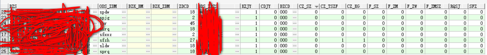

[TOC]

# pg 判断 字符 各种类型


​	同事给我打电话说了一下解决问题



​	根据这些字段的值来判断如下一下条件

​	1、空值校验

​	2、长度校验(标准长度)

​	3、存在_数字

​	4、存在_特殊字符

​	5、存在_空格

​	6、非_数字

​	7、非_字母

​	8、非_中文

​	9、非_字母数字

​	10、RQSJ 判断是否符合date类型

​	11、身份证校验


​	这里面最难反而是身份证校验

​	

​	空值校验

```
length(trim(column))<>0
```

​	长度校验()

```
length(column)=?
```

​	判断是否存在数字

```
tutorial=# select '过会1223'~'[0-9]';
 ?column? 
----------
 t
(1 row)

tutorial=# select '过会ABC'~'[0-9]';
 ?column? 
----------
 f
(1 row)
```

​	判断是否为特殊字符(不知道什么是特殊字符)

```
特殊字符指的是什么？
```


​	判断非数字

```
tutorial=# select '123过会123' ~ '^[0-9]*$';
 ?column? 
----------
 f
(1 row)

tutorial=# select '12123' ~ '^[0-9]*$';
 ?column? 
----------
 t
(1 row)

tutorial=# select '121,23' ~ '^[0-9]*$';
 ?column? 
----------
 f
(1 row)

```


​	判断非中文

```
tutorial=# select '121过会23' ~ '^[\u4e00-\u9fa5]{0,}$';
 ?column? 
----------
 f
(1 row)

tutorial=# select '过会' ~ '^[\u4e00-\u9fa5]{0,}$';
 ?column? 
----------
 t
(1 row)

tutorial=# select '过会123' ~ '^[\u4e00-\u9fa5]{0,}$';
 ?column? 
----------
 f
(1 row)
```


​	判断是否空格

```
tutorial=# select '过会 1223'~ E'\\s+';
 ?column? 
----------
 t
(1 row)

tutorial=# select '过会1223'~ E'\\s+';
 ?column? 
----------
 f
(1 row)
```

​	


​	判断是否存在字母

```
tutorial=# select '过会1223adA'~'[A-Za-z]';
 ?column? 
----------
 t
(1 row)

tutorial=# select '过会1223'~'[A-Za-z]';
 ?column? 
----------
 f
(1 row)
```


