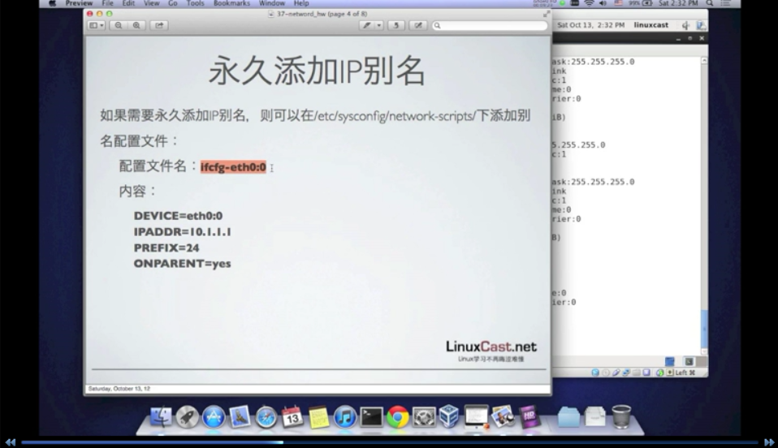

[TOC]

# linux 网卡绑定 子接口 


​	此文档整理自《linuxcast培训》


## 网卡高级命令

​	命令mii-tool用以查看网卡状态

​	mii-tool eth0

```
# mii-tool eth0
eth0: no autonegotiation, 100baseTx-FD, link ok
```

​	命令ethtool命令可以查看网卡

​	ethtool eth0 :网卡物理信息

​	ethtool -i eth0：网卡驱动信息

​	ethtool -S eth0:网卡状态

```
# ethtool eth0
Settings for eth0:
	Supported ports: [ TP ]
	Supported link modes:   10baseT/Half 10baseT/Full 
	                        100baseT/Half 100baseT/Full 
	                        1000baseT/Full 
	Supported pause frame use: No
	Supports auto-negotiation: Yes
	Advertised link modes:  10baseT/Half 10baseT/Full 
	                        100baseT/Half 100baseT/Full 
	                        1000baseT/Full 
	Advertised pause frame use: No
	Advertised auto-negotiation: Yes
	Speed: 1000Mb/s
	Duplex: Full
	Port: Twisted Pair
	PHYAD: 0
	Transceiver: internal
	Auto-negotiation: on
	MDI-X: Unknown
	Supports Wake-on: umbg
	Wake-on: d
	Current message level: 0x00000007 (7)
			       drv probe link
	Link detected: yes
```

```
# ethtool -i eth0
driver: e1000
version: 7.3.21-k8-NAPI
firmware-version: 
bus-info: 0000:00:03.0
supports-statistics: yes
supports-test: yes
supports-eeprom-access: yes
supports-register-dump: yes
supports-priv-flags: no
```

```
# ethtool -S eth0
NIC statistics:
     rx_packets: 141
     tx_packets: 93
     rx_bytes: 13297
     tx_bytes: 11523
     rx_broadcast: 10
     tx_broadcast: 4
     rx_multicast: 0
     tx_multicast: 7
     rx_errors: 0
     tx_errors: 0
     tx_dropped: 0
     multicast: 0
     collisions: 0
     rx_length_errors: 0
     rx_over_errors: 0
     rx_crc_errors: 0
     rx_frame_errors: 0
     rx_no_buffer_count: 0
     rx_missed_errors: 0
     tx_aborted_errors: 0
     tx_carrier_errors: 0
     tx_fifo_errors: 0
     tx_heartbeat_errors: 0
     tx_window_errors: 0
     tx_abort_late_coll: 0
     tx_deferred_ok: 0
     tx_single_coll_ok: 0
     tx_multi_coll_ok: 0
     tx_timeout_count: 0
     tx_restart_queue: 0
     rx_long_length_errors: 0
     rx_short_length_errors: 0
     rx_align_errors: 0
     tx_tcp_seg_good: 0
     tx_tcp_seg_failed: 0
     rx_flow_control_xon: 0
     rx_flow_control_xoff: 0
     tx_flow_control_xon: 0
     tx_flow_control_xoff: 0
     rx_long_byte_count: 13297
     rx_csum_offload_good: 0
     rx_csum_offload_errors: 0
     alloc_rx_buff_failed: 0
     tx_smbus: 0
     rx_smbus: 0
     dropped_smbus: 0
```


## ip别名

​	linux支持在一个物理网卡上配置多个ip地址，用来实现类似子接口之类的功能，称之为IP别名

​	centos或RHEL系统默认会启动NetworkManager对网卡管理，以方便用户使用，但是如果使用子接口需要禁用NetworkManager服务

```
# service NetworkManager stop
# chkconfig NetworkManager off
```

​	之后在使用ip命令时临时创建一个ip别名

```
# ip addr add 192.168.1.200/23 dev eth0 label eth0:0
```

​	eth0:0中第二个0是别名编号，第二个可以命名为eth0:1


**测试脚本**

```
[root@centos65 ~]# ifconfig
eth0      Link encap:Ethernet  HWaddr 08:00:27:1F:2B:99  
          inet addr:192.168.1.9  Bcast:192.168.1.255  Mask:255.255.255.0
          inet6 addr: fe80::a00:27ff:fe1f:2b99/64 Scope:Link
          UP BROADCAST RUNNING MULTICAST  MTU:1500  Metric:1
          RX packets:60 errors:0 dropped:0 overruns:0 frame:0
          TX packets:34 errors:0 dropped:0 overruns:0 carrier:0
          collisions:0 txqueuelen:1000 
          RX bytes:7547 (7.3 KiB)  TX bytes:5181 (5.0 KiB)

lo        Link encap:Local Loopback  
          inet addr:127.0.0.1  Mask:255.0.0.0
          inet6 addr: ::1/128 Scope:Host
          UP LOOPBACK RUNNING  MTU:16436  Metric:1
          RX packets:100 errors:0 dropped:0 overruns:0 frame:0
          TX packets:100 errors:0 dropped:0 overruns:0 carrier:0
          collisions:0 txqueuelen:0 
          RX bytes:7408 (7.2 KiB)  TX bytes:7408 (7.2 KiB)

[root@centos65 ~]# service NetworkManager stop
Stopping NetworkManager daemon:                            [  OK  ]
[root@centos65 ~]# chkconfig NetworkManager off
[root@centos65 ~]# chkconfig --list NetworkManager
NetworkManager 	0:off	1:off	2:off	3:off	4:off	5:off	6:off
[root@centos65 ~]# ip addr add 192.168.1.200/24 dev eth0 label eth0:0
[root@centos65 network-scripts]# ifconfig 
eth0      Link encap:Ethernet  HWaddr 08:00:27:1F:2B:99  
          inet addr:192.168.1.9  Bcast:192.168.1.255  Mask:255.255.255.0
          inet6 addr: fe80::a00:27ff:fe1f:2b99/64 Scope:Link
          UP BROADCAST RUNNING MULTICAST  MTU:1500  Metric:1
          RX packets:602 errors:0 dropped:0 overruns:0 frame:0
          TX packets:329 errors:0 dropped:0 overruns:0 carrier:0
          collisions:0 txqueuelen:1000 
          RX bytes:52775 (51.5 KiB)  TX bytes:37587 (36.7 KiB)

eth0:0    Link encap:Ethernet  HWaddr 08:00:27:1F:2B:99  
          inet addr:192.168.1.200  Bcast:0.0.0.0  Mask:255.255.255.0
          UP BROADCAST RUNNING MULTICAST  MTU:1500  Metric:1

lo        Link encap:Local Loopback  
          inet addr:127.0.0.1  Mask:255.0.0.0
          inet6 addr: ::1/128 Scope:Host
          UP LOOPBACK RUNNING  MTU:16436  Metric:1
          RX packets:116 errors:0 dropped:0 overruns:0 frame:0
          TX packets:116 errors:0 dropped:0 overruns:0 carrier:0
          collisions:0 txqueuelen:0 
          RX bytes:8624 (8.4 KiB)  TX bytes:8624 (8.4 KiB)
```

**永久添加ip别名**



```
# vim /etc/sysconfig/network-scripts/ifcfg-eth0:0
DEVICE=eth0:0
IPADDR=192.168.1.200
PREFIX=24
ONPARENT=yes
```

```
# service network restart
```

**删除ip别名**

```
# rm -rf ifcfg-eth0:0
```


## 多网卡绑定


2018-09-01_101354.png	