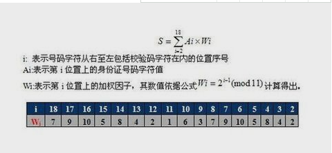
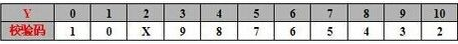

[TOC]

# pg 校验18位身份证号是否为真


## 前言

​	今天在看别人文档时，看到一篇生成18位身份证的pg函数，突然想到后期可能会在pg验证sfz号


## 规则

前1、2位数字表示：所在省（直辖市、自治区）的代码 

第3、4位数字表示：所在地级市（自治州）的代码 

第5、6位数字表示：所在区（县、自治县、县级市）的代码 

第[7-14]位数字表示：出生年、月、日 

第15、16位数字表示：所在地的派出所的代码

第17位数字表示性别：奇数表示男性，偶数表示女性

第18位数字是校检码：也有的说是个人信息码，不是随计算机的随机产生，它是 用来检验身份证的正确性。校检码可以是0—9的数字，有时也用x表示。作为尾号的校验码，是由号码编制单位按统一的公式计算出来的，如果某人的尾号是0－9，都不会出现X，但如果尾号是10，那么就得用X来代替，因为如果用10做尾号，那么此人的身份证就变成了19位。X是罗马数字的10，用X来代替10，可以保证公民的身份证符合国家标准。




​	



## 函数


```
-- Function: f_sfzh18_jyzsx(character varying)

-- DROP FUNCTION f_sfzh18_jyzsx(character varying);

CREATE OR REPLACE FUNCTION f_sfzh18_jyzsx(i_sfzh character varying)
  RETURNS text AS
$BODY$ declare
v_sfzh varchar(100);
v_s varchar(100);
v_array1 int[];
v_array2 varchar[];
v_sum int;
v_i int;
begin

v_sfzh :=i_sfzh;
v_array1:=array[7,9,10,5,8,4,2,1,6,3,7,9,10,5,8,4,2];
v_array2:=array['1','0','X','9','8','7','6','5','4','3','2'];
v_i:=1;
v_sum:=0;
	loop
		v_s:=substr(v_sfzh,v_i,1);
 
		if (v_s)~ '^[0-9]' then 
			v_sum:=v_sum + cast(v_s as integer)*v_array1[v_i];
		else
			return -1;
		end if;
 
		v_i:=v_i + 1;
		if v_i>17 then
			exit;
		end if;
	end loop;
 
	v_sum:=mod(v_sum,11) ;
	v_s:=v_array2[v_sum];
	if v_s=substr(v_sfzh,18,1) then
		return 0;
	else
		return -2;
	end if;
end; $BODY$
  LANGUAGE plpgsql VOLATILE
  COST 100;
ALTER FUNCTION f_sfzh18_jyzsx(character varying)
  OWNER TO ysys;

```


## 链接地址

https://github.com/digoal/blog/blob/master/201710/20171016_02.md

https://jingyan.baidu.com/article/72ee561abd962fe16038df48.html

https://blog.csdn.net/zeeeitch/article/details/7256741

