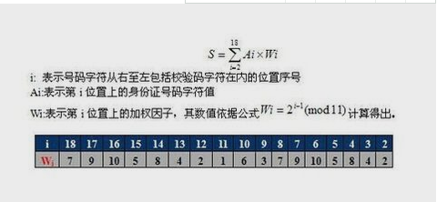
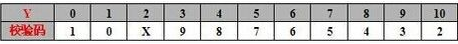

[TOC]

# pg 校验18位身份证号是否为真

## 前言

​	今天在看别人文档时，看到一篇生成18位身份证的pg函数，突然想到后期可能会在pg验证sfz号

## 规则

前1、2位数字表示：所在省（直辖市、自治区）的代码 

第3、4位数字表示：所在地级市（自治州）的代码 

第5、6位数字表示：所在区（县、自治县、县级市）的代码 

第[7-14]位数字表示：出生年、月、日 

第15、16位数字表示：所在地的派出所的代码

第17位数字表示性别：奇数表示男性，偶数表示女性

第18位数字是校检码：也有的说是个人信息码，不是随计算机的随机产生，它是 用来检验身份证的正确性。校检码可以是0—9的数字，有时也用x表示。作为尾号的校验码，是由号码编制单位按统一的公式计算出来的，如果某人的尾号是0－9，都不会出现X，但如果尾号是10，那么就得用X来代替，因为如果用10做尾号，那么此人的身份证就变成了19位。X是罗马数字的10，用X来代替10，可以保证公民的身份证符合国家标准。

​	

## 函数

## 链接地址

https://github.com/digoal/blog/blob/master/201710/20171016_02.md

https://jingyan.baidu.com/article/72ee561abd962fe16038df48.html

https://blog.csdn.net/zeeeitch/article/details/7256741