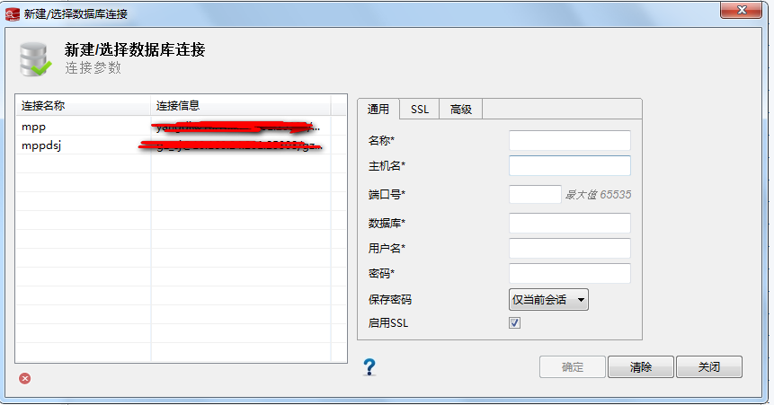

[TOC]

# libra 数据库 常规使用


## 对于libra疑问

1、对于高并发事务的支持力度 多用户

2、对于连接数 试着往上调节

2、对于update的优化，自动vacuum ，或者vacuum full ？

3、gds是否集成了update 否 外部表

4、表空间pg_default，pg_global是否有优化  和其他表空间没有太大区别

5、分布键倾斜的程度影响查询	影响

6、多表关联（分布键，普通字段) 如何聚合 

7、查询select * from table limit 100，是否是查询出来所有数据再limit 100

8、负载均衡(ip)  正在做

9、数据库字符集 ASCII UTF8

10、列存储 (单列column) 

11、session_timeout (现场办事处)


## 访问

### data Studio

​	目前实施团队主要使用data Studio客户端来访问华为Libra数据库，当前将主要的操作流程记录下来。

​	需要用的软件分别是**jdk1.8_32**,**data_studio 32**，在配置中(**发现只是支持32位**)

**jdk1.8-32 data_studio 32** 相关链接：https://pan.baidu.com/s/1l7uv7MVy_V4t6sftpF_dVA 密码：zgk3

​	配置jdk环境后，将**data_studio 32**解压后执行命令**Data Studio.exe**,出现如图界面,点击文件下发的发黄的按钮


​	出现如图



*名称建议填写自己所在项目名称*

*主机名默认华为会提供cn的ip地址*

*端口号默认是25308（具体请询问华为部署人员)*

*数据库,用户名,密码请注意保密*

*只有将启用SSL的√取消掉，才能保存这个确定*


### 其他访问

​	支持jdbc,odbc接口访问


## 确定libra 版本

​	每一个版本的特性都很重要

```
$ sh /opt/huawei/Bigdata/om-server_V100R002C80SPC200/om/sbin/queryVersion.sh
```

```
sh /opt/huawei/Bigdata/om-server_V100R002C80SPC200/om/sbin/queryVersion.sh
                              Package                                      Version                  BuildTime                         Pack                                              
     FusionInsight            FusionInsight Manager                        V100R002C80SPC200        2018-05-17 23:39:46               FusionInsight_BASE_V100R002C80SPC200              
     KrbServer                FusionInsight-kerberos-1.15.2.tar.gz         1.15.2                   2018-05-17 23:28:45               FusionInsight_BASE_V100R002C80SPC200              
     KrbClient                FusionInsight-kerberos-1.15.2.tar.gz         1.15.2                   2018-05-17 23:28:45               FusionInsight_BASE_V100R002C80SPC200              
     LdapClient               FusionInsight-ldapclient-2.7.0.tar.gz        2.7.0                    2018-05-17 23:22:25               FusionInsight_BASE_V100R002C80SPC200              
     LdapServer               FusionInsight-ldapserver-2.7.0.tar.gz        2.7.0                    2018-05-17 23:26:03               FusionInsight_BASE_V100R002C80SPC200              
     meta                     FusionInsight-meta-2.7.0.tar.gz              2.7.0                    2018-05-17 23:40:35               FusionInsight_BASE_V100R002C80SPC200              
     MPPDB                    FusionInsight-MPPDB-2.8.0.tar.gz             2.8.0                    2018-07-29 10:31:27               FusionInsight_MPPDB_V100R002C80SPC300 
```

​	最主要的要看FusionInsight 的这一行的版本FusionInsight_BASE_V100R002C80SPC200 


## 数据库操作

## 进入libra数据库 环境

使用管理员用户登陆到libra环境中

```
# su - omm
```

```
$  source ${BIGDATA_HOME}/mppdb/.mppdbgs_profile
```

```
$ gsql -d postgres -p 25308 -r
```

```
$ \q
```


### 创建用户

​	接触的很多数据库，可以都是从创建数据库开始，而libra数据库这里先要讲一下如何创建用户，默认情况下，不要使用安装用户作为数据库的创建者，所以在这里首先介绍如何创建用户.

​	一般情况下，role和user在pg数据库已经通用了，而在libra数据库，对于user做了一些优化措施(**小的知识点，如果使用create user username login password 'xxxxxxx' ;如果shcema没有相对应的username，libra数据库会默认自动创建一个以username的模式名schema**).

**创建role/user语法**

```
postgres=# \h create role
Command:     CREATE ROLE
Description: define a new database role
Syntax:
CREATE ROLE role_name [ [ WITH ] option [ ... ] ] [ ENCRYPTED | UNENCRYPTED ] { PASSWORD | IDENTIFIED BY } 'password';

where option can be:
{SYSADMIN | NOSYSADMIN}
    | {AUDITADMIN | NOAUDITADMIN}
    | {CREATEDB | NOCREATEDB}
    | {USEFT | NOUSEFT}
    | {CREATEROLE | NOCREATEROLE}
    | {INHERIT | NOINHERIT}
    | {LOGIN | NOLOGIN}
    | {REPLICATION | NOREPLICATION}
    | CONNECTION LIMIT connlimit
    | VALID BEGIN 'timestamp'
    | VALID UNTIL 'timestamp'
    | RESOURCE POOL 'respool'
    | USER GROUP 'groupuser'
    | PERM SPACE 'spacelimit'
    | IN ROLE role_name [, ...]
    | IN GROUP role_name [, ...]
    | ROLE role_name [, ...]
    | ADMIN role_name [, ...]
    | USER role_name [, ...]
    | SYSID uid
    | DEFAULT TABLESPACE tablespace_name
    | PROFILE DEFAULT
    | PROFILE profile_name
    | PGUSER

postgres=# \h create user
Command:     CREATE USER
Description: define a new database role
Syntax:
CREATE USER user_name [ [ WITH ] option [ ... ] ] [ ENCRYPTED | UNENCRYPTED ] { PASSWORD | IDENTIFIED BY } 'password';

where option can be:
{CREATEDB | NOCREATEDB}
    | {CREATEROLE | NOCREATEROLE}
    | {INHERIT | NOINHERIT}
    | {AUDITADMIN | NOAUDITADMIN}
    | {SYSADMIN | NOSYSADMIN}
    | {USEFT | NOUSEFT}
    | {LOGIN | NOLOGIN}
    | {REPLICATION | NOREPLICATION}
    | CONNECTION LIMIT connlimit
    | VALID BEGIN 'timestamp'
    | VALID UNTIL 'timestamp'
    | RESOURCE POOL 'respool'
    | USER GROUP 'groupuser'
    | PERM SPACE 'spacelimit'
    | IN ROLE role_name [, ...]
    | IN GROUP role_name [, ...]
    | ROLE role_name [, ...]
    | ADMIN role_name [, ...]
    | USER role_name [, ...]
    | SYSID uid
    | DEFAULT TABLESPACE name
    | PROFILE DEFAULT
    | PROFILE name
    | PGUSER

```

**创建role,user示例**

*创建普通可以登录的用户*

```
# create user/role username login password 'password'
```

*创建用于创建数据库的用户*

```
# create user/role username login password 'password' creatdb
```

​	其他请参考上面语法

**查看user/role**

```
# \du
```

```
# select * from pg_shadow;
```

**删除 user/role,请慎重操作** 

```
# drop user/role username
```


### 创建数据库

​	*注意创建数据库必须有创建数据库权限的用户才行，查看是否可以创建数据库，可以使用\du命令*

​	默认情况下omm用户具有创建database,或者可以以omm用户登录的前提下，创建一个其他用户，使其具有创建数据库的权限

```
postgres=# \h create database   
Command:     CREATE DATABASE
Description: create a new database
Syntax:
CREATE DATABASE database_name
    [ [ WITH ] {[ OWNER [=] user_name ]|
           [ TEMPLATE [=] template ]|
           [ ENCODING [=] encoding ]|
           [ LC_COLLATE [=] lc_collate ]|
           [ LC_CTYPE [=] lc_ctype ]|
           [ DBCOMPATIBILITY [=] compatibility_type ]|
           [ TABLESPACE [=] tablespace_name ]|
           [ CONNECTION LIMIT [=] connlimit ]}[...] ];


```

 **创建database示例**

​	默认数据库带有的字符集'ASCII',可以兼容utf-8，字段长度可能需要扩充3倍（varchar2(3),varchar2(9))

```
# create database tutorial 
```

```
# - drop database tutorial	\
```

​	数据库默认字符集可能需要手动设置

```
# create database tutorial  ENCODING 'UTF8' TEMPLATE  template0;
```

​	template0和template1有区别

**删除database请慎重操作**

```
# drop database dname
```


### 创建模式

​	创建完数据库，表，视图，函数等不能直接在数据库中创建，需要模式(schema)的支持，在pg(libra)中，谁创建了什么，那么这个什么就归属谁

```
postgres=# \h create schema
Command:     CREATE SCHEMA
Description: define a new schema
Syntax:
CREATE SCHEMA schema_name
    [ AUTHORIZATION user_name ] [ schema_element [ ... ] ];
CREATE SCHEMA AUTHORIZATION user_name [ schema_element [ ... ] ];

```

**创建chema示例**

```
# create schema schema_name 
```

​	**用户不会跨库访问，但是可以跨schema来访问，不过首先需要授予使用schema的权限**

```
# grant usage on schema schema to username 
```

```
# GRANT { { CREATE | USAGE } [, ...] | ALL [ PRIVILEGES ] }
    ON SCHEMA schema_name [, ...]
    TO { [ GROUP ] role_name | PUBLIC } [, ...]
```

**删除schema请慎重考虑**

```
# drop schema schema_name
```

### 创建表

```
postgres=# \h create table
Command:     CREATE TABLE
Description: define a new table
Syntax:
CREATE [ [ GLOBAL | LOCAL ] { TEMPORARY | TEMP } | UNLOGGED ] TABLE [ IF NOT EXISTS ] table_name 
({ column_name data_type [ compress_mode ] [ COLLATE collation ] [ column_constraint [ ... ] ]
    | table_constraint
    | LIKE source_table [ like_option [...] ] }
    [, ... ])
[ WITH ( {storage_parameter = value} [, ... ] ) ]
[ ON COMMIT { PRESERVE ROWS | DELETE ROWS | DROP } ]
[ COMPRESS | NOCOMPRESS ]
[ TABLESPACE tablespace_name ]
[ DISTRIBUTE BY { REPLICATION | { HASH ( column_name [,...] ) } } ]
[ TO { GROUP groupname | NODE ( nodename [, ... ] ) } ];

where column_constraint can be:
[ CONSTRAINT constraint_name ]
{ NOT NULL |
  NULL |
  CHECK ( expression ) |
  DEFAULT default_expr |
  UNIQUE index_parameters |
  PRIMARY KEY index_parameters }
[ DEFERRABLE | NOT DEFERRABLE | INITIALLY DEFERRED | INITIALLY IMMEDIATE ]
where table_constraint can be:
[ CONSTRAINT constraint_name ]
{ CHECK ( expression ) |
  UNIQUE ( column_name [, ... ] ) index_parameters |
  PRIMARY KEY ( column_name [, ... ] ) index_parameters |
  PARTIAL CLUSTER KEY ( column_name [, ... ] ) }
[ DEFERRABLE | NOT DEFERRABLE | INITIALLY DEFERRED | INITIALLY IMMEDIATE ]
where compress_mode can be:
{ DELTA | PREFIX | DICTIONARY | NUMSTR | NOCOMPRESS }
where like_option can be:
{ INCLUDING | EXCLUDING } { DEFAULTS | CONSTRAINTS | INDEXES | STORAGE | COMMENTS | PARTITION | RELOPTIONS | DISTRIBUTION | ALL }
where index_parameters can be:
[ WITH ( {storage_parameter = value} [, ... ] ) ]
[ USING INDEX TABLESPACE tablespace_name ]

```


​	在libra的客户端工具data studio中，可以直接将Oracle的建表语句拷贝到工具中执行，不过要注意如下几点（默认oracle的字段长度varchar变长3倍）。

​	Oracle和libra的建表主要区别是libra拥有分布键，而选择分布键的原则，第一个选择主键，第二个选择业务字段经常访问的字段，而且这些字段不能被更新(个人要求：字段不允许为空值)

​	在创建数据表时，如果入库的第一批次数据量特别大，建议先不要进行做约束，还有创建索引，建议建表时，除了主键索引，唯一约束外，尽量不要创建 'default zzzz',尽量不要创建' not null'

​	在Oracle中，经常会根据业务时间来分区，在libra可以沿用Oracle分区范围。

​	表运行一段时间后，可能统计信息不准确，建议每周定期执行' vacuum tablename ','analyze tablename',vacuum tablename 不会阻塞表的DML操作

​	索引的创建其实尽量选择颗粒度比较分散的，业务字段经常访问的（如SFZH)	

### 创建函数存储过程

```
# create function|procedure 
```

​	其实学习pg函数的写法可以很好地参考libra,现场实施团队大多接触的数据库是oracle,其实libra数据库可以按照Oracle的存储过程写法写，它会将过程或者函数转换成pg自身的函数，这个对于实施人员来说非常好。


### 创建表空间(但是不建议)

```
# create tablespace 
```

```
# - drop tablespace 
```

​	咨询过华为研发人员，对于创建表空间，不是很建议，在新疆测试中发现删除tablespace时，会发现原始目录还会存在

### 授权

```
#\h grant

Command:     GRANT
Description: define access privileges
Syntax:
GRANT { { SELECT | INSERT | UPDATE | DELETE | TRUNCATE | REFERENCES }
    [, ...] | ALL [ PRIVILEGES ] }
    ON { [ TABLE ] table_name [, ...]
         | ALL TABLES IN SCHEMA schema_name [, ...] }
    TO { [ GROUP ] role_name | PUBLIC } [, ...] 
    [ WITH GRANT OPTION ];
GRANT { {{ SELECT | INSERT | UPDATE | REFERENCES } ( column_name [, ...] )}
    [, ...] | ALL [ PRIVILEGES ] ( column_name [, ...] ) }
    ON [ TABLE ] table_name [, ...]
    TO { [ GROUP ] role_name | PUBLIC } [, ...]
    [ WITH GRANT OPTION ];
GRANT { { CREATE | CONNECT | TEMPORARY | TEMP } [, ...] | ALL [ PRIVILEGES ] }
    ON DATABASE database_name [, ...]
    TO { [ GROUP ] role_name | PUBLIC } [, ...]
    [ WITH GRANT OPTION ];
GRANT { USAGE | ALL [ PRIVILEGES ] }
    ON DOMAIN domain_name [, ...]
    TO { [ GROUP ] role_name | PUBLIC } [, ...]
    [ WITH GRANT OPTION ];
GRANT { USAGE | ALL [ PRIVILEGES ] }
    ON FOREIGN DATA WRAPPER fdw_name [, ...]
    TO { [ GROUP ] role_name | PUBLIC } [, ...]
    [ WITH GRANT OPTION ];
GRANT { USAGE | ALL [ PRIVILEGES ] }
    ON FOREIGN SERVER server_name [, ...]
    TO { [ GROUP ] role_name | PUBLIC } [, ...]
    [ WITH GRANT OPTION ];
GRANT { EXECUTE | ALL [ PRIVILEGES ] }
    ON { FUNCTION {function_name ( [ {[ argmode ] [ arg_name ] arg_type} [, ...] ] )} [, ...]
         | ALL FUNCTIONS IN SCHEMA schema_name [, ...] }
    TO { [ GROUP ] role_name | PUBLIC } [, ...]
    [ WITH GRANT OPTION ];
GRANT { USAGE | ALL [ PRIVILEGES ] }
    ON LANGUAGE lang_name [, ...]
    TO { [ GROUP ] role_name | PUBLIC } [, ...]
    [ WITH GRANT OPTION ];
GRANT { { SELECT | UPDATE } [, ...] | ALL [ PRIVILEGES ] }
    ON LARGE OBJECT loid [, ...]
    TO { [ GROUP ] role_name | PUBLIC } [, ...]
    [ WITH GRANT OPTION ];
GRANT { { CREATE | USAGE } [, ...] | ALL [ PRIVILEGES ] }
    ON SCHEMA schema_name [, ...]
    TO { [ GROUP ] role_name | PUBLIC } [, ...]
    [ WITH GRANT OPTION ];
GRANT { CREATE | ALL [ PRIVILEGES ] }
    ON TABLESPACE tablespace_name [, ...]
    TO { [ GROUP ] role_name | PUBLIC } [, ...]
    [ WITH GRANT OPTION ];
GRANT { USAGE | ALL [ PRIVILEGES ] }
    ON TYPE type_name [, ...]
    TO { [ GROUP ] role_name | PUBLIC } [, ...]
    [ WITH GRANT OPTION ];
GRANT { CREATE | USAGE | COMPUTE | ALL [ PRIVILEGES ] }
    ON NODE GROUP group_name [, ...]
    TO { [ GROUP ] role_name | PUBLIC } [, ...]
    [ WITH GRANT OPTION ];
GRANT role_name [, ...]
   TO role_name [, ...]
   [ WITH ADMIN OPTION ];
GRANT ALL { PRIVILEGES | PRIVILEGE }
   TO role_name;
GRANT {USAGE | ALL [PRIVILEGES]}
   ON DATA SOURCE src_name [, ...]
   TO {[GROUP] role_name | PUBLIC]} [, ...] [WITH GRANT OPTION];

```

​	授权的内容很多，目前需要了解的主要是针对于表和schema的授权

​	当A用户访问B用户在C模式创建的表D时，需要如下操作

​	登录到创建C模式的用户，授权A具有使用C模式的权限

```
# grant usage on schema schema_name to A
```

​	登录到创建表D的用户B,授权A可以访问D表

```
# grant select on table tablename to A
```

​	**权限回收不在本次文档讲解范围**

​	

### GDS搭建并使用


​	gds搭建较为简单，只要一直解压缩就可以了，主要是启动服务时，请注意配置参数

```

./gds -d /home/apps/LibrA/data/ -p 192.168.1.25:3425 -H 192.168.0.0/16 -l /var/log/gds_log/gds_log.txt -D -t 2
```

*-p 后面跟的ip地址是本地ip地址，-H 后面的跟的限制访问的ip地址范围如（192.168.0.~ 到 192.168.254.~）区间都可以访问gds，请注意，libra数据库的地址ip必须要在这个范围区间才可以，否则会报超出ip范围的报错*

[附录](../mirror/gds-install-new.txt)


### 注意事项


#### vacuum  analyze table

​	数据库运行一段时间后，经常会遇到查询较慢，统计信息不实的情况，这个时候可能是因为数据所在的表经常被更新，目前libra基于postgresql的底层数据库所采用的mvcc方式(更新时重新插入一条新数据)，这样很容易引发垃圾数据过多冗余，需要对表进行一些瘦身操作

​	目前对于表的“瘦身”有两种操作，分别是 vacuum full table和vacuum table，不建议使用vacuum full table操作，建议使用vacuum table

```
# vacuum tablename
```

```
# ananlyze tablename
```

​	vacuum table并不会使用排它锁，不会影响数据插入更新查询操作


#### pg_stat_activity

​	pg_stat_activity:活动信息的会话查询

```
# select * from pg_stat_activity
```


