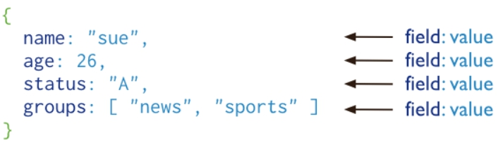
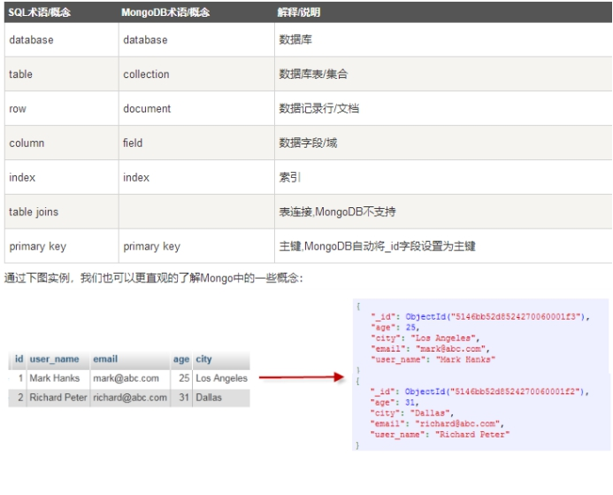

[TOC]

# mongo 了解

​	本文档整理自菜鸟教程

## 介绍

MONGDB 是为快速开发互联网Web应用而设计的数据库系统，其数据模型和持久性策略就是为了构建高读/写吞吐量和高自动灾备伸缩性的系统。

 

MONGDB 的文档格式基于JSON，一种流行的数据存储格式，JSON数据结构是由键值对，也可以内置嵌套。

 

关于MONGODB和POSTGRESQL关于JSON类型联系请参考文档[mongo与postgresql的json串比较](../20180602/mongo_postgresql_diff.md)

 

MongoDB是一个基于分布式文件存储的数据库，由c++语言编写，旨在为WEB应用提供可扩展的高性能数据存储解决方案。

 

MongoDB将数据存储为一个文档

 



 

特点:

 

MongoDB 是一个面向文档存储的数据库，操作起来比较简单和容易

MongoDB 设置任何属性的索引

MongoDB 支持丰富的查询表达式

 

## Mongo learn


 ### install


1 查看服务器的操作系统

​	建议使用linux的redhat或者centos系列，本次测试使用的标准版本(centos6.5x64)

2、下载地址

 	下载地址：[https://www.MongoDB.com/download-center#community](#community)

3、上传并解压文件,将解压包拷贝到指定目录

```
# tar -zxvf mongodb-linux-x86_64-rhel62-3.6.4.tgz
# mv mongodb-linux-x86_64-rhel62-3.6.4/ /usr/local/mongodb
```

4、修改环境变量

 ```
# vim .bash_profile
export PATH=/usr/local/mongodb/bin:$PGHOME/bin:$MYSQLHOME/bin:$PATH:.
 ```

5、创建数据库目录

```
# mkdir -p /data/db
```

6、命令行中运行MongoDB服务

 ```
# cd /usr/local/mongodb/bin
# ./mongod
 ```

如果数据库目录不是/data/db,可以通过--dbpath 来指定

7、MongoDB后台管理shell

 ```
# cd /usr/local/mongodb/bin
# ./mongo
> 2+2
4
> db.runoob.insert({x:10})
WriteResult({ "nInserted" : 1 })
> db.runoob.find()
{ "_id" : ObjectId("5afe3ab35fca929f059d4a72"), "x" : 10 }
{ "_id" : ObjectId("5afe479028dacca2c5e05420"), "x" : 10 }
 ```

### MongoDB 概念

 

 

**MongoDB表链接在3.x版本中测试可以关联**

mongodb可以创建多个数据库

查看数据库命令：show dbs

切换数据库使用：use database

当前数据库显示: db

```
> show dbs
admin   0.000GB
config  0.000GB
local   0.000GB
test    0.000GB
> db
test
> use local
switched to db local
> db
local
```

 

### 数据库创建

**创建删除**

```
> use database;
> db.dropDatabase();
```

```
> use runoob
switched to db runoob
> db
runoob
> show dbs
admin   0.000GB
config  0.000GB
local   0.000GB
test    0.000GB
```

**发现刚刚创建数据库runoob并不存在数据库的列表中，要显示它，我们需要想runoob数据库插入一些数据。**

```
> db.runoob.insert({"name":"菜鸟"});
WriteResult({ "nInserted" : 1 })
> show dbs
admin   0.000GB
config  0.000GB
local   0.000GB
runoob  0.000GB
test    0.000GB
> 
```

**删除数据库 db.dropDatabase**

```
> use runoob
switched to db runoob
> db.dropDatabase()
{ "dropped" : "runoob", "ok" : 1 }
> show dbs
admin   0.000GB
config  0.000GB
local   0.000GB
test    0.000GB
```


### collection

MongoDB 创建集合 db.createCollection(name,options)

 ```
>db.createCollection(“tablename”);
>db.collection.drop();
 ```

name：要创建的集合名称

options:可选参数，指定有关内存大小及索引的选项

options参数

| **字段**    | **类型** | **描述**                                                     |
| ----------- | -------- | ------------------------------------------------------------ |
| capped      | 布尔     | （可选）如果为 true，则创建固定集合。固定集合是指有着固定大小的集合，当达到最大值时，它会自动覆盖最早的文档。 **当该值为 true 时，必须指定 size 参数。** |
| autoIndexId | 布尔     | （可选）如为 true，自动在 _id 字段创建索引。默认为 false。   |
| size        | 数值     | （可选）为固定集合指定一个最大值（以字节计）。 **如果 capped 为 true，也需要指定该字段。** |
| max         | 数值     | （可选）指定固定集合中包含文档的最大数量。                   |

在插入文档时，MongoDB首先检查固定集合的size字段，然后检查max字段

```
> show tables
> db.createCollection("runoob")
{ "ok" : 1 }
> show collections;
runoob
> show collections
runoob
> show tables
runoob
> db.createCollection("mycol",{capped:true,autoIndexId:true,size:6142max:10});
--创建固定集合 mycol，整个集合空间大小 6142KB, 文档最大个数为 10个
> db.mycol.insert({"name":"015"});
WriteResult({ "nInserted" : 1 })
> db.mycol.find().pretty()
{ "_id" : ObjectId("5afe532c28dacca2c5e05427"), "name" : "678" }
{ "_id" : ObjectId("5afe533228dacca2c5e05428"), "name" : "789" }
{ "_id" : ObjectId("5afe533928dacca2c5e05429"), "name" : "890" }
{ "_id" : ObjectId("5afe534a28dacca2c5e0542a"), "name" : "901" }
{ "_id" : ObjectId("5afe535128dacca2c5e0542b"), "name" : "012" }
{ "_id" : ObjectId("5afe535728dacca2c5e0542c"), "name" : "014" }
{ "_id" : ObjectId("5afe53af28dacca2c5e0542d"), "name" : "015" }
```

 

**MongoDB 删除集合**

 ```
db.collection.drop()
> db.mycol.drop()
true
> show tables
runoob
 ```


### insert

​	MongoDB 插入数据

```
>db.collection.insert({tile:'mongodb教程',description:'mongodb 是一个nosql数据库',by:'菜鸟'});
>db.col.insertMany([{name:"guohui",sex:"1"},{name:"guokai",sex:1,age:13}]);
```

```
> db.t_md_data.insert({tile:'mongodb教程',description:'mongodb 是一个nosql数据库',by:'菜鸟'});
WriteResult({ "nInserted" : 1 })
```

​	db.collection.find():查看数据

```
> db.t_md_data.find();
{ "_id" : ObjectId("5aff7d91710b4f25a9df6e41"), "tile" : "mongodb教程", "description" : "mongodb 是一个nosql数据库", "by" : "菜鸟" }
{ "_id" : ObjectId("5aff7e60710b4f25a9df6e42"), "tile" : "mongodb教程", "description" : "mongodb 是一个nosql数据库", "by" : "菜鸟" }
```

​	定义变量

```
> document=({title: 'MongoDB 教程', 
...     description: 'MongoDB 是一个 Nosql 数据库',
...     by: '菜鸟教程',
...     url: 'http://www.runoob.com',
...     tags: ['mongodb', 'database', 'NoSQL'],
...     likes: 100
... });
```

​	变量显示

```

{
	"title" : "MongoDB 教程",
	"description" : "MongoDB 是一个 Nosql 数据库",
	"by" : "菜鸟教程",
	"url" : "http://www.runoob.com",
	"tags" : [
		"mongodb",
		"database",
		"NoSQL"
	],
	"likes" : 100
}
```

​	插入变量

```
> db.t_md_data.insert(document);
WriteResult({ "nInserted" : 1 })
> db.t_md_data.find();
{ "_id" : ObjectId("5aff7d91710b4f25a9df6e41"), "tile" : "mongodb教程", "description" : "mongodb 是一个nosql数据库", "by" : "菜鸟" }
{ "_id" : ObjectId("5aff7e60710b4f25a9df6e42"), "tile" : "mongodb教程", "description" : "mongodb 是一个nosql数据库", "by" : "菜鸟" }
{ "_id" : ObjectId("5aff7f2e710b4f25a9df6e43"), "title" : "MongoDB 教程", "description" : "MongoDB 是一个 Nosql 数据库", "by" : "菜鸟教程", "url" : "http://www.runoob.com", "tags" : [ "mongodb", "database", "NoSQL" ], "likes" : 100 }
```

​	插入1条数据

```
> var document=db.t_md_data.insertOne({"a":3});
> document;
{
	"acknowledged" : true,
	"insertedId" : ObjectId("5aff7f9f710b4f25a9df6e44")
}
> db.t_md_data.find();
{ "_id" : ObjectId("5aff7d91710b4f25a9df6e41"), "tile" : "mongodb教程", "description" : "mongodb 是一个nosql数据库", "by" : "菜鸟" }
{ "_id" : ObjectId("5aff7e60710b4f25a9df6e42"), "tile" : "mongodb教程", "description" : "mongodb 是一个nosql数据库", "by" : "菜鸟" }
{ "_id" : ObjectId("5aff7f2e710b4f25a9df6e43"), "title" : "MongoDB 教程", "description" : "MongoDB 是一个 Nosql 数据库", "by" : "菜鸟教程", "url" : "http://www.runoob.com", "tags" : [ "mongodb", "database", "NoSQL" ], "likes" : 100 }
{ "_id" : ObjectId("5aff7f9f710b4f25a9df6e44"), "a" : 3 }
> db.t_md_data.find();
{ "_id" : ObjectId("5aff7d91710b4f25a9df6e41"), "tile" : "mongodb教程", "description" : "mongodb 是一个nosql数据库", "by" : "菜鸟" }
{ "_id" : ObjectId("5aff7e60710b4f25a9df6e42"), "tile" : "mongodb教程", "description" : "mongodb 是一个nosql数据库", "by" : "菜鸟" }
{ "_id" : ObjectId("5aff7f2e710b4f25a9df6e43"), "title" : "MongoDB 教程", "description" : "MongoDB 是一个 Nosql 数据库", "by" : "菜鸟教程", "url" : "http://www.runoob.com", "tags" : [ "mongodb", "database", "NoSQL" ], "likes" : 100 }
{ "_id" : ObjectId("5aff7f9f710b4f25a9df6e44"), "a" : 3 }
```

​	插入n条

```
> var res = db.t_md_data.insertMany([{"cbd":2,"ddd":2},{"cbd":2,"dde":2}]);
> res
{
	"acknowledged" : true,
	"insertedIds" : [
		ObjectId("5aff8025710b4f25a9df6e45"),
		ObjectId("5aff8025710b4f25a9df6e46")
	]
}
> db.t_md_data.find();
{ "_id" : ObjectId("5aff7d91710b4f25a9df6e41"), "tile" : "mongodb教程", "description" : "mongodb 是一个nosql数据库", "by" : "菜鸟" }
{ "_id" : ObjectId("5aff7e60710b4f25a9df6e42"), "tile" : "mongodb教程", "description" : "mongodb 是一个nosql数据库", "by" : "菜鸟" }
{ "_id" : ObjectId("5aff7f2e710b4f25a9df6e43"), "title" : "MongoDB 教程", "description" : "MongoDB 是一个 Nosql 数据库", "by" : "菜鸟教程", "url" : "http://www.runoob.com", "tags" : [ "mongodb", "database", "NoSQL" ], "likes" : 100 }
{ "_id" : ObjectId("5aff7f9f710b4f25a9df6e44"), "a" : 3 }
{ "_id" : ObjectId("5aff8025710b4f25a9df6e45"), "cbd" : 2, "ddd" : 2 }
{ "_id" : ObjectId("5aff8025710b4f25a9df6e46"), "cbd" : 2, "dde" : 2 }
> 
```

### delete

MongoDB 删除数据

 

测试环境：

```
db.col.insert({title: 'MongoDB 教程', 

...     description: 'MongoDB 是一个 Nosql 数据库',

...     by: '菜鸟教程',

...     url: 'http://www.runoob.com',

...     tags: ['mongodb', 'database', 'NoSQL'],

...     likes: 100

... })

插入语句执行2次

> db.col.find().pretty();

{

	"_id" : ObjectId("5b00a6459358af8e9a326f1a"),

	"title" : "MongoDB",

	"description" : "MongoDB ",

	"by" : "菜鸟",

	"url" : "http://www.runoob",

	"tags" : [

		"modb",

		"database",

		"NoSQL"

	],

	"likes" : 100

}

{

	"_id" : ObjectId("5b00be852e406295813d68c7"),

	"title" : "MongoDB 教程",

	"description" : "MongoDB 是一个 Nosql 数据库",

	"by" : "菜鸟教程",

	"url" : "http://www.runoob.com",

	"tags" : [

		"mongodb",

		"database",

		"NoSQL"

	],

	"likes" : 100

}

{

	"_id" : ObjectId("5b00be872e406295813d68c8"),

	"title" : "MongoDB 教程",

	"description" : "MongoDB 是一个 Nosql 数据库",

	"by" : "菜鸟教程",

	"url" : "http://www.runoob.com",

	"tags" : [

		"mongodb",

		"database",

		"NoSQL"

	],

	"likes" : 100

}
```

 

删除1条数据


 ```
> db.col.remove({'title':'MongoDB 教程'},1);

WriteResult({ "nRemoved" : 1 })

> db.col.find().pretty();

{

	"_id" : ObjectId("5b00be872e406295813d68c8"),

	"title" : "MongoDB 教程",

	"description" : "MongoDB 是一个 Nosql 数据库",

	"by" : "菜鸟教程",

	"url" : "http://www.runoob.com",

	"tags" : [

		"mongodb",

		"database",

		"NoSQL"

	],

	"likes" : 100

}

 ```

删除n条数据

 ```
> db.col.remove({'title':'MongoDB'});

WriteResult({ "nRemoved" : 1 })

> db.col.find().pretty();

{

	"_id" : ObjectId("5b00be852e406295813d68c7"),

	"title" : "MongoDB 教程",

	"description" : "MongoDB 是一个 Nosql 数据库",

	"by" : "菜鸟教程",

	"url" : "http://www.runoob.com",

	"tags" : [

		"mongodb",

		"database",

		"NoSQL"

	],

	"likes" : 100

}

{

	"_id" : ObjectId("5b00be872e406295813d68c8"),

	"title" : "MongoDB 教程",

	"description" : "MongoDB 是一个 Nosql 数据库",

	"by" : "菜鸟教程",

	"url" : "http://www.runoob.com",

	"tags" : [

		"mongodb",

		"database",

		"NoSQL"

	],

	"likes" : 100

}

> 

 ```

全部删除

```
> db.col.remove({});

WriteResult({ "nRemoved" : 1 })

> db.col.find().pretty();

>

```

### update

```

插入数据

> db.createCollection('col');
{ "ok" : 1 }
> db.col.insert({
...     title: 'MongoDB 教程', 
...     description: 'MongoDB 是一个 Nosql 数据库',
...     by: '菜鸟教程',
...     url: 'http://www.runoob.com',
...     tags: ['mongodb', 'database', 'NoSQL'],
...     likes: 100
... });
WriteResult({ "nInserted" : 1 })
> db.col.find().pretty();
{
	"_id" : ObjectId("5b00a6459358af8e9a326f1a"),
	"title" : "MongoDB 教程",
	"description" : "MongoDB 是一个 Nosql 数据库",
	"by" : "菜鸟教程",
	"url" : "http://www.runoob.com",
	"tags" : [
		"mongodb",
		"database",
		"NoSQL"
	],
	"likes" : 100
}
> db.col.update({'title':'MongoDB 教程'},{$set:{'title':'MongoDB'}});
WriteResult({ "nMatched" : 1, "nUpserted" : 0, "nModified" : 1 })
> db.col.find().pretty();
{
	"_id" : ObjectId("5b00a6459358af8e9a326f1a"),
	"title" : "MongoDB",
	"description" : "MongoDB 是一个 Nosql 数据库",
	"by" : "菜鸟教程",
	"url" : "http://www.runoob.com",
	"tags" : [
		"mongodb",
		"database",
		"NoSQL"
	],
	"likes" : 100
}
> db.col.update({'title':'MongoDB 教程'},{$set:{'title':'MongoDB'}},{multi:true})
WriteResult({ "nMatched" : 0, "nUpserted" : 0, "nModified" : 0 })
#如果你要修改多条相同的文档，则需要设置 multi 参数为 true。
> db.col.find().pretty();
{
	"_id" : ObjectId("5b00a6459358af8e9a326f1a"),
	"title" : "MongoDB",
	"description" : "MongoDB 是一个 Nosql 数据库",
	"by" : "菜鸟教程",
	"url" : "http://www.runoob.com",
	"tags" : [
		"mongodb",
		"database",
		"NoSQL"
	],
	"likes" : 100
}

Db.collection.save 
> db.col.save({
... "_id" : ObjectId("5b00a6459358af8e9a326f1a"),
... "title" : "MongoDB",
... "description" : "MongoDB ",
... "by" : "菜鸟",
... "url" : "http://www.runoob",
... "tags" : [
... "modb",
... "database",
... "NoSQL"
... ],
... "likes" : 100
... }
... );
WriteResult({ "nMatched" : 1, "nUpserted" : 0, "nModified" : 1 })
> db.col.find().pretty();
{
	"_id" : ObjectId("5b00a6459358af8e9a326f1a"),
	"title" : "MongoDB",
	"description" : "MongoDB ",
	"by" : "菜鸟",
	"url" : "http://www.runoob",
	"tags" : [
		"modb",
		"database",
		"NoSQL"
	],
	"likes" : 100
}
> 


Mongodb 更新数据场景


测试数据
>db.col.remove({});
> db.col.insert({     title: 'MongoDB 教程',      description: 'MongoDB 是一个 Nosql 数据库',     by: '菜鸟教程',     url: 'http://www.runoob.com',     tags: ['mongodb', 'database', 'NoSQL'],     likes: 100 });

WriteResult({ "nInserted" : 1 })
> db.col.insert({     title: 'MongoDB 教程',      description: 'MongoDB 是一个 Nosql 数据库',     by: '菜鸟教程',     url: 'http://www.runoob.com',     tags: ['mongodb', 'database', 'NoSQL'],     likes: 100 });

WriteResult({ "nInserted" : 1 })
> db.col.find().pretty();
{
	"_id" : ObjectId("5b19b5a497182baf226e10b9"),
	"title" : "MongoDB 教程",
	"description" : "MongoDB 是一个 Nosql 数据库",
	"by" : "菜鸟教程",
	"url" : "http://www.runoob.com",
	"tags" : [
		"mongodb",
		"database",
		"NoSQL"
	],
	"likes" : 100
}
{
	"_id" : ObjectId("5b19b5a597182baf226e10ba"),
	"title" : "MongoDB 教程",
	"description" : "MongoDB 是一个 Nosql 数据库",
	"by" : "菜鸟教程",
	"url" : "http://www.runoob.com",
	"tags" : [
		"mongodb",
		"database",
		"NoSQL"
	],
	"likes" : 100
}
[1] 代表当前数据


1、主键或者比较字段存在且值存在，更新存在的字段值。

根据关键字段title，修改字段by值

> db.col.update({title:"MongoDB 教程"},{$set:{"by":"cainiao"}},true,true);
WriteResult({ "nMatched" : 2, "nUpserted" : 0, "nModified" : 2 })
> db.col.find().pretty();
{
	"_id" : ObjectId("5b19b5a497182baf226e10b9"),
	"title" : "MongoDB 教程",
	"description" : "MongoDB 是一个 Nosql 数据库",
	"by" : "cainiao",
	"url" : "http://www.runoob.com",
	"tags" : [
		"mongodb",
		"database",
		"NoSQL"
	],
	"likes" : 100
}
{
	"_id" : ObjectId("5b19b5a597182baf226e10ba"),
	"title" : "MongoDB 教程",
	"description" : "MongoDB 是一个 Nosql 数据库",
	"by" : "cainiao",
	"url" : "http://www.runoob.com",
	"tags" : [
		"mongodb",
		"database",
		"NoSQL"
	],
	"likes" : 100
}

测试发现通过，并且可以执行n条语句


2、主键或者比较字段存在且值存在，添加新的字段并将值传入

将数据重新恢复到原始状态[1]，并且根据字段title添加新的字段good

> db.col.update({title:"MongoDB 教程"},{$set:{"good":"cainiao"}},true,true);
WriteResult({ "nMatched" : 2, "nUpserted" : 0, "nModified" : 2 })
> db.col.find().pretty();
{
	"_id" : ObjectId("5b19b7b397182baf226e10bb"),
	"title" : "MongoDB 教程",
	"description" : "MongoDB 是一个 Nosql 数据库",
	"by" : "菜鸟教程",
	"url" : "http://www.runoob.com",
	"tags" : [
		"mongodb",
		"database",
		"NoSQL"
	],
	"likes" : 100,
	"good" : "cainiao"
}
{
	"_id" : ObjectId("5b19b7b497182baf226e10bc"),
	"title" : "MongoDB 教程",
	"description" : "MongoDB 是一个 Nosql 数据库",
	"by" : "菜鸟教程",
	"url" : "http://www.runoob.com",
	"tags" : [
		"mongodb",
		"database",
		"NoSQL"
	],
	"likes" : 100,
	"good" : "cainiao"
}


3、主键或者比较字段存在但是值不存在，添加新数据并将值传入

将数据重新恢复到原始状态[1]，并且根据字段title,但是值不存在，查看最新数据是否入库

> db.col.update({title:"MongoDB"},{$set:{"good":"cainiao"}},true,true);
WriteResult({
	"nMatched" : 0,
	"nUpserted" : 1,
	"nModified" : 0,
	"_id" : ObjectId("5b19b973055a4b40dff06e95")
})
> db.col.find().pretty();
{
	"_id" : ObjectId("5b19b93f97182baf226e10bd"),
	"title" : "MongoDB 教程",
	"description" : "MongoDB 是一个 Nosql 数据库",
	"by" : "菜鸟教程",
	"url" : "http://www.runoob.com",
	"tags" : [
		"mongodb",
		"database",
		"NoSQL"
	],
	"likes" : 100
}
{
	"_id" : ObjectId("5b19b94097182baf226e10be"),
	"title" : "MongoDB 教程",
	"description" : "MongoDB 是一个 Nosql 数据库",
	"by" : "菜鸟教程",
	"url" : "http://www.runoob.com",
	"tags" : [
		"mongodb",
		"database",
		"NoSQL"
	],
	"likes" : 100
}
{
	"_id" : ObjectId("5b19b973055a4b40dff06e95"),
	"title" : "MongoDB",
	"good" : "cainiao"
}
> 

比较字段和更新字段都已经入库

4、主键或者比较字段不存在，插入这条数据

将数据重新恢复到原始状态[1]，并且根据文档中不存在字段进行更新，查看最新数据是否入库
> db.col.update({fazhan:"MongoDB"},{$set:{"good":"cainiao"}},true,true);
WriteResult({
	"nMatched" : 0,
	"nUpserted" : 1,
	"nModified" : 0,
	"_id" : ObjectId("5b19ba70055a4b40dff06ea1")
})
> db.col.find().pretty();
{
	"_id" : ObjectId("5b19ba2d97182baf226e10bf"),
	"title" : "MongoDB 教程",
	"description" : "MongoDB 是一个 Nosql 数据库",
	"by" : "菜鸟教程",
	"url" : "http://www.runoob.com",
	"tags" : [
		"mongodb",
		"database",
		"NoSQL"
	],
	"likes" : 100
}
{
	"_id" : ObjectId("5b19ba2d97182baf226e10c0"),
	"title" : "MongoDB 教程",
	"description" : "MongoDB 是一个 Nosql 数据库",
	"by" : "菜鸟教程",
	"url" : "http://www.runoob.com",
	"tags" : [
		"mongodb",
		"database",
		"NoSQL"
	],
	"likes" : 100
}
{
	"_id" : ObjectId("5b19ba70055a4b40dff06ea1"),
	"fazhan" : "MongoDB",
	"good" : "cainiao"
}
> 

发现初步完成测试效果，会将这个数据及时入库。


测试发现：upsert语句都能够完成，不仅update,而且insert，不管需要设置true,true
```


## 链接地址

http://www.runoob.com/mongodb/mongodb-tutorial.html