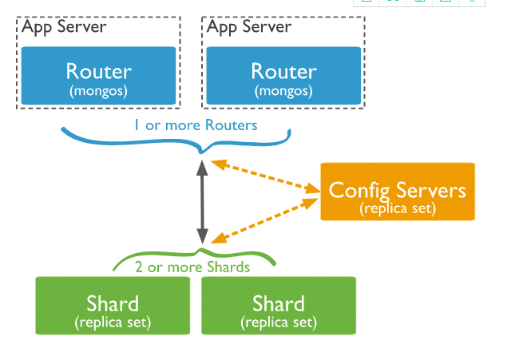
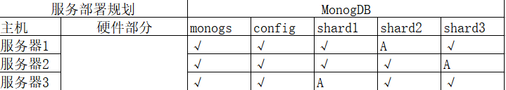

[TOC]

# gz mongo cluster install （二）


​	之前安装的数据库后期测试有问题，而且也是很难理解具体架构，参考新的就比较简单，而且更好理解。


## 原理



​	mongos:数据库集群请求的入口，所有的请求都通过mongos进行协调，不需要在应用程序添加一个路由选择器，mongos自己就是一个请求分发中心，它负责将对应的数据请求转发到对应的shard服务器上。在生产环境通常有多个mongos作为请求的入口，防止其中一个挂掉所有的mongodb请求都没有办法操作

​	config server:配置服务器，存储所有数据库 元信息(路由，分片)的配置。mongos本身没有物理存储分片服务器和数据路由信息，只能缓存在内存里，配置服务器则实际存储这些数据。monogs第一次启动或者关掉重启就会从config server 加载配置信息，以后如果配置服务器信息变化会通知到所有的mongos更新自己的状态，这样mongos就能继续准确路由，在生产环境下通常有多个config server配置服务器，因为它存储了分片路由的元数据，防止数据丢失。

​	shard：分片，是将数据库拆分，将其分散到不同的机器上的过程。将数据分散到不同的机器上，不需要功能强大的服务区就可以存储跟多的数据和处理更大的负载。基本思想就是将集合切成小块，这些块分散到若干片里，每个片只负责总数据的一部分，最后通过一个均衡器来对各个分片进行均衡(数据迁移)。

​	replica set是shard的备份，防止shard挂掉之后数据丢失。复制提供了数据冗余备份，并在多个服务器上存储数据副本，提高了数据的可用性，并可以保证数据的安全性

​	Arbiter，仲裁者，是复制集中的一个MongbDB实例，他并不保存数据。仲裁节点使用最小的资源并且要求硬件设备，不能将Arbiter部署在同一个数据集节点中，可以部署在其他应用服务器或者监视服务器中，也可部署在单独的虚拟中。为了确保复制集中有奇数的投票成员(包括primary)，需要添加仲裁节点作为投票，否则primary不能运行时不会自动切换primary。

​	应用请求mongos来操作mongodb的增删改查，配置服务器存储数据库元信息，并且和mongos做同步，数据最终存入在shard(分片)上，为了防止数据丢失同步在副本集中存储了一份，仲裁在数据存储分片的时候决定存储到哪个节点。

​	


## 安装步骤


### 每台服务器都要执行





#### 删除文件(GZ看其他可以跳过这个小节)

​	之前在GZ部署时参考的文档有的出入，导致数据库安装不是很准确，之前想在旧的环境部署，发现很多错误信息，考虑到mongo的真实情况，将数据全部删除重新搞，如果之前并没有部署，可以不参考此内容

```
rm -rf  /usr/local/mongodb/conf/*
rm -rf  /data/config/data/*
rm -rf  /data/shard1/data/*
rm -rf  /data/shard2/data/*
rm -rf  /data/shard3/data/*
```

​	删除过这些后，可以跳到 创建config 环节	

#### 上传文件并解压文件到规定的目录

```
# mkdir /software
# cd /software
--通过软件将mongodb-linux-x86_64-3.4.6.tgz上传到/software
# tar -xzvf mongodb-linux-x86_64-3.6.3.tgz  -C /usr/local/
# cd /usr/local
# mv mongodb-linux-x86_64-3.6.3 mongodb
```

#### 创建目录及用户，授权，修改变量

```
# mkdir /data
# groupadd ysys
# useradd -g ysys ysys
# passwd ysys
--密码确认
# chown -R ysys:ysys /usr/local/
# chown -R ysys:ysys /data
```

```
# vim /etc/profile
--在export PATH USER LOGNAME MAIL HOSTNAME HISTSIZE HISTCONTROL 上面添加下面两行
export MONGODB_HOME=/usr/local/mongodb
export PATH=$MONGODB_HOME/bin:$PATH

# source /etc/profile
```

```
# su - ysys
$ mongod -v 
--查看mongo版本是否存在
```

**在每台服务器上执行下面语句**

```
mkdir -p /usr/local/mongodb/conf
mkdir -p /data/mongos/log
mkdir -p /data/config/data
mkdir -p /data/config/log
mkdir -p /data/shard1/data
mkdir -p /data/shard1/log
mkdir -p /data/shard2/data
mkdir -p /data/shard2/log
mkdir -p /data/shard3/data
mkdir -p /data/shard3/log
```

```
# chown -R ysys:ysys /usr/local/
# chown -R ysys:ysys /data
```

#### 创建config

```
# su - ysys
$ cd /usr/local/mongodb/conf
$ vi config.conf

## 配置文件内容
pidfilepath = /data/config/log/configsrv.pid
dbpath = /data/config/data
logpath = /data/config/log/congigsrv.log
logappend = true
 
bind_ip = 0.0.0.0
port = 21000
fork = true
 
#declare this is a config db of a cluster;
configsvr = true

#副本集名称
replSet=configs
 
#设置最大连接数
maxConns=20000
```

**三台启动config**

```
$ mongod -f /usr/local/mongodb/conf/config.conf
```

**只要登陆到其中一台就可以了，以ip:192.168.1.31为例**

**请注意从config开始ip的顺序，比如是_id是0的192.168.1.31,id是1的192.168.1.32,id是2的192.168.1.33就确定了，后续都需要按照这个顺序配置，因此要注意**

```
$ mongo 192.168.1.31:21000
```

```
> config = { _id : "configs",members : [{_id : 0, host : "192.168.1.31:21000" },{_id : 1, host : "192.168.1.32:21000" }, {_id : 2, host : "192.168.1.33:21000" }]}
> rs.initiate(config)
> rs.status()
```

#### 创建shard1

```
# su - ysys
$ cd /usr/local/mongodb/conf/
$ vim shard1.conf


pidfilepath = /data/shard1/log/shard1.pid
dbpath = /data/shard1/data
logpath = /data/shard1/log/shard1.log
logappend = true

bind_ip = 0.0.0.0
port = 27001
fork = true
 
#打开web监控
#httpinterface=true
#rest=true
 
#副本集名称
replSet=shard1
 
#declare this is a shard db of a cluster;
shardsvr = true
 
#设置最大连接数
maxConns=20000
```

**三台启动shard1**

```
$ mongod  -f  /usr/local/mongodb/conf/shard1.conf
```

**任意一台登陆**

```
$ mongo 192.168.1.31:27001
$ use admin
> config = {_id : "shard1", members : [ {_id : 0, host : "192.168.1.31:27001" }, {_id : 1, host : "192.168.1.32:27001" },{_id : 2, host : "192.168.1.33:27001" , arbiterOnly: true }]}
> rs.initiate(config)
```

#### 创建shard2

```
# su - ysys
$ cd /usr/local/mongodb/conf/
$ vim shard2.conf

pidfilepath = /data/shard2/log/shard2.pid
dbpath = /data/shard2/data
logpath = /data/shard2/log/shard2.log
logappend = true

bind_ip = 0.0.0.0
port = 27002
fork = true
 
#打开web监控
#httpinterface=true
#rest=true
 
#副本集名称
replSet=shard2
 
#declare this is a shard db of a cluster;
shardsvr = true
 
#设置最大连接数
maxConns=20000
```

**三台启动shard2**

```
$ mongod  -f  /usr/local/mongodb/conf/shard2.conf
```

**任意一台登陆**

```
$ mongo 192.168.1.32:27002
> use admin
> config = { _id : "shard2",members : [ {_id : 0, host : "192.168.1.31:27002"  , arbiterOnly: true }, {_id : 1, host : "192.168.1.32:27002" }, {_id : 2, host : "192.168.1.33:27002" }  ]}
> rs.initiate(config)
```

#### 创建shard3

```
# su - ysys
$ cd /usr/local/mongodb/conf/
$ vim shard3.conf


pidfilepath = /data/shard3/log/shard3.pid
dbpath = /data/shard3/data
logpath = /data/shard3/log/shard3.log
logappend = true

bind_ip = 0.0.0.0
port = 27003
fork = true
 
#打开web监控
#httpinterface=true
#rest=true
 
#副本集名称
replSet=shard3
 
#declare this is a shard db of a cluster;
shardsvr = true
 
#设置最大连接数
maxConns=20000
```

**三台启动shard3**

```
$ mongod  -f  /usr/local/mongodb/conf/shard3.conf
```

**任意一台登陆**

```
$ mongo 192.168.1.33:27003
> use admin
> config = { _id : "shard3",members : [{_id : 0, host : "192.168.1.31:27003" },{_id : 1, host : "192.168.1.32:27003" , arbiterOnly: true},{_id : 2, host : "192.168.1.33:27003" }]}
> rs.initiate(config);
```


#### 创建mongos

```
# su - ysys
$ cd /usr/local/mongodb/conf/
$ vim mongos.conf


#内容
pidfilepath = /data/mongos/log/mongos.pid
logpath = /data/mongos/log/mongos.log
logappend = true

bind_ip = 0.0.0.0
port = 20000
fork = true

#监听的配置服务器,只能有1个或者3个 configs为配置服务器的副本集名字
configdb = configs/192.168.1.31:21000,192.168.1.32:21000,192.168.1.33:21000
 
#设置最大连接数
maxConns=20000
```

**三台启动mongos**

```
$ mongos -f /usr/local/mongodb/conf/mongos.conf
```

**任意一台登陆**

```\
$ mongo 192.168.1.31:20000
> use admin
> sh.addShard("shard1/192.168.1.31:27001,192.168.1.32:27001,192.168.1.33:27001")
> sh.addShard("shard2/192.168.1.31:27002,192.168.1.32:27002,192.168.1.33:27002")
> sh.addShard("shard3/192.168.1.31:27003,192.168.1.32:27003,192.168.1.33:27003")
> sh.status()
```

### 测试

```
$ mongo 192.168.1.31:20000
> use admin
> db.runCommand( { enablesharding :"testdb"});
$ mongo 192.168.1.31:20000
> use testdb
> db.runCommand( { shardcollection : "testdb.table1",key : {id: 1} } )
> for (var i = 1; i <= 10; i++) db.table1.save({id:i,"test1":"testval1"});
> db.table1.find();
```


## 启动关闭

​	启动

```
$ mongod -f /usr/local/mongodb/conf/config.conf
$ mongod -f /usr/local/mongodb/conf/shard1.conf
$ mongod -f /usr/local/mongodb/conf/shard2.conf
$ mongod -f /usr/local/mongodb/conf/shard3.conf
$ mongos -f /usr/local/mongodb/conf/mongos.conf
```

​	关闭

```
$ kill mongos.conf --ps -ef|grep monogs.conf
$ kill shard3.conf --ps -ef|grep shard3.conf
$ kill shard2.conf --ps -ef|grep shard2.conf
$ kill shard1.conf --ps -ef|grep shard1.conf
$ kill config.conf --ps -ef|grep config.conf
```

​	


## 错误信息


```
$ vim shard1.conf 
#打开web监控
httpinterface=true
rest=true
```

```
[ysys@gh31 conf]$ mongod -f /usr/local/mongodb/conf/shard1.conf 
Error parsing INI config file: unrecognised option 'httpinterface'
try 'mongod --help' for more information
```

某些应用可能有问题


## 链接地址

http://www.ityouknow.com/mongodb/2017/08/05/mongodb-cluster-setup.html