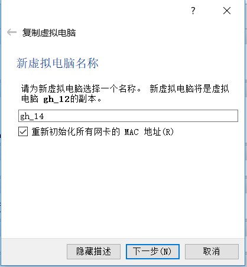
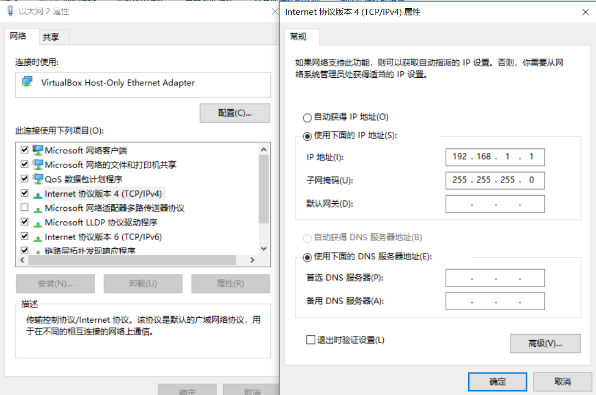

[TOC]

# 我和virtualbox死磕上网问题引发的深思

## 描述

​	这两台要在虚拟机上安装redis3.2版本的集群，参考文档有一些依赖包需要到网上下载，默认为虚拟机配置的是'Host-Only Ethernet'方式，这种方式没有办法连接互联网，只能通过其他方式连接互联网。

​	之后采取了复用之前的文件并修改连接方式，改为“网络地址转换(NET)”，这个将ip改为自动或地区，可以访问www.baidu.com；可是当虚拟机服务器重启之后，问题就出现了，无法ping www.baidu.com这个地址了，为此一半天都在搞这个问题，也没有好的想法。

​	后来得到别人的提醒，可能你的环境就无法ping通www.baidu.com;后面在服务器(不是虚拟机)执行，确实ping不同。

​	产生该问题的原因找到了，那么为什么可以访问百度，却不能ping通百度，发现换了wifi热点就可以，之前的连接地址是360wifi热点，没有办法ping通百度，而在其他的热点就可以访问了。

​	

## 问题 

**virtualbox 网络设置**

​**路由器问题**

​	

## 复制 host+only 加上 访问互联网

​	一定要在如下环境下复制

​	在 ping www.baidu.com 环境下复制 Host+only 加上 访问互联网 模式才能成功，如果路由器限制你 ping www.baidu.com，那么互联网模式就无法复制成功，建议复制前请查看清楚


​	

### 示例

​	目前在本地虚拟机中有一个虚拟机叫gh_12，这个上面是一个模板(上面可以访问互联网和访问本地ip)

​	执行以下步骤

​	在虚拟机管理界面上复制虚拟机:修改新虚拟机电脑名称，记得要重新初始化所有网卡的MAC地址



​	复制完成后，开启虚拟机记得修改如下配置,删除eth0,eth1的网络并将eth2改为eth0,eth3改为eth1

```
# vim /etc/udev/rule.s/70-persistent-net.rules
```

​	之后修改网络信息，记得修改eth1的信息改成本地的网关地址



```
# ifconfig
eth0      Link encap:Ethernet  HWaddr 08:00:27:7E:28:38  
          inet addr:10.0.2.15  Bcast:10.0.2.255  Mask:255.255.255.0
          inet6 addr: fe80::a00:27ff:fe7e:2838/64 Scope:Link
          UP BROADCAST RUNNING MULTICAST  MTU:1500  Metric:1
          RX packets:5 errors:0 dropped:0 overruns:0 frame:0
          TX packets:15 errors:0 dropped:0 overruns:0 carrier:0
          collisions:0 txqueuelen:1000 
          RX bytes:1914 (1.8 KiB)  TX bytes:1884 (1.8 KiB)

eth1      Link encap:Ethernet  HWaddr 08:00:27:53:02:3F  
          inet addr:192.168.1.14  Bcast:192.168.1.255  Mask:255.255.255.0
          inet6 addr: fe80::a00:27ff:fe53:23f/64 Scope:Link
          UP BROADCAST RUNNING MULTICAST  MTU:1500  Metric:1
          RX packets:35 errors:0 dropped:0 overruns:0 frame:0
          TX packets:47 errors:0 dropped:0 overruns:0 carrier:0
          collisions:0 txqueuelen:1000 
          RX bytes:4073 (3.9 KiB)  TX bytes:5503 (5.3 KiB)

lo        Link encap:Local Loopback  
          inet addr:127.0.0.1  Mask:255.0.0.0
          inet6 addr: ::1/128 Scope:Host
          UP LOOPBACK RUNNING  MTU:16436  Metric:1
          RX packets:4 errors:0 dropped:0 overruns:0 frame:0
          TX packets:4 errors:0 dropped:0 overruns:0 carrier:0
          collisions:0 txqueuelen:0 
          RX bytes:240 (240.0 b)  TX bytes:240 (240.0 b)

```

​	如果后期ping www.baidu.com依然ping不同，可能是因为当前环境下，你连接的路由禁止ping www.baidu.com,在windows环境下ping www.baidu.com尝试一下

**测试发现，如果当前环境下无法ping www.baidu.com，复制服务器并修改信息，后期连到正常的网络，依然不会成功**


## 链接地址

https://jingyan.baidu.com/article/48a420571e6d75a9242504e0.html