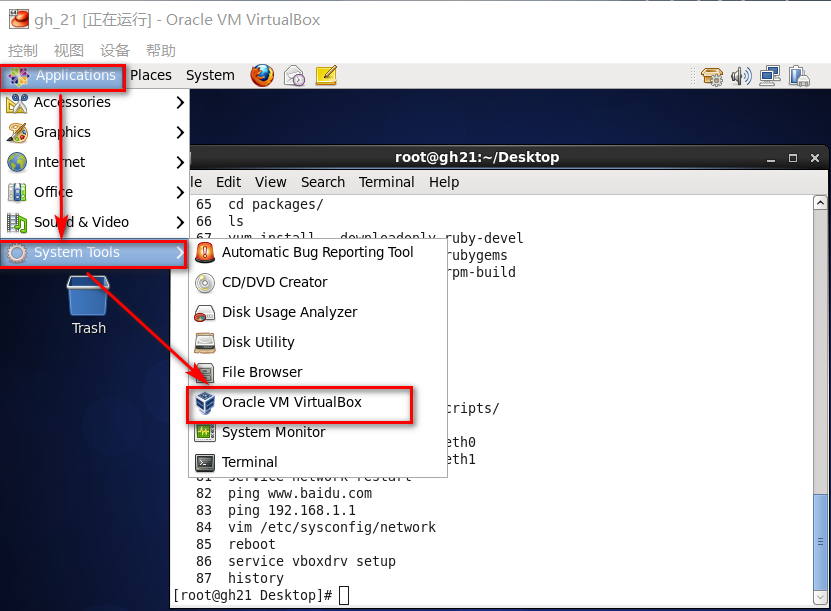
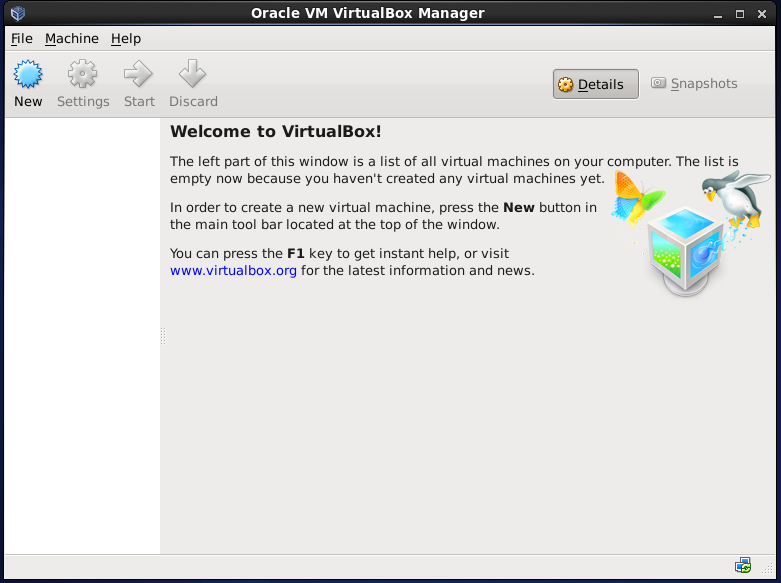

[TOC]

# linux 安装 virtualbox 

**文档整理**

ysys

**日期**

2018-09-30

**标签**

linux,virtualbox,virtualbox install


## 背景

​	之前同事给我打电话，问是否可以在linux服务器上安装虚拟机，我不加思索说可以，那么是否真的可以，同事在centos 7.x系列完成了该方案，centos 6.x系列没有完成该方案；现在有时间想测试一下，并整理相关文档。


## 环境

​	操作系统：win10

​	虚拟机：virutalbox 4.3

​	linux：centos6.5_x64

​	目标：在linux上接着安装virtualbox虚拟机，查看是否可以使用


## 步骤


### 创建一个linux虚拟机

​	当前自己的电脑是win10，所以本身就需要创建一个linux虚拟机出来，环境是centos6.5_x64;本次虚拟机设置了双网络(网络地址转换(NAT)和仅主机(Host-Only)网络)，为了更好获得一些依赖包


### 下载依赖包

```
# wget ftp://ftp.pbone.net/mirror/ftp5.gwdg.de/pub/opensuse/repositories/home:/l-card/CentOS_CentOS-6/noarch/dkms-2.2.0.3-30.1.noarch.rpm
```

​	或者访问链接地址

链接：https://pan.baidu.com/s/1srDRxlpJcXCCBB6LJ2tvdw 
提取码：kqy0


### 安装依赖包

​	dkms-2.2.0.3-1.noarch.rpm网上已经不提供了，下载的是dkms较新的安装包

```
# rpm -ivh dkms-2.2.0.3-30.1.noarch.rpm 
```

### 安装gcc

```
# yum -y install gcc*
```

### 安装kernel

```
# yum install kernel-devel*
```

​	当前的yum为本地yum源，就是安装包

### 安装软件

```
#  wget http://download.virtualbox.org/virtualbox/4.3.28/VirtualBox-4.3-4.3.28_100309_el6-1.x86_64.rpm
```

​	或者访问链接地址

链接：https://pan.baidu.com/s/1srDRxlpJcXCCBB6LJ2tvdw 
提取码：kqy0

```
# rpm -ivh VirtualBox-4.3-4.3.28_100309_el6-1.x86_64.rpm 
```


### 生成vbox服务

```
# service vboxdrv setup
```


### 图形化界面操作

​	选择Applications下的System Tools的Oracle VM VirtualBox就可以了，会出现在Windows上类似的图形化界面，到此安装完成。





**注意**：本次安装并没有安装vnc服务，如果不想在直接在服务器所在的机房操作，需要vnc服务，才能远程图形化桌面。


## 错误

1、rpm -ivh VirtualBox-4.3-4.3.28_100309_el6-1.x86_64.rpm  失败，需要先安装 kernel-devel相对应的内核

```
No precompiled module for this kernel found -- trying to build one. Messages
emitted during module compilation will be logged to /var/log/vbox-install.log.

Stopping VirtualBox kernel modules [ OK ]
Uninstalling old VirtualBox DKMS kernel modules [ OK ]
Trying to register the VirtualBox kernel modules using DKMSError! echo
Your kernel headers for kernel 2.6.32-358.el6.x86_64 cannot be found at
/lib/modules/2.6.32-358.el6.x86_64/build or /lib/modules/2.6.32-358.el6.x86_64/source.
[FAILED]
(Failed, trying without DKMS)
Recompiling VirtualBox kernel modules [FAILED]
(Look at /var/log/vbox-install.log to find out what went wrong)   
```


## 链接地址

https://www.cnblogs.com/usergaojie/p/4624498.html

https://blog.csdn.net/body100123/article/details/53353995

https://blog.csdn.net/houzhizhen/article/details/55096677

http://rpm.pbone.net/index.php3/stat/4/idpl/23564018/dir/centos_6/com/dkms-2.2.0.3-30.1.noarch.rpm.html

https://blog.csdn.net/u014577061/article/details/79522464