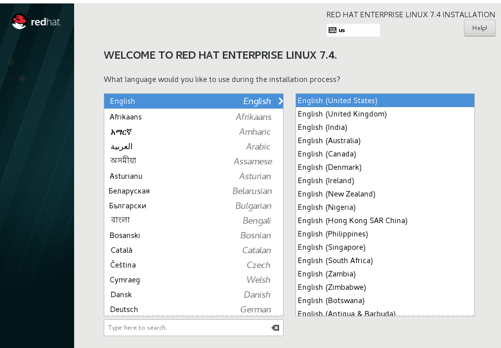
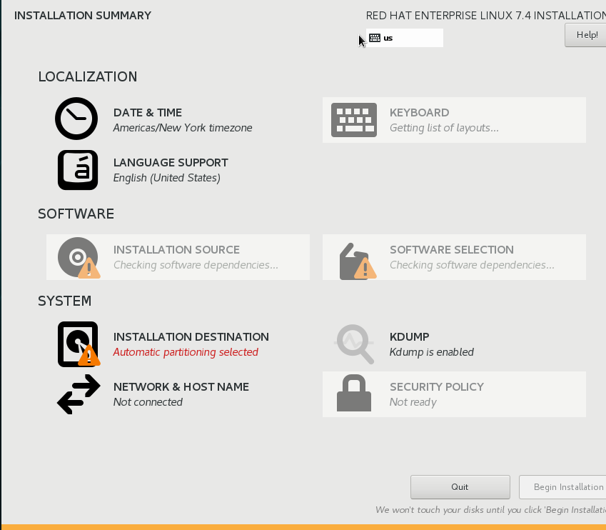
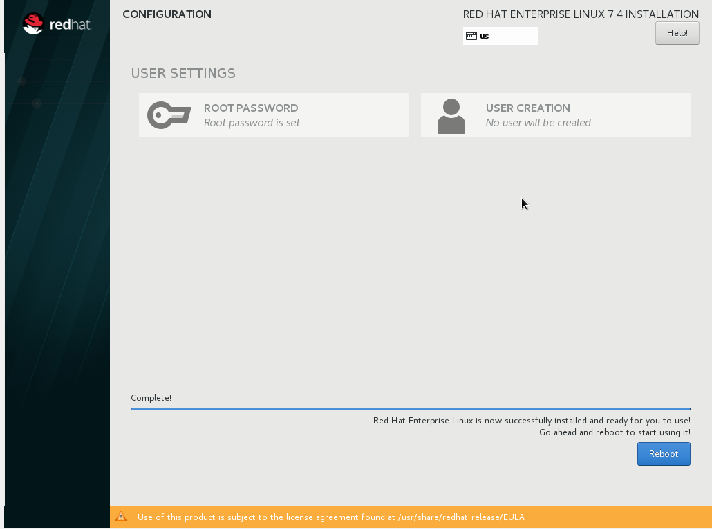

[TOC]

# redhat 7.4 install

**文档整理**

ysys

**时间**

2018-10-15

**标签**

redhat,7.x install


## 背景

​	今天在生产环境下创建ftp服务器，发现redhat7和centos6系列不是很一致，导致安装出差错多次，现在想重新整理一下ftp在redhat7.4上的安装手册，就先记录一下redhat7.4的安装步骤


## 安装

​	本次安装实在虚拟机下操作的，虚拟机操作的步骤较为简单，不再本次说明中，直接跳到使用光盘操作模块下的选择语言

### 语言选择

​	选择English和Englist(United States)



### 选择安装总结栏

​	这里面有LOCALIZATION分别是时间和语言支持；SOFTWARE软件安装的源头和选择安装的软件；SYSTEM里面是主要的硬盘划分和网络主机名设置，这里尤其注意SOFTEARE和SYSTEM两个模块

​	SOFTWARE SELECTION 选择最下面一个GUI




reboot一下就可以了,同意注册。



### 默认情况下磁盘分布

```
# df -TH
Filesystem            Type      Size  Used Avail Use% Mounted on
/dev/mapper/rhel-root xfs        19G  3.4G   15G  19% /
devtmpfs              devtmpfs  769M     0  769M   0% /dev
tmpfs                 tmpfs     785M     0  785M   0% /dev/shm
tmpfs                 tmpfs     785M  9.7M  776M   2% /run
tmpfs                 tmpfs     785M     0  785M   0% /sys/fs/cgroup
/dev/sda1             xfs       1.1G  168M  896M  16% /boot
tmpfs                 tmpfs     157M   46k  157M   1% /run/user/1000
tmpfs                 tmpfs     157M     0  157M   0% /run/user/0
```

