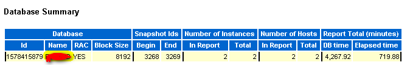

[TOC]

# oracle_rac_bjjz_awr

**文档整理**

ysys

**日期**

2018-11-09

**标签**

oracle rac,awr


## 背景

​	最近一段时间，同事和我说BJ的JZ的ORACLE数据库特别慢，因为之前经常遇到是以为可能sql语句的问题，后面发现sql语句只是一小部分可能影响数据库查询慢，那么就要分析awr


## awr 生成


## awr 数据

sql和优化器指标

os指标

等待事件类型

时间指标


## 维护 awr

MMON(Manageability Monitor Process)和它的小工进程(m00x)


## awr小技巧


```
http://10.3.19.27:8080/dpjc/dpjc/gkcx/drdt.jsp
http://10.3.19.27:8080/dpjc/dpjc/klqk/klqk.jsp
http://10.3.19.27:8080/dpjc/dpjc/gkcx/gksj.jsp
```


### database summary

DB time:所有前台sessions花费在database调用的总和时间（包括cpu时间，io time和其他一系列非空闲等待时间，还有cpu on queue time）

Elapsed time:

AAS(Average Active Session)=DB time /Elapsed time





## 链接地址

[awr报告](awrrpt_rac_3268_3269.html)