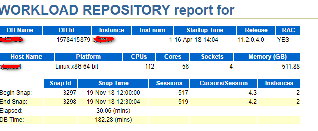
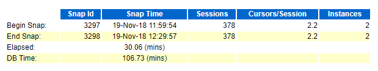
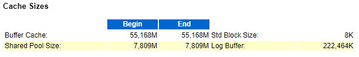
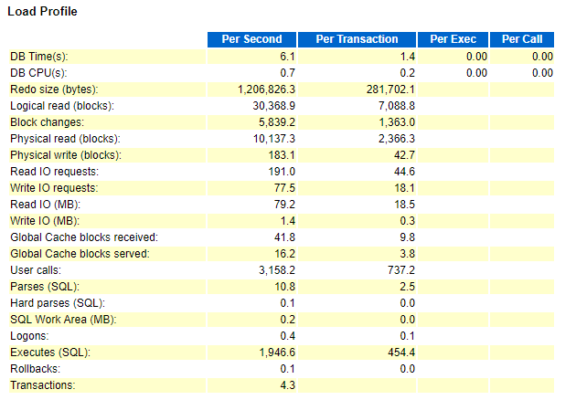

[TOC]

# oracle awr analyze

**文档整理**

ysys

**日期**

2018-11-19

**标签**

oracle,awr,awr analyze

## awr analyze

​	一直就对awr感觉很有意思，刚好这段时间帮助BJ项目组优化oracle数据库时，使用awr,觉得有必要好好了解一下。

### awr concept

​	AWR是oracle10g版本推出的新特性，全程叫做Automatic Workload Repository,自动负载信息库，AWR是通过两次或者多次的快照(snapshot)收集到的统计信息，来生成报表。

### workload repository report for

​	上面告诉当前数据库服务名，实例名，是否属于集群，数据库版本，数据库启动时间，操作系统版本，物理cpu个数，逻辑cpu个数，cpu sockets(?),操作系统内存，当前快照的起始截至，快照开始时间，快照结束时间，系统逝去时间(Elapsed),DB time时间，会话数，游标与会话的比值

​	在这里介绍一个概念AAS(avg active sessions)=DB time/Elapsed time，如果DB time远远小于Elapsed time，说明数据库比较空闲。

​	`DB time=cpu time + wait time（不包含空闲等待)(非后台进程)`

​	`DB time=cputime + all of nonidle wait event time` 

​	db time就是记录服务器花爱数据库运算(非后台进程)和等待（非空闲等待)上的时间

​	在30min内(期间收集了两次快照数据，3297，3298)，数据库耗时182min，在数据中显示系统共有112个逻辑CPU（56个物理CPU),平均每个CPU耗时1.6min,cpu利用率只有大约5%，说明系统压力非常小。

​	在节点二上AAS=106.73/30.06=3.55

​	cpu利用率=3.55/112=3%

**当然对于批量系统，数据库的工作负载总是集中在一段时间内，如果快照周期不再这一段时间内，或者快照周期跨度太长从而包含了大量的数据库空闲时间，所得出的分析结果是没有意义的。**

### report summary

#### cache size

​	显示SGA每个区域的大小(ORACLE 11G 采用MGA内存管理方式)

​	shared pool主要包含library cache和dictionary cache.library cache用来存储最近解析（或编译）后的SQL,PL/SQL和Java classes等。library cache用来存储最近引用的数据字典。

#### load profile

Redo size(bytes):每秒/事务产生的日志大小（单位字节），可标志数据变更频率，数据库任务的繁重与否

Logical read(blocks):每秒/事务