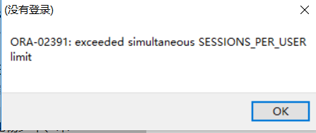

[TOC]

# oracle 授权用户只能查询某表

**文档整理**

ysys

**日期**

2018-11-27

**标签**

oracle,grant


## 背景

​	之前在授权用户查询权限时，使用的命令可能给的权限更大，今天在看视频发现有权限更小的授权但是完成同样的事情。


## 过去操作

### 创建一个用户

```
create user username identified by password;
grant connect to username
grant resource to username
```

### 将表进行授权

```
grant select on userA.tableB to username
```

​	授权操作一般都是这个样子的。


## 现在操作


### 创建profile

```
create profile app_limit_session_db_profile limit sessions_per_user 1;
```

### 创建用户

```
create user app_shard identified by "123456";
alter user app_shard profile app_limit_session_db_profile;
```

### 授权

```
grant create session to app_shard;
grant select on test_a to app_shard;
```

### 要开启resouce_limit

```
 alter system set resource_limit =TRUE; 
```


### 多次登陆 报错


