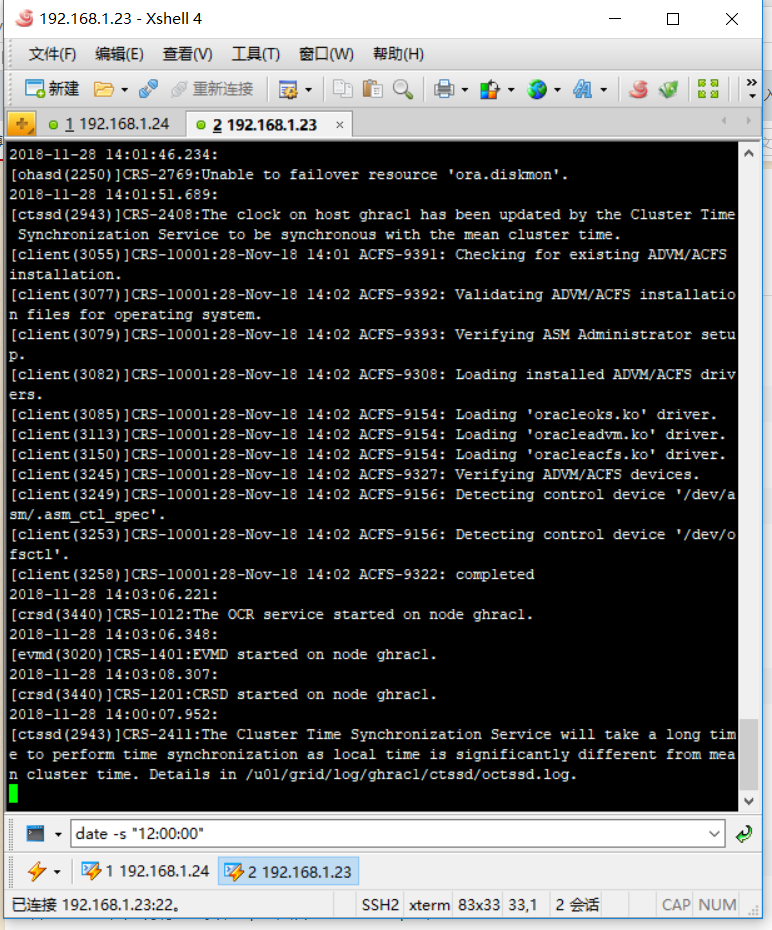

[TOC]

# oracle rac synchronization time

**文档整理**

ysys

**日期**

2018-11-28

**标签**

oracle rac,synchronization time


## 背景

​	最近一段时间发现数据库的时间便快了，早于当前时间20min，很多情况下，可能对于时间戳有影响，建议对数据库时间同步一下。


## 操作

### 关闭数据库实例

```
$ srvctl stop database -d ghdb
```

​	ghdb是我测试环境的数据库

### 使用xshell软件并修改相关配置

​	在查看栏选择会话栏和撰写栏✔

​	在下方选择全部会话

​	在命令栏中输入时间命令`date -s "12:00:00"`





 

### 启动实例

```
$ srvctl start database -d ghdb
```

​	

## 最大顾虑

​	某些情况下使用的是数据库的时间戳，如果你的时间变成当前的时间，可是在数据库上是发生过的时间，导致某些以时间戳抽取比对的方案数据异常更新

​	这也是为什么发现时间不一致后并没有对其立即修改，而是统一考量


