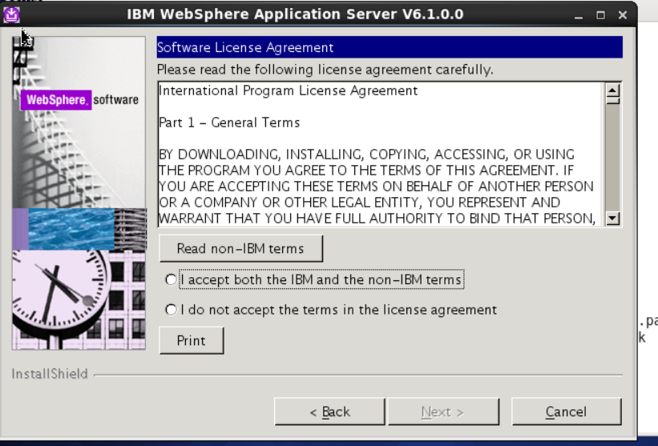
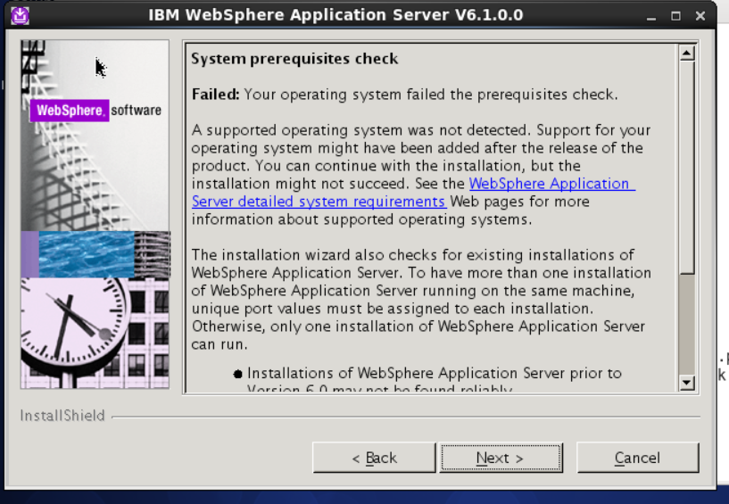

[TOC]

# linux install was and was update

**document support**

ysys

**date**

2018-12-17

**label**

linux,was install,was update


## was install

​	初始化was版本是was 6.1.0.0

​	操作系统是centos6.5_x64

​	

​	**关闭防火墙，selinux安全策略**

​	

​	1、配置yum源，并且安装compat-libstdc的rpm包

```
# yum -y install compat-libstdc*
```

​	2、配置vnc,并配置

​	3、上传文件并解压

```
# mkdir -p /software
# cd /software
# ls -ls
# unzip was.zip
```

​	4、配置vnc-client

​	5、进入图形化界面

​	6、

```
# cd /software/was

```

​	进入到安装界面选择NEXT按钮


选择同意协议,在`I accept both the`上打√




​	检查系统先决条件，选择NEXT




## was update

​	


## was start or stop

